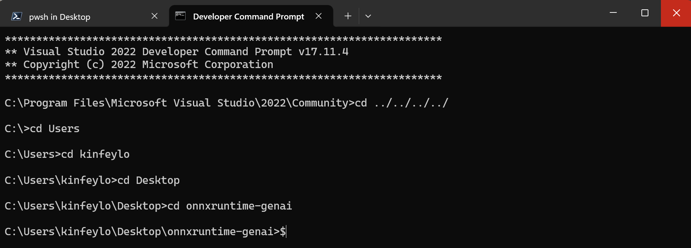

# **Guideline for OnnxRuntime GenAI  Windows GPU**

This guideline provides steps for setting up and using the ONNX Runtime (ORT) with GPUs on Windows. It's designed to help you leverage GPU acceleration for your models, improving performance and efficiency.

The document provides guidance on:

- Environment Setup: Instructions on installing the necessary dependencies like CUDA, cuDNN, and ONNX Runtime.
- Configuration: How to configure the environment and ONNX Runtime to utilize GPU resources effectively.
- Optimization Tips: Advice on how to fine-tune your GPU settings for optimal performance.

### **1. Python 3.10.x /3.11.8**

   ***Note*** Suggest use [miniforge](https://github.com/conda-forge/miniforge/releases/latest/download/Miniforge3-Windows-x86_64.exe) as your Python env

   ```bash

   conda create -n pydev python==3.11.8

   conda activate pydev

   ```

   ***Reminder*** If you have intall any about python ONNX library, please uninstall it

### **2. Install CMake with winget**


   ```bash

   winget install -e --id Kitware.CMake

   ```

### **3. Install Visual Studio 2022 - Desktop Development with C++**

   ***Note*** If you not want to compile you can skip this step


### **4. Install NVIDIA Driver**

1. **NVIDIA GPU Driver**  [https://www.nvidia.com/en-us/drivers/](https://www.nvidia.com/en-us/drivers/)

2. **NVIDIA CUDA 12.4** [https://developer.nvidia.com/cuda-12-4-0-download-archive](https://developer.nvidia.com/cuda-12-4-0-download-archive)

3. **NVIDIA CUDNN 9.4**  [https://developer.nvidia.com/cudnn-downloads](https://developer.nvidia.com/cudnn-downloads)

***Reminder*** Please use default settings with Installation flow 

### **5. Set NVIDIA Env**

Copy NVIDIA CUDNN 9.4 lib,bin,include to NVIDIA CUDA 12.4 lib,bin,include

- copy *'C:\Program Files\NVIDIA\CUDNN\v9.4\bin\12.6'* files to  *'C:\Program Files\NVIDIA GPU Computing Toolkit\CUDA\v12.4\bin*

- copy *'C:\Program Files\NVIDIA\CUDNN\v9.4\include\12.6'* files to  *'C:\Program Files\NVIDIA GPU Computing Toolkit\CUDA\v12.4\include*

- copy *'C:\Program Files\NVIDIA\CUDNN\v9.4\lib\12.6'* files to  *'C:\Program Files\NVIDIA GPU Computing Toolkit\CUDA\v12.4\lib\x64'*


### **6. Download Phi-3.5-mini-instruct-onnx**


   ```bash

   winget install -e --id Git.Git

   winget install -e --id GitHub.GitLFS

   git lfs install

   git clone https://huggingface.co/microsoft/Phi-3.5-mini-instruct-onnx

   ```

### **7. Runing InferencePhi35Instruct.ipynb**

   Open [Notebook](../../../code/09.UpdateSamples/Aug/ortgpu-phi35-instruct.ipynb) and execute 


### **8. Compile ORT GenAI GPU**


   ***Note*** 
   
   1. Please uninstall all about onnx and onnxruntime and onnxruntime-genai firstly

   
   ```bash

   pip list 
   
   ```

   Then uninstall all onnxruntime libraries i.e. 


   ```bash

   pip uninstall onnxruntime

   pip uninstall onnxruntime-genai

   pip uninstall onnxruntume-genai-cuda
   
   ```

   2. Check Visual Studio Extension support 

   Check C:\Program Files\NVIDIA GPU Computing Toolkit\CUDA\v12.4\extras to ensure C:\Program Files\NVIDIA GPU Computing Toolkit\CUDA\v12.4\extras\visual_studio_integration is found. 
   
   If not found check other Cuda toolkit driver folders and copy the visual_studio_integration folder and contents to C:\Program Files\NVIDIA GPU Computing Toolkit\CUDA\v12.4\extras\visual_studio_integration


   - If you not want to compile you can skip this step


   ```bash

   git clone https://github.com/microsoft/onnxruntime-genai

   ```

   - Download [https://github.com/microsoft/onnxruntime/releases/download/v1.19.2/onnxruntime-win-x64-gpu-1.19.2.zip](https://github.com/microsoft/onnxruntime/releases/download/v1.19.2/onnxruntime-win-x64-gpu-1.19.2.zip)

   - Unzip onnxruntime-win-x64-gpu-1.19.2.zip ,and rename it to **ort**,copy ort folder to onnxruntime-genai

   - Using Windows Terminal,go to Deveopler Command Prompt for VS 2022 and go to onnxruntime-genai 



   - Compile it with your python env

   
   ```bash

   cd onnxruntime-genai

   python build.py --use_cuda  --cuda_home "C:\Program Files\NVIDIA GPU Computing Toolkit\CUDA\v12.4" --config Release
 

   cd build/Windows/Release/Wheel

   pip install .whl

   ```


   


