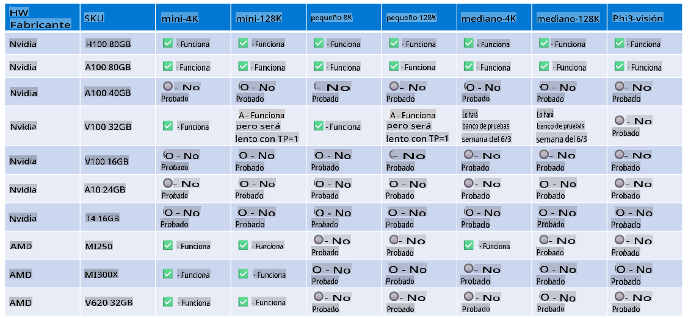

# Soporte de Hardware para Phi-3

Microsoft Phi-3 ha sido optimizado para ONNX Runtime y es compatible con Windows DirectML. Funciona bien en varios tipos de hardware, incluidos GPUs, CPUs e incluso dispositivos móviles.

## Hardware del Dispositivo
Específicamente, el hardware compatible incluye:

- GPU SKU: RTX 4090 (DirectML)
- GPU SKU: 1 A100 80GB (CUDA)
- CPU SKU: Standard F64s v2 (64 vCPUs, 128 GiB de memoria)

## SKU Móvil

- Android - Samsung Galaxy S21
- Apple iPhone 14 o superior con procesador A16/A17

## Especificación de Hardware de Phi-3

- Configuración Mínima Requerida.
- Windows: GPU compatible con DirectX 12 y un mínimo de 4GB de RAM combinada

CUDA: GPU NVIDIA con capacidad de cómputo >= 7.02



## Ejecutando onnxruntime en múltiples GPUs

Actualmente, los modelos ONNX de Phi-3 disponibles son solo para 1 GPU. Es posible soportar múltiples GPUs para el modelo Phi-3, pero ORT con 2 GPUs no garantiza que proporcione más rendimiento en comparación con 2 instancias de ort.

En [Build 2024 el equipo de GenAI ONNX](https://youtu.be/WLW4SE8M9i8?si=EtG04UwDvcjunyfC) anunció que habían habilitado múltiples instancias en lugar de múltiples GPUs para los modelos Phi.

Actualmente, esto te permite ejecutar una instancia de onnxruntime o onnxruntime-genai con la variable de entorno CUDA_VISIBLE_DEVICES de esta manera.

```Python
CUDA_VISIBLE_DEVICES=0 python infer.py
CUDA_VISIBLE_DEVICES=1 python infer.py
```

Siéntete libre de explorar más sobre Phi-3 en [Azure AI Studio](https://ai.azure.com)

        Descargo de responsabilidad: La traducción fue realizada por un modelo de IA y puede no ser perfecta.
        Por favor, revise el resultado y haga las correcciones necesarias.