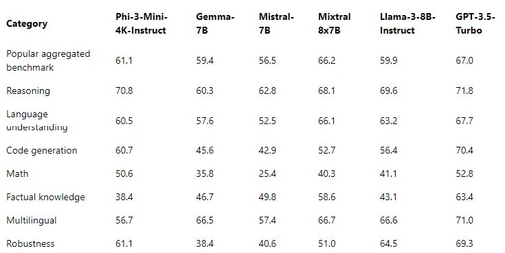
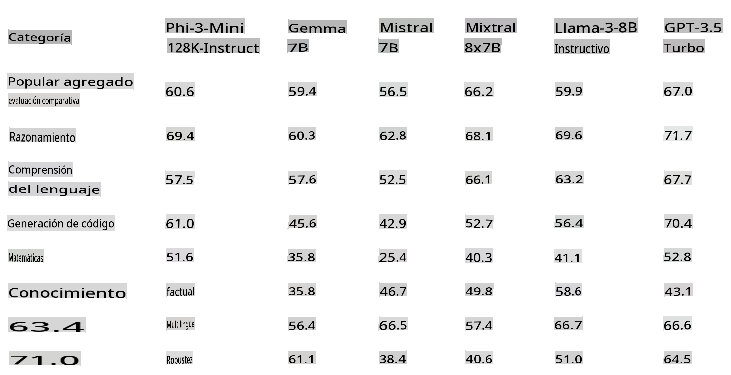
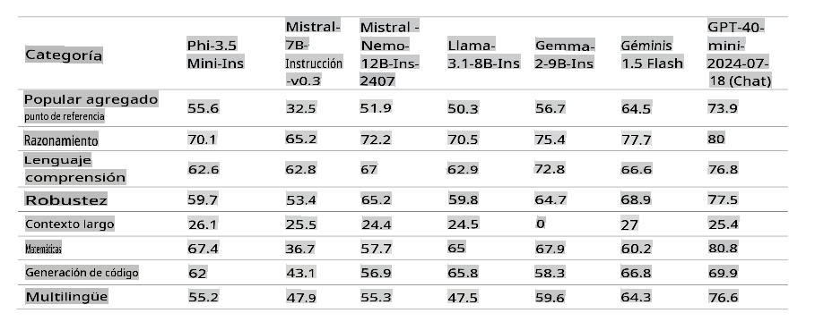
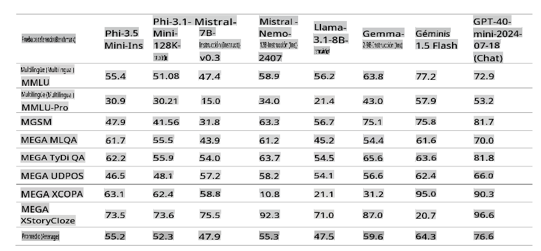
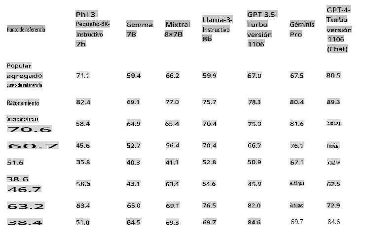
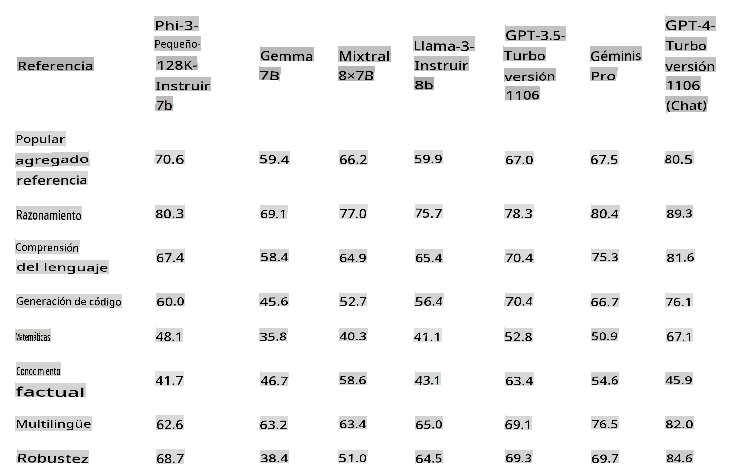
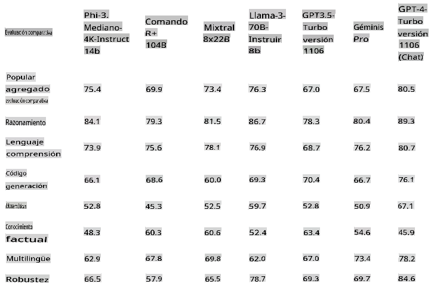
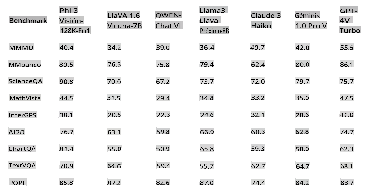
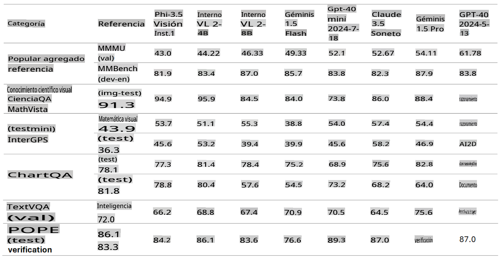

# La familia Phi-3 de Microsoft

Los modelos Phi-3 son los Modelos de Lenguaje Pequeños (SLMs) más capaces y rentables disponibles, superando a modelos del mismo tamaño y del siguiente tamaño en una variedad de pruebas de lenguaje, razonamiento, codificación y matemáticas. Esta versión amplía la selección de modelos de alta calidad para los clientes, ofreciendo más opciones prácticas para componer y construir aplicaciones de IA generativa.

La familia Phi-3 incluye versiones mini, pequeña, mediana y de visión, entrenadas con diferentes cantidades de parámetros para servir en varios escenarios de aplicación. Cada modelo está ajustado por instrucciones y desarrollado de acuerdo con los estándares de IA Responsable, seguridad y protección de Microsoft para garantizar que esté listo para usarse directamente. Phi-3-mini supera a modelos que duplican su tamaño, y Phi-3-small y Phi-3-medium superan a modelos mucho más grandes, incluyendo GPT-3.5T.

## Ejemplo de Tareas de Phi-3

| | |
|-|-|
|Tareas|Phi-3|
|Tareas de Lenguaje|Sí|
|Matemáticas y Razonamiento|Sí|
|Codificación|Sí|
|Llamada a Funciones|No|
|Auto Orquestación (Asistente)|No|
|Modelos de Embedding Dedicados|No|

## Phi-3-mini

Phi-3-mini, un modelo de lenguaje con 3.8 mil millones de parámetros, está disponible en [Microsoft Azure AI Studio](https://ai.azure.com/explore/models?selectedCollection=phi), [Hugging Face](https://huggingface.co/collections/microsoft/phi-3-6626e15e9585a200d2d761e3), y [Ollama](https://ollama.com/library/phi3). Ofrece dos longitudes de contexto: [128K](https://ai.azure.com/explore/models/Phi-3-mini-128k-instruct/version/9/registry/azureml) y [4K](https://ai.azure.com/explore/models/Phi-3-mini-4k-instruct/version/9/registry/azureml).

Phi-3-mini es un modelo de lenguaje basado en Transformadores con 3.8 mil millones de parámetros. Fue entrenado usando datos de alta calidad que contienen información útil educativamente, aumentados con nuevas fuentes de datos que consisten en varios textos sintéticos de NLP, y conjuntos de datos de chat tanto internos como externos, lo que mejora significativamente las capacidades de chat. Además, Phi-3-mini ha sido afinado para chat después del pre-entrenamiento mediante ajuste fino supervisado (SFT) y Optimización de Preferencias Directas (DPO). Después de este post-entrenamiento, Phi-3-mini ha demostrado mejoras significativas en varias capacidades, particularmente en alineación, robustez y seguridad. El modelo es parte de la familia Phi-3 y viene en la versión mini con dos variantes, 4K y 128K, que representan la longitud del contexto (en tokens) que puede soportar.

## Phi-3.5-mini-instruct 

[Phi-3.5 mini](https://ai.azure.com/explore/models/Phi-3.5-mini-instruct/version/1/registry/azureml) es un modelo abierto ligero y de última generación construido sobre los conjuntos de datos usados para Phi-3 - datos sintéticos y sitios web públicos filtrados - con un enfoque en datos de muy alta calidad y densa capacidad de razonamiento. El modelo pertenece a la familia de modelos Phi-3 y soporta una longitud de contexto de 128K tokens. El modelo pasó por un riguroso proceso de mejora, incorporando ajuste fino supervisado, optimización de políticas proximales y optimización de preferencias directas para asegurar una adherencia precisa a las instrucciones y medidas de seguridad robustas.

Phi-3.5 Mini tiene 3.8 mil millones de parámetros y es un modelo de Transformador denso de solo decodificador usando el mismo tokenizador que Phi-3 Mini.

En general, el modelo con solo 3.8 mil millones de parámetros logra un nivel similar de comprensión del lenguaje multilingüe y capacidad de razonamiento que modelos mucho más grandes. Sin embargo, todavía está fundamentalmente limitado por su tamaño para ciertas tareas. El modelo simplemente no tiene la capacidad de almacenar demasiados conocimientos fácticos, por lo tanto, los usuarios pueden experimentar inexactitudes fácticas. Sin embargo, creemos que tal debilidad puede resolverse aumentando Phi-3.5 con un motor de búsqueda, particularmente cuando se usa el modelo en configuraciones RAG.

### Soporte de Idiomas 

La tabla a continuación resalta la capacidad multilingüe del Phi-3 en los conjuntos de datos multilingües MMLU, MEGA y MMLU-pro multilingüe. En general, observamos que incluso con solo 3.8 mil millones de parámetros activos, el modelo es muy competitivo en tareas multilingües en comparación con otros modelos con muchos más parámetros activos.

## Phi-3-small

Phi-3-small, un modelo de lenguaje con 7 mil millones de parámetros, disponible en dos longitudes de contexto [128K](https://ai.azure.com/explore/models/Phi-3-small-128k-instruct/version/2/registry/azureml) y [8K.](https://ai.azure.com/explore/models/Phi-3-small-8k-instruct/version/2/registry/azureml) supera a GPT-3.5T en una variedad de pruebas de lenguaje, razonamiento, codificación y matemáticas.

Phi-3-small es un modelo de lenguaje basado en Transformadores con 7 mil millones de parámetros. Fue entrenado usando datos de alta calidad que contienen información útil educativamente, aumentados con nuevas fuentes de datos que consisten en varios textos sintéticos de NLP, y conjuntos de datos de chat tanto internos como externos, lo que mejora significativamente las capacidades de chat. Además, Phi-3-small ha sido afinado para chat después del pre-entrenamiento mediante ajuste fino supervisado (SFT) y Optimización de Preferencias Directas (DPO). Después de este post-entrenamiento, Phi-3-small ha mostrado mejoras significativas en varias capacidades, particularmente en alineación, robustez y seguridad. Phi-3-small también ha sido entrenado más intensivamente en conjuntos de datos multilingües en comparación con Phi-3-Mini. La familia de modelos ofrece dos variantes, 8K y 128K, que representan la longitud del contexto (en tokens) que puede soportar.

## Phi-3-medium

Phi-3-medium, un modelo de lenguaje con 14 mil millones de parámetros, disponible en dos longitudes de contexto [128K](https://ai.azure.com/explore/models/Phi-3-medium-128k-instruct/version/2/registry/azureml) y [4K.](https://ai.azure.com/explore/models/Phi-3-medium-4k-instruct/version/2/registry/azureml), continúa la tendencia superando a Gemini 1.0 Pro.

Phi-3-medium es un modelo de lenguaje basado en Transformadores con 14 mil millones de parámetros. Fue entrenado usando datos de alta calidad que contienen información útil educativamente, aumentados con nuevas fuentes de datos que consisten en varios textos sintéticos de NLP, y conjuntos de datos de chat tanto internos como externos, lo que mejora significativamente las capacidades de chat. Además, Phi-3-medium ha sido afinado para chat después del pre-entrenamiento mediante ajuste fino supervisado (SFT) y Optimización de Preferencias Directas (DPO). Después de este post-entrenamiento, Phi-3-medium ha mostrado mejoras significativas en varias capacidades, particularmente en alineación, robustez y seguridad. La familia de modelos ofrece dos variantes, 4K y 128K, que representan la longitud del contexto (en tokens) que puede soportar.

[!NOTE]
Recomendamos cambiar a Phi-3.5-MoE como una actualización de Phi-3-medium, ya que el modelo MoE es mucho mejor y más rentable.

## Phi-3-vision

El [Phi-3-vision](https://ai.azure.com/explore/models/Phi-3-vision-128k-instruct/version/2/registry/azureml), un modelo multimodal con 4.2 mil millones de parámetros con capacidades de lenguaje y visión, supera a modelos más grandes como Claude-3 Haiku y Gemini 1.0 Pro V en tareas generales de razonamiento visual, OCR y comprensión de tablas y gráficos.

Phi-3-vision es el primer modelo multimodal en la familia Phi-3, reuniendo texto e imágenes. Phi-3-vision puede usarse para razonar sobre imágenes del mundo real y extraer y razonar sobre texto de imágenes. También ha sido optimizado para la comprensión de gráficos y diagramas y puede usarse para generar ideas y responder preguntas. Phi-3-vision se basa en las capacidades de lenguaje de Phi-3-mini, continuando con una alta calidad de razonamiento en lenguaje e imágenes en un tamaño pequeño.

## Phi-3.5-vision
[Phi-3.5 Vision](https://ai.azure.com/explore/models/Phi-3.5-vision-instruct/version/1/registry/azureml) es un modelo multimodal ligero y de última generación construido sobre conjuntos de datos que incluyen - datos sintéticos y sitios web públicos filtrados - con un enfoque en datos de muy alta calidad y densa capacidad de razonamiento tanto en texto como en visión. El modelo pertenece a la familia de modelos Phi-3, y la versión multimodal viene con una longitud de contexto de 128K tokens que puede soportar. El modelo pasó por un riguroso proceso de mejora, incorporando ajuste fino supervisado y optimización de preferencias directas para asegurar una adherencia precisa a las instrucciones y medidas de seguridad robustas.

Phi-3.5 Vision tiene 4.2 mil millones de parámetros y contiene un codificador de imágenes, conector, proyector y el modelo de lenguaje Phi-3 Mini.

El modelo está destinado para uso comercial y de investigación en inglés. El modelo proporciona usos para sistemas de IA de propósito general y aplicaciones con capacidades de entrada visual y de texto que requieren
1) entornos con limitaciones de memoria/cómputo.
2) escenarios con limitaciones de latencia.
3) comprensión general de imágenes.
4) OCR
5) comprensión de gráficos y tablas.
6) comparación de múltiples imágenes.
7)resumen de múltiples imágenes o videoclips.

 El modelo Phi-3.5-vision está diseñado para acelerar la investigación en modelos de lenguaje y multimodales eficientes, para usarse como un bloque de construcción para características impulsadas por IA generativa.

## Phi-3.5-MoE

[Phi-3.5 MoE](https://ai.azure.com/explore/models/Phi-3.5-MoE-instruct/version/1/registry/azureml) es un modelo abierto ligero y de última generación construido sobre conjuntos de datos usados para Phi-3 - datos sintéticos y documentos públicos filtrados - con un enfoque en datos de muy alta calidad y densa capacidad de razonamiento. El modelo soporta multilingüismo y viene con una longitud de contexto de 128K tokens. El modelo pasó por un riguroso proceso de mejora, incorporando ajuste fino supervisado, optimización de políticas proximales y optimización de preferencias directas para asegurar una adherencia precisa a las instrucciones y medidas de seguridad robustas.

Phi-3 MoE tiene 16x3.8 mil millones de parámetros con 6.6 mil millones de parámetros activos cuando se usan 2 expertos. El modelo es un modelo de Transformador de solo decodificador de mezcla de expertos usando el tokenizador con un tamaño de vocabulario de 32,064.

El modelo está destinado para uso comercial y de investigación en inglés. El modelo proporciona usos para sistemas de IA de propósito general y aplicaciones que requieren.

1) entornos con limitaciones de memoria/cómputo.
2) escenarios con limitaciones de latencia.
3) fuerte razonamiento (especialmente matemáticas y lógica).

El modelo MoE está diseñado para acelerar la investigación en modelos de lenguaje y multimodales, para usarse como un bloque de construcción para características impulsadas por IA generativa y requiere recursos de cómputo adicionales.

> [!NOTE]
>
> Los modelos Phi-3 no se desempeñan tan bien en pruebas de conocimientos fácticos (como TriviaQA) ya que el tamaño más pequeño del modelo resulta en menos capacidad para retener hechos.

## Phi silica

Estamos presentando Phi Silica, que se construye a partir de la serie de modelos Phi y está diseñado específicamente para los NPUs en PCs con Copilot+. Windows es la primera plataforma en tener un modelo de lenguaje pequeño (SLM) de última generación personalizado para el NPU y que se envía de serie. La API de Phi Silica junto con OCR, Studio Effects, Live Captions y las APIs de Recall User Activity estarán disponibles en la Biblioteca de Copilot de Windows en junio. Más APIs como Vector Embedding, RAG API y Resumen de Texto llegarán más adelante.

## **Encuentra todos los modelos Phi-3** 

- [Azure AI](https://ai.azure.com/explore/models?selectedCollection=phi)
- [Hugging Face](https://huggingface.co/collections/microsoft/phi-3-6626e15e9585a200d2d761e3) 

## Modelos ONNX

La principal diferencia entre los dos modelos ONNX, “cpu-int4-rtn-block-32” y “cpu-int4-rtn-block-32-acc-level-4”, es el nivel de precisión. El modelo con “acc-level-4” está diseñado para equilibrar latencia y precisión, con una pequeña compensación en precisión para un mejor rendimiento, lo que podría ser particularmente adecuado para dispositivos móviles.

## Ejemplo de Selección de Modelos

| | | | |
|-|-|-|-|
|Necesidad del Cliente|Tarea|Comienza con|Más Detalles|
|Necesita un modelo que simplemente resuma una conversación|Resumen de Conversación|Modelo de texto Phi-3|El factor decisivo aquí es que el cliente tiene una tarea de lenguaje bien definida y directa|
|Una app gratuita de tutor de matemáticas para niños|Matemáticas y Razonamiento|Modelos de texto Phi-3|Debido a que la app es gratuita, los clientes quieren una solución que no les cueste de forma recurrente|
|Cámara de patrulla autónoma|Análisis de Visión|Phi-Vision|Necesita una solución que pueda funcionar en el borde sin internet|
|Quiere construir un agente de reserva de viajes basado en IA|Necesita planificación compleja, llamada a funciones y orquestación|Modelos GPT|Necesita la capacidad de planificar, llamar a APIs para recopilar información y ejecutar|
|Quiere construir un copiloto para sus empleados|RAG, múltiples dominios, complejo y abierto|Modelos GPT|Escenario abierto, necesita un conocimiento más amplio del mundo, por lo tanto, un modelo más grande es más adecuado|

**Descargo de responsabilidad**:
Este documento ha sido traducido utilizando servicios de traducción automática basados en inteligencia artificial. Aunque nos esforzamos por lograr precisión, tenga en cuenta que las traducciones automáticas pueden contener errores o inexactitudes. El documento original en su idioma nativo debe considerarse la fuente autorizada. Para información crítica, se recomienda la traducción profesional humana. No somos responsables de ningún malentendido o interpretación errónea que surja del uso de esta traducción.