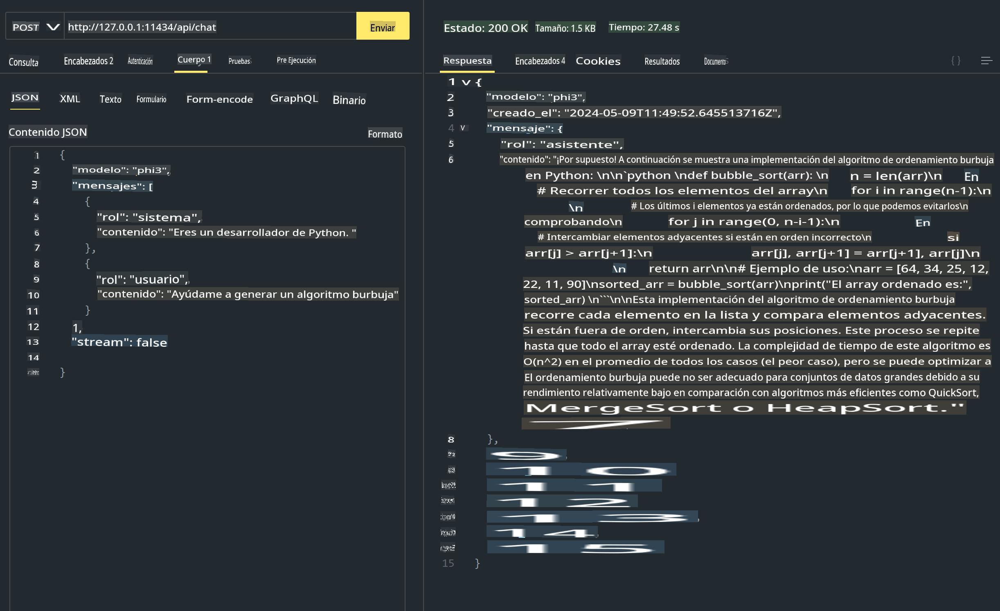
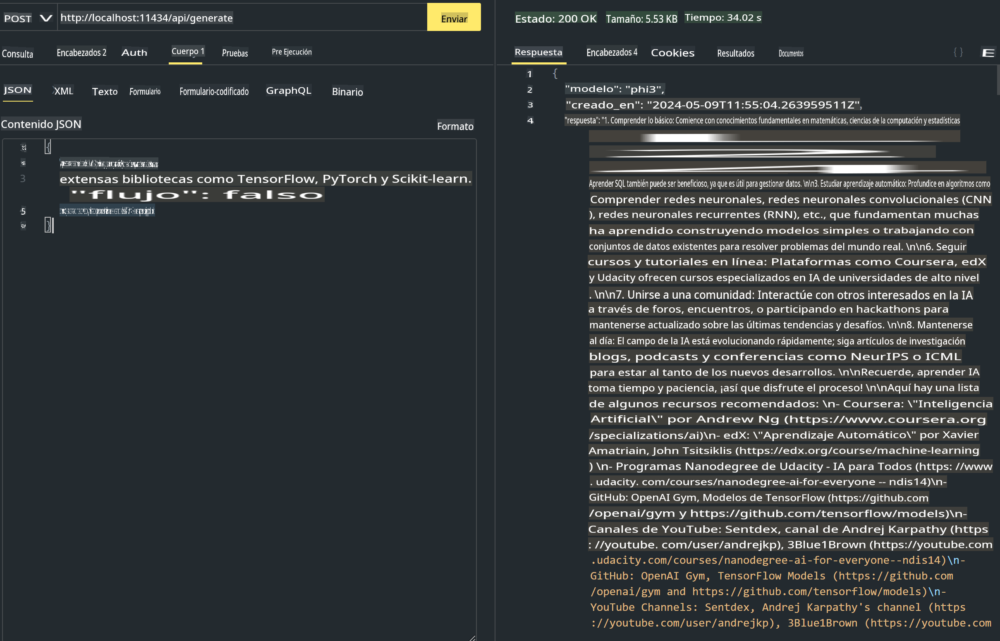

# **Usando Phi-3 en Ollama**

[Ollama](https://ollama.com) permite que más personas desplieguen directamente LLM o SLM de código abierto a través de scripts simples, y también pueden construir APIs para ayudar en escenarios de aplicaciones locales de Copilot.

## **1. Instalación**

Ollama es compatible con Windows, macOS y Linux. Puedes instalar Ollama a través de este enlace ([https://ollama.com/download](https://ollama.com/download)). Después de una instalación exitosa, puedes usar directamente el script de Ollama para llamar a Phi-3 a través de una ventana de terminal. Puedes ver todas las [bibliotecas disponibles en Ollama](https://ollama.com/library). Si abres este repositorio en un Codespace, ya tendrá Ollama instalado.

```bash

ollama run phi3

```

> [!NOTE]
> El modelo se descargará primero cuando lo ejecutes por primera vez. Por supuesto, también puedes especificar directamente el modelo Phi-3 descargado. Tomamos WSL como ejemplo para ejecutar el comando. Después de que el modelo se descargue correctamente, puedes interactuar directamente en el terminal.


## **2. Llamar a la API de phi-3 desde Ollama**

Si deseas llamar a la API de Phi-3 generada por ollama, puedes usar este comando en el terminal para iniciar el servidor de Ollama.

```bash

ollama serve

```

> [!NOTE]
> Si ejecutas MacOS o Linux, ten en cuenta que puedes encontrar el siguiente error **"Error: listen tcp 127.0.0.1:11434: bind: address already in use"** Puedes obtener este error al ejecutar el comando. Puedes ignorar ese error, ya que generalmente indica que el servidor ya está en funcionamiento, o puedes detener y reiniciar Ollama:

**macOS**

```bash

brew services restart ollama

```

**Linux**

```bash

sudo systemctl stop ollama

```

Ollama admite dos API: generate y chat. Puedes llamar a la API del modelo proporcionada por Ollama según tus necesidades, enviando solicitudes al servicio local que se ejecuta en el puerto 11434.

**Chat**

```bash

curl http://127.0.0.1:11434/api/chat -d '{
  "model": "phi3",
  "messages": [
    {
      "role": "system",
      "content": "Eres un desarrollador de python."
    },
    {
      "role": "user",
      "content": "Ayúdame a generar un algoritmo de burbuja"
    }
  ],
  "stream": false
  
}'


```

Este es el resultado en Postman



```bash

curl http://127.0.0.1:11434/api/generate -d '{
  "model": "phi3",
  "prompt": "<|system|>Eres mi asistente de IA.<|end|><|user|>dime cómo aprender IA<|end|><|assistant|>",
  "stream": false
}'


```

Este es el resultado en Postman



## Recursos Adicionales

Consulta la lista de modelos disponibles en Ollama en [su biblioteca](https://ollama.com/library).

Extrae tu modelo desde el servidor de Ollama usando este comando

```bash
ollama pull phi3
```

Ejecuta el modelo usando este comando

```bash
ollama run phi3
```

***Nota:*** Visita este enlace [https://github.com/ollama/ollama/blob/main/docs/api.md](https://github.com/ollama/ollama/blob/main/docs/api.md) para aprender más

## Llamar a Ollama desde Python

Puedes usar `requests` o `urllib3` para hacer solicitudes a los endpoints del servidor local utilizados anteriormente. Sin embargo, una forma popular de usar Ollama en Python es a través del SDK de [openai](https://pypi.org/project/openai/), ya que Ollama proporciona endpoints de servidor compatibles con OpenAI.

Aquí hay un ejemplo para phi3-mini:

```python
import openai

client = openai.OpenAI(
    base_url="http://localhost:11434/v1",
    api_key="nokeyneeded",
)

response = client.chat.completions.create(
    model="phi3",
    temperature=0.7,
    n=1,
    messages=[
        {"role": "system", "content": "Eres un asistente útil."},
        {"role": "user", "content": "Escribe un haiku sobre un gato hambriento"},
    ],
)

print("Respuesta:")
print(response.choices[0].message.content)
```

## Llamar a Ollama desde JavaScript 

```javascript
// Ejemplo de resumir un archivo con Phi-3
script({
    model: "ollama:phi3",
    title: "Resumir con Phi-3",
    system: ["system"],
})

// Ejemplo de resumen
const file = def("FILE", env.files)
$`Resume ${file} en un solo párrafo.`
```

## Llamar a Ollama desde C#

Crea una nueva aplicación de consola en C# y agrega el siguiente paquete NuGet:

```bash
dotnet add package Microsoft.SemanticKernel --version 1.13.0
```

Luego reemplaza este código en el archivo `Program.cs`

```csharp
using Microsoft.SemanticKernel;
using Microsoft.SemanticKernel.ChatCompletion;

// agregar servicio de chat completion usando el endpoint del servidor local de ollama
#pragma warning disable SKEXP0001, SKEXP0003, SKEXP0010, SKEXP0011, SKEXP0050, SKEXP0052
builder.AddOpenAIChatCompletion(
    modelId: "phi3.5",
    endpoint: new Uri("http://localhost:11434/"),
    apiKey: "no requerido");

// invocar un prompt simple al servicio de chat
string prompt = "Escribe un chiste sobre gatitos";
var response = await kernel.InvokePromptAsync(prompt);
Console.WriteLine(response.GetValue<string>());
```

Ejecuta la aplicación con el comando:

```bash
dotnet run
```

Aviso legal: La traducción fue realizada a partir del original por un modelo de IA y puede no ser perfecta. 
Por favor, revise el resultado y haga las correcciones necesarias.