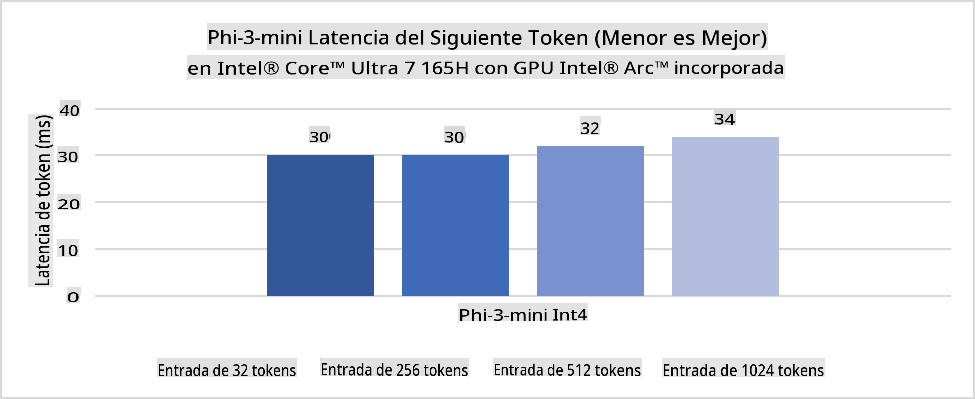
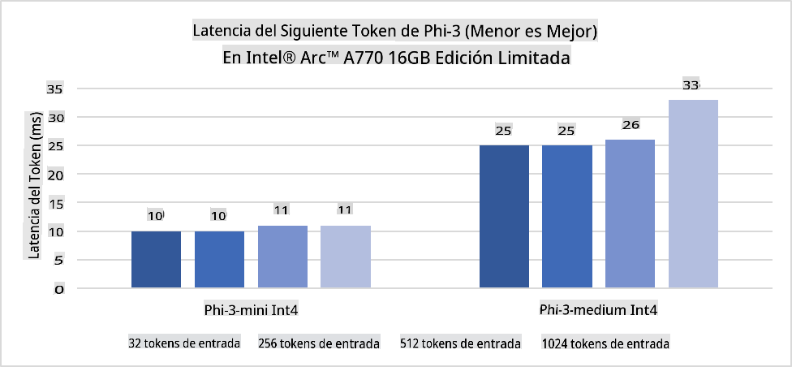
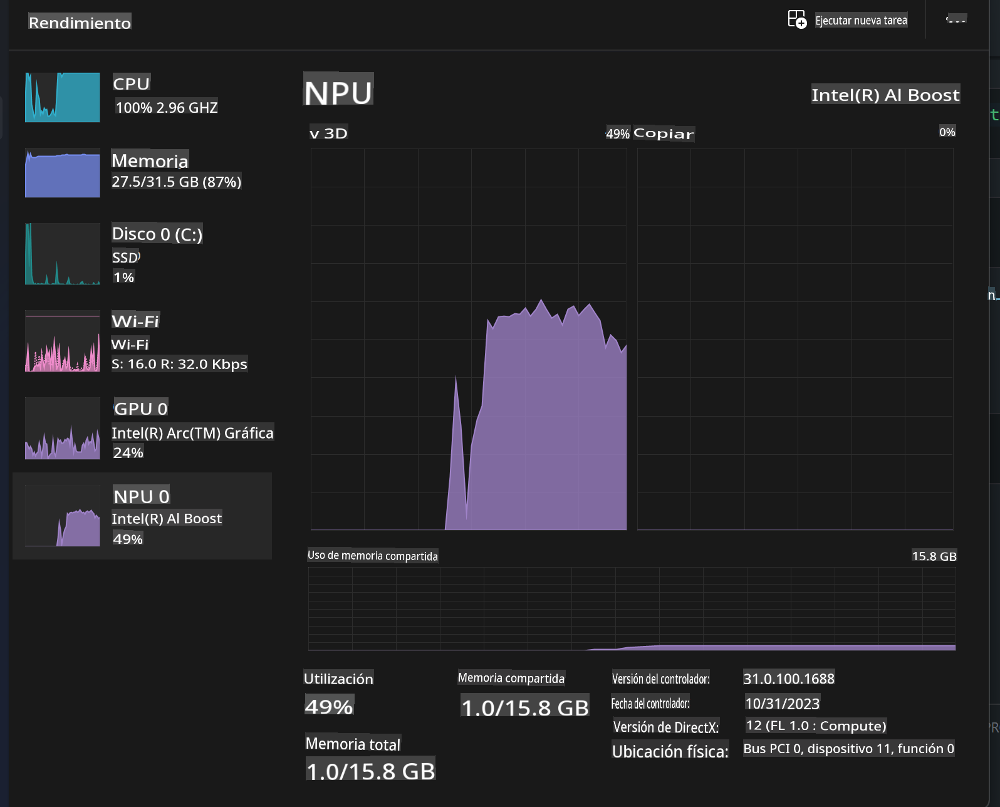
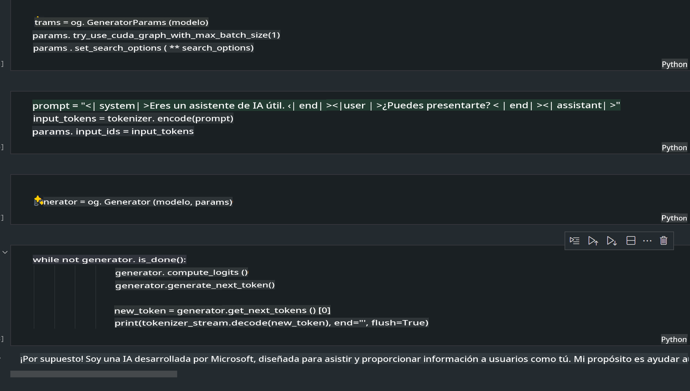
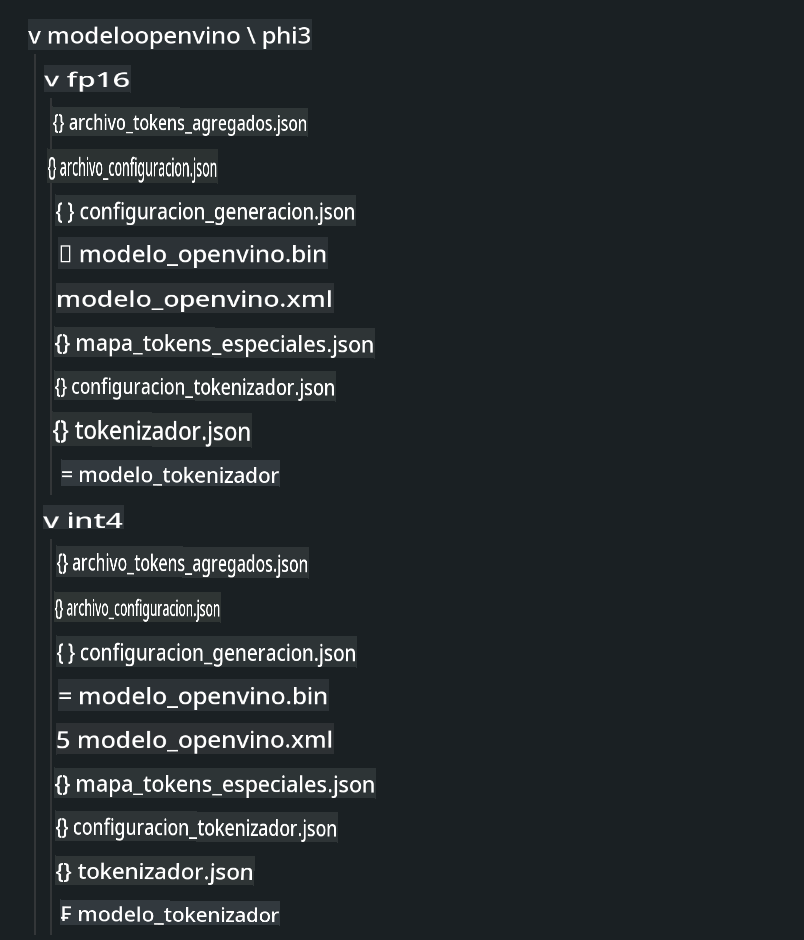
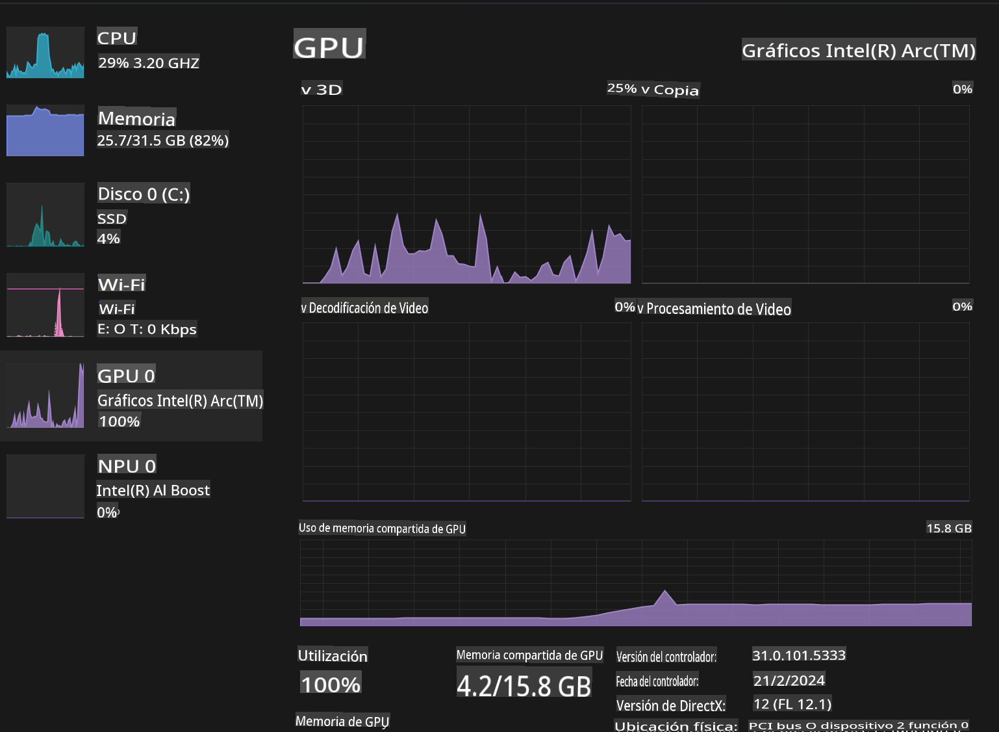

# **Inferencia Phi-3 en PC con IA**

Con el avance de la IA generativa y la mejora en las capacidades de hardware de los dispositivos edge, un número creciente de modelos de IA generativa ahora pueden integrarse en los dispositivos Bring Your Own Device (BYOD) de los usuarios. Las PCs con IA están entre estos modelos. A partir de 2024, Intel, AMD y Qualcomm han colaborado con fabricantes de PC para introducir PCs con IA que faciliten el despliegue de modelos de IA generativa localizados a través de modificaciones de hardware. En esta discusión, nos centraremos en las PCs con IA de Intel y exploraremos cómo desplegar Phi-3 en una PC con IA de Intel.

### Qué es un NPU

Un NPU (Unidad de Procesamiento Neural) es un procesador o unidad de procesamiento dedicada en un SoC más grande, diseñado específicamente para acelerar las operaciones de redes neuronales y tareas de IA. A diferencia de las CPUs y GPUs de propósito general, los NPUs están optimizados para la computación paralela basada en datos, lo que los hace altamente eficientes en el procesamiento de grandes cantidades de datos multimedia como videos e imágenes y en el procesamiento de datos para redes neuronales. Son particularmente hábiles en manejar tareas relacionadas con la IA, como el reconocimiento de voz, el desenfoque de fondo en videollamadas y los procesos de edición de fotos o videos como la detección de objetos.

## NPU vs GPU

Aunque muchas cargas de trabajo de IA y aprendizaje automático se ejecutan en GPUs, hay una distinción crucial entre GPUs y NPUs.
Las GPUs son conocidas por sus capacidades de computación paralela, pero no todas las GPUs son igualmente eficientes más allá del procesamiento de gráficos. Los NPUs, por otro lado, están diseñados específicamente para las complejas computaciones involucradas en las operaciones de redes neuronales, haciéndolos altamente efectivos para tareas de IA.

En resumen, los NPUs son los genios matemáticos que aceleran los cálculos de IA, ¡y juegan un papel clave en la emergente era de las PCs con IA!

***Este ejemplo está basado en el último Procesador Intel Core Ultra de Intel***

## **1. Usar NPU para ejecutar el modelo Phi-3**

El dispositivo Intel® NPU es un acelerador de inferencia de IA integrado con las CPUs de cliente de Intel, comenzando desde la generación de CPUs Intel® Core™ Ultra (anteriormente conocida como Meteor Lake). Permite la ejecución eficiente en términos de energía de tareas de redes neuronales artificiales.





**Biblioteca de Aceleración Intel NPU**

La Biblioteca de Aceleración Intel NPU [https://github.com/intel/intel-npu-acceleration-library](https://github.com/intel/intel-npu-acceleration-library) es una biblioteca de Python diseñada para aumentar la eficiencia de tus aplicaciones aprovechando el poder de la Unidad de Procesamiento Neural (NPU) de Intel para realizar cálculos de alta velocidad en hardware compatible.

Ejemplo de Phi-3-mini en PC con IA alimentada por procesadores Intel® Core™ Ultra.


Instalar la biblioteca de Python con pip

```bash

   pip install intel-npu-acceleration-library

```

***Nota*** El proyecto aún está en desarrollo, pero el modelo de referencia ya es muy completo.

### **Ejecutando Phi-3 con la Biblioteca de Aceleración Intel NPU**

Usando la aceleración NPU de Intel, esta biblioteca no afecta el proceso de codificación tradicional. Solo necesitas usar esta biblioteca para cuantizar el modelo original de Phi-3, como FP16, INT8, INT4, como

```python

from transformers import AutoTokenizer, pipeline,TextStreamer
import intel_npu_acceleration_library as npu_lib
import warnings

model_id = "microsoft/Phi-3-mini-4k-instruct"

model = npu_lib.NPUModelForCausalLM.from_pretrained(
                                    model_id,
                                    torch_dtype="auto",
                                    dtype=npu_lib.int4,
                                    trust_remote_code=True
                                )

tokenizer = AutoTokenizer.from_pretrained(model_id)

text_streamer = TextStreamer(tokenizer, skip_prompt=True)

```
Después de que la cuantificación sea exitosa, continúa la ejecución para llamar al NPU para ejecutar el modelo Phi-3.

```python

generation_args = {
            "max_new_tokens": 1024,
            "return_full_text": False,
            "temperature": 0.3,
            "do_sample": False,
            "streamer": text_streamer,
        }

pipe = pipeline(
            "text-generation",
            model=model,
            tokenizer=tokenizer,
)

query = "<|system|>You are a helpful AI assistant.<|end|><|user|>Can you introduce yourself?<|end|><|assistant|>"

with warnings.catch_warnings():
    warnings.simplefilter("ignore")
    pipe(query, **generation_args)


```

Al ejecutar el código, podemos ver el estado de ejecución del NPU a través del Administrador de Tareas



***Ejemplos*** : [AIPC_NPU_DEMO.ipynb](../../../../code/03.Inference/AIPC/AIPC_NPU_DEMO.ipynb)

## **2. Usar DirectML + ONNX Runtime para ejecutar el Modelo Phi-3**

### **Qué es DirectML**

[DirectML](https://github.com/microsoft/DirectML) es una biblioteca de DirectX 12 de alto rendimiento y acelerada por hardware para el aprendizaje automático. DirectML proporciona aceleración GPU para tareas comunes de aprendizaje automático en una amplia gama de hardware y controladores compatibles, incluyendo todas las GPUs compatibles con DirectX 12 de proveedores como AMD, Intel, NVIDIA y Qualcomm.

Cuando se usa de forma independiente, la API de DirectML es una biblioteca de DirectX 12 de bajo nivel y es adecuada para aplicaciones de alto rendimiento y baja latencia, como frameworks, juegos y otras aplicaciones en tiempo real. La interoperabilidad perfecta de DirectML con Direct3D 12, así como su bajo overhead y conformidad en hardware, hacen que DirectML sea ideal para acelerar el aprendizaje automático cuando se desea tanto alto rendimiento como la fiabilidad y predictibilidad de los resultados en hardware.

***Nota*** : El último DirectML ya soporta NPU(https://devblogs.microsoft.com/directx/introducing-neural-processor-unit-npu-support-in-directml-developer-preview/)

### DirectML y CUDA en términos de sus capacidades y rendimiento:

**DirectML** es una biblioteca de aprendizaje automático desarrollada por Microsoft. Está diseñada para acelerar cargas de trabajo de aprendizaje automático en dispositivos Windows, incluyendo desktops, laptops y dispositivos edge.
- Basado en DX12: DirectML está construido sobre DirectX 12 (DX12), lo que proporciona una amplia gama de soporte de hardware en GPUs, incluyendo tanto NVIDIA como AMD.
- Soporte más amplio: Dado que aprovecha DX12, DirectML puede trabajar con cualquier GPU que soporte DX12, incluso GPUs integradas.
- Procesamiento de imágenes: DirectML procesa imágenes y otros datos usando redes neuronales, haciéndolo adecuado para tareas como reconocimiento de imágenes, detección de objetos y más.
- Facilidad de configuración: Configurar DirectML es sencillo y no requiere SDKs o bibliotecas específicas de los fabricantes de GPUs.
- Rendimiento: En algunos casos, DirectML funciona bien y puede ser más rápido que CUDA, especialmente para ciertas cargas de trabajo.
- Limitaciones: Sin embargo, hay casos en los que DirectML puede ser más lento, particularmente para tamaños de lote grandes en float16.

**CUDA** es la plataforma de computación paralela y modelo de programación de NVIDIA. Permite a los desarrolladores aprovechar el poder de las GPUs de NVIDIA para la computación de propósito general, incluyendo el aprendizaje automático y las simulaciones científicas.
- Específico de NVIDIA: CUDA está estrechamente integrado con las GPUs de NVIDIA y está específicamente diseñado para ellas.
- Altamente optimizado: Proporciona un excelente rendimiento para tareas aceleradas por GPU, especialmente cuando se usan GPUs de NVIDIA.
- Amplio uso: Muchos frameworks y bibliotecas de aprendizaje automático (como TensorFlow y PyTorch) tienen soporte para CUDA.
- Personalización: Los desarrolladores pueden ajustar configuraciones de CUDA para tareas específicas, lo que puede llevar a un rendimiento óptimo.
- Limitaciones: Sin embargo, la dependencia de CUDA en hardware de NVIDIA puede ser limitante si deseas una compatibilidad más amplia en diferentes GPUs.

### Elegir entre DirectML y CUDA

La elección entre DirectML y CUDA depende de tu caso de uso específico, disponibilidad de hardware y preferencias.
Si buscas una compatibilidad más amplia y facilidad de configuración, DirectML podría ser una buena elección. Sin embargo, si tienes GPUs de NVIDIA y necesitas un rendimiento altamente optimizado, CUDA sigue siendo un fuerte contendiente. En resumen, tanto DirectML como CUDA tienen sus fortalezas y debilidades, así que considera tus requisitos y el hardware disponible al tomar una decisión.

### **IA Generativa con ONNX Runtime**

En la era de la IA, la portabilidad de los modelos de IA es muy importante. ONNX Runtime puede desplegar fácilmente modelos entrenados en diferentes dispositivos. Los desarrolladores no necesitan prestar atención al framework de inferencia y usan una API unificada para completar la inferencia del modelo. En la era de la IA generativa, ONNX Runtime también ha realizado optimizaciones de código (https://onnxruntime.ai/docs/genai/). A través del ONNX Runtime optimizado, el modelo de IA generativa cuantizado puede ser inferido en diferentes terminales. En IA Generativa con ONNX Runtime, puedes inferir la API del modelo de IA a través de Python, C#, C / C++. por supuesto, el despliegue en iPhone puede aprovechar la API de IA Generativa con ONNX Runtime de C++.

[Código de ejemplo](https://github.com/Azure-Samples/Phi-3MiniSamples/tree/main/onnx)

***compilar IA generativa con la biblioteca ONNX Runtime***

```bash

winget install --id=Kitware.CMake  -e

git clone https://github.com/microsoft/onnxruntime.git

cd .\onnxruntime\

./build.bat --build_shared_lib --skip_tests --parallel --use_dml --config Release

cd ../

git clone https://github.com/microsoft/onnxruntime-genai.git

cd .\onnxruntime-genai\

mkdir ort

cd ort

mkdir include

mkdir lib

copy ..\onnxruntime\include\onnxruntime\core\providers\dml\dml_provider_factory.h ort\include

copy ..\onnxruntime\include\onnxruntime\core\session\onnxruntime_c_api.h ort\include

copy ..\onnxruntime\build\Windows\Release\Release\*.dll ort\lib

copy ..\onnxruntime\build\Windows\Release\Release\onnxruntime.lib ort\lib

python build.py --use_dml


```

**Instalar biblioteca**

```bash

pip install .\onnxruntime_genai_directml-0.3.0.dev0-cp310-cp310-win_amd64.whl

```

Este es el resultado de la ejecución



***Ejemplos*** : [AIPC_DirectML_DEMO.ipynb](../../../../code/03.Inference/AIPC/AIPC_DirectML_DEMO.ipynb)

## **3. Usar Intel OpenVino para ejecutar el Modelo Phi-3**

### **Qué es OpenVINO**

[OpenVINO](https://github.com/openvinotoolkit/openvino) es un toolkit de código abierto para optimizar y desplegar modelos de aprendizaje profundo. Proporciona un rendimiento mejorado de aprendizaje profundo para modelos de visión, audio y lenguaje de frameworks populares como TensorFlow, PyTorch y más. Empieza con OpenVINO. OpenVINO también puede usarse en combinación con CPU y GPU para ejecutar el modelo Phi3.

***Nota***: Actualmente, OpenVINO no soporta NPU en este momento.

### **Instalar la Biblioteca OpenVINO**

```bash

 pip install git+https://github.com/huggingface/optimum-intel.git

 pip install git+https://github.com/openvinotoolkit/nncf.git

 pip install openvino-nightly

```

### **Ejecutando Phi-3 con OpenVINO**

Al igual que NPU, OpenVINO completa la llamada de modelos de IA generativa ejecutando modelos cuantitativos. Necesitamos cuantizar primero el modelo Phi-3 y completar la cuantización del modelo en la línea de comandos a través de optimum-cli

**INT4**

```bash

optimum-cli export openvino --model "microsoft/Phi-3-mini-4k-instruct" --task text-generation-with-past --weight-format int4 --group-size 128 --ratio 0.6  --sym  --trust-remote-code ./openvinomodel/phi3/int4

```

**FP16**

```bash

optimum-cli export openvino --model "microsoft/Phi-3-mini-4k-instruct" --task text-generation-with-past --weight-format fp16 --trust-remote-code ./openvinomodel/phi3/fp16

```

el formato convertido, como este



Cargar rutas de modelos (model_dir), configuraciones relacionadas (ov_config = {"PERFORMANCE_HINT": "LATENCY", "NUM_STREAMS": "1", "CACHE_DIR": ""}), y dispositivos acelerados por hardware (GPU.0) a través de OVModelForCausalLM

```python

ov_model = OVModelForCausalLM.from_pretrained(
     model_dir,
     device='GPU.0',
     ov_config=ov_config,
     config=AutoConfig.from_pretrained(model_dir, trust_remote_code=True),
     trust_remote_code=True,
)

```

Al ejecutar el código, podemos ver el estado de ejecución de la GPU a través del Administrador de Tareas



***Ejemplos*** : [AIPC_OpenVino_Demo.ipynb](../../../../code/03.Inference/AIPC/AIPC_OpenVino_Demo.ipynb)

### ***Nota*** : Los tres métodos anteriores tienen sus propias ventajas, pero se recomienda usar la aceleración NPU para la inferencia en PC con IA.

        **Descargo de responsabilidad**:
        Este documento ha sido traducido utilizando servicios de traducción automática basados en IA. Si bien nos esforzamos por lograr precisión, tenga en cuenta que las traducciones automatizadas pueden contener errores o inexactitudes. El documento original en su idioma nativo debe considerarse la fuente autorizada. Para información crítica, se recomienda la traducción profesional humana. No somos responsables de ningún malentendido o interpretación errónea que surja del uso de esta traducción.