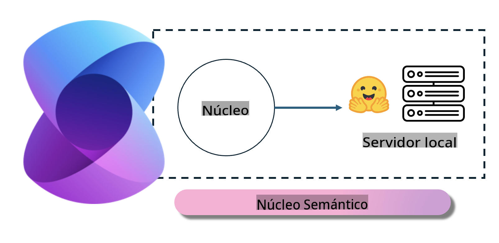
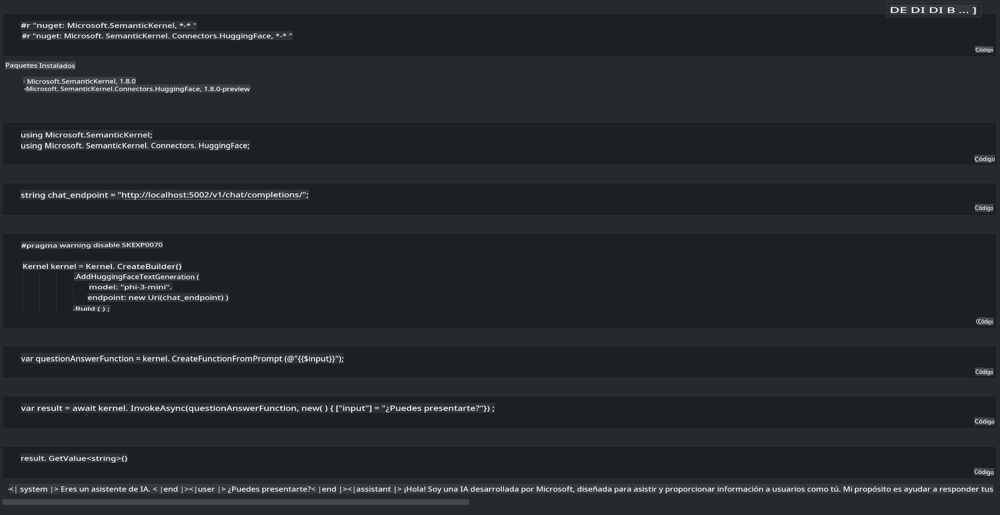

# **Inferencia Phi-3 en Servidor Local**

Podemos desplegar Phi-3 en un servidor local. Los usuarios pueden elegir soluciones como [Ollama](https://ollama.com) o [LM Studio](https://llamaedge.com), o pueden escribir su propio código. Puedes conectar los servicios locales de Phi-3 a través de [Semantic Kernel](https://github.com/microsoft/semantic-kernel?WT.mc_id=aiml-138114-kinfeylo) o [Langchain](https://www.langchain.com/) para construir aplicaciones Copilot.

## **Usar Semantic Kernel para acceder a Phi-3-mini**

En la aplicación Copilot, creamos aplicaciones a través de Semantic Kernel / LangChain. Este tipo de marco de aplicación es generalmente compatible con Azure OpenAI Service / modelos OpenAI, y también puede soportar modelos de código abierto en Hugging Face y modelos locales. ¿Qué debemos hacer si queremos usar Semantic Kernel para acceder a Phi-3-mini? Usando .NET como ejemplo, podemos combinarlo con el Conector de Hugging Face en Semantic Kernel. Por defecto, puede corresponder al id del modelo en Hugging Face (la primera vez que lo uses, el modelo se descargará de Hugging Face, lo cual toma mucho tiempo). También puedes conectar al servicio local construido. Comparando ambos, recomendamos usar el último porque tiene un mayor grado de autonomía, especialmente en aplicaciones empresariales.

En la figura, acceder a servicios locales a través de Semantic Kernel puede conectar fácilmente al servidor del modelo Phi-3-mini construido por ti mismo. Aquí está el resultado de la ejecución:

***Código de Ejemplo*** https://github.com/kinfey/Phi3MiniSamples/tree/main/semantickernel

**Descargo de responsabilidad**:
Este documento ha sido traducido utilizando servicios de traducción automática basados en IA. Aunque nos esforzamos por lograr precisión, tenga en cuenta que las traducciones automatizadas pueden contener errores o inexactitudes. El documento original en su idioma nativo debe considerarse la fuente autorizada. Para información crítica, se recomienda una traducción humana profesional. No somos responsables de ningún malentendido o interpretación errónea que surja del uso de esta traducción.