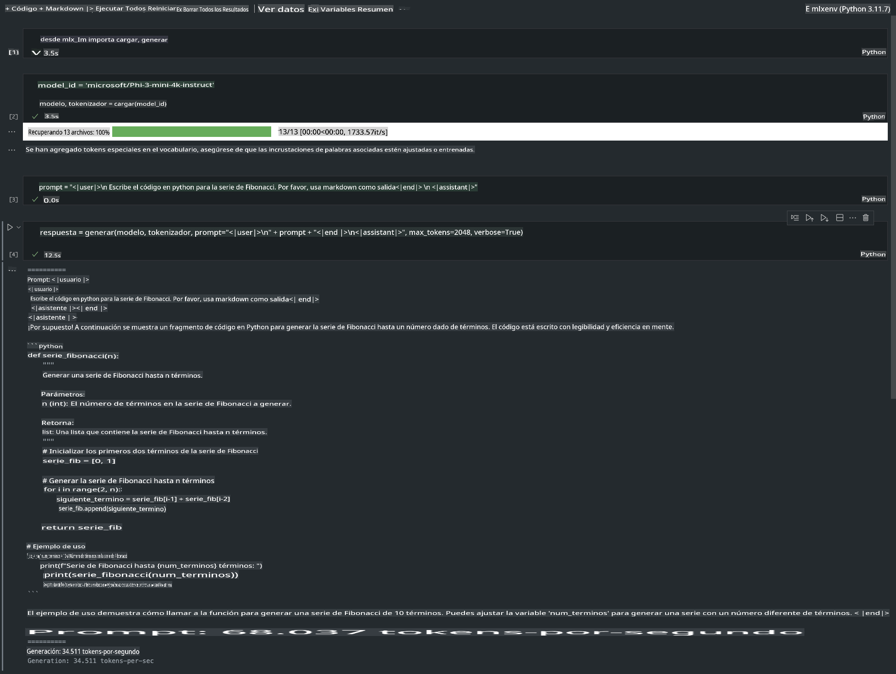

# **Inferencia de Phi-3 con el Framework Apple MLX**

## **Qué es el Framework MLX**

MLX es un framework para investigación en aprendizaje automático en dispositivos con Apple silicon, desarrollado por el equipo de investigación en aprendizaje automático de Apple.

MLX está diseñado por investigadores de aprendizaje automático para investigadores de aprendizaje automático. El framework está pensado para ser fácil de usar, pero aun así eficiente para entrenar y desplegar modelos. El diseño del framework en sí también es conceptualmente simple. Nuestro objetivo es facilitar a los investigadores la extensión y mejora de MLX para explorar rápidamente nuevas ideas.

Los LLMs pueden acelerarse en dispositivos con Apple Silicon a través de MLX, y los modelos pueden ejecutarse localmente de manera muy conveniente.

## **Usando MLX para inferencia de Phi-3-mini**

### **1. Configura tu entorno MLX**

1. Python 3.11.x
2. Instalar la Biblioteca MLX

```bash

pip install mlx-lm

```

### **2. Ejecutando Phi-3-mini en Terminal con MLX**

```bash

python -m mlx_lm.generate --model microsoft/Phi-3-mini-4k-instruct --max-token 2048 --prompt  "<|user|>\nCan you introduce yourself<|end|>\n<|assistant|>"

```

El resultado (mi entorno es Apple M1 Max, 64GB) es


### **3. Cuantizando Phi-3-mini con MLX en Terminal**

```bash

python -m mlx_lm.convert --hf-path microsoft/Phi-3-mini-4k-instruct

```

***Nota:*** El modelo puede ser cuantizado a través de mlx_lm.convert, y la cuantización por defecto es INT4. Este ejemplo cuantiza Phi-3-mini a INT4.

El modelo puede ser cuantizado a través de mlx_lm.convert, y la cuantización por defecto es INT4. Este ejemplo es para cuantizar Phi-3-mini en INT4. Después de la cuantización, se almacenará en el directorio por defecto ./mlx_model

Podemos probar el modelo cuantizado con MLX desde la terminal

```bash

python -m mlx_lm.generate --model ./mlx_model/ --max-token 2048 --prompt  "<|user|>\nCan you introduce yourself<|end|>\n<|assistant|>"

```

El resultado es


### **4. Ejecutando Phi-3-mini con MLX en Jupyter Notebook**



***Nota:*** Por favor, lee este ejemplo [haz clic en este enlace](../../../../code/03.Inference/MLX/MLX_DEMO.ipynb)

## **Recursos**

1. Aprende sobre el Framework Apple MLX [https://ml-explore.github.io](https://ml-explore.github.io/mlx/build/html/index.html)

2. Repositorio de Apple MLX en GitHub [https://github.com/ml-explore](https://github.com/ml-explore)

**Descargo de responsabilidad**:
Este documento ha sido traducido utilizando servicios de traducción automática basados en inteligencia artificial. Si bien nos esforzamos por lograr precisión, tenga en cuenta que las traducciones automatizadas pueden contener errores o imprecisiones. El documento original en su idioma nativo debe considerarse la fuente autorizada. Para información crítica, se recomienda la traducción profesional humana. No nos hacemos responsables de ningún malentendido o interpretación errónea que surja del uso de esta traducción.