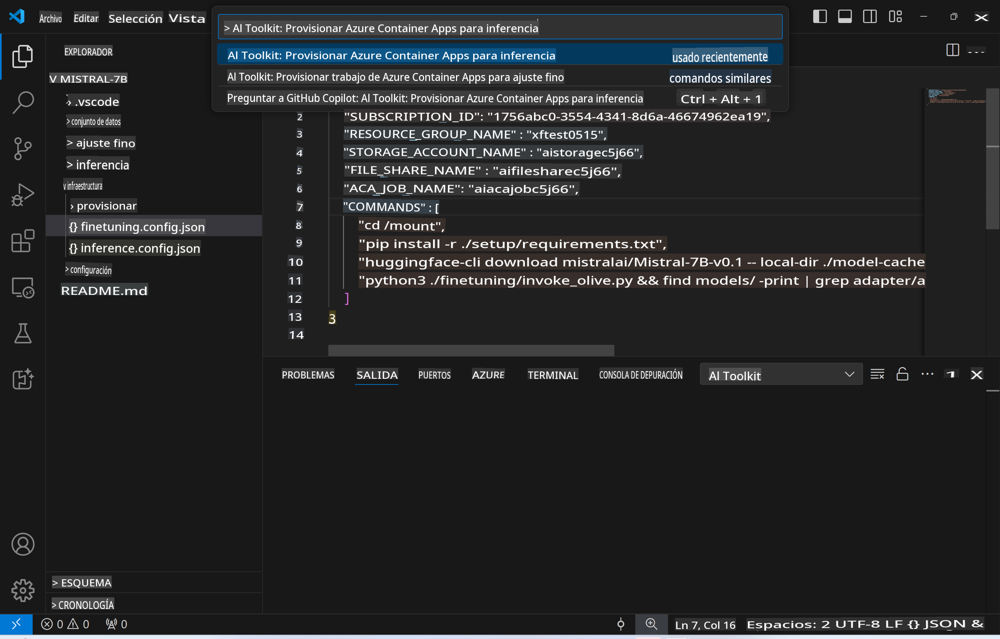
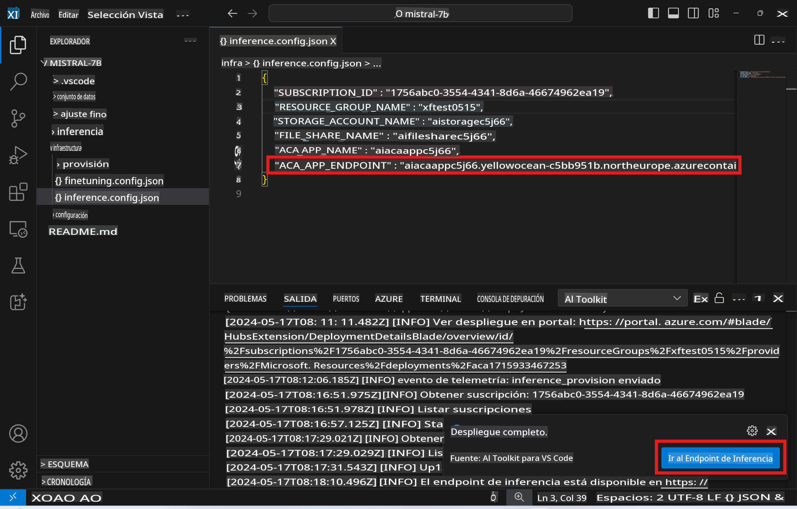

# Inferencia Remota con el modelo afinado

Después de que los adaptadores se entrenan en el entorno remoto, utiliza una aplicación simple de Gradio para interactuar con el modelo.


### Aprovisionar Recursos de Azure
Necesitas configurar los Recursos de Azure para la inferencia remota ejecutando el `AI Toolkit: Provision Azure Container Apps for inference` desde la paleta de comandos. Durante esta configuración, se te pedirá seleccionar tu Suscripción de Azure y grupo de recursos.  

   
Por defecto, la suscripción y el grupo de recursos para la inferencia deberían coincidir con los utilizados para el afinado. La inferencia usará el mismo Entorno de Aplicaciones de Contenedor de Azure y accederá al modelo y al adaptador de modelo almacenados en Archivos de Azure, que se generaron durante el paso de afinado.

## Usando AI Toolkit 

### Despliegue para Inferencia  
Si deseas revisar el código de inferencia o recargar el modelo de inferencia, por favor ejecuta el comando `AI Toolkit: Deploy for inference`. Esto sincronizará tu último código con ACA y reiniciará la réplica.  


Después de completar exitosamente el despliegue, el modelo está listo para ser evaluado usando este endpoint.

### Accediendo a la API de Inferencia

Puedes acceder a la API de inferencia haciendo clic en el botón "*Go to Inference Endpoint*" mostrado en la notificación de VSCode. Alternativamente, el endpoint de la API web se puede encontrar bajo `ACA_APP_ENDPOINT` en `./infra/inference.config.json` y en el panel de salida.



> **Note:** El endpoint de inferencia puede requerir unos minutos para estar completamente operativo.

## Componentes de Inferencia Incluidos en la Plantilla
 
| Carpeta | Contenidos |
| ------ |--------- |
| `infra` | Contiene todas las configuraciones necesarias para las operaciones remotas. |
| `infra/provision/inference.parameters.json` | Contiene parámetros para las plantillas bicep, usados para aprovisionar recursos de Azure para inferencia. |
| `infra/provision/inference.bicep` | Contiene plantillas para aprovisionar recursos de Azure para inferencia. |
| `infra/inference.config.json` | El archivo de configuración, generado por el comando `AI Toolkit: Provision Azure Container Apps for inference`. Se usa como entrada para otras paletas de comandos remotos. |

### Usando AI Toolkit para configurar el Aprovisionamiento de Recursos de Azure
Configura el [AI Toolkit](https://marketplace.visualstudio.com/items?itemName=ms-windows-ai-studio.windows-ai-studio)

Aprovisiona Aplicaciones de Contenedor de Azure para inferencia ` command.

You can find configuration parameters in `./infra/provision/inference.parameters.json` file. Here are the details:
| Parameter | Description |
| --------- |------------ |
| `defaultCommands` | This is the commands to initiate a web API. |
| `maximumInstanceCount` | This parameter sets the maximum capacity of GPU instances. |
| `location` | This is the location where Azure resources are provisioned. The default value is the same as the chosen resource group's location. |
| `storageAccountName`, `fileShareName` `acaEnvironmentName`, `acaEnvironmentStorageName`, `acaAppName`,  `acaLogAnalyticsName` | These parameters are used to name the Azure resources for provision. By default, they will be same to the fine-tuning resource name. You can input a new, unused resource name to create your own custom-named resources, or you can input the name of an already existing Azure resource if you'd prefer to use that. For details, refer to the section [Using existing Azure Resources](../../../../md/03.Inference). |

### Using Existing Azure Resources

By default, the inference provision use the same Azure Container App Environment, Storage Account, Azure File Share, and Azure Log Analytics that were used for fine-tuning. A separate Azure Container App is created solely for the inference API. 

If you have customized the Azure resources during the fine-tuning step or want to use your own existing Azure resources for inference, specify their names in the `./infra/inference.parameters.json` file. Luego, ejecuta el comando `AI Toolkit: Provision Azure Container Apps for inference` desde la paleta de comandos. Esto actualiza cualquier recurso especificado y crea aquellos que falten.

Por ejemplo, si tienes un entorno de contenedor de Azure existente, tu `./infra/finetuning.parameters.json` debería verse así:

```json
{
    "$schema": "https://schema.management.azure.com/schemas/2019-04-01/deploymentParameters.json#",
    "contentVersion": "1.0.0.0",
    "parameters": {
      ...
      "acaEnvironmentName": {
        "value": "<your-aca-env-name>"
      },
      "acaEnvironmentStorageName": {
        "value": null
      },
      ...
    }
  }
```

### Aprovisionamiento Manual  
Si prefieres configurar manualmente los recursos de Azure, puedes usar los archivos bicep proporcionados en el archivo `./infra/provision` folders. If you have already set up and configured all the Azure resources without using the AI Toolkit command palette, you can simply enter the resource names in the `inference.config.json`.

Por ejemplo:

```json
{
  "SUBSCRIPTION_ID": "<your-subscription-id>",
  "RESOURCE_GROUP_NAME": "<your-resource-group-name>",
  "STORAGE_ACCOUNT_NAME": "<your-storage-account-name>",
  "FILE_SHARE_NAME": "<your-file-share-name>",
  "ACA_APP_NAME": "<your-aca-name>",
  "ACA_APP_ENDPOINT": "<your-aca-endpoint>"
}
```

**Descargo de responsabilidad**: 
Este documento ha sido traducido utilizando servicios de traducción automática basados en inteligencia artificial. Si bien nos esforzamos por lograr precisión, tenga en cuenta que las traducciones automatizadas pueden contener errores o imprecisiones. El documento original en su idioma nativo debe considerarse la fuente autorizada. Para información crítica, se recomienda una traducción profesional realizada por humanos. No somos responsables de ningún malentendido o interpretación errónea que surja del uso de esta traducción.