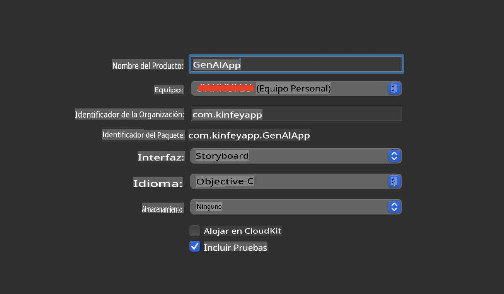
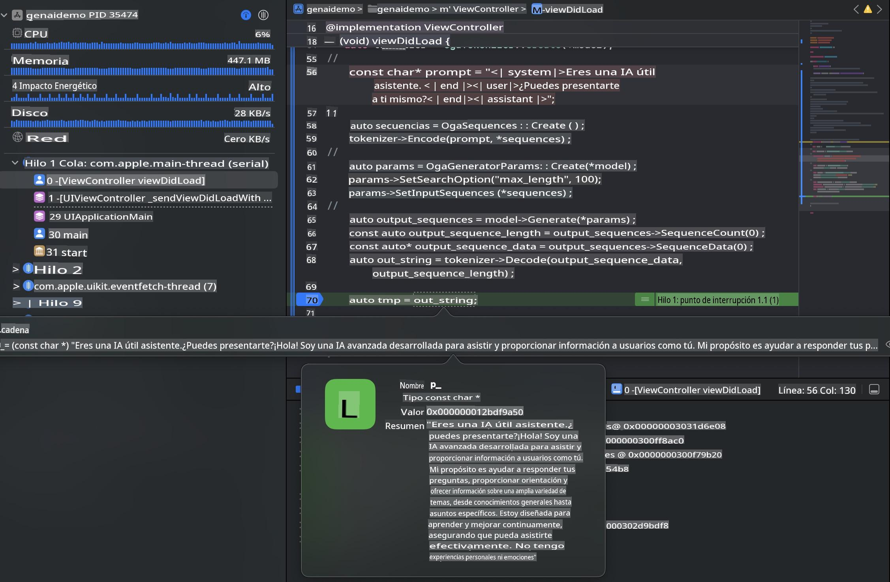

# **Inferencia Phi-3 en iOS**

Phi-3-mini es una nueva serie de modelos de Microsoft que permite el despliegue de Modelos de Lenguaje Grande (LLMs) en dispositivos edge y dispositivos IoT. Phi-3-mini está disponible para implementaciones en iOS, Android y dispositivos edge, permitiendo que la IA generativa se despliegue en entornos BYOD. El siguiente ejemplo demuestra cómo desplegar Phi-3-mini en iOS.

## **1. Preparación**

- **a.** macOS 14+
- **b.** Xcode 15+
- **c.** iOS SDK 17.x (iPhone 14 A16 o superior)
- **d.** Instalar Python 3.10+ (se recomienda Conda)
- **e.** Instalar la biblioteca de Python: `python-flatbuffers`
- **f.** Instalar CMake

### Kernel Semántico e Inferencia

Kernel Semántico es un marco de aplicación que te permite crear aplicaciones compatibles con Azure OpenAI Service, modelos de OpenAI e incluso modelos locales. Acceder a servicios locales a través de Kernel Semántico permite una fácil integración con tu servidor de modelos Phi-3-mini autoalojado.

### Llamando a Modelos Cuantizados con Ollama o LlamaEdge

Muchos usuarios prefieren usar modelos cuantizados para ejecutar modelos localmente. [Ollama](https://ollama.com) y [LlamaEdge](https://llamaedge.com) permiten a los usuarios llamar a diferentes modelos cuantizados:

#### **Ollama**

Puedes ejecutar `ollama run phi3` directamente o configurarlo offline. Crea un Modelfile con la ruta a tu archivo `gguf`. Código de ejemplo para ejecutar el modelo cuantizado Phi-3-mini:

```gguf
FROM {Add your gguf file path}
TEMPLATE \"\"\"<|user|> .Prompt<|end|> <|assistant|>\"\"\"
PARAMETER stop <|end|>
PARAMETER num_ctx 4096
```

#### **LlamaEdge**

Si deseas usar `gguf` en dispositivos en la nube y edge simultáneamente, LlamaEdge es una gran opción.

## **2. Compilando ONNX Runtime para iOS**

```bash

git clone https://github.com/microsoft/onnxruntime.git

cd onnxruntime

./build.sh --build_shared_lib --ios --skip_tests --parallel --build_dir ./build_ios --ios --apple_sysroot iphoneos --osx_arch arm64 --apple_deploy_target 17.5 --cmake_generator Xcode --config Release

cd ../

```

### **Aviso**

- **a.** Antes de compilar, asegúrate de que Xcode esté correctamente configurado y configúralo como el directorio de desarrollador activo en la terminal:

    ```bash
    sudo xcode-select -switch /Applications/Xcode.app/Contents/Developer
    ```

- **b.** ONNX Runtime necesita ser compilado para diferentes plataformas. Para iOS, puedes compilar para `arm64` or `x86_64`.

- **c.** Se recomienda usar el último SDK de iOS para la compilación. Sin embargo, también puedes usar una versión anterior si necesitas compatibilidad con SDKs anteriores.

## **3. Compilando IA Generativa con ONNX Runtime para iOS**

> **Nota:** Debido a que la IA Generativa con ONNX Runtime está en vista previa, ten en cuenta los posibles cambios.

```bash

git clone https://github.com/microsoft/onnxruntime-genai
 
cd onnxruntime-genai
 
mkdir ort
 
cd ort
 
mkdir include
 
mkdir lib
 
cd ../
 
cp ../onnxruntime/include/onnxruntime/core/session/onnxruntime_c_api.h ort/include
 
cp ../onnxruntime/build_ios/Release/Release-iphoneos/libonnxruntime*.dylib* ort/lib
 
export OPENCV_SKIP_XCODEBUILD_FORCE_TRYCOMPILE_DEBUG=1
 
python3 build.py --parallel --build_dir ./build_ios --ios --ios_sysroot iphoneos --ios_arch arm64 --ios_deployment_target 17.5 --cmake_generator Xcode --cmake_extra_defines CMAKE_XCODE_ATTRIBUTE_CODE_SIGNING_ALLOWED=NO

```

## **4. Crear una aplicación App en Xcode**

Elegí Objective-C como el método de desarrollo de la App, porque usando IA Generativa con la API C++ de ONNX Runtime, Objective-C es mejor compatible. Por supuesto, también puedes completar llamadas relacionadas a través de Swift bridging.



## **5. Copiar el modelo INT4 cuantizado de ONNX al proyecto de la aplicación App**

Necesitamos importar el modelo de cuantización INT4 en formato ONNX, que debe descargarse primero.


Después de descargarlo, necesitas agregarlo al directorio de Recursos del proyecto en Xcode.


## **6. Agregar la API de C++ en ViewControllers**

> **Aviso:**

- **a.** Agrega los archivos de encabezado C++ correspondientes al proyecto.

  

- **b.** Incluye `onnxruntime-genai` dynamic library in Xcode.

  

- **c.** Use the C Samples code for testing. You can also add additional features like ChatUI for more functionality.

- **d.** Since you need to use C++ in your project, rename `ViewController.m` to `ViewController.mm` para habilitar el soporte de Objective-C++.

```objc

    NSString *llmPath = [[NSBundle mainBundle] resourcePath];
    char const *modelPath = llmPath.cString;

    auto model =  OgaModel::Create(modelPath);

    auto tokenizer = OgaTokenizer::Create(*model);

    const char* prompt = "<|system|>You are a helpful AI assistant.<|end|><|user|>Can you introduce yourself?<|end|><|assistant|>";

    auto sequences = OgaSequences::Create();
    tokenizer->Encode(prompt, *sequences);

    auto params = OgaGeneratorParams::Create(*model);
    params->SetSearchOption("max_length", 100);
    params->SetInputSequences(*sequences);

    auto output_sequences = model->Generate(*params);
    const auto output_sequence_length = output_sequences->SequenceCount(0);
    const auto* output_sequence_data = output_sequences->SequenceData(0);
    auto out_string = tokenizer->Decode(output_sequence_data, output_sequence_length);
    
    auto tmp = out_string;

```

## **7. Ejecutando la Aplicación**

Una vez que la configuración esté completa, puedes ejecutar la aplicación para ver los resultados de la inferencia del modelo Phi-3-mini.



Para más código de ejemplo e instrucciones detalladas, visita el [repositorio de Ejemplos de Phi-3 Mini](https://github.com/Azure-Samples/Phi-3MiniSamples/tree/main/ios).

        **Descargo de responsabilidad**: 
        Este documento ha sido traducido utilizando servicios de traducción automática basados en IA. Si bien nos esforzamos por lograr precisión, tenga en cuenta que las traducciones automáticas pueden contener errores o imprecisiones. El documento original en su idioma nativo debe considerarse la fuente autorizada. Para información crítica, se recomienda una traducción humana profesional. No somos responsables de ningún malentendido o interpretación errónea que surja del uso de esta traducción.