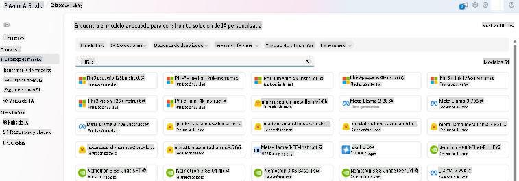
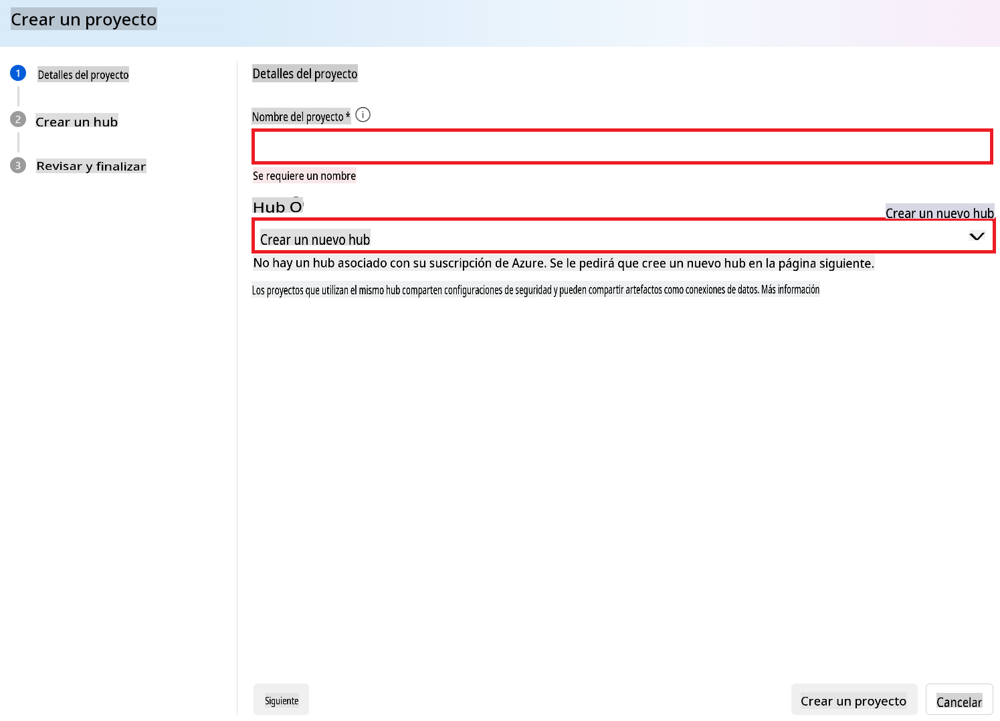
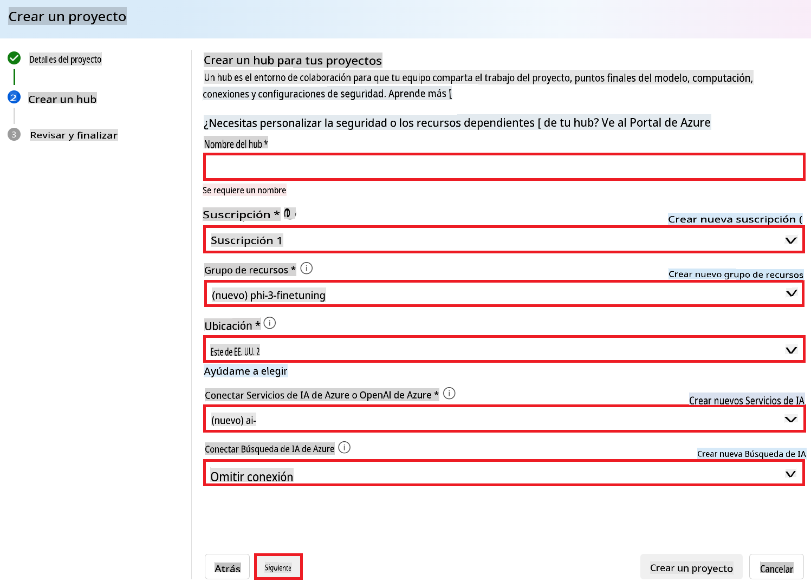
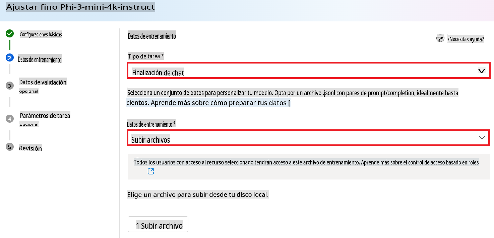
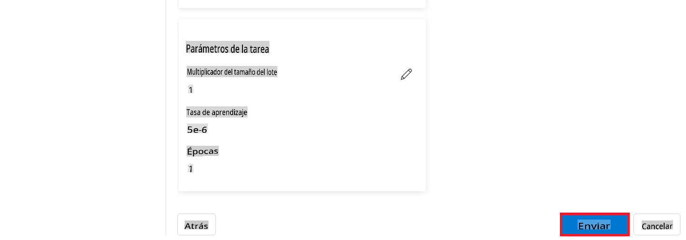

# Ajuste fino de Phi-3 con Azure AI Studio

Exploremos cómo ajustar fino el modelo de lenguaje Phi-3 Mini de Microsoft utilizando Azure AI Studio. El ajuste fino te permite adaptar Phi-3 Mini a tareas específicas, haciéndolo aún más poderoso y consciente del contexto.

## Consideraciones

- **Capacidades:** ¿Qué modelos se pueden ajustar fino? ¿Qué puede hacer el modelo base después del ajuste fino?
- **Costo:** ¿Cuál es el modelo de precios para el ajuste fino?
**Personalización:** ¿Cuánto puedo modificar el modelo base y de qué maneras?
- **Conveniencia:** ¿Cómo se lleva a cabo el ajuste fino? ¿Necesito escribir código personalizado? ¿Necesito traer mi propia capacidad de cómputo?
- **Seguridad:** Se sabe que los modelos ajustados fino pueden tener riesgos de seguridad. ¿Hay medidas de protección para evitar daños no intencionados?



## Preparación para el ajuste fino

### Requisitos previos

> [!NOTE]
> Para los modelos de la familia Phi-3, la oferta de ajuste fino de pago por uso solo está disponible con hubs creados en las regiones de **East US 2**.

- Una suscripción de Azure. Si no tienes una suscripción de Azure, crea una [cuenta de Azure de pago](https://azure.microsoft.com/pricing/purchase-options/pay-as-you-go) para comenzar.

- Un [proyecto de AI Studio](https://ai.azure.com?WT.mc_id=aiml-138114-kinfeylo).
- Los controles de acceso basados en roles de Azure (Azure RBAC) se utilizan para otorgar acceso a las operaciones en Azure AI Studio. Para realizar los pasos en este artículo, tu cuenta de usuario debe estar asignada al __rol de Desarrollador de Azure AI__ en el grupo de recursos.

### Registro del proveedor de suscripciones

Verifica que la suscripción esté registrada en el proveedor de recursos `Microsoft.Network`.

1. Inicia sesión en el [portal de Azure](https://portal.azure.com).
1. Selecciona **Suscripciones** en el menú de la izquierda.
1. Selecciona la suscripción que deseas usar.
1. Selecciona **Configuración del proyecto de AI** > **Proveedores de recursos** en el menú de la izquierda.
1. Confirma que **Microsoft.Network** esté en la lista de proveedores de recursos. De lo contrario, añádelo.

### Preparación de datos

Prepara tus datos de entrenamiento y validación para ajustar fino tu modelo. Tus conjuntos de datos de entrenamiento y validación consisten en ejemplos de entrada y salida para cómo te gustaría que el modelo se desempeñara.

Asegúrate de que todos tus ejemplos de entrenamiento sigan el formato esperado para la inferencia. Para ajustar fino los modelos de manera efectiva, asegúrate de tener un conjunto de datos equilibrado y diverso.

Esto implica mantener el equilibrio de datos, incluir varios escenarios y refinar periódicamente los datos de entrenamiento para alinearlos con las expectativas del mundo real, lo que en última instancia conduce a respuestas del modelo más precisas y equilibradas.

Diferentes tipos de modelos requieren un formato diferente de datos de entrenamiento.

### Chat Completion

Los datos de entrenamiento y validación que uses **deben** estar formateados como un documento JSON Lines (JSONL). Para `Phi-3-mini-128k-instruct`, el conjunto de datos de ajuste fino debe estar formateado en el formato conversacional que utiliza la API de Chat completions.

### Ejemplo de formato de archivo

```json
    {"messages": [{"role": "system", "content": "Eres un agente de soporte al cliente de Xbox cuyo objetivo principal es ayudar a los usuarios con problemas que están experimentando con sus dispositivos Xbox. Eres amigable y conciso. Solo proporcionas respuestas basadas en hechos y no proporcionas respuestas que no estén relacionadas con Xbox."}, {"role": "user", "content": "¿Es Xbox mejor que PlayStation?"}, {"role": "assistant", "content": "Lo siento, pero no puedo dar opiniones personales. Mi trabajo principal es asistirte con cualquier problema relacionado con tu dispositivo Xbox. ¿Tienes algún problema relacionado con Xbox que necesite atención?"}]}
    {"messages": [{"role": "system", "content": "Eres un agente de soporte al cliente de Xbox cuyo objetivo principal es ayudar a los usuarios con problemas que están experimentando con sus dispositivos Xbox. Eres amigable y conciso. Solo proporcionas respuestas basadas en hechos y no proporcionas respuestas que no estén relacionadas con Xbox."}, {"role": "user", "content": "¿Puedo jugar juegos de PC en mi Xbox?"}, {"role": "assistant", "content": "Aunque las consolas Xbox no soportan juegos de PC de manera nativa, pueden jugar una variedad de juegos de Xbox, muchos de los cuales también están disponibles en PC. ¿Puedo ayudarte a encontrar juegos compatibles con tu dispositivo Xbox?"}]}
    {"messages": [{"role": "system", "content": "Eres un agente de soporte al cliente de Xbox cuyo objetivo principal es ayudar a los usuarios con problemas que están experimentando con sus dispositivos Xbox. Eres amigable y conciso. Solo proporcionas respuestas basadas en hechos y no proporcionas respuestas que no estén relacionadas con Xbox."}, {"role": "user", "content": "Estoy teniendo problemas para conectar mi Xbox al Wi-Fi."}, {"role": "assistant", "content": "No te preocupes, revisemos la configuración de red en tu Xbox. ¿Puedes decirme qué sucede cuando intentas conectarla al Wi-Fi?"}]}
```

El tipo de archivo soportado es JSON Lines. Los archivos se cargan en el almacén de datos predeterminado y están disponibles en tu proyecto.

## Ajuste fino de Phi-3 con Azure AI Studio

Azure AI Studio te permite adaptar grandes modelos de lenguaje a tus conjuntos de datos personales mediante un proceso conocido como ajuste fino. El ajuste fino proporciona un valor significativo al permitir la personalización y optimización para tareas y aplicaciones específicas. Conduce a un mejor rendimiento, eficiencia de costos, reducción de latencia y resultados personalizados.


### Crear un nuevo proyecto

1. Inicia sesión en [Azure AI Studio](https://ai.azure.com).

1. Selecciona **+Nuevo proyecto** para crear un nuevo proyecto en Azure AI Studio.

    

1. Realiza las siguientes tareas:

    - Nombre del **Hub del proyecto**. Debe ser un valor único.
    - Selecciona el **Hub** a utilizar (crea uno nuevo si es necesario).

    

1. Realiza las siguientes tareas para crear un nuevo hub:

    - Ingresa el **Nombre del hub**. Debe ser un valor único.
    - Selecciona tu **Suscripción de Azure**.
    - Selecciona el **Grupo de recursos** a utilizar (crea uno nuevo si es necesario).
    - Selecciona la **Ubicación** que deseas utilizar.
    - Selecciona **Conectar Servicios de Azure AI** a utilizar (crea uno nuevo si es necesario).
    - Selecciona **Conectar Búsqueda de Azure AI** para **Omitir la conexión**.

    

1. Selecciona **Siguiente**.
1. Selecciona **Crear un proyecto**.

### Preparación de datos

Antes del ajuste fino, reúne o crea un conjunto de datos relevante para tu tarea, como instrucciones de chat, pares de preguntas y respuestas, o cualquier otro dato de texto pertinente. Limpia y preprocesa estos datos eliminando el ruido, manejando valores faltantes y tokenizando el texto.

### Ajuste fino de modelos Phi-3 en Azure AI Studio

> [!NOTE]
> El ajuste fino de los modelos Phi-3 es actualmente compatible en proyectos ubicados en East US 2.

1. Selecciona **Catálogo de modelos** en la pestaña lateral izquierda.

1. Escribe *phi-3* en la **barra de búsqueda** y selecciona el modelo phi-3 que deseas utilizar.

    

1. Selecciona **Ajuste fino**.

    

1. Ingresa el **Nombre del modelo ajustado fino**.

    

1. Selecciona **Siguiente**.

1. Realiza las siguientes tareas:

    - Selecciona el **tipo de tarea** como **Chat completion**.
    - Selecciona los **Datos de entrenamiento** que deseas utilizar. Puedes cargarlos a través de los datos de Azure AI Studio o desde tu entorno local.

    

1. Selecciona **Siguiente**.

1. Carga los **Datos de validación** que deseas utilizar o puedes seleccionar **División automática de datos de entrenamiento**.

    

1. Selecciona **Siguiente**.

1. Realiza las siguientes tareas:

    - Selecciona el **Multiplicador del tamaño del lote** que deseas utilizar.
    - Selecciona la **Tasa de aprendizaje** que deseas utilizar.
    - Selecciona las **Épocas** que deseas utilizar.

    

1. Selecciona **Enviar** para iniciar el proceso de ajuste fino.

    

1. Una vez que tu modelo esté ajustado fino, el estado se mostrará como **Completado**, como se muestra en la imagen a continuación. Ahora puedes desplegar el modelo y usarlo en tu propia aplicación, en el playground o en el flujo de prompts. Para más información, consulta [Cómo desplegar la familia de modelos de lenguaje pequeños Phi-3 con Azure AI Studio](https://learn.microsoft.com/azure/ai-studio/how-to/deploy-models-phi-3?tabs=phi-3-5&pivots=programming-language-python).

    

> [!NOTE]
> Para obtener información más detallada sobre el ajuste fino de Phi-3, visita [Ajuste fino de modelos Phi-3 en Azure AI Studio](https://learn.microsoft.com/azure/ai-studio/how-to/fine-tune-phi-3?tabs=phi-3-mini).

## Limpiar tus modelos ajustados fino

Puedes eliminar un modelo ajustado fino de la lista de modelos ajustados fino en [Azure AI Studio](https://ai.azure.com) o desde la página de detalles del modelo. Selecciona el modelo ajustado fino que deseas eliminar desde la página de Ajuste fino y luego selecciona el botón Eliminar para eliminar el modelo ajustado fino.

> [!NOTE]
> No puedes eliminar un modelo personalizado si tiene un despliegue existente. Debes eliminar primero tu despliegue de modelo antes de poder eliminar tu modelo personalizado.

## Costo y cuotas

### Consideraciones de costo y cuota para modelos Phi-3 ajustados fino como servicio

Los modelos Phi ajustados fino como servicio son ofrecidos por Microsoft e integrados con Azure AI Studio para su uso. Puedes encontrar los precios al [desplegar](https://learn.microsoft.com/azure/ai-studio/how-to/deploy-models-phi-3?tabs=phi-3-5&pivots=programming-language-python) o ajustar fino los modelos bajo la pestaña de Precios y términos en el asistente de despliegue.

## Filtrado de contenido

Los modelos desplegados como servicio con pago por uso están protegidos por la Seguridad de Contenido de Azure AI. Cuando se despliegan a puntos finales en tiempo real, puedes optar por no utilizar esta capacidad. Con la seguridad de contenido de Azure AI habilitada, tanto el prompt como la respuesta pasan por un conjunto de modelos de clasificación destinados a detectar y prevenir la salida de contenido dañino. El sistema de filtrado de contenido detecta y toma medidas sobre categorías específicas de contenido potencialmente dañino tanto en los prompts de entrada como en las respuestas. Aprende más sobre [Seguridad de Contenido de Azure AI](https://learn.microsoft.com/azure/ai-studio/concepts/content-filtering).

**Configuración de Ajuste Fino**

Hiperparámetros: Define hiperparámetros como la tasa de aprendizaje, el tamaño del lote y el número de épocas de entrenamiento.

**Función de Pérdida**

Elige una función de pérdida apropiada para tu tarea (por ejemplo, entropía cruzada).

**Optimizador**

Selecciona un optimizador (por ejemplo, Adam) para las actualizaciones de gradiente durante el entrenamiento.

**Proceso de Ajuste Fino**

- Cargar Modelo Preentrenado: Carga el checkpoint de Phi-3 Mini.
- Añadir Capas Personalizadas: Añade capas específicas para la tarea (por ejemplo, cabeza de clasificación para instrucciones de chat).

**Entrenar el Modelo**
Ajusta fino el modelo usando tu conjunto de datos preparado. Monitorea el progreso del entrenamiento y ajusta los hiperparámetros según sea necesario.

**Evaluación y Validación**

Conjunto de Validación: Divide tus datos en conjuntos de entrenamiento y validación.

**Evaluar el Rendimiento**

Utiliza métricas como precisión, F1-score o perplejidad para evaluar el rendimiento del modelo.

## Guardar el Modelo Ajustado Fino

**Checkpoint**
Guarda el checkpoint del modelo ajustado fino para uso futuro.

## Despliegue

- Despliega como un Servicio Web: Despliega tu modelo ajustado fino como un servicio web en Azure AI Studio.
- Prueba el Punto Final: Envía consultas de prueba al punto final desplegado para verificar su funcionalidad.

## Iterar y Mejorar

Iterar: Si el rendimiento no es satisfactorio, itera ajustando los hiperparámetros, añadiendo más datos o ajustando fino por más épocas.

## Monitorear y Refinar

Monitorea continuamente el comportamiento del modelo y refínalo según sea necesario.

## Personalizar y Extender

Tareas Personalizadas: Phi-3 Mini puede ajustarse fino para varias tareas más allá de las instrucciones de chat. ¡Explora otros casos de uso!
Experimenta: Prueba diferentes arquitecturas, combinaciones de capas y técnicas para mejorar el rendimiento.

> [!NOTE]
> El ajuste fino es un proceso iterativo. ¡Experimenta, aprende y adapta tu modelo para lograr los mejores resultados para tu tarea específica!

Aviso legal: La traducción fue realizada a partir del original por un modelo de IA y puede no ser perfecta. 
Por favor, revise el resultado y haga las correcciones necesarias.