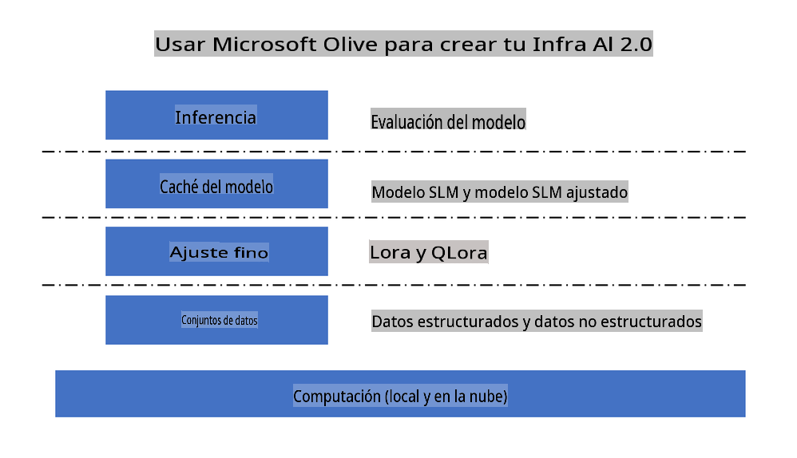
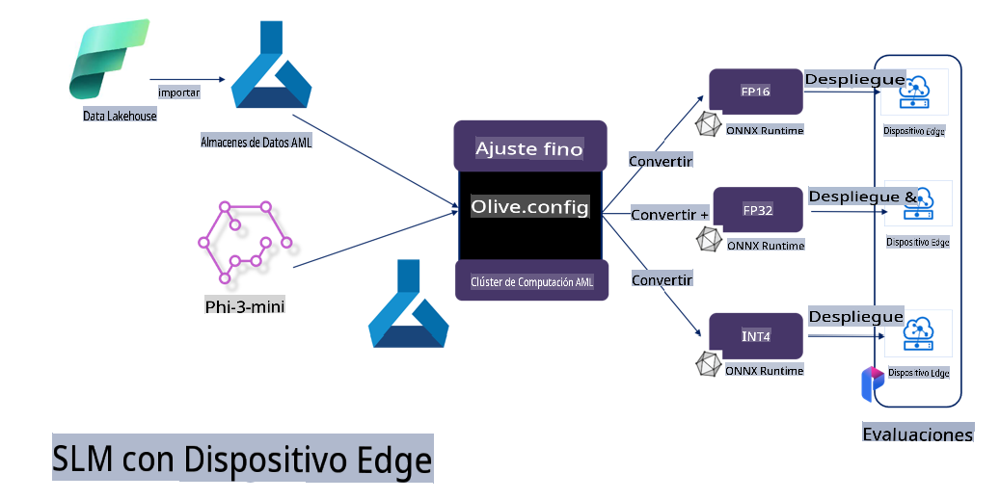

# **Ajuste fino de Phi-3 con Microsoft Olive**

[Olive](https://github.com/microsoft/OLive?WT.mc_id=aiml-138114-kinfeylo) es una herramienta de optimización de modelos consciente del hardware, fácil de usar, que reúne técnicas líderes en la industria en compresión, optimización y compilación de modelos.

Está diseñada para simplificar el proceso de optimización de modelos de aprendizaje automático, asegurando que hagan el uso más eficiente de arquitecturas de hardware específicas.

Ya sea que estés trabajando en aplicaciones basadas en la nube o dispositivos de borde, Olive te permite optimizar tus modelos de manera fácil y efectiva.

## Características Clave:
- Olive agrega y automatiza técnicas de optimización para los objetivos de hardware deseados.
- No existe una técnica de optimización única que se ajuste a todos los escenarios, por lo que Olive permite la extensibilidad al permitir que los expertos de la industria integren sus innovaciones de optimización.

## Reducir el Esfuerzo de Ingeniería:
- Los desarrolladores a menudo necesitan aprender y utilizar múltiples cadenas de herramientas específicas de proveedores de hardware para preparar y optimizar modelos entrenados para su despliegue.
- Olive simplifica esta experiencia automatizando técnicas de optimización para el hardware deseado.

## Solución de Optimización E2E Lista para Usar:

Al componer y ajustar técnicas integradas, Olive ofrece una solución unificada para la optimización de extremo a extremo.
Tiene en cuenta restricciones como la precisión y la latencia al optimizar los modelos.

## Usando Microsoft Olive para ajuste fino

Microsoft Olive es una herramienta de optimización de modelos de código abierto muy fácil de usar que puede cubrir tanto el ajuste fino como la referencia en el campo de la inteligencia artificial generativa. Solo requiere una configuración simple, combinada con el uso de pequeños modelos de lenguaje de código abierto y entornos de ejecución relacionados (AzureML / GPU local, CPU, DirectML), puedes completar el ajuste fino o la referencia del modelo a través de la optimización automática, y encontrar el mejor modelo para desplegar en la nube o en dispositivos de borde. Permite a las empresas construir sus propios modelos verticales de la industria en las instalaciones y en la nube.



## Ajuste Fino de Phi-3 con Microsoft Olive



## Código de Ejemplo y Ejemplo de Olive para Phi-3
En este ejemplo, usarás Olive para:

- Ajustar fino un adaptador LoRA para clasificar frases en Tristeza, Alegría, Miedo, Sorpresa.
- Fusionar los pesos del adaptador en el modelo base.
- Optimizar y cuantizar el modelo en int4.

[Código de Ejemplo](../../code/04.Finetuning/olive-ort-example/README.md)

### Configuración de Microsoft Olive

La instalación de Microsoft Olive es muy simple, y también puede instalarse para CPU, GPU, DirectML y Azure ML

```bash
pip install olive-ai
```

Si deseas ejecutar un modelo ONNX con una CPU, puedes usar

```bash
pip install olive-ai[cpu]
```

Si deseas ejecutar un modelo ONNX con una GPU, puedes usar

```python
pip install olive-ai[gpu]
```

Si deseas usar Azure ML, usa

```python
pip install git+https://github.com/microsoft/Olive#egg=olive-ai[azureml]
```

**Aviso**
Requisito del SO: Ubuntu 20.04 / 22.04 

### **Config.json de Microsoft Olive**

Después de la instalación, puedes configurar diferentes configuraciones específicas del modelo a través del archivo Config, incluyendo datos, computación, entrenamiento, despliegue y generación de modelos.

**1. Datos**

En Microsoft Olive, se puede entrenar con datos locales y datos en la nube, y se puede configurar en la configuración.

*Configuración de datos locales*

Puedes configurar fácilmente el conjunto de datos que necesita ser entrenado para el ajuste fino, generalmente en formato json, y adaptarlo con la plantilla de datos. Esto necesita ser ajustado según los requisitos del modelo (por ejemplo, adaptarlo al formato requerido por Microsoft Phi-3-mini. Si tienes otros modelos, por favor consulta los formatos de ajuste fino requeridos por otros modelos para el procesamiento)

```json

    "data_configs": [
        {
            "name": "dataset_default_train",
            "type": "HuggingfaceContainer",
            "load_dataset_config": {
                "params": {
                    "data_name": "json", 
                    "data_files":"dataset/dataset-classification.json",
                    "split": "train"
                }
            },
            "pre_process_data_config": {
                "params": {
                    "dataset_type": "corpus",
                    "text_cols": [
                            "phrase",
                            "tone"
                    ],
                    "text_template": "### Text: {phrase}\n### The tone is:\n{tone}",
                    "corpus_strategy": "join",
                    "source_max_len": 2048,
                    "pad_to_max_len": false,
                    "use_attention_mask": false
                }
            }
        }
    ],
```

**Configuración de fuente de datos en la nube**

Al vincular el almacén de datos de Azure AI Studio / Azure Machine Learning Service para vincular los datos en la nube, puedes elegir introducir diferentes fuentes de datos a Azure AI Studio / Azure Machine Learning Service a través de Microsoft Fabric y Azure Data como soporte para el ajuste fino de los datos.

```json

    "data_configs": [
        {
            "name": "dataset_default_train",
            "type": "HuggingfaceContainer",
            "load_dataset_config": {
                "params": {
                    "data_name": "json", 
                    "data_files": {
                        "type": "azureml_datastore",
                        "config": {
                            "azureml_client": {
                                "subscription_id": "Your Azure Subscrition ID",
                                "resource_group": "Your Azure Resource Group",
                                "workspace_name": "Your Azure ML Workspaces name"
                            },
                            "datastore_name": "workspaceblobstore",
                            "relative_path": "Your train_data.json Azure ML Location"
                        }
                    },
                    "split": "train"
                }
            },
            "pre_process_data_config": {
                "params": {
                    "dataset_type": "corpus",
                    "text_cols": [
                            "Question",
                            "Best Answer"
                    ],
                    "text_template": "<|user|>\n{Question}<|end|>\n<|assistant|>\n{Best Answer}\n<|end|>",
                    "corpus_strategy": "join",
                    "source_max_len": 2048,
                    "pad_to_max_len": false,
                    "use_attention_mask": false
                }
            }
        }
    ],
    
```

**2. Configuración de Computación**

Si necesitas estar local, puedes usar directamente los recursos de datos locales. Necesitas usar los recursos de Azure AI Studio / Azure Machine Learning Service. Necesitas configurar los parámetros relevantes de Azure, el nombre de la potencia de cálculo, etc.

```json

    "systems": {
        "aml": {
            "type": "AzureML",
            "config": {
                "accelerators": ["gpu"],
                "hf_token": true,
                "aml_compute": "Your Azure AI Studio / Azure Machine Learning Service Compute Name",
                "aml_docker_config": {
                    "base_image": "Your Azure AI Studio / Azure Machine Learning Service docker",
                    "conda_file_path": "conda.yaml"
                }
            }
        },
        "azure_arc": {
            "type": "AzureML",
            "config": {
                "accelerators": ["gpu"],
                "aml_compute": "Your Azure AI Studio / Azure Machine Learning Service Compute Name",
                "aml_docker_config": {
                    "base_image": "Your Azure AI Studio / Azure Machine Learning Service docker",
                    "conda_file_path": "conda.yaml"
                }
            }
        }
    },
```

***Aviso***

Debido a que se ejecuta a través de un contenedor en Azure AI Studio / Azure Machine Learning Service, el entorno requerido necesita ser configurado. Esto se configura en el entorno conda.yaml.

```yaml

name: project_environment
channels:
  - defaults
dependencies:
  - python=3.8.13
  - pip=22.3.1
  - pip:
      - einops
      - accelerate
      - azure-keyvault-secrets
      - azure-identity
      - bitsandbytes
      - datasets
      - huggingface_hub
      - peft
      - scipy
      - sentencepiece
      - torch>=2.2.0
      - transformers
      - git+https://github.com/microsoft/Olive@jiapli/mlflow_loading_fix#egg=olive-ai[gpu]
      - --extra-index-url https://aiinfra.pkgs.visualstudio.com/PublicPackages/_packaging/ORT-Nightly/pypi/simple/ 
      - ort-nightly-gpu==1.18.0.dev20240307004
      - --extra-index-url https://aiinfra.pkgs.visualstudio.com/PublicPackages/_packaging/onnxruntime-genai/pypi/simple/
      - onnxruntime-genai-cuda

    

```

**3. Elige tu SLM**

Puedes usar el modelo directamente de Hugging face, o puedes combinarlo directamente con el Catálogo de Modelos de Azure AI Studio / Azure Machine Learning para seleccionar el modelo a usar. En el ejemplo de código a continuación, usaremos Microsoft Phi-3-mini como ejemplo.

Si tienes el modelo localmente, puedes usar este método

```json

    "input_model":{
        "type": "PyTorchModel",
        "config": {
            "hf_config": {
                "model_name": "model-cache/microsoft/phi-3-mini",
                "task": "text-generation",
                "model_loading_args": {
                    "trust_remote_code": true
                }
            }
        }
    },
```

Si deseas usar un modelo de Azure AI Studio / Azure Machine Learning Service, puedes usar este método

```json

    "input_model":{
        "type": "PyTorchModel",
        "config": {
            "model_path": {
                "type": "azureml_registry_model",
                "config": {
                    "name": "microsoft/Phi-3-mini-4k-instruct",
                    "registry_name": "azureml-msr",
                    "version": "11"
                }
            },
             "model_file_format": "PyTorch.MLflow",
             "hf_config": {
                "model_name": "microsoft/Phi-3-mini-4k-instruct",
                "task": "text-generation",
                "from_pretrained_args": {
                    "trust_remote_code": true
                }
            }
        }
    },
```

**Aviso:**
Necesitamos integrarnos con Azure AI Studio / Azure Machine Learning Service, así que al configurar el modelo, por favor consulta el número de versión y la nomenclatura relacionada.

Todos los modelos en Azure necesitan configurarse en PyTorch.MLflow

Necesitas tener una cuenta de Hugging face y vincular la clave al valor de la clave de Azure AI Studio / Azure Machine Learning

**4. Algoritmo**

Microsoft Olive encapsula muy bien los algoritmos de ajuste fino de Lora y QLora. Todo lo que necesitas configurar son algunos parámetros relevantes. Aquí tomo QLora como ejemplo.

```json
        "lora": {
            "type": "LoRA",
            "config": {
                "target_modules": [
                    "o_proj",
                    "qkv_proj"
                ],
                "double_quant": true,
                "lora_r": 64,
                "lora_alpha": 64,
                "lora_dropout": 0.1,
                "train_data_config": "dataset_default_train",
                "eval_dataset_size": 0.3,
                "training_args": {
                    "seed": 0,
                    "data_seed": 42,
                    "per_device_train_batch_size": 1,
                    "per_device_eval_batch_size": 1,
                    "gradient_accumulation_steps": 4,
                    "gradient_checkpointing": false,
                    "learning_rate": 0.0001,
                    "num_train_epochs": 3,
                    "max_steps": 10,
                    "logging_steps": 10,
                    "evaluation_strategy": "steps",
                    "eval_steps": 187,
                    "group_by_length": true,
                    "adam_beta2": 0.999,
                    "max_grad_norm": 0.3
                }
            }
        },
```

Si deseas conversión de cuantización, la rama principal de Microsoft Olive ya soporta el método onnxruntime-genai. Puedes configurarlo según tus necesidades:

1. fusionar pesos del adaptador en el modelo base
2. Convertir el modelo a un modelo onnx con la precisión requerida por ModelBuilder

como convertir a INT4 cuantizado

```json

        "merge_adapter_weights": {
            "type": "MergeAdapterWeights"
        },
        "builder": {
            "type": "ModelBuilder",
            "config": {
                "precision": "int4"
            }
        }
```

**Aviso**
- Si usas QLoRA, la conversión de cuantización de ONNXRuntime-genai no es soportada por el momento.

- Debe señalarse aquí que puedes configurar los pasos anteriores según tus propias necesidades. No es necesario configurar completamente los pasos anteriores. Dependiendo de tus necesidades, puedes usar directamente los pasos del algoritmo sin ajuste fino. Finalmente necesitas configurar los motores relevantes

```json

    "engine": {
        "log_severity_level": 0,
        "host": "aml",
        "target": "aml",
        "search_strategy": false,
        "execution_providers": ["CUDAExecutionProvider"],
        "cache_dir": "../model-cache/models/phi3-finetuned/cache",
        "output_dir" : "../model-cache/models/phi3-finetuned"
    }
```

**5. Ajuste fino terminado**

En la línea de comandos, ejecuta en el directorio de olive-config.json

```bash
olive run --config olive-config.json  
```

        **Descargo de responsabilidad**: 
        Este documento ha sido traducido utilizando servicios de traducción automática basados en IA. Aunque nos esforzamos por lograr precisión, tenga en cuenta que las traducciones automáticas pueden contener errores o imprecisiones. El documento original en su idioma nativo debe considerarse la fuente autorizada. Para información crítica, se recomienda la traducción profesional humana. No nos hacemos responsables de ningún malentendido o interpretación errónea que surja del uso de esta traducción.