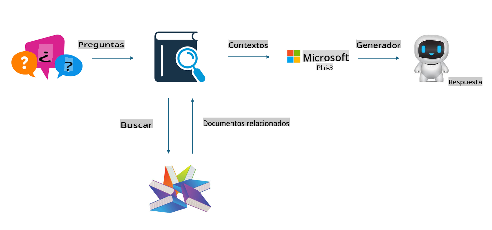

# **Deja que Phi-3 se convierta en un experto en la industria**

Para incorporar el modelo Phi-3 en una industria, es necesario agregar datos empresariales específicos al modelo Phi-3. Tenemos dos opciones diferentes: la primera es RAG (Generación Aumentada por Recuperación) y la segunda es Fine Tuning (Ajuste Fino).

## **RAG vs Fine-Tuning**

### **Generación Aumentada por Recuperación**

RAG es recuperación de datos + generación de texto. Los datos estructurados y no estructurados de la empresa se almacenan en la base de datos vectorial. Al buscar contenido relevante, se encuentra el resumen y contenido pertinente para formar un contexto, y se combina con la capacidad de finalización de texto de LLM/SLM para generar contenido.

### **Ajuste Fino**

El ajuste fino se basa en la mejora de un modelo determinado. No es necesario comenzar con el algoritmo del modelo, pero se necesita acumular datos continuamente. Si deseas una terminología y expresión de lenguaje más precisa en aplicaciones industriales, el ajuste fino es tu mejor opción. Pero si tus datos cambian con frecuencia, el ajuste fino puede volverse complicado.

### **Cómo elegir**

1. Si nuestra respuesta requiere la introducción de datos externos, RAG es la mejor opción.

2. Si necesitas producir conocimiento industrial estable y preciso, el ajuste fino será una buena elección. RAG prioriza extraer contenido relevante, pero puede que no siempre capte las sutilezas especializadas.

3. El ajuste fino requiere un conjunto de datos de alta calidad, y si es solo un pequeño rango de datos, no hará mucha diferencia. RAG es más flexible.

4. El ajuste fino es una caja negra, una metafísica, y es difícil entender el mecanismo interno. Pero RAG puede hacer más fácil encontrar la fuente de los datos, ajustando eficazmente alucinaciones o errores de contenido y proporcionando mejor transparencia.

### **Escenarios**

1. Industrias verticales que requieren vocabulario y expresiones profesionales específicas, ***Fine-tuning*** será la mejor opción.

2. Sistema de preguntas y respuestas, que involucra la síntesis de diferentes puntos de conocimiento, ***RAG*** será la mejor opción.

3. La combinación de flujo de negocio automatizado ***RAG + Fine-tuning*** es la mejor opción.

## **Cómo usar RAG**

Una base de datos vectorial es una colección de datos almacenados en forma matemática. Las bases de datos vectoriales facilitan que los modelos de aprendizaje automático recuerden entradas anteriores, permitiendo usar el aprendizaje automático para apoyar casos de uso como búsqueda, recomendaciones y generación de texto. Los datos pueden identificarse basándose en métricas de similitud en lugar de coincidencias exactas, permitiendo que los modelos computacionales comprendan el contexto de los datos.

La base de datos vectorial es clave para realizar RAG. Podemos convertir datos en almacenamiento vectorial a través de modelos vectoriales como text-embedding-3, jina-ai-embedding, etc.

Aprende más sobre cómo crear una aplicación RAG [https://github.com/microsoft/Phi-3CookBook](https://github.com/microsoft/Phi-3CookBook?WT.mc_id=aiml-138114-kinfeylo)

## **Cómo usar Fine-tuning**

Los algoritmos comúnmente usados en el ajuste fino son Lora y QLora. ¿Cómo elegir?
- [Aprende más con este cuaderno de ejemplos](../../../../code/04.Finetuning/Phi_3_Inference_Finetuning.ipynb)
- [Ejemplo de Python FineTuning Sample](../../../../code/04.Finetuning/FineTrainingScript.py)

### **Lora y QLora**

LoRA (Adaptación de Bajo Rango) y QLoRA (Adaptación de Bajo Rango Cuantizada) son técnicas utilizadas para ajustar finamente grandes modelos de lenguaje (LLMs) usando Ajuste Fino Eficiente en Parámetros (PEFT). Las técnicas PEFT están diseñadas para entrenar modelos de manera más eficiente que los métodos tradicionales. 
LoRA es una técnica de ajuste fino independiente que reduce el uso de memoria aplicando una aproximación de bajo rango a la matriz de actualización de pesos. Ofrece tiempos de entrenamiento rápidos y mantiene un rendimiento cercano a los métodos tradicionales de ajuste fino.

QLoRA es una versión extendida de LoRA que incorpora técnicas de cuantización para reducir aún más el uso de memoria. QLoRA cuantiza la precisión de los parámetros de peso en el LLM preentrenado a una precisión de 4 bits, lo cual es más eficiente en términos de memoria que LoRA. Sin embargo, el entrenamiento de QLoRA es aproximadamente un 30% más lento que el de LoRA debido a los pasos adicionales de cuantización y des-cuantización.

QLoRA utiliza LoRA como un accesorio para corregir los errores introducidos durante la cuantización. QLoRA permite el ajuste fino de modelos masivos con miles de millones de parámetros en GPUs relativamente pequeñas y altamente disponibles. Por ejemplo, QLoRA puede ajustar finamente un modelo de 70B parámetros que requiere 36 GPUs con solo 2.

Aviso legal: La traducción fue realizada por un modelo de IA y puede no ser perfecta. Por favor, revise el resultado y haga las correcciones necesarias.