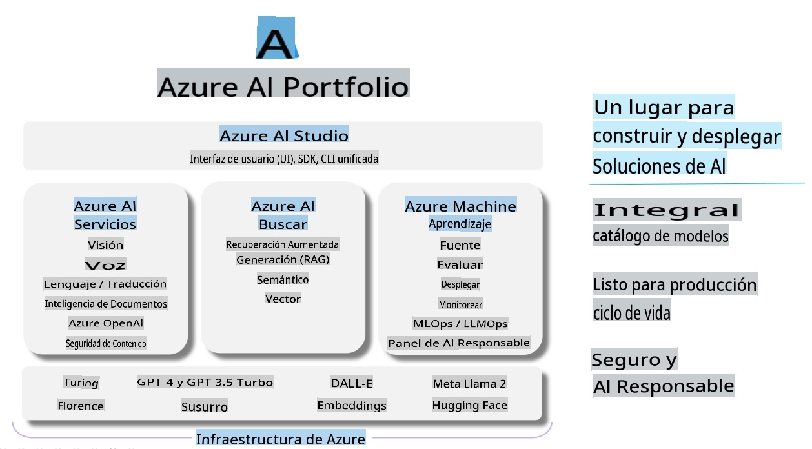

# **Usando Azure AI Foundry para evaluación**

Cómo evaluar tu aplicación de IA generativa usando [Azure AI Foundry](https://ai.azure.com?WT.mc_id=aiml-138114-kinfeylo). Ya sea que estés evaluando conversaciones de un solo turno o de varios turnos, Azure AI Foundry proporciona herramientas para evaluar el rendimiento y la seguridad del modelo.

## Cómo evaluar aplicaciones de IA generativa con Azure AI Foundry
Para más detalles, consulta la [Documentación de Azure AI Foundry](https://learn.microsoft.com/azure/ai-studio/how-to/evaluate-generative-ai-app?WT.mc_id=aiml-138114-kinfeylo)

Aquí están los pasos para comenzar:

## Evaluando Modelos de IA Generativa en Azure AI Foundry

**Requisitos previos**

- Un conjunto de datos de prueba en formato CSV o JSON.
- Un modelo de IA generativa desplegado (como los modelos Phi-3, GPT 3.5, GPT 4, o Davinci).
- Un entorno de ejecución con una instancia de cómputo para realizar la evaluación.

## Métricas de Evaluación Integradas

Azure AI Foundry te permite evaluar tanto conversaciones de un solo turno como conversaciones complejas de varios turnos.
Para escenarios de Generación Aumentada por Recuperación (RAG), donde el modelo está basado en datos específicos, puedes evaluar el rendimiento utilizando métricas de evaluación integradas.
Además, puedes evaluar escenarios generales de respuesta a preguntas de un solo turno (no RAG).

## Creando una Ejecución de Evaluación

Desde la interfaz de Azure AI Foundry, navega a la página de Evaluar o a la página de Flujo de Prompts.
Sigue el asistente de creación de evaluación para configurar una ejecución de evaluación. Proporciona un nombre opcional para tu evaluación.
Selecciona el escenario que se alinea con los objetivos de tu aplicación.
Elige una o más métricas de evaluación para evaluar la salida del modelo.

## Flujo de Evaluación Personalizado (Opcional)

Para mayor flexibilidad, puedes establecer un flujo de evaluación personalizado. Personaliza el proceso de evaluación basado en tus requisitos específicos.

## Visualización de Resultados

Después de realizar la evaluación, registra, visualiza y analiza métricas de evaluación detalladas en Azure AI Foundry. Obtén información sobre las capacidades y limitaciones de tu aplicación.

**Note** Azure AI Foundry está actualmente en vista previa pública, así que úsalo para propósitos de experimentación y desarrollo. Para cargas de trabajo de producción, considera otras opciones. Explora la [documentación oficial de AI Foundry](https://learn.microsoft.com/azure/ai-studio/?WT.mc_id=aiml-138114-kinfeylo) para más detalles e instrucciones paso a paso.

**Descargo de responsabilidad**:
Este documento ha sido traducido utilizando servicios de traducción automática basados en inteligencia artificial. Aunque nos esforzamos por lograr precisión, tenga en cuenta que las traducciones automáticas pueden contener errores o inexactitudes. El documento original en su idioma nativo debe considerarse la fuente autorizada. Para información crítica, se recomienda una traducción profesional realizada por humanos. No nos hacemos responsables de ningún malentendido o interpretación errónea que surja del uso de esta traducción.