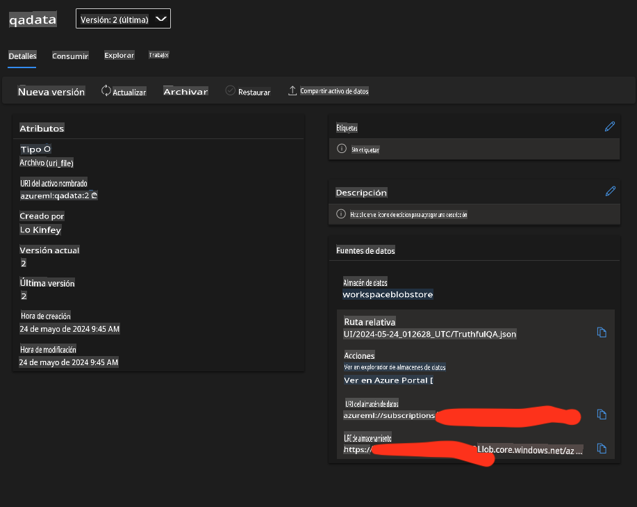

# **Prepara tus datos de la industria**

Esperamos inyectar Phi-3-mini en [los datos de TruthfulQA](https://github.com/sylinrl/TruthfulQA/blob/main/TruthfulQA.csv). El primer paso es importar los datos de TruthfulQA.

### **1. Cargar los datos en csv y guardarlos en json**

```python

import csv
import json

csvfile = open('./datasets/TruthfulQA.csv', 'r')
jsonfile = open('./output/TruthfulQA.json', 'w')

fieldnames = ("Type","Category","Question","Best Answer","Correct Answers","Incorrect Answers","Source")

reader = csv.DictReader(csvfile, fieldnames)

for row in reader:
    json.dump(row, jsonfile)
    jsonfile.write('\n')

i = 1
data = []
with open('./output/TruthfulQA.json', 'r') as file:
    for line in file:
        print(line)
        data.append(json.loads(line))
        print(str(i))
        i+=1


```

### **2. Subir los datos a los almacenes de datos de Azure ML**



### **¡Felicidades!**

Tus datos se han cargado exitosamente. A continuación, necesitas configurar tus datos y algoritmos relacionados a través de Microsoft Olive [E2E_LoRA&QLoRA_Config_With_Olive.md](./E2E_LoRA&QLoRA_Config_With_Olive.md)

**Descargo de responsabilidad**:
Este documento ha sido traducido utilizando servicios de traducción automática basados en inteligencia artificial. Aunque nos esforzamos por lograr precisión, tenga en cuenta que las traducciones automatizadas pueden contener errores o imprecisiones. El documento original en su idioma nativo debe considerarse la fuente autorizada. Para información crítica, se recomienda una traducción humana profesional. No nos hacemos responsables de cualquier malentendido o interpretación errónea que surja del uso de esta traducción.