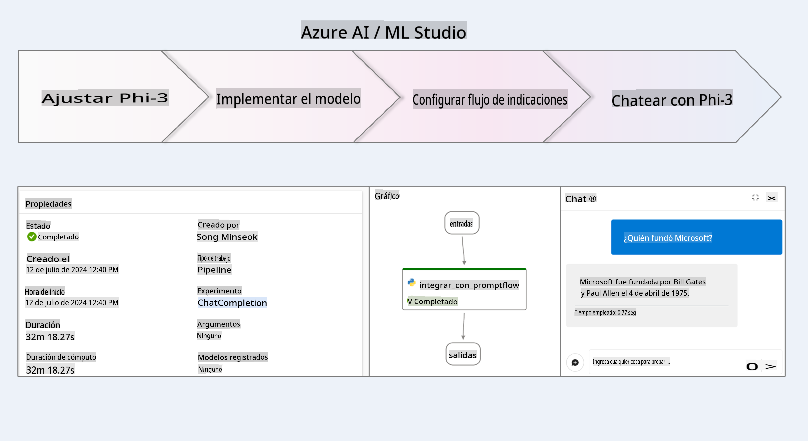
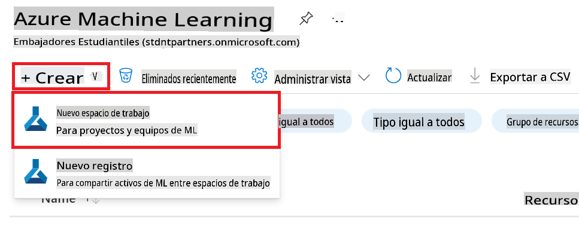
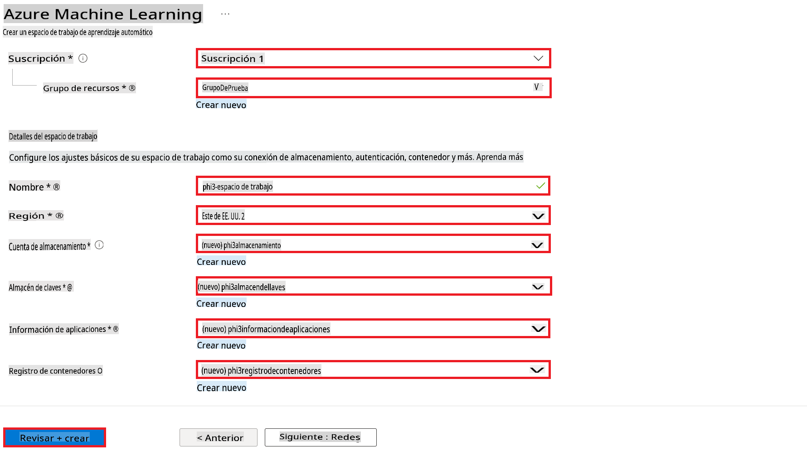
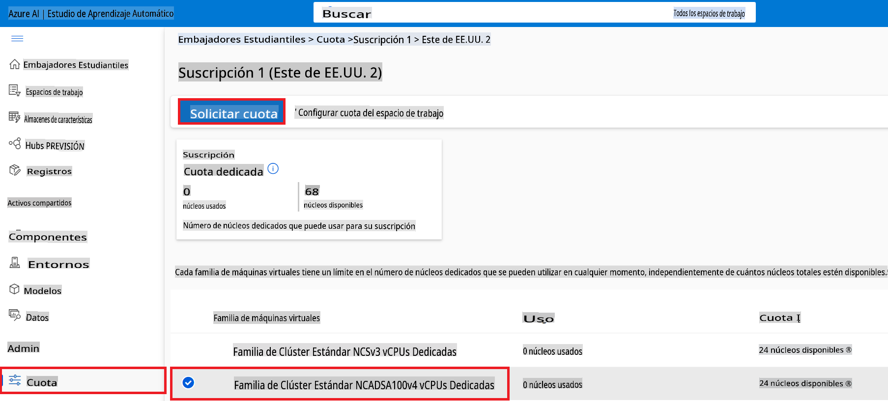
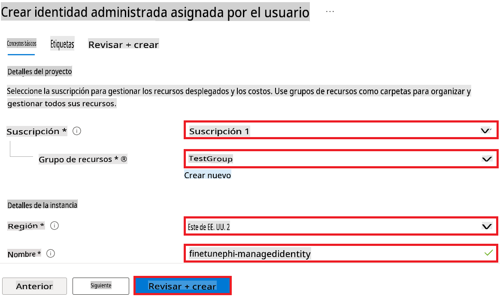
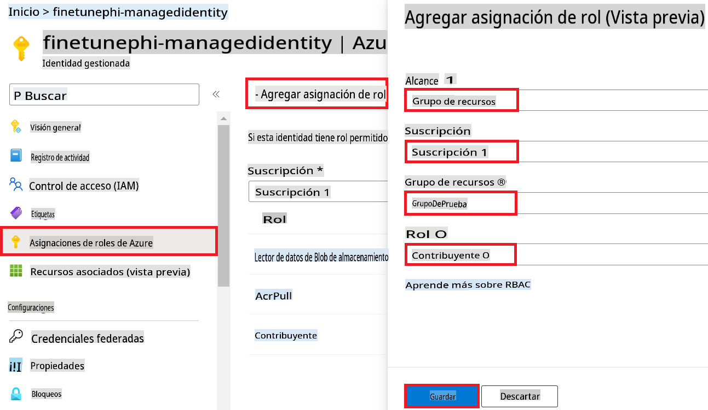
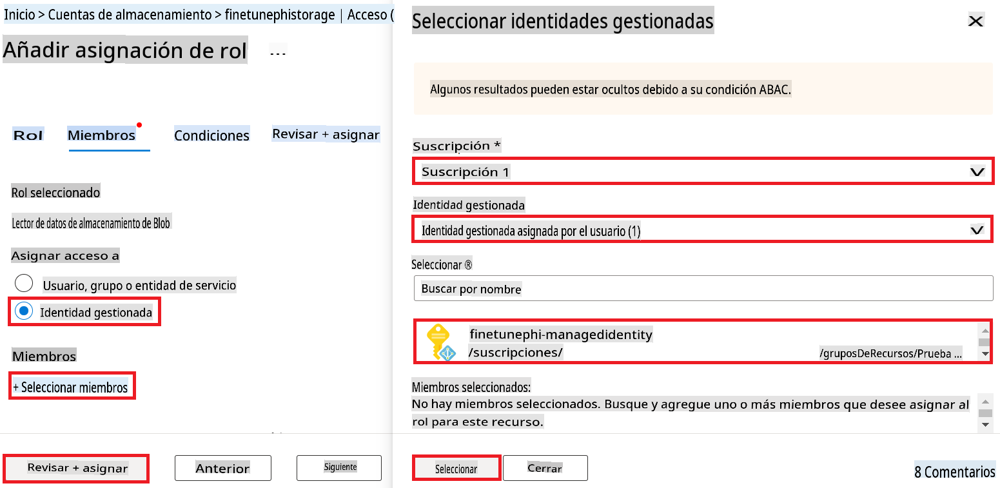
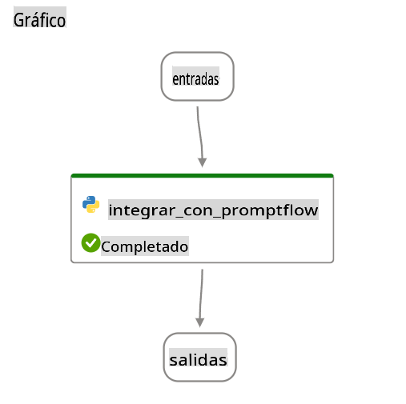

# Ajustar y Integrar modelos Phi-3 personalizados con Prompt Flow en Azure AI Studio

Este ejemplo de extremo a extremo (E2E) se basa en la guía "[Fine-Tune and Integrate Custom Phi-3 Models with Prompt Flow in Azure AI Studio](https://techcommunity.microsoft.com/t5/educator-developer-blog/fine-tune-and-integrate-custom-phi-3-models-with-prompt-flow-in/ba-p/4191726?WT.mc_id=aiml-137032-kinfeylo)" de la Comunidad Técnica de Microsoft. Introduce los procesos de ajuste fino, despliegue e integración de modelos Phi-3 personalizados con Prompt Flow en Azure AI Studio.
A diferencia del ejemplo E2E, "[Fine-Tune and Integrate Custom Phi-3 Models with Prompt Flow](./E2E_Phi-3-FineTuning_PromptFlow_Integration.md)", que implicaba ejecutar código localmente, este tutorial se centra completamente en ajustar e integrar tu modelo dentro de Azure AI / ML Studio.

## Visión General

En este ejemplo E2E, aprenderás a ajustar el modelo Phi-3 e integrarlo con Prompt Flow en Azure AI Studio. Aprovechando Azure AI / ML Studio, establecerás un flujo de trabajo para desplegar y utilizar modelos de IA personalizados. Este ejemplo E2E se divide en tres escenarios:

**Escenario 1: Configurar recursos de Azure y Prepararse para el ajuste fino**

**Escenario 2: Ajustar el modelo Phi-3 y Desplegar en Azure Machine Learning Studio**

**Escenario 3: Integrar con Prompt Flow y Chatear con tu modelo personalizado en Azure AI Studio**

Aquí tienes una visión general de este ejemplo E2E.



### Tabla de Contenidos

1. **[Escenario 1: Configurar recursos de Azure y Prepararse para el ajuste fino](../../../../md/06.E2ESamples)**
    - [Crear un Workspace de Azure Machine Learning](../../../../md/06.E2ESamples)
    - [Solicitar cuotas de GPU en la Suscripción de Azure](../../../../md/06.E2ESamples)
    - [Agregar asignación de roles](../../../../md/06.E2ESamples)
    - [Configurar proyecto](../../../../md/06.E2ESamples)
    - [Preparar el conjunto de datos para el ajuste fino](../../../../md/06.E2ESamples)

1. **[Escenario 2: Ajustar el modelo Phi-3 y Desplegar en Azure Machine Learning Studio](../../../../md/06.E2ESamples)**
    - [Ajustar el modelo Phi-3](../../../../md/06.E2ESamples)
    - [Desplegar el modelo Phi-3 ajustado](../../../../md/06.E2ESamples)

1. **[Escenario 3: Integrar con Prompt Flow y Chatear con tu modelo personalizado en Azure AI Studio](../../../../md/06.E2ESamples)**
    - [Integrar el modelo Phi-3 personalizado con Prompt Flow](../../../../md/06.E2ESamples)
    - [Chatear con tu modelo Phi-3 personalizado](../../../../md/06.E2ESamples)

## Escenario 1: Configurar recursos de Azure y Prepararse para el ajuste fino

### Crear un Workspace de Azure Machine Learning

1. Escribe *azure machine learning* en la **barra de búsqueda** en la parte superior de la página del portal y selecciona **Azure Machine Learning** de las opciones que aparecen.

    

2. Selecciona **+ Crear** en el menú de navegación.

3. Selecciona **Nuevo workspace** en el menú de navegación.

    

4. Realiza las siguientes tareas:

    - Selecciona tu **Suscripción** de Azure.
    - Selecciona el **Grupo de recursos** a utilizar (crea uno nuevo si es necesario).
    - Ingresa el **Nombre del Workspace**. Debe ser un valor único.
    - Selecciona la **Región** que deseas usar.
    - Selecciona la **Cuenta de almacenamiento** a utilizar (crea una nueva si es necesario).
    - Selecciona el **Key vault** a utilizar (crea uno nuevo si es necesario).
    - Selecciona el **Application insights** a utilizar (crea uno nuevo si es necesario).
    - Selecciona el **Registro de contenedores** a utilizar (crea uno nuevo si es necesario).

    

5. Selecciona **Revisar + Crear**.

6. Selecciona **Crear**.

### Solicitar cuotas de GPU en la Suscripción de Azure

En este tutorial, aprenderás cómo ajustar y desplegar un modelo Phi-3, utilizando GPUs. Para el ajuste fino, usarás la GPU *Standard_NC24ads_A100_v4*, que requiere una solicitud de cuota. Para el despliegue, usarás la GPU *Standard_NC6s_v3*, que también requiere una solicitud de cuota.

> [!NOTE]
>
> Solo las suscripciones de Pago por Uso (el tipo de suscripción estándar) son elegibles para la asignación de GPU; las suscripciones de beneficios no son actualmente compatibles.
>

1. Visita [Azure ML Studio](https://ml.azure.com/home?wt.mc_id=studentamb_279723).

1. Realiza las siguientes tareas para solicitar la cuota de *Standard NCADSA100v4 Family*:

    - Selecciona **Cuota** en la pestaña del lado izquierdo.
    - Selecciona la **Familia de máquinas virtuales** a utilizar. Por ejemplo, selecciona **Standard NCADSA100v4 Family Cluster Dedicated vCPUs**, que incluye la GPU *Standard_NC24ads_A100_v4*.
    - Selecciona **Solicitar cuota** en el menú de navegación.

        

    - Dentro de la página de Solicitud de cuota, ingresa el **Nuevo límite de núcleos** que deseas usar. Por ejemplo, 24.
    - Dentro de la página de Solicitud de cuota, selecciona **Enviar** para solicitar la cuota de GPU.

1. Realiza las siguientes tareas para solicitar la cuota de *Standard NCSv3 Family*:

    - Selecciona **Cuota** en la pestaña del lado izquierdo.
    - Selecciona la **Familia de máquinas virtuales** a utilizar. Por ejemplo, selecciona **Standard NCSv3 Family Cluster Dedicated vCPUs**, que incluye la GPU *Standard_NC6s_v3*.
    - Selecciona **Solicitar cuota** en el menú de navegación.
    - Dentro de la página de Solicitud de cuota, ingresa el **Nuevo límite de núcleos** que deseas usar. Por ejemplo, 24.
    - Dentro de la página de Solicitud de cuota, selecciona **Enviar** para solicitar la cuota de GPU.

### Agregar asignación de roles

Para ajustar y desplegar tus modelos, primero debes crear una Identidad Administrada Asignada por el Usuario (UAI) y asignarle los permisos apropiados. Esta UAI se usará para la autenticación durante el despliegue.

#### Crear una Identidad Administrada Asignada por el Usuario (UAI)

1. Escribe *identidades gestionadas* en la **barra de búsqueda** en la parte superior de la página del portal y selecciona **Identidades Gestionadas** de las opciones que aparecen.

    

1. Selecciona **+ Crear**.

    

1. Realiza las siguientes tareas:

    - Selecciona tu **Suscripción** de Azure.
    - Selecciona el **Grupo de recursos** a utilizar (crea uno nuevo si es necesario).
    - Selecciona la **Región** que deseas usar.
    - Ingresa el **Nombre**. Debe ser un valor único.

    

1. Selecciona **Revisar + crear**.

1. Selecciona **+ Crear**.

#### Agregar asignación de rol de Contribuyente a la Identidad Gestionada

1. Navega al recurso de Identidad Gestionada que creaste.

1. Selecciona **Asignaciones de roles de Azure** en la pestaña del lado izquierdo.

1. Selecciona **+Agregar asignación de rol** en el menú de navegación.

1. Dentro de la página de Agregar asignación de rol, realiza las siguientes tareas:
    - Selecciona el **Alcance** a **Grupo de recursos**.
    - Selecciona tu **Suscripción** de Azure.
    - Selecciona el **Grupo de recursos** a utilizar.
    - Selecciona el **Rol** a **Contribuyente**.

    

1. Selecciona **Guardar**.

#### Agregar asignación de rol de Lector de Datos de Blob de Almacenamiento a la Identidad Gestionada

1. Escribe *cuentas de almacenamiento* en la **barra de búsqueda** en la parte superior de la página del portal y selecciona **Cuentas de almacenamiento** de las opciones que aparecen.

    

1. Selecciona la cuenta de almacenamiento asociada con el workspace de Azure Machine Learning que creaste. Por ejemplo, *finetunephistorage*.

1. Realiza las siguientes tareas para navegar a la página de Agregar asignación de rol:

    - Navega a la cuenta de almacenamiento de Azure que creaste.
    - Selecciona **Control de acceso (IAM)** en la pestaña del lado izquierdo.
    - Selecciona **+ Agregar** en el menú de navegación.
    - Selecciona **Agregar asignación de rol** en el menú de navegación.

    

1. Dentro de la página de Agregar asignación de rol, realiza las siguientes tareas:

    - Dentro de la página de Rol, escribe *Lector de Datos de Blob de Almacenamiento* en la **barra de búsqueda** y selecciona **Lector de Datos de Blob de Almacenamiento** de las opciones que aparecen.
    - Dentro de la página de Rol, selecciona **Siguiente**.
    - Dentro de la página de Miembros, selecciona **Asignar acceso a** **Identidad gestionada**.
    - Dentro de la página de Miembros, selecciona **+ Seleccionar miembros**.
    - Dentro de la página de Seleccionar identidades gestionadas, selecciona tu **Suscripción** de Azure.
    - Dentro de la página de Seleccionar identidades gestionadas, selecciona la **Identidad gestionada** a **Gestionar Identidad**.
    - Dentro de la página de Seleccionar identidades gestionadas, selecciona la Identidad Gestionada que creaste. Por ejemplo, *finetunephi-managedidentity*.
    - Dentro de la página de Seleccionar identidades gestionadas, selecciona **Seleccionar**.

    

1. Selecciona **Revisar + asignar**.

#### Agregar asignación de rol de AcrPull a la Identidad Gestionada

1. Escribe *registros de contenedores* en la **barra de búsqueda** en la parte superior de la página del portal y selecciona **Registros de contenedores** de las opciones que aparecen.

    

1. Selecciona el registro de contenedores asociado con el workspace de Azure Machine Learning. Por ejemplo, *finetunephicontainerregistry*

1. Realiza las siguientes tareas para navegar a la página de Agregar asignación de rol:

    - Selecciona **Control de acceso (IAM)** en la pestaña del lado izquierdo.
    - Selecciona **+ Agregar** en el menú de navegación.
    - Selecciona **Agregar asignación de rol** en el menú de navegación.

1. Dentro de la página de Agregar asignación de rol, realiza las siguientes tareas:

    - Dentro de la página de Rol, escribe *AcrPull* en la **barra de búsqueda** y selecciona **AcrPull** de las opciones que aparecen.
    - Dentro de la página de Rol, selecciona **Siguiente**.
    - Dentro de la página de Miembros, selecciona **Asignar acceso a** **Identidad gestionada**.
    - Dentro de la página de Miembros, selecciona **+ Seleccionar miembros**.
    - Dentro de la página de Seleccionar identidades gestionadas, selecciona tu **Suscripción** de Azure.
    - Dentro de la página de Seleccionar identidades gestionadas, selecciona la **Identidad gestionada** a **Gestionar Identidad**.
    - Dentro de la página de Seleccionar identidades gestionadas, selecciona la Identidad Gestionada que creaste. Por ejemplo, *finetunephi-managedidentity*.
    - Dentro de la página de Seleccionar identidades gestionadas, selecciona **Seleccionar**.
    - Selecciona **Revisar + asignar**.

### Configurar proyecto

Para descargar los conjuntos de datos necesarios para el ajuste fino, configurarás un entorno local.

En este ejercicio, harás lo siguiente:

- Crear una carpeta para trabajar dentro de ella.
- Crear un entorno virtual.
- Instalar los paquetes necesarios.
- Crear un archivo *download_dataset.py* para descargar el conjunto de datos.

#### Crear una carpeta para trabajar dentro de ella

1. Abre una ventana de terminal y escribe el siguiente comando para crear una carpeta llamada *finetune-phi* en la ruta predeterminada.

    ```console
    mkdir finetune-phi
    ```

2. Escribe el siguiente comando dentro de tu terminal para navegar a la carpeta *finetune-phi* que creaste.

    ```console
    cd finetune-phi
    ```

#### Crear un entorno virtual

1. Escribe el siguiente comando dentro de tu terminal para crear un entorno virtual llamado *.venv*.

    ```console
    python -m venv .venv
    ```

2. Escribe el siguiente comando dentro de tu terminal para activar el entorno virtual.

    ```console
    .venv\Scripts\activate.bat
    ```

> [!NOTE]
> Si funcionó, deberías ver *(.venv)* antes del símbolo del sistema.

#### Instalar los paquetes necesarios

1. Escribe los siguientes comandos dentro de tu terminal para instalar los paquetes necesarios.

    ```console
    pip install datasets==2.19.1
    ```

#### Crear `download_dataset.py`

> [!NOTE]
> Estructura completa de la carpeta:
>
> ```text
> └── YourUserName
> .    └── finetune-phi
> .        └── download_dataset.py
> ```

1. Abre **Visual Studio Code**.

1. Selecciona **Archivo** en la barra de menú.

1. Selecciona **Abrir Carpeta**.

1. Selecciona la carpeta *finetune-phi* que creaste, ubicada en *C:\Users\yourUserName\finetune-phi*.

    

1. En el panel izquierdo de Visual Studio Code, haz clic derecho y selecciona **Nuevo Archivo** para crear un nuevo archivo llamado *download_dataset.py*.

    

### Preparar el conjunto de datos para el ajuste fino

En este ejercicio, ejecutarás el archivo *download_dataset.py* para descargar los conjuntos de datos *ultrachat_200k* en tu entorno local. Luego, utilizarás estos conjuntos de datos para ajustar el modelo Phi-3 en Azure Machine Learning.

En este ejercicio, harás lo siguiente:

- Agregar código al archivo *download_dataset.py* para descargar los conjuntos de datos.
- Ejecutar el archivo *download_dataset.py* para descargar los conjuntos de datos en tu entorno local.

#### Descargar tu conjunto de datos usando *download_dataset.py*

1. Abre el archivo *download_dataset.py* en Visual Studio Code.

1. Agrega el siguiente código en el archivo *download_dataset.py*.

    ```python
    import json
    import os
    from datasets import load_dataset

    def load_and_split_dataset(dataset_name, config_name, split_ratio):
        """
        Load and split a dataset.
        """
        # Load the dataset with the specified name, configuration, and split ratio
        dataset = load_dataset(dataset_name, config_name, split=split_ratio)
        print(f"Original dataset size: {len(dataset)}")
        
        # Split the dataset into train and test sets (80% train, 20% test)
        split_dataset = dataset.train_test_split(test_size=0.2)
        print(f"Train dataset size: {len(split_dataset['train'])}")
        print(f"Test dataset size: {len(split_dataset['test'])}")
        
        return split_dataset

    def save_dataset_to_jsonl(dataset, filepath):
        """
        Save a dataset to a JSONL file.
        """

1. Visita [Azure ML Studio](https://ml.azure.com/home?wt.mc_id=studentamb_279723).

1. Selecciona **Compute** desde la pestaña del lado izquierdo.

1. Selecciona **Compute clusters** desde el menú de navegación.

1. Selecciona **+ New**.

    

1. Realiza las siguientes tareas:

    - Selecciona la **Region** que deseas usar.
    - Selecciona el **Virtual machine tier** a **Dedicated**.
    - Selecciona el **Virtual machine type** a **GPU**.
    - Selecciona el filtro **Virtual machine size** a **Select from all options**.
    - Selecciona el **Virtual machine size** a **Standard_NC24ads_A100_v4**.

    

1. Selecciona **Next**.

1. Realiza las siguientes tareas:

    - Ingresa el **Compute name**. Debe ser un valor único.
    - Selecciona el **Minimum number of nodes** a **0**.
    - Selecciona el **Maximum number of nodes** a **1**.
    - Selecciona los **Idle seconds before scale down** a **120**.

    

1. Selecciona **Create**.

#### Ajustar el modelo Phi-3

1. Visita [Azure ML Studio](https://ml.azure.com/home?wt.mc_id=studentamb_279723).

1. Selecciona el espacio de trabajo de Azure Machine Learning que creaste.

    

1. Realiza las siguientes tareas:

    - Selecciona **Model catalog** desde la pestaña del lado izquierdo.
    - Escribe *phi-3-mini-4k* en la **barra de búsqueda** y selecciona **Phi-3-mini-4k-instruct** de las opciones que aparecen.

    

1. Selecciona **Fine-tune** desde el menú de navegación.

    

1. Realiza las siguientes tareas:

    - Selecciona **Select task type** a **Chat completion**.
    - Selecciona **+ Select data** para subir **Training data**.
    - Selecciona el tipo de subida de datos de validación a **Provide different validation data**.
    - Selecciona **+ Select data** para subir **Validation data**.

    

    > [!TIP]
    >
    > Puedes seleccionar **Advanced settings** para personalizar configuraciones como **learning_rate** y **lr_scheduler_type** para optimizar el proceso de ajuste fino según tus necesidades específicas.

1. Selecciona **Finish**.

1. En este ejercicio, ajustaste exitosamente el modelo Phi-3 usando Azure Machine Learning. Ten en cuenta que el proceso de ajuste fino puede tomar un tiempo considerable. Después de ejecutar el trabajo de ajuste fino, debes esperar a que se complete. Puedes monitorear el estado del trabajo de ajuste fino navegando a la pestaña Jobs en el lado izquierdo de tu espacio de trabajo de Azure Machine Learning. En la próxima serie, desplegarás el modelo ajustado e integrarás con Prompt flow.

    

### Desplegar el modelo Phi-3 ajustado

Para integrar el modelo Phi-3 ajustado con Prompt flow, necesitas desplegar el modelo para que esté accesible para inferencias en tiempo real. Este proceso implica registrar el modelo, crear un endpoint en línea y desplegar el modelo.

En este ejercicio, harás lo siguiente:

- Registrar el modelo ajustado en el espacio de trabajo de Azure Machine Learning.
- Crear un endpoint en línea.
- Desplegar el modelo Phi-3 ajustado registrado.

#### Registrar el modelo ajustado

1. Visita [Azure ML Studio](https://ml.azure.com/home?wt.mc_id=studentamb_279723).

1. Selecciona el espacio de trabajo de Azure Machine Learning que creaste.

    

1. Selecciona **Models** desde la pestaña del lado izquierdo.
1. Selecciona **+ Register**.
1. Selecciona **From a job output**.

    

1. Selecciona el trabajo que creaste.

    

1. Selecciona **Next**.

1. Selecciona **Model type** a **MLflow**.

1. Asegúrate de que **Job output** esté seleccionado; debería estar seleccionado automáticamente.

    

1. Selecciona **Next**.

1. Selecciona **Register**.

    

1. Puedes ver tu modelo registrado navegando al menú **Models** desde la pestaña del lado izquierdo.

    

#### Desplegar el modelo ajustado

1. Navega al espacio de trabajo de Azure Machine Learning que creaste.

1. Selecciona **Endpoints** desde la pestaña del lado izquierdo.

1. Selecciona **Real-time endpoints** desde el menú de navegación.

    

1. Selecciona **Create**.

1. Selecciona el modelo registrado que creaste.

    

1. Selecciona **Select**.

1. Realiza las siguientes tareas:

    - Selecciona **Virtual machine** a *Standard_NC6s_v3*.
    - Selecciona la **Instance count** que deseas usar. Por ejemplo, *1*.
    - Selecciona el **Endpoint** a **New** para crear un endpoint.
    - Ingresa el **Endpoint name**. Debe ser un valor único.
    - Ingresa el **Deployment name**. Debe ser un valor único.

    

1. Selecciona **Deploy**.

> [!WARNING]
> Para evitar cargos adicionales en tu cuenta, asegúrate de eliminar el endpoint creado en el espacio de trabajo de Azure Machine Learning.
>

#### Verifica el estado del despliegue en el espacio de trabajo de Azure Machine Learning

1. Navega al espacio de trabajo de Azure Machine Learning que creaste.

1. Selecciona **Endpoints** desde la pestaña del lado izquierdo.

1. Selecciona el endpoint que creaste.

    

1. En esta página, puedes gestionar los endpoints durante el proceso de despliegue.

> [!NOTE]
> Una vez que el despliegue esté completo, asegúrate de que **Live traffic** esté configurado al **100%**. Si no es así, selecciona **Update traffic** para ajustar la configuración del tráfico. Ten en cuenta que no podrás probar el modelo si el tráfico está configurado en 0%.
>
> 
>

## Escenario 3: Integrar con Prompt flow y chatear con tu modelo personalizado en Azure AI Studio

### Integrar el modelo personalizado Phi-3 con Prompt flow

Después de desplegar exitosamente tu modelo ajustado, ahora puedes integrarlo con Prompt Flow para usar tu modelo en aplicaciones en tiempo real, permitiendo una variedad de tareas interactivas con tu modelo personalizado Phi-3.

En este ejercicio, harás lo siguiente:

- Crear Azure AI Studio Hub.
- Crear Azure AI Studio Project.
- Crear Prompt flow.
- Añadir una conexión personalizada para el modelo Phi-3 ajustado.
- Configurar Prompt flow para chatear con tu modelo personalizado Phi-3.

> [!NOTE]
> También puedes integrar con Promptflow usando Azure ML Studio. El mismo proceso de integración se puede aplicar a Azure ML Studio.

#### Crear Azure AI Studio Hub

Necesitas crear un Hub antes de crear el Proyecto. Un Hub actúa como un Grupo de Recursos, permitiéndote organizar y gestionar múltiples Proyectos dentro de Azure AI Studio.

1. Visita [Azure AI Studio](https://ai.azure.com/?WT.mc_id=aiml-137032-kinfeylo).

1. Selecciona **All hubs** desde la pestaña del lado izquierdo.

1. Selecciona **+ New hub** desde el menú de navegación.

    

1. Realiza las siguientes tareas:

    - Ingresa el **Hub name**. Debe ser un valor único.
    - Selecciona tu **Subscription** de Azure.
    - Selecciona el **Resource group** a usar (crea uno nuevo si es necesario).
    - Selecciona la **Location** que deseas usar.
    - Selecciona los **Azure AI Services** a usar (crea uno nuevo si es necesario).
    - Selecciona **Connect Azure AI Search** a **Skip connecting**.

    

1. Selecciona **Next**.

#### Crear Azure AI Studio Project

1. En el Hub que creaste, selecciona **All projects** desde la pestaña del lado izquierdo.

1. Selecciona **+ New project** desde el menú de navegación.

    

1. Ingresa el **Project name**. Debe ser un valor único.

    

1. Selecciona **Create a project**.

#### Añadir una conexión personalizada para el modelo Phi-3 ajustado

Para integrar tu modelo personalizado Phi-3 con Prompt flow, necesitas guardar el endpoint y la clave del modelo en una conexión personalizada. Esta configuración asegura el acceso a tu modelo personalizado Phi-3 en Prompt flow.

#### Configurar la clave API y el URI del endpoint del modelo Phi-3 ajustado

1. Visita [Azure ML Studio](https://ml.azure.com/home?WT.mc_id=aiml-137032-kinfeylo).

1. Navega al espacio de trabajo de Azure Machine Learning que creaste.

1. Selecciona **Endpoints** desde la pestaña del lado izquierdo.

    

1. Selecciona el endpoint que creaste.

    

1. Selecciona **Consume** desde el menú de navegación.

1. Copia tu **REST endpoint** y **Primary key**.


#### Agregar la Conexión Personalizada

1. Visita [Azure AI Studio](https://ai.azure.com/?WT.mc_id=aiml-137032-kinfeylo).

1. Navega al proyecto de Azure AI Studio que creaste.

1. En el proyecto que creaste, selecciona **Settings** desde la pestaña del lado izquierdo.

1. Selecciona **+ New connection**.

    

1. Selecciona **Custom keys** desde el menú de navegación.

    

1. Realiza las siguientes tareas:

    - Selecciona **+ Add key value pairs**.
    - Para el nombre de la clave, ingresa **endpoint** y pega el endpoint que copiaste de Azure ML Studio en el campo de valor.
    - Selecciona **+ Add key value pairs** nuevamente.
    - Para el nombre de la clave, ingresa **key** y pega la clave que copiaste de Azure ML Studio en el campo de valor.
    - Después de agregar las claves, selecciona **is secret** para evitar que la clave sea expuesta.

    

1. Selecciona **Add connection**.

#### Crear Prompt flow

Has agregado una conexión personalizada en Azure AI Studio. Ahora, vamos a crear un Prompt flow usando los siguientes pasos. Luego, conectarás este Prompt flow a la conexión personalizada para que puedas usar el modelo ajustado dentro del Prompt flow.

1. Navega al proyecto de Azure AI Studio que creaste.

1. Selecciona **Prompt flow** desde la pestaña del lado izquierdo.

1. Selecciona **+ Create** desde el menú de navegación.

    

1. Selecciona **Chat flow** desde el menú de navegación.

    

1. Ingresa **Folder name** a utilizar.

    

1. Selecciona **Create**.

#### Configurar Prompt flow para chatear con tu modelo personalizado Phi-3

Necesitas integrar el modelo ajustado Phi-3 en un Prompt flow. Sin embargo, el Prompt flow existente no está diseñado para este propósito. Por lo tanto, debes rediseñar el Prompt flow para habilitar la integración del modelo personalizado.

1. En el Prompt flow, realiza las siguientes tareas para reconstruir el flujo existente:

    - Selecciona **Raw file mode**.
    - Elimina todo el código existente en el archivo *flow.dag.yml*.
    - Agrega el siguiente código al archivo *flow.dag.yml*.

        ```yml
        inputs:
          input_data:
            type: string
            default: "¿Quién fundó Microsoft?"

        outputs:
          answer:
            type: string
            reference: ${integrate_with_promptflow.output}

        nodes:
        - name: integrate_with_promptflow
          type: python
          source:
            type: code
            path: integrate_with_promptflow.py
          inputs:
            input_data: ${inputs.input_data}
        ```

    - Selecciona **Save**.

    

1. Agrega el siguiente código al archivo *integrate_with_promptflow.py* para usar el modelo personalizado Phi-3 en Prompt flow.

    ```python
    import logging
    import requests
    from promptflow import tool
    from promptflow.connections import CustomConnection

    # Configuración de registro
    logging.basicConfig(
        format="%(asctime)s - %(levelname)s - %(name)s - %(message)s",
        datefmt="%Y-%m-%d %H:%M:%S",
        level=logging.DEBUG
    )
    logger = logging.getLogger(__name__)

    def query_phi3_model(input_data: str, connection: CustomConnection) -> str:
        """
        Envía una solicitud al endpoint del modelo Phi-3 con los datos de entrada proporcionados usando la Conexión Personalizada.
        """

        # "connection" es el nombre de la Conexión Personalizada, "endpoint", "key" son las claves en la Conexión Personalizada
        endpoint_url = connection.endpoint
        api_key = connection.key

        headers = {
            "Content-Type": "application/json",
            "Authorization": f"Bearer {api_key}"
        }
        data = {
            "input_data": {
                "input_string": [
                    {"role": "user", "content": input_data}
                ],
                "parameters": {
                    "temperature": 0.7,
                    "max_new_tokens": 128
                }
            }
        }
        try:
            response = requests.post(endpoint_url, json=data, headers=headers)
            response.raise_for_status()
            
            # Registrar la respuesta JSON completa
            logger.debug(f"Respuesta JSON completa: {response.json()}")

            result = response.json()["output"]
            logger.info("Respuesta recibida con éxito del Endpoint de Azure ML.")
            return result
        except requests.exceptions.RequestException as e:
            logger.error(f"Error al consultar el Endpoint de Azure ML: {e}")
            raise

    @tool
    def my_python_tool(input_data: str, connection: CustomConnection) -> str:
        """
        Función de herramienta para procesar los datos de entrada y consultar el modelo Phi-3.
        """
        return query_phi3_model(input_data, connection)

    ```

    

> [!NOTE]
> Para obtener información más detallada sobre el uso de Prompt flow en Azure AI Studio, puedes consultar [Prompt flow en Azure AI Studio](https://learn.microsoft.com/azure/ai-studio/how-to/prompt-flow).

1. Selecciona **Chat input**, **Chat output** para habilitar el chat con tu modelo.

    

1. Ahora estás listo para chatear con tu modelo personalizado Phi-3. En el próximo ejercicio, aprenderás cómo iniciar Prompt flow y usarlo para chatear con tu modelo ajustado Phi-3.

> [!NOTE]
>
> El flujo reconstruido debería verse como la imagen a continuación:
>
> 
>

### Chatea con tu modelo personalizado Phi-3

Ahora que has ajustado e integrado tu modelo personalizado Phi-3 con Prompt flow, estás listo para comenzar a interactuar con él. Este ejercicio te guiará a través del proceso de configurar e iniciar un chat con tu modelo usando Prompt flow. Siguiendo estos pasos, podrás aprovechar al máximo las capacidades de tu modelo Phi-3 ajustado para diversas tareas y conversaciones.

- Chatea con tu modelo personalizado Phi-3 usando Prompt flow.

#### Iniciar Prompt flow

1. Selecciona **Start compute sessions** para iniciar Prompt flow.

    

1. Selecciona **Validate and parse input** para renovar parámetros.

    

1. Selecciona el **Value** de la **connection** a la conexión personalizada que creaste. Por ejemplo, *connection*.

    

#### Chatea con tu modelo personalizado

1. Selecciona **Chat**.

    

1. Aquí tienes un ejemplo de los resultados: Ahora puedes chatear con tu modelo personalizado Phi-3. Se recomienda hacer preguntas basadas en los datos utilizados para el ajuste fino.

    

Aviso legal: La traducción fue realizada por un modelo de IA y puede no ser perfecta. 
Por favor, revise el resultado y haga las correcciones necesarias.

"Nota: Esta traducción fue generada utilizando herramientas automáticas y puede tener limitaciones. Las futuras actualizaciones mejorarán gradualmente la precisión de este documento. Las contribuciones de la comunidad son bienvenidas para mejorar la calidad de la traducción."