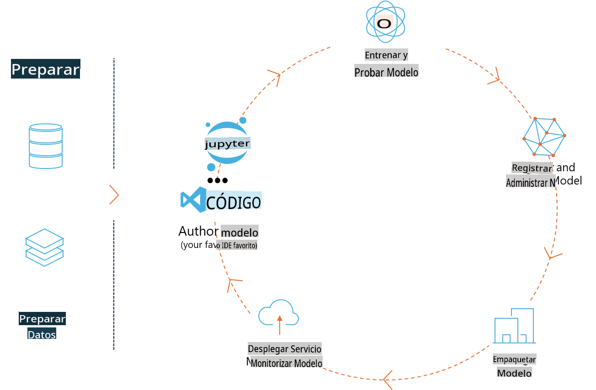
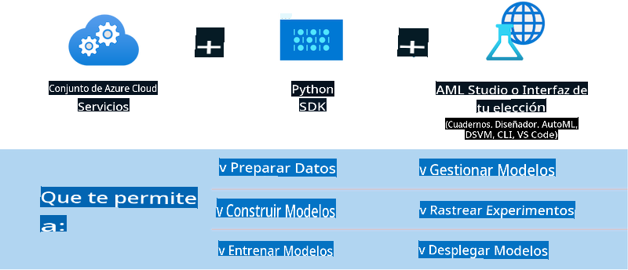

# MLflow

[MLflow](https://mlflow.org/) es una plataforma de código abierto diseñada para gestionar el ciclo de vida completo del aprendizaje automático.



MLFlow se utiliza para gestionar el ciclo de vida del ML, incluyendo experimentación, reproducibilidad, despliegue y un registro central de modelos. Actualmente, MLFlow ofrece cuatro componentes:

- **MLflow Tracking:** Registra y consulta experimentos, código, configuración de datos y resultados.
- **MLflow Projects:** Empaqueta el código de ciencia de datos en un formato para reproducir ejecuciones en cualquier plataforma.
- **Mlflow Models:** Despliega modelos de aprendizaje automático en diversos entornos de servicio.
- **Model Registry:** Almacena, anota y gestiona modelos en un repositorio central.

Incluye capacidades para rastrear experimentos, empaquetar código en ejecuciones reproducibles y compartir y desplegar modelos. MLFlow está integrado en Databricks y soporta una variedad de bibliotecas de ML, haciéndolo independiente de la biblioteca. Puede ser utilizado con cualquier biblioteca de aprendizaje automático y en cualquier lenguaje de programación, ya que proporciona una API REST y CLI para mayor comodidad.


Las características clave de MLFlow incluyen:

- **Seguimiento de Experimentos:** Registra y compara parámetros y resultados.
- **Gestión de Modelos:** Despliega modelos en diversas plataformas de servicio e inferencia.
- **Registro de Modelos:** Gestiona colaborativamente el ciclo de vida de los modelos de MLflow, incluyendo versionado y anotaciones.
- **Proyectos:** Empaqueta código de ML para compartir o usar en producción.

MLFlow también soporta el ciclo de MLOps, que incluye preparar datos, registrar y gestionar modelos, empaquetar modelos para ejecución, desplegar servicios y monitorear modelos. Su objetivo es simplificar el proceso de pasar de un prototipo a un flujo de trabajo de producción, especialmente en entornos de nube y edge.

## Escenario de E2E - Construyendo un envoltorio y usando Phi-3 como un modelo de MLFlow

En este ejemplo de E2E demostraremos dos enfoques diferentes para construir un envoltorio alrededor del modelo de lenguaje pequeño Phi-3 (SLM) y luego ejecutarlo como un modelo de MLFlow ya sea localmente o en la nube, por ejemplo, en el espacio de trabajo de Azure Machine Learning.



| Proyecto | Descripción | Ubicación |
| ------------ | ----------- | -------- |
| Transformer Pipeline | Transformer Pipeline es la opción más fácil para construir un envoltorio si deseas usar un modelo de HuggingFace con el sabor experimental de transformadores de MLFlow. | [**TransformerPipeline.ipynb**](../../../../code/06.E2E/E2E_Phi-3-MLflow_TransformerPipeline.ipynb) |
| Envoltorio Python Personalizado | En el momento de escribir esto, el pipeline de transformadores no soportaba la generación de envoltorios de MLFlow para modelos de HuggingFace en formato ONNX, incluso con el paquete experimental optimum de Python. Para casos como este, puedes construir tu propio envoltorio personalizado en Python para el modo MLFlow. | [**CustomPythonWrapper.ipynb**](../../../../code/06.E2E/E2E_Phi-3-MLflow_CustomPythonWrapper.ipynb) |

## Proyecto: Transformer Pipeline

1. Necesitarás los paquetes de Python relevantes de MLFlow y HuggingFace:

    ``` Python
    import mlflow
    import transformers
    ```

2. A continuación, deberías iniciar un pipeline de transformadores refiriéndote al modelo objetivo Phi-3 en el registro de HuggingFace. Como se puede ver en la tarjeta del modelo _Phi-3-mini-4k-instruct_, su tarea es de tipo “Generación de Texto”:

    ``` Python
    pipeline = transformers.pipeline(
        task = "text-generation",
        model = "microsoft/Phi-3-mini-4k-instruct"
    )
    ```

3. Ahora puedes guardar el pipeline del modelo Phi-3 en formato MLFlow y proporcionar detalles adicionales como la ruta de los artefactos objetivo, configuraciones específicas del modelo y tipo de API de inferencia:

    ``` Python
    model_info = mlflow.transformers.log_model(
        transformers_model = pipeline,
        artifact_path = "phi3-mlflow-model",
        model_config = model_config,
        task = "llm/v1/chat"
    )
    ```

## Proyecto: Envoltorio Python Personalizado

1. Aquí podemos utilizar la [API generate() de ONNX Runtime](https://github.com/microsoft/onnxruntime-genai) de Microsoft para la inferencia del modelo ONNX y la codificación/decodificación de tokens. Tienes que elegir el paquete _onnxruntime_genai_ para tu computación objetivo, con el siguiente ejemplo apuntando a CPU:

    ``` Python
    import mlflow
    from mlflow.models import infer_signature
    import onnxruntime_genai as og
    ```

1. Nuestra clase personalizada implementa dos métodos: _load_context()_ para inicializar el **modelo ONNX** de Phi-3 Mini 4K Instruct, **parámetros del generador** y **tokenizador**; y _predict()_ para generar tokens de salida para el prompt proporcionado:

    ``` Python
    class Phi3Model(mlflow.pyfunc.PythonModel):
        def load_context(self, context):
            # Recuperando el modelo de los artefactos
            model_path = context.artifacts["phi3-mini-onnx"]
            model_options = {
                 "max_length": 300,
                 "temperature": 0.2,         
            }
        
            # Definiendo el modelo
            self.phi3_model = og.Model(model_path)
            self.params = og.GeneratorParams(self.phi3_model)
            self.params.set_search_options(**model_options)
            
            # Definiendo el tokenizador
            self.tokenizer = og.Tokenizer(self.phi3_model)
    
        def predict(self, context, model_input):
            # Recuperando el prompt de la entrada
            prompt = model_input["prompt"][0]
            self.params.input_ids = self.tokenizer.encode(prompt)
    
            # Generando la respuesta del modelo
            response = self.phi3_model.generate(self.params)
    
            return self.tokenizer.decode(response[0][len(self.params.input_ids):])
    ```

1. Ahora puedes usar la función _mlflow.pyfunc.log_model()_ para generar un envoltorio personalizado en Python (en formato pickle) para el modelo Phi-3, junto con el modelo ONNX original y las dependencias necesarias:

    ``` Python
    model_info = mlflow.pyfunc.log_model(
        artifact_path = artifact_path,
        python_model = Phi3Model(),
        artifacts = {
            "phi3-mini-onnx": "cpu_and_mobile/cpu-int4-rtn-block-32-acc-level-4",
        },
        input_example = input_example,
        signature = infer_signature(input_example, ["Run"]),
        extra_pip_requirements = ["torch", "onnxruntime_genai", "numpy"],
    )
    ```

## Firmas de los modelos generados de MLFlow

1. En el paso 3 del proyecto Transformer Pipeline anterior, establecimos la tarea del modelo de MLFlow en “_llm/v1/chat_”. Tal instrucción genera un envoltorio de API del modelo, compatible con la API de Chat de OpenAI como se muestra a continuación:

    ``` Python
    {inputs: 
      ['messages': Array({content: string (required), name: string (optional), role: string (required)}) (required), 'temperature': double (optional), 'max_tokens': long (optional), 'stop': Array(string) (optional), 'n': long (optional), 'stream': boolean (optional)],
    outputs: 
      ['id': string (required), 'object': string (required), 'created': long (required), 'model': string (required), 'choices': Array({finish_reason: string (required), index: long (required), message: {content: string (required), name: string (optional), role: string (required)} (required)}) (required), 'usage': {completion_tokens: long (required), prompt_tokens: long (required), total_tokens: long (required)} (required)],
    params: 
      None}
    ```

1. Como resultado, puedes enviar tu prompt en el siguiente formato:

    ``` Python
    messages = [{"role": "user", "content": "¿Cuál es la capital de España?"}]
    ```

1. Luego, usa el post-procesamiento compatible con la API de OpenAI, por ejemplo, _response[0][‘choices’][0][‘message’][‘content’]_, para embellecer tu salida a algo como esto:

    ``` JSON
    Pregunta: ¿Cuál es la capital de España?
    
    Respuesta: La capital de España es Madrid. Es la ciudad más grande de España y sirve como el centro político, económico y cultural del país. Madrid está ubicada en el centro de la Península Ibérica y es conocida por su rica historia, arte y arquitectura, incluyendo el Palacio Real, el Museo del Prado y la Plaza Mayor.
    
    Uso: {'prompt_tokens': 11, 'completion_tokens': 73, 'total_tokens': 84}
    ```

1. En el paso 3 del proyecto Envoltorio Python Personalizado anterior, permitimos que el paquete de MLFlow genere la firma del modelo a partir de un ejemplo de entrada dado. La firma del envoltorio de MLFlow se verá así:

    ``` Python
    {inputs: 
      ['prompt': string (required)],
    outputs: 
      [string (required)],
    params: 
      None}
    ```

1. Entonces, nuestro prompt necesitaría contener la clave de diccionario "prompt", similar a esto:

    ``` Python
    {"prompt": "<|system|>Eres un comediante de stand-up.<|end|><|user|>Cuéntame un chiste sobre átomos<|end|><|assistant|>",}
    ```

1. La salida del modelo se proporcionará entonces en formato de cadena:

    ``` JSON
    ¡De acuerdo, aquí tienes un pequeño chiste relacionado con átomos!
    
    ¿Por qué los electrones nunca juegan a las escondidas con los protones?
    
    ¡Porque buena suerte encontrándolos cuando siempre están "compartiendo" sus electrones!
    
    ¡Recuerda, esto es solo para divertirnos y estamos teniendo un poco de humor a nivel atómico!
    ```

Aviso legal: La traducción fue realizada a partir de su original por un modelo de IA y puede no ser perfecta. 
Por favor, revise el resultado y haga las correcciones necesarias.