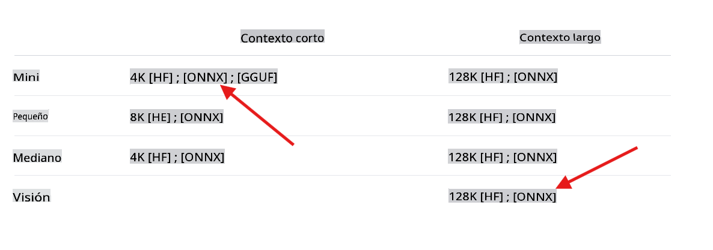

## Bienvenido a los laboratorios Phi-3 usando C#. 

Hay una selección de laboratorios que muestran cómo integrar las poderosas versiones de los modelos Phi-3 en un entorno .NET.

## Prerrequisitos
Antes de ejecutar el ejemplo, asegúrate de tener lo siguiente instalado:

**.NET 8:** Asegúrate de tener la [última versión de .NET](https://dotnet.microsoft.com/download/dotnet/8.0?WT.mc_id=aiml-137032-kinfeylo) instalada en tu máquina.

**(Opcional) Visual Studio o Visual Studio Code:** Necesitarás un IDE o editor de código capaz de ejecutar proyectos .NET. Se recomienda [Visual Studio](https://visualstudio.microsoft.com/) o [Visual Studio Code](https://code.visualstudio.com?WT.mc_id=aiml-137032-kinfeylo).

**Usando git** clona localmente una de las versiones disponibles de Phi-3 desde [Hugging Face](https://huggingface.co).

**Descarga el modelo phi3-mini-4k-instruct-onnx** a tu máquina local:

### navega a la carpeta para almacenar los modelos
```bash
cd c:\phi3\models
```
### añade soporte para lfs
```bash
git lfs install 
```
### clona y descarga el modelo mini 4K instruct
```bash
git clone https://huggingface.co/microsoft/Phi-3-mini-4k-instruct-onnx
```

### clona y descarga el modelo vision 128K
```
git clone https://huggingface.co/microsoft/Phi-3-vision-128k-instruct-onnx-cpu
```
**Importante:** Las demos actuales están diseñadas para usar las versiones ONNX del modelo. Los pasos anteriores clonan los siguientes modelos. 



## Acerca de los Laboratorios

La solución principal tiene varios laboratorios de muestra que demuestran las capacidades de los modelos Phi-3 usando C#.

| Proyecto | Descripción | Ubicación |
| ------------ | ----------- | -------- |
| LabsPhi301    | Este es un proyecto de muestra que usa un modelo phi3 local para hacer una pregunta. El proyecto carga un modelo ONNX Phi-3 local usando `Microsoft.ML.OnnxRuntime` libraries. | .\src\LabsPhi301\ |
| LabsPhi302    | This is a sample project that implement a Console chat using Semantic Kernel. | .\src\LabsPhi302\ |
| LabsPhi303 | This is a sample project that uses a local phi3 vision model to analyze images.. The project load a local ONNX Phi-3 Vision model using the `Microsoft.ML.OnnxRuntime` libraries. | .\src\LabsPhi303\ |
| LabsPhi304 | This is a sample project that uses a local phi3 vision model to analyze images.. The project load a local ONNX Phi-3 Vision model using the `Microsoft.ML.OnnxRuntime` libraries. The project also presents a menu with different options to interacti with the user. | .\src\LabsPhi304\ |
| LabsPhi305 | This is a sample project that uses a the Phi-3 hosted in ollama model to answer a question.  |**coming soon**|
| LabsPhi306 | This is a sample project that implement a Console chat using Semantic Kernel. |**coming soon**|
| LabsPhi307  | This is a sample project that implement a RAG using local embeddings and Semantic Kernel. |**coming soon**|


## How to Run the Projects

To run the projects, follow these steps:
1. Clone the repository to your local machine.

1. Open a terminal and navigate to the desired project. In example, let's run `LabsPhi301`.
    ```bash
    cd .\src\LabsPhi301\
    ```

1. Ejecuta el proyecto con el comando
    ```bash
    dotnet run
    ```

1.  El proyecto de muestra pide una entrada del usuario y responde usando el modo local. 

    La demo en ejecución es similar a esta:

    

    ***Nota:** ¡hay un error tipográfico en la primera pregunta, Phi-3 es lo suficientemente inteligente como para compartir la respuesta correcta!*

1.  El proyecto `LabsPhi304` pide al usuario seleccionar diferentes opciones, y luego procesa la solicitud. Por ejemplo, analizando una imagen local.

    La demo en ejecución es similar a esta:

    

**Descargo de responsabilidad**: 
Este documento ha sido traducido utilizando servicios de traducción automática basados en inteligencia artificial. Aunque nos esforzamos por lograr precisión, tenga en cuenta que las traducciones automáticas pueden contener errores o inexactitudes. El documento original en su idioma nativo debe considerarse la fuente autorizada. Para información crítica, se recomienda la traducción profesional humana. No somos responsables de ningún malentendido o interpretación errónea que surja del uso de esta traducción.