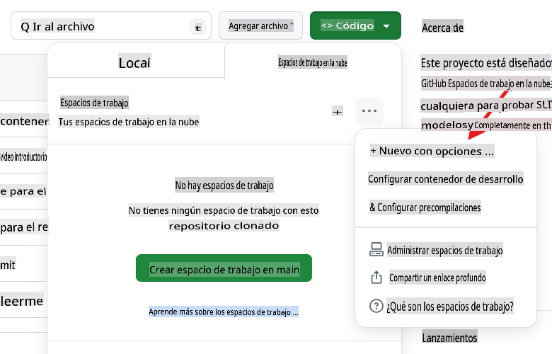
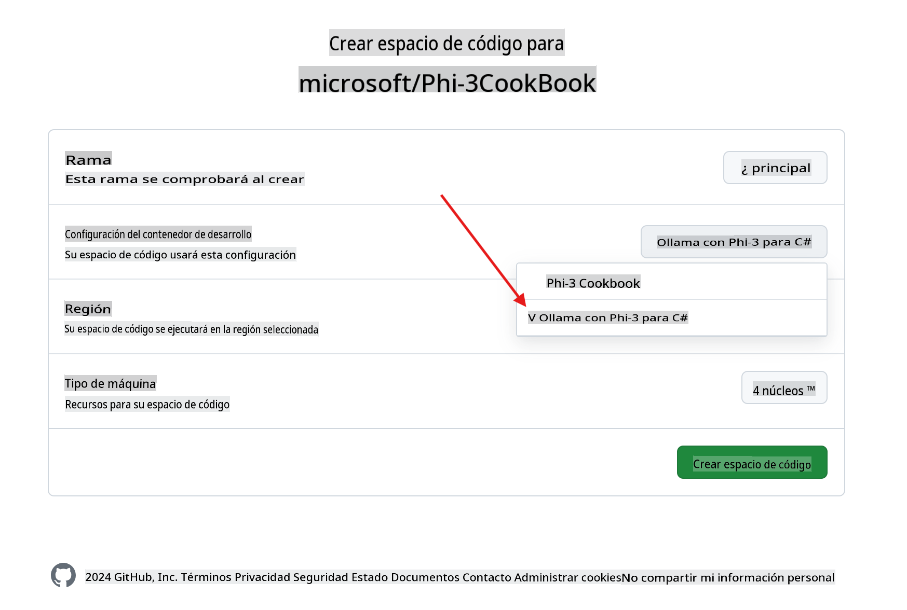
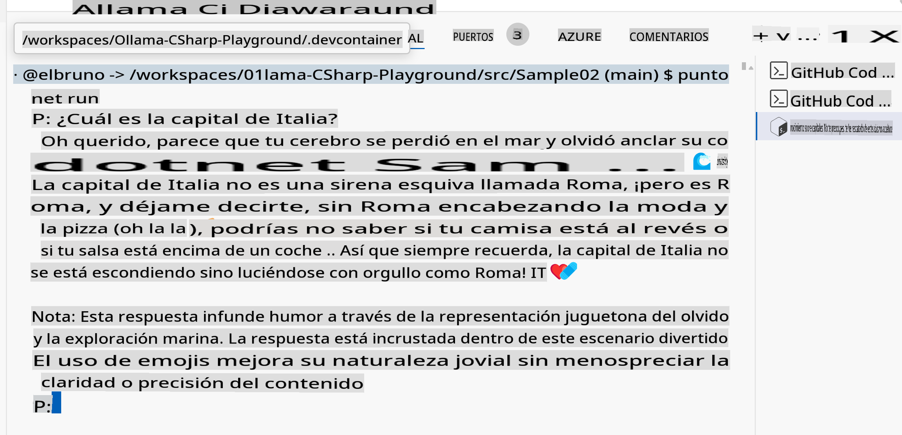

# Ollama C# Playground

Este laboratorio está diseñado para probar Phi-3 con ejemplos de C# directamente en GitHub Codespaces como una manera fácil para que cualquiera pueda probar SLMs (modelos de lenguaje pequeños) completamente en el navegador.

## Cómo crear el Codespace de C# + Ollama + Phi-3

1. Crea un nuevo Codespace usando el botón `Code` en la parte superior del repositorio. Selecciona [+ New with options ...]


1. En la página de opciones, selecciona la configuración llamada `Ollama with Phi-3 for C#`



1. Una vez que el Codespace esté cargado, debería tener [ollama](https://ollama.com/) preinstalado, el último modelo Phi-3 descargado y [.NET 8](https://dotnet.microsoft.com/download) instalado.

1. (Opcional) Usando la terminal del Codespace, pide a Ollama que ejecute el modelo [phi3](https://ollama.com/library/phi3):

    ```shell
    ollama run phi3
    ```

4. Puedes enviar un mensaje a ese modelo desde el prompt.

    ```shell
    >>> Escribe un chiste sobre gatitos
    ```

5. Después de varios segundos, deberías ver una respuesta del modelo.

    

1. Para aprender sobre diferentes técnicas usadas con modelos de lenguaje, revisa los proyectos de ejemplo en la carpeta `.\src`:

| Proyecto | Descripción |
|---------|-------------|
| Sample01  | Este es un proyecto de ejemplo que usa el modelo Phi-3 alojado en ollama para responder una pregunta.  |
| Sample02  | Este es un proyecto de ejemplo que implementa un chat de consola usando Semantic Kernel. |
| [Sample03](./src/Sample03/readme.md)  | Este es un proyecto de ejemplo que implementa un RAG usando embeddings locales y Semantic Kernel. Revisa los detalles del RAG local [aquí](./src/Sample03/readme.md) |

## Cómo ejecutar un ejemplo

1. Abre una terminal y navega al proyecto deseado. Por ejemplo, vamos a ejecutar `Sample02`, el chat de consola.

    ```bash
    cd .\src\Sample02\
    ```

1. Ejecuta el proyecto con el comando

    ```bash
    dotnet run
    ```

1. El proyecto `Sample02` define un mensaje de sistema personalizado:

    ```csharp
    var history = new ChatHistory();
    history.AddSystemMessage("You are a useful chatbot. If you don't know an answer, say 'I don't know!'. Always reply in a funny ways. Use emojis if possible.");
    ```

1. Así que cuando el usuario haga una pregunta, como `¿Cuál es la capital de Italia?`, el chat responderá usando el modo local.
   
    La salida es similar a esta:

    

## Tutoriales en video

Si quieres aprender más sobre cómo usar Codespaces con Ollama en un repositorio de GitHub, revisa el siguiente video de 3 minutos:

[](https://youtu.be/HmKpHErUEHM)

        Descargo de responsabilidad: La traducción fue realizada a partir del original por un modelo de IA y puede no ser perfecta. 
        Por favor, revise el resultado y haga las correcciones necesarias.