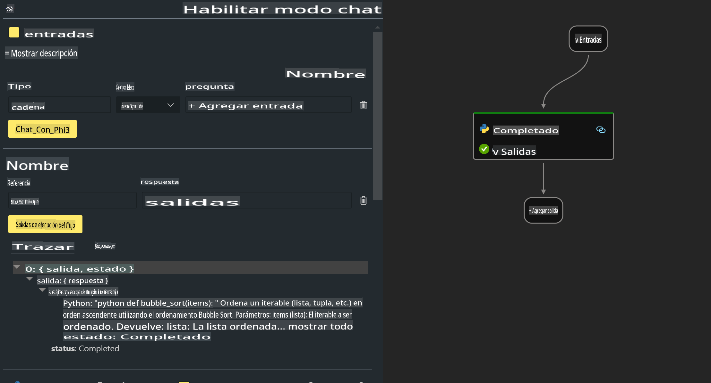

# **Lab 2 - Ejecutar Prompt flow con Phi-3-mini en AIPC**

## **Qué es Prompt flow**

Prompt flow es un conjunto de herramientas de desarrollo diseñadas para agilizar el ciclo de desarrollo de aplicaciones de IA basadas en LLM, desde la ideación, el prototipo, las pruebas, la evaluación hasta el despliegue en producción y el monitoreo. Facilita mucho la ingeniería de prompts y te permite construir aplicaciones de LLM con calidad de producción.

Con prompt flow, podrás:

- Crear flujos que enlacen LLMs, prompts, código Python y otras herramientas en un flujo de trabajo ejecutable.

- Depurar e iterar tus flujos, especialmente la interacción con LLMs de manera sencilla.

- Evaluar tus flujos, calcular métricas de calidad y rendimiento con conjuntos de datos más grandes.

- Integrar las pruebas y evaluaciones en tu sistema CI/CD para asegurar la calidad de tu flujo.

- Desplegar tus flujos en la plataforma de servicio que elijas o integrarlos fácilmente en la base de código de tu aplicación.

- (Opcional pero altamente recomendado) Colaborar con tu equipo aprovechando la versión en la nube de Prompt flow en Azure AI.

## **Qué es AIPC**

Un PC de IA tiene una CPU, una GPU y una NPU, cada uno con capacidades específicas de aceleración de IA. Una NPU, o unidad de procesamiento neural, es un acelerador especializado que maneja tareas de inteligencia artificial (IA) y aprendizaje automático (ML) directamente en tu PC en lugar de enviar datos para ser procesados en la nube. La GPU y la CPU también pueden procesar estas cargas de trabajo, pero la NPU es especialmente buena en cálculos de IA de baja potencia. El PC de IA representa un cambio fundamental en cómo operan nuestras computadoras. No es una solución para un problema que no existía antes. En cambio, promete ser una gran mejora para los usos cotidianos de la PC.

Entonces, ¿cómo funciona? Comparado con la IA generativa y los modelos de lenguaje grandes (LLMs) entrenados con toneladas de datos públicos, la IA que ocurrirá en tu PC es más accesible en casi todos los niveles. El concepto es más fácil de digerir y, como está entrenado en tus datos, sin necesidad de acceder a la nube, los beneficios son más inmediatamente atractivos para una población más amplia.

A corto plazo, el mundo del PC de IA implica asistentes personales y modelos de IA más pequeños que se ejecutan directamente en tu PC, usando tus datos para ofrecer mejoras de IA personales, privadas y más seguras para cosas que ya haces todos los días: tomar notas de reuniones, organizar una liga de fútbol de fantasía, automatizar mejoras para la edición de fotos y videos, o planificar el itinerario perfecto para una reunión familiar basado en los tiempos de llegada y salida de todos.

## **Construyendo flujos de generación de código en AIPC**

***Note***: Si no has completado la instalación del entorno, por favor visita [Lab 0 -Instalaciones](./01.Installations.md)

1. Abre la extensión de Prompt flow en Visual Studio Code y crea un proyecto de flujo vacío


2. Agrega parámetros de Entradas y Salidas y añade Código Python como nuevo flujo



Puedes referirte a esta estructura (flow.dag.yaml) para construir tu flujo

```yaml

inputs:
  question:
    type: string
    default: how to write Bubble Algorithm
outputs:
  answer:
    type: string
    reference: ${Chat_With_Phi3.output}
nodes:
- name: Chat_With_Phi3
  type: python
  source:
    type: code
    path: Chat_With_Phi3.py
  inputs:
    question: ${inputs.question}

```

3. Agrega el código en ***Chat_With_Phi3.py***

```python

from promptflow.core import tool

# import torch
from transformers import AutoTokenizer, pipeline, TextStreamer
import intel_npu_acceleration_library as npu_lib

import warnings

import asyncio
import platform

class Phi3CodeAgent:
    
    model = None
    tokenizer = None
    text_streamer = None
    
    model_id = "microsoft/Phi-3-mini-4k-instruct"

    @staticmethod
    def init_phi3():
        
        if Phi3CodeAgent.model is None or Phi3CodeAgent.tokenizer is None o Phi3CodeAgent.text_streamer is None:
            Phi3CodeAgent.model = npu_lib.NPUModelForCausalLM.from_pretrained(
                                    Phi3CodeAgent.model_id,
                                    torch_dtype="auto",
                                    dtype=npu_lib.int4,
                                    trust_remote_code=True
                                )
            Phi3CodeAgent.tokenizer = AutoTokenizer.from_pretrained(Phi3CodeAgent.model_id)
            Phi3CodeAgent.text_streamer = TextStreamer(Phi3CodeAgent.tokenizer, skip_prompt=True)

    @staticmethod
    def chat_with_phi3(prompt):
        
        Phi3CodeAgent.init_phi3()

        messages = "<|system|>You are a AI Python coding assistant. Please help me to generate code in Python.The answer only generated Python code, but any comments and instructions do not need to be generated<|end|><|user|>" + prompt + "<|end|><|assistant|>"

        generation_args = {
            "max_new_tokens": 1024,
            "return_full_text": False,
            "temperature": 0.3,
            "do_sample": False,
            "streamer": Phi3CodeAgent.text_streamer,
        }

        pipe = pipeline(
            "text-generation",
            model=Phi3CodeAgent.model,
            tokenizer=Phi3CodeAgent.tokenizer,
            # **generation_args
        )

        result = ''

        with warnings.catch_warnings():
            warnings.simplefilter("ignore")
            response = pipe(messages, **generation_args)
            result = response[0]['generated_text']
            return result

@tool
def my_python_tool(question: str) -> str:
    if platform.system() == 'Windows':
        asyncio.set_event_loop_policy(asyncio.WindowsSelectorEventLoopPolicy())
    return Phi3CodeAgent.chat_with_phi3(question)

```

4. Puedes probar el flujo desde Debug o Run para verificar si el código generado está bien o no


5. Ejecuta el flujo como API de desarrollo en el terminal

```

pf flow serve --source ./ --port 8080 --host localhost   

```

Puedes probarlo en Postman / Thunder Client

### **Nota**

1. La primera ejecución toma mucho tiempo. Se recomienda descargar el modelo phi-3 desde Hugging face CLI.

2. Considerando la potencia de cálculo limitada de la NPU de Intel, se recomienda usar Phi-3-mini-4k-instruct

3. Usamos la Aceleración de NPU de Intel para cuantizar la conversión a INT4, pero si vuelves a ejecutar el servicio, necesitas eliminar las carpetas de caché y nc_workshop.

## **Recursos**

1. Aprende Promptflow [https://microsoft.github.io/promptflow/](https://microsoft.github.io/promptflow/)

2. Aprende Aceleración de NPU de Intel [https://github.com/intel/intel-npu-acceleration-library](https://github.com/intel/intel-npu-acceleration-library)

3. Código de Ejemplo, descarga [Local NPU Agent Sample Code](../../../../../code/07.Lab/01/AIPC/local-npu-agent/)

Aviso legal: La traducción fue realizada a partir del original por un modelo de IA y puede no ser perfecta. Por favor, revise el resultado y haga las correcciones necesarias.