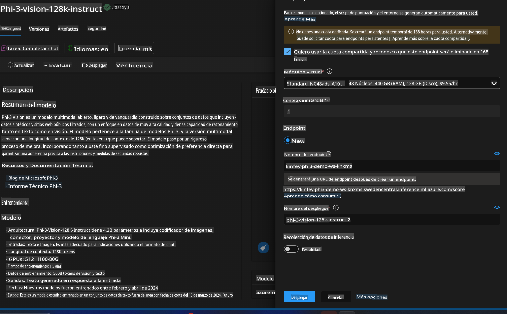

# **Lab 3 - Desplegar Phi-3-vision en Azure Machine Learning Service**

Usamos NPU para completar el despliegue de código local en producción, y luego queremos introducir la capacidad de PHI-3-VISION a través de él para lograr la generación de código a partir de imágenes.

En esta introducción, podemos construir rápidamente un servicio Model As Service Phi-3 Vision en Azure Machine Learning Service.

***Note***: Phi-3 Vision requiere poder de cómputo para generar contenido a mayor velocidad. Necesitamos el poder de cómputo en la nube para ayudarnos a lograr esto.


### **1. Crear Azure Machine Learning Service**

Necesitamos crear un Azure Machine Learning Service en el Azure Portal. Si quieres aprender cómo, por favor visita este enlace [https://learn.microsoft.com/azure/machine-learning/quickstart-create-resources?view=azureml-api-2](https://learn.microsoft.com/azure/machine-learning/quickstart-create-resources?view=azureml-api-2)


### **2. Elegir Phi-3 Vision en Azure Machine Learning Service**


### **3. Desplegar Phi-3-Vision en Azure**




### **4. Probar el Endpoint en Postman**


***Note***

1. Los parámetros a transmitir deben incluir Authorization, azureml-model-deployment, y Content-Type. Necesitas verificar la información de despliegue para obtenerlos.

2. Para transmitir parámetros, Phi-3-Vision necesita transmitir un enlace de imagen. Por favor, consulta el método de GPT-4-Vision para transmitir parámetros, como

```json

{
  "input_data":{
    "input_string":[
      {
        "role":"user",
        "content":[ 
          {
            "type": "text",
            "text": "You are a Python coding assistant.Please create Python code for image "
          },
          {
              "type": "image_url",
              "image_url": {
                "url": "https://ajaytech.co/wp-content/uploads/2019/09/index.png"
              }
          }
        ]
      }
    ],
    "parameters":{
          "temperature": 0.6,
          "top_p": 0.9,
          "do_sample": false,
          "max_new_tokens": 2048
    }
  }
}

```

3. Llama a **/score** usando el método Post

**¡Felicidades**! Has completado el despliegue rápido de PHI-3-VISION y probado cómo usar imágenes para generar código. A continuación, podemos construir aplicaciones en combinación con NPUs y la nube.

Aviso legal: La traducción fue realizada a partir del original por un modelo de IA y puede no ser perfecta. 
Por favor, revise el resultado y haga las correcciones necesarias.