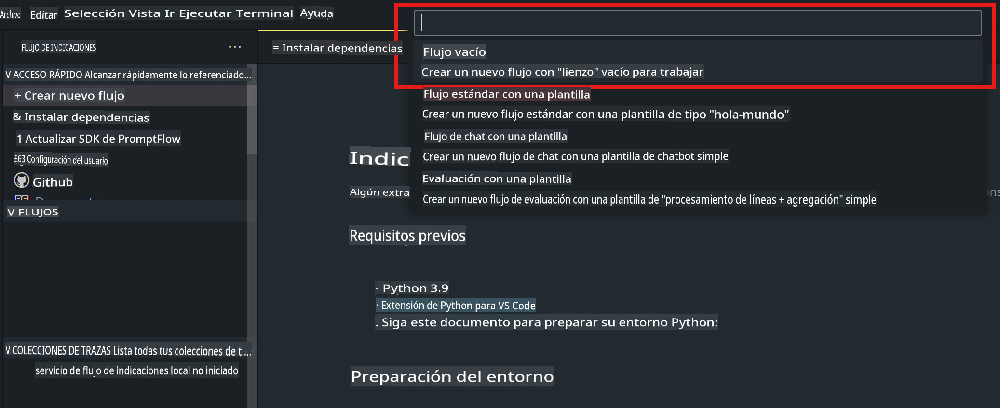

# **Lab 2 - Ejecutar Prompt flow con Phi-3-mini en AIPC**

## **¿Qué es Prompt flow?**

Prompt flow es un conjunto de herramientas de desarrollo diseñadas para simplificar el ciclo de desarrollo completo de aplicaciones de IA basadas en LLM, desde la ideación, prototipado, pruebas, evaluación hasta el despliegue en producción y monitoreo. Facilita la ingeniería de prompts y te permite construir aplicaciones LLM con calidad de producción.

Con Prompt flow, podrás:

- Crear flujos que vinculen LLMs, prompts, código Python y otras herramientas en un flujo de trabajo ejecutable.

- Depurar e iterar tus flujos, especialmente la interacción con LLMs con facilidad.

- Evaluar tus flujos, calcular métricas de calidad y rendimiento con conjuntos de datos más grandes.

- Integrar las pruebas y la evaluación en tu sistema CI/CD para asegurar la calidad de tu flujo.

- Desplegar tus flujos en la plataforma de servicio que elijas o integrarlos fácilmente en la base de código de tu aplicación.

- (Opcional pero altamente recomendado) Colaborar con tu equipo aprovechando la versión en la nube de Prompt flow en Azure AI.

## **Construcción de flujos de generación de código en Apple Silicon**

***Note*** ：Si no has completado la instalación del entorno, por favor visita [Lab 0 -Installations](./01.Installations.md)

1. Abre la extensión de Prompt flow en Visual Studio Code y crea un proyecto de flujo vacío.



2. Añade parámetros de Entradas y Salidas y Añade Código Python como nuevo flujo.


Puedes referirte a esta estructura (flow.dag.yaml) para construir tu flujo:

```yaml
inputs:
  prompt:
    type: string
    default: Write python code for Fibonacci serie. Please use markdown as output
outputs:
  result:
    type: string
    reference: ${gen_code_by_phi3.output}
nodes:
- name: gen_code_by_phi3
  type: python
  source:
    type: code
    path: gen_code_by_phi3.py
  inputs:
    prompt: ${inputs.prompt}
```

3. Cuantificar phi-3-mini

Esperamos ejecutar mejor SLM en dispositivos locales. Generalmente, cuantificamos el modelo (INT4, FP16, FP32).

```bash
python -m mlx_lm.convert --hf-path microsoft/Phi-3-mini-4k-instruct
```

**Note:** la carpeta predeterminada es mlx_model.

4. Añade Código en ***Chat_With_Phi3.py***

```python
from promptflow import tool
from mlx_lm import load, generate

# La sección de inputs cambiará según los argumentos de la función tool, después de guardar el código
# Añadir tipo a los argumentos y valor de retorno ayudará al sistema a mostrar los tipos correctamente
# Por favor actualiza el nombre/firma de la función según sea necesario
@tool
def my_python_tool(prompt: str) -> str:
    model_id = './mlx_model_phi3_mini'
    model, tokenizer = load(model_id)

    # <|user|>\nWrite python code for Fibonacci serie. Please use markdown as output<|end|>\n<|assistant|>
    response = generate(model, tokenizer, prompt="<|user|>\n" + prompt  + "<|end|>\n<|assistant|>", max_tokens=2048, verbose=True)

    return response
```

4. Puedes probar el flujo desde Debug o Run para verificar si la generación de código es correcta o no.


5. Ejecuta el flujo como API de desarrollo en la terminal.

```
pf flow serve --source ./ --port 8080 --host localhost   
```

Puedes probarlo en Postman / Thunder Client.

### **Note**

1. La primera ejecución toma mucho tiempo. Se recomienda descargar el modelo phi-3 desde Hugging face CLI.

2. Considerando la limitada capacidad de cómputo del NPU de Intel, se recomienda usar Phi-3-mini-4k-instruct.

3. Usamos la aceleración del NPU de Intel para la conversión cuantizada INT4, pero si vuelves a ejecutar el servicio, necesitas eliminar las carpetas cache y nc_workshop.

## **Recursos**

1. Aprende sobre Promptflow [https://microsoft.github.io/promptflow/](https://microsoft.github.io/promptflow/)

2. Aprende sobre Intel NPU Acceleration [https://github.com/intel/intel-npu-acceleration-library](https://github.com/intel/intel-npu-acceleration-library)

3. Código de ejemplo, descarga [Local NPU Agent Sample Code](../../../../../code/07.Lab/01/AIPC/local-npu-agent/)

Aviso legal: La traducción fue realizada a partir del original por un modelo de IA y puede no ser perfecta. 
Por favor, revise el resultado y haga las correcciones necesarias.