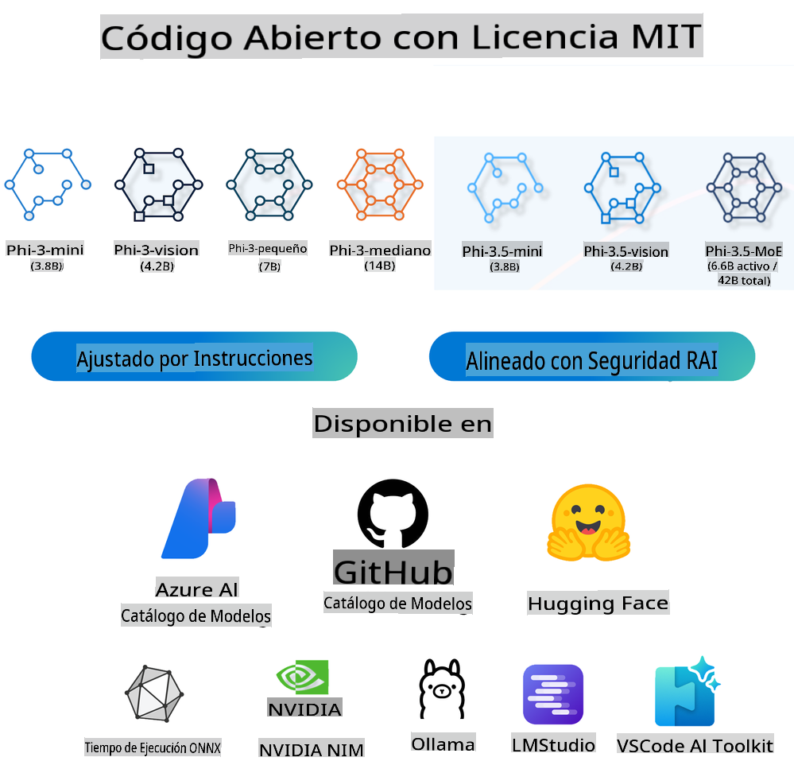
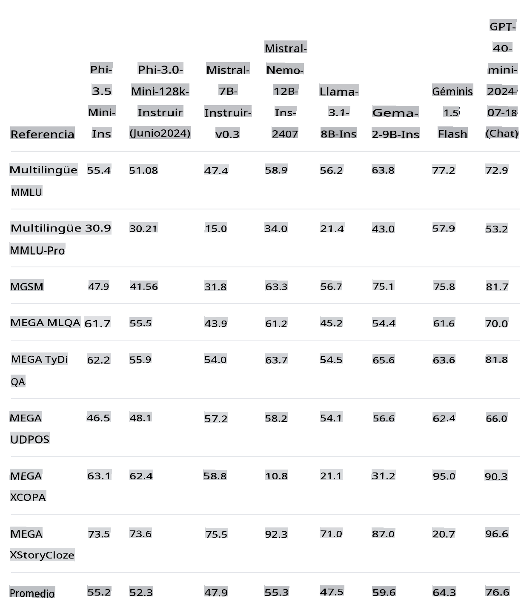
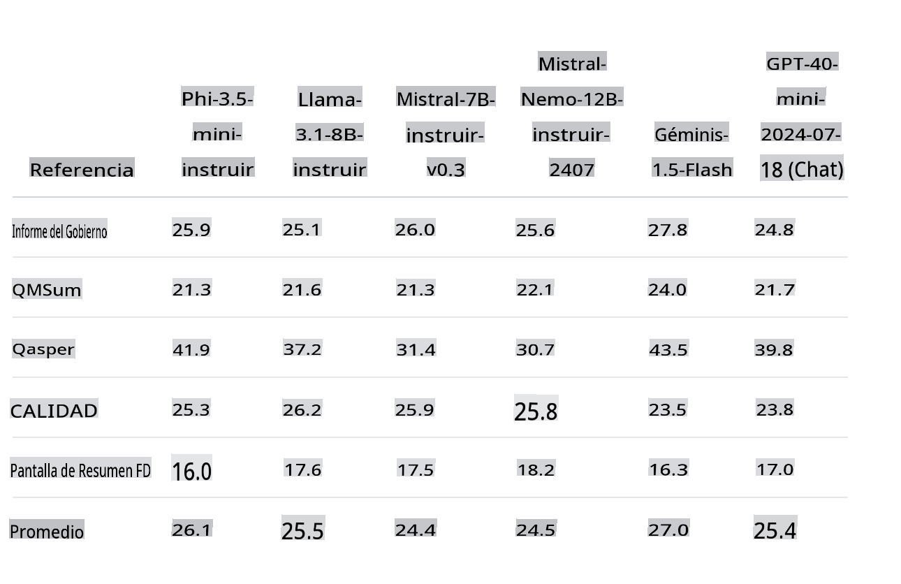
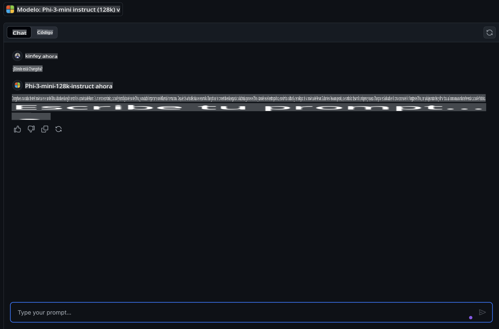
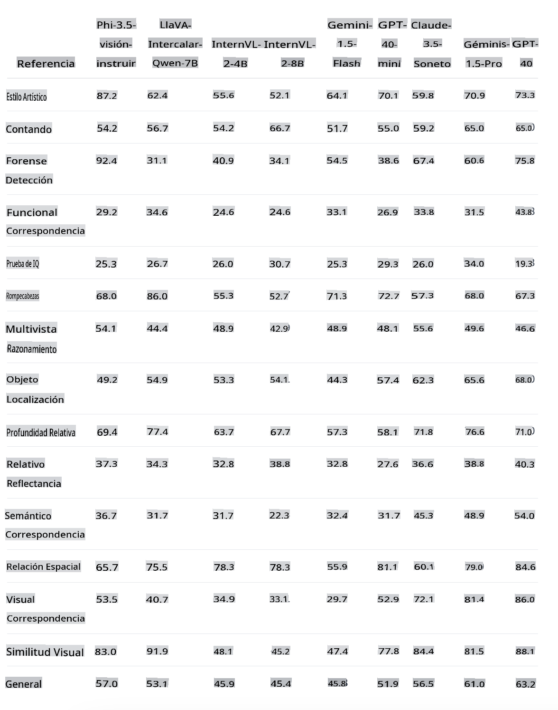
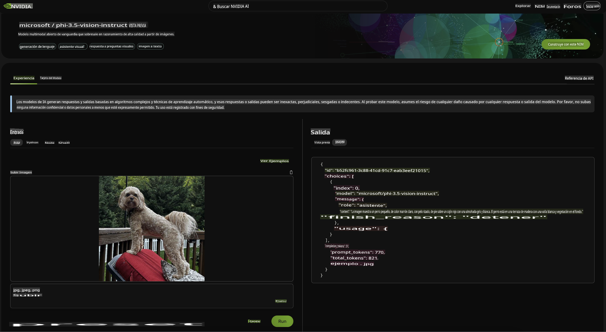
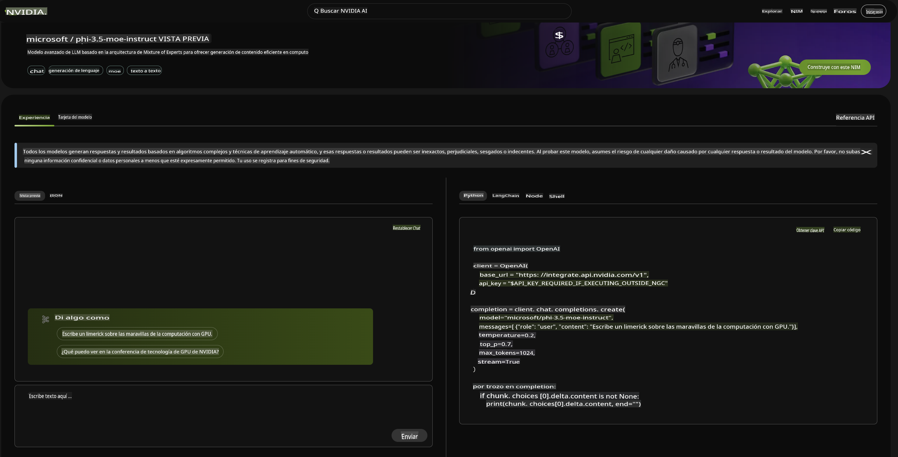

# **Novedades de la Familia Phi-3.5**

¿Ya estás usando la Familia Phi-3? ¿Cuáles son tus escenarios? El 20 de agosto de 2024, Microsoft lanzó la nueva Familia Phi-3.5, que ha sido mejorada en aspectos multilingües, de visión y en Agentes de IA. Hagamos una introducción más detallada en conjunto con la Model Card en Hugging Face.

## **Phi-3.5-mini-instruct**

Phi-3.5-mini es un modelo ligero y de última generación construido sobre los conjuntos de datos utilizados para Phi-3 - datos sintéticos y sitios web públicos filtrados - con un enfoque en datos de muy alta calidad y densos en razonamiento. El modelo pertenece a la familia de modelos Phi-3 y soporta una longitud de contexto de 128K tokens. El modelo pasó por un riguroso proceso de mejora, incorporando tanto ajuste fino supervisado, optimización de políticas proximales, como optimización de preferencias directas para asegurar una adherencia precisa a las instrucciones y medidas de seguridad robustas.

A través de los indicadores en el Benchmark, puedes ver que Phi-3.5-mini ha mejorado el soporte para múltiples idiomas y contenido de texto largo en comparación con Phi-3-mini, lo que se utiliza para mejorar las capacidades de lenguaje y texto de Phi-3.5 mini en aplicaciones de borde.

Podemos comparar la capacidad de conocimiento en chino a través de los Modelos de GitHub. Cuando preguntamos "¿Dónde está Changsha?" (长沙在哪里?), podemos comparar los resultados de Phi-3-mini-128k-instruct y Phi-3.5-mini-128k-instruct.

No es difícil ver que la mejora de datos en el corpus chino permite que Phi-3.5-mini tenga mejores resultados en escenarios básicos de generación de texto (***Nota:*** Tenga en cuenta que si Phi-3.5-mini necesita una respuesta más precisa, se recomienda ajustarlo según el escenario de aplicación).

## **Phi-3.5-vision-instruct**

Phi-3.5-vision es un modelo multimodal ligero y de última generación construido sobre conjuntos de datos que incluyen - datos sintéticos y sitios web públicos filtrados - con un enfoque en datos de muy alta calidad y densos en razonamiento tanto en texto como en visión. El modelo pertenece a la familia de modelos Phi-3, y la versión multimodal viene con una longitud de contexto de 128K tokens que puede soportar. El modelo pasó por un riguroso proceso de mejora, incorporando tanto ajuste fino supervisado como optimización de preferencias directas para asegurar una adherencia precisa a las instrucciones y medidas de seguridad robustas.

A través de Vision abrimos los ojos de la Familia Phi-3.x y pudimos completar los siguientes escenarios:

1. Entornos con restricciones de memoria/cómputo
2. Escenarios con limitaciones de latencia
3. Comprensión general de imágenes
4. Reconocimiento óptico de caracteres
5. Comprensión de gráficos y tablas
6. Comparación de múltiples imágenes
7. Resumen de múltiples imágenes o clips de video

A través de Vision, permitimos que la Familia Phi abra sus ojos y complete los siguientes escenarios.

También podemos usar el benchmark proporcionado por Hugging Face para entender la comparación en diferentes escenarios visuales.

Si deseas probar la versión gratuita de Phi-3.5-vision-instruct, podemos usar [Nivida NIM](https://build.nvidia.com/microsoft/phi-3_5-vision-instruct) para completar la experiencia.

Por supuesto, también puedes completar el despliegue a través de Azure AI Studio.

## **Phi-3.5-MoE-instruct**

Phi-3.5-MoE es un modelo ligero y de última generación construido sobre los conjuntos de datos utilizados para Phi-3 - datos sintéticos y documentos públicos filtrados - con un enfoque en datos de muy alta calidad y densos en razonamiento. El modelo soporta múltiples idiomas y viene con una longitud de contexto de 128K tokens. El modelo pasó por un riguroso proceso de mejora, incorporando ajuste fino supervisado, optimización de políticas proximales y optimización de preferencias directas para asegurar una adherencia precisa a las instrucciones y medidas de seguridad robustas.

Con el desarrollo de Agentes de IA, la demanda de modelos MoE aumentará gradualmente. MoE, cuyo nombre completo es Modelos de Expertos Mixtos, es un nuevo modelo formado por la mezcla de múltiples modelos expertos. MoE consiste en dividir primero el gran problema, luego resolver los pequeños problemas uno por uno y finalmente resumir las conclusiones. Además, la escala del modelo es uno de los factores clave para mejorar el rendimiento del modelo. Con recursos de cómputo limitados, entrenar un modelo más grande con menos pasos de entrenamiento suele ser mejor que entrenar un modelo más pequeño con más pasos.

El modelo Phi-3.5-MoE-Instruct requiere más poder de cómputo que Phi-3.5-Vision y Phi-3.5-Instruct. Se recomienda utilizar métodos basados en la nube como Azure AI Studio y Nvidia NIM para la experiencia y uso.

### **🤖 Ejemplos para Phi-3.5 con Apple MLX**

| Laboratorios | Introducción | Ir |
| ------------- | ------------ | -- |
| 🚀 Lab-Introduce Phi-3.5 Instruct  | Aprende a usar Phi-3.5 Instruct |  [Ir](../../../../../code/09.UpdateSamples/Aug/phi3-instruct-demo.ipynb)    |
| 🚀 Lab-Introduce Phi-3.5 Vision (imagen) | Aprende a usar Phi-3.5 Vision para analizar imágenes |  [Ir](../../../../../code/09.UpdateSamples/Aug/phi3-vision-demo.ipynb)    |
| 🚀 Lab-Introduce Phi-3.5 MoE   | Aprende a usar Phi-3.5 Vision para analizar imágenes |  [Ir](../../../../../code/09.UpdateSamples/Aug/phi3_moe_demo.ipynb)    |

## **Recursos**

1. Phi Family en Hugging Face [https://huggingface.co/collections/microsoft/phi-3-6626e15e9585a200d2d761e3](https://huggingface.co/collections/microsoft/phi-3-6626e15e9585a200d2d761e3)

2. Sobre Modelos de GitHub [https://gh.io/models](https://gh.io/models)

3. Sobre Azure AI Studio [https://ai.azure.com/](https://ai.azure.com/)

4. Sobre Nvidia NIM [https://build.nvidia.com/explore/discover](https://build.nvidia.com/explore/discover)

Aviso legal: La traducción fue realizada a partir de su original por un modelo de IA y puede no ser perfecta. 
Por favor, revise el resultado y haga las correcciones necesarias.