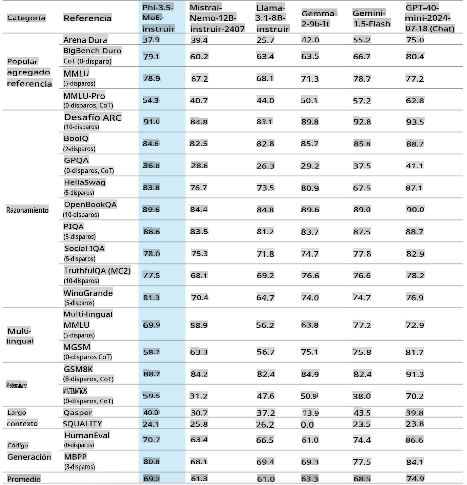
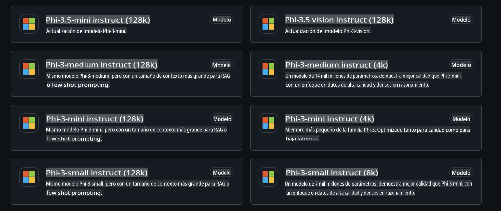
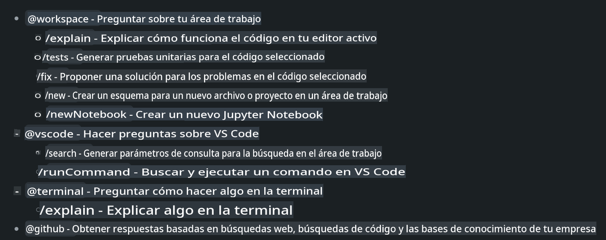
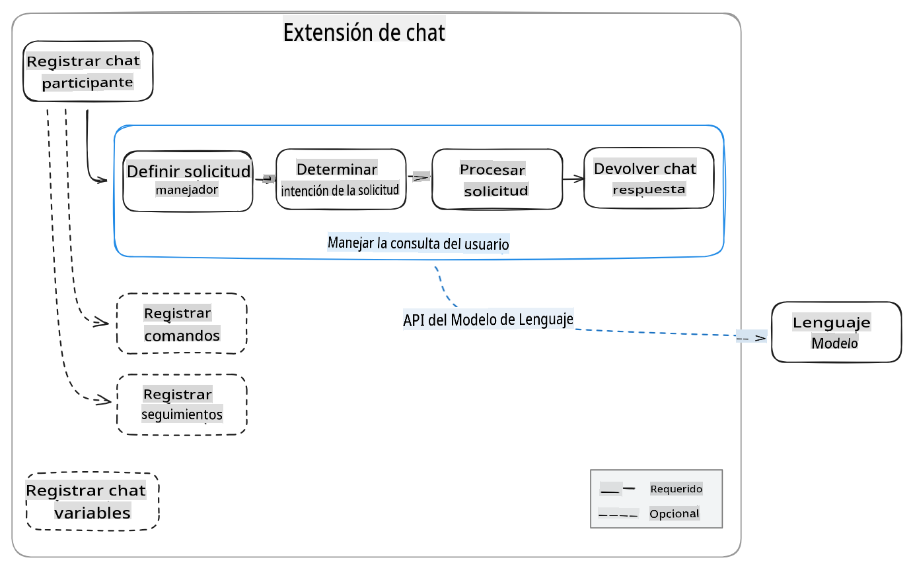
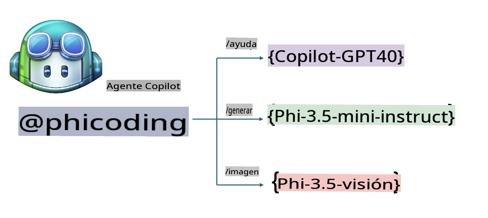
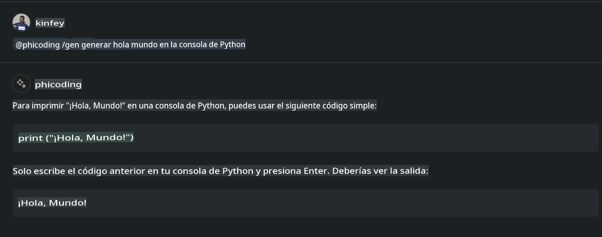
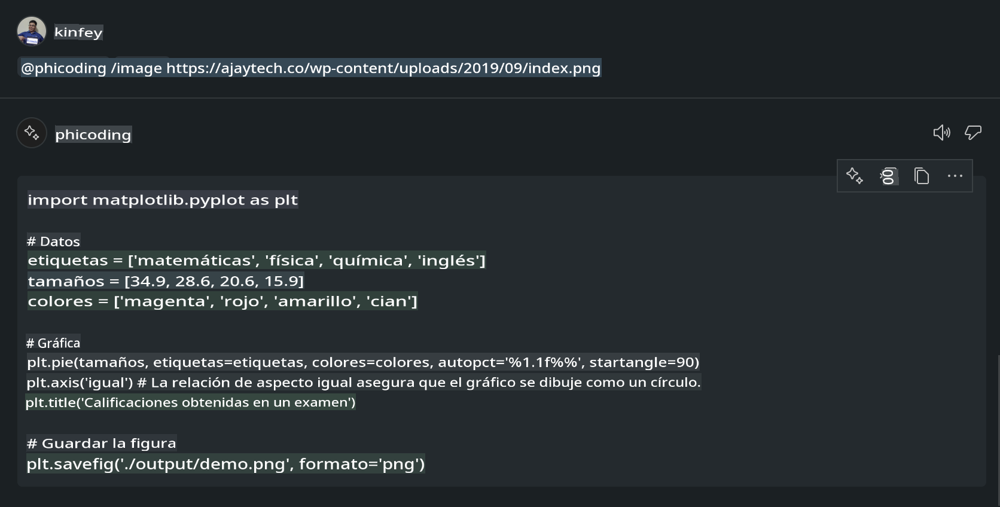

# **Crea tu propio Agente Chat Copilot de Visual Studio Code con Phi-3.5 de GitHub Models**

¿Estás usando Visual Studio Code Copilot? Especialmente en el Chat, puedes usar diferentes agentes para mejorar la capacidad de crear, escribir y mantener proyectos en Visual Studio Code. Visual Studio Code proporciona una API que permite a empresas e individuos crear diferentes agentes basados en su negocio para expandir sus capacidades en diferentes campos propietarios. En este artículo, nos enfocaremos en **Phi-3.5-mini-instruct (128k)** y **Phi-3.5-vision-instruct (128k)** de GitHub Models para crear tu propio Agente de Visual Studio Code.

## **Sobre Phi-3.5 en GitHub Models**

Sabemos que Phi-3/3.5-mini-instruct en la Familia Phi-3/3.5 tiene fuertes capacidades de comprensión y generación de código, y tiene ventajas sobre Gemma-2-9b y Mistral-Nemo-12B-instruct-2407.



Los últimos GitHub Models ya proporcionan acceso a los modelos Phi-3.5-mini-instruct (128k) y Phi-3.5-vision-instruct (128k). Los desarrolladores pueden acceder a ellos a través del SDK de OpenAI, el SDK de Azure AI Inference y la API REST.



***Nota:*** Se recomienda usar el SDK de Azure AI Inference aquí, porque puede cambiar mejor con el Catálogo de Modelos de Azure en el entorno de producción.

A continuación se presentan los resultados de **Phi-3.5-mini-instruct (128k)** y **Phi-3.5-vision-instruct (128k)** en el escenario de generación de código después de acoplarse con GitHub Models, y también se preparan para los siguientes ejemplos.

**Demo: GitHub Models Phi-3.5-mini-instruct (128k) genera código a partir de un Prompt** ([haz clic en este enlace](../../../../../code/09.UpdateSamples/Aug/ghmodel_phi35_instruct_demo.ipynb))

**Demo: GitHub Models Phi-3.5-vision-instruct (128k) genera código a partir de una Imagen** ([haz clic en este enlace](../../../../../code/09.UpdateSamples/Aug/ghmodel_phi35_vision_demo.ipynb))


## **Sobre el Agente Chat Copilot de GitHub**

El Agente Chat Copilot de GitHub puede completar diferentes tareas en diferentes escenarios de proyectos basados en el código. El sistema tiene cuatro agentes: workspace, github, terminal, vscode.



Agregando el nombre del agente con ‘@’, puedes completar rápidamente el trabajo correspondiente. Para las empresas, si agregas tu propio contenido relacionado con el negocio, como requisitos, codificación, especificaciones de prueba y lanzamiento, puedes tener funciones privadas empresariales más poderosas basadas en GitHub Copilot.

Visual Studio Code Chat Agent ha lanzado oficialmente su API, permitiendo a empresas o desarrolladores empresariales desarrollar agentes basados en diferentes ecosistemas de negocios de software. Basado en el método de desarrollo de Extensiones de Visual Studio Code, puedes acceder fácilmente a la interfaz de la API del Visual Studio Code Chat Agent. Podemos desarrollar basado en este proceso.



El escenario de desarrollo puede soportar acceso a APIs de modelos de terceros (como GitHub Models, Azure Model Catalog y servicios autoconstruidos basados en modelos de código abierto) y también puede usar los modelos gpt-35-turbo, gpt-4 y gpt-4o proporcionados por GitHub Copilot.

## **Agregar un Agente @phicoding basado en Phi-3.5**

Intentamos integrar las capacidades de programación de Phi-3.5 para completar la escritura de código, la generación de código a partir de imágenes y otras tareas. Completa un Agente construido alrededor de Phi-3.5 - @PHI, a continuación algunas funciones.

1. Genera una auto-presentación basada en GPT-4o proporcionado por GitHub Copilot a través del comando **@phicoding /help**.

2. Genera código para diferentes lenguajes de programación basado en **Phi-3.5-mini-instruct (128k)** a través del comando **@phicoding /gen**.

3. Genera código basado en **Phi-3.5-vision-instruct (128k)** y completa la imagen a través del comando **@phicoding /image**.



## **Pasos relacionados**

1. Instala el soporte de desarrollo de Extensiones de Visual Studio Code usando npm.

```bash

npm install --global yo generator-code 

```
2. Crea un plugin de Extensión de Visual Studio Code (usando el modo de desarrollo en Typescript, llamado phiext).

```bash

yo code 

```

3. Abre el proyecto creado y modifica package.json. Aquí están las instrucciones y configuraciones relacionadas, así como la configuración de GitHub Models. Ten en cuenta que necesitas agregar tu token de GitHub Models aquí.

```json

{
  "name": "phiext",
  "displayName": "phiext",
  "description": "",
  "version": "0.0.1",
  "engines": {
    "vscode": "^1.93.0"
  },
  "categories": [
    "AI",
    "Chat"
  ],
  "activationEvents": [],
  "enabledApiProposals": [
      "chatVariableResolver"
  ],
  "main": "./dist/extension.js",
  "contributes": {
    "chatParticipants": [
        {
            "id": "chat.phicoding",
            "name": "phicoding",
            "description": "¡Hola! Soy Microsoft Phi-3.5, puedo ayudarte con problemas de codificación, como generar código con tu lenguaje natural, o incluso generar código sobre gráficos a partir de imágenes. ¡Pregúntame cualquier cosa!",
            "isSticky": true,
            "commands": [
                {
                    "name": "help",
                    "description": "Presentarme"
                },
                {
                    "name": "gen",
                    "description": "Generar código para ti con Microsoft Phi-3.5-mini-instruct"
                },
                {
                    "name": "image",
                    "description": "Generar código para gráficos a partir de imagen (png o jpg) con Microsoft Phi-3.5-vision-instruct, por favor agrega la URL de la imagen así: https://ajaytech.co/wp-content/uploads/2019/09/index.png"
                }
            ]
        }
    ],
    "commands": [
        {
            "command": "phicoding.namesInEditor",
            "title": "Usar Microsoft Phi 3.5 en el Editor"
        }
    ],
    "configuration": {
      "type": "object",
      "title": "githubmodels",
      "properties": {
        "githubmodels.endpoint": {
          "type": "string",
          "default": "https://models.inference.ai.azure.com",
          "description": "Tu Endpoint de GitHub Models",
          "order": 0
        },
        "githubmodels.api_key": {
          "type": "string",
          "default": "Tu Token de GitHub Models",
          "description": "Tu Token de GitHub Models",
          "order": 1
        },
        "githubmodels.phi35instruct": {
          "type": "string",
          "default": "Phi-3.5-mini-instruct",
          "description": "Tu Modelo Phi-35-Instruct",
          "order": 2
        },
        "githubmodels.phi35vision": {
          "type": "string",
          "default": "Phi-3.5-vision-instruct",
          "description": "Tu Modelo Phi-35-Vision",
          "order": 3
        }
      }
    }
  },
  "scripts": {
    "vscode:prepublish": "npm run package",
    "compile": "webpack",
    "watch": "webpack --watch",
    "package": "webpack --mode production --devtool hidden-source-map",
    "compile-tests": "tsc -p . --outDir out",
    "watch-tests": "tsc -p . -w --outDir out",
    "pretest": "npm run compile-tests && npm run compile && npm run lint",
    "lint": "eslint src",
    "test": "vscode-test"
  },
  "devDependencies": {
    "@types/vscode": "^1.93.0",
    "@types/mocha": "^10.0.7",
    "@types/node": "20.x",
    "@typescript-eslint/eslint-plugin": "^8.3.0",
    "@typescript-eslint/parser": "^8.3.0",
    "eslint": "^9.9.1",
    "typescript": "^5.5.4",
    "ts-loader": "^9.5.1",
    "webpack": "^5.94.0",
    "webpack-cli": "^5.1.4",
    "@vscode/test-cli": "^0.0.10",
    "@vscode/test-electron": "^2.4.1"
  },
  "dependencies": {
    "@types/node-fetch": "^2.6.11",
    "node-fetch": "^3.3.2",
    "@azure-rest/ai-inference": "latest",
    "@azure/core-auth": "latest",
    "@azure/core-sse": "latest"
  }
}


```

4. Modifica src/extension.ts

```typescript

// El módulo 'vscode' contiene la API de extensibilidad de VS Code
// Importa el módulo y haz referencia a él con el alias vscode en tu código a continuación
import * as vscode from 'vscode';
import ModelClient from "@azure-rest/ai-inference";
import { AzureKeyCredential } from "@azure/core-auth";


interface IPhiChatResult extends vscode.ChatResult {
    metadata: {
        command: string;
    };
}


const MODEL_SELECTOR: vscode.LanguageModelChatSelector = { vendor: 'copilot', family: 'gpt-4o' };

function isValidImageUrl(url: string): boolean {
    const regex = /^(https?:\/\/.*\.(?:png|jpg))$/i;
    return regex.test(url);
}
  

// Este método se llama cuando tu extensión se activa
// Tu extensión se activa la primera vez que se ejecuta el comando
export function activate(context: vscode.ExtensionContext) {

    const codinghandler: vscode.ChatRequestHandler = async (request: vscode.ChatRequest, context: vscode.ChatContext, stream: vscode.ChatResponseStream, token: vscode.CancellationToken): Promise<IPhiChatResult> => {


        const config : any = vscode.workspace.getConfiguration('githubmodels');
        const endPoint: string = config.get('endpoint');
        const apiKey: string = config.get('api_key');
        const phi35instruct: string = config.get('phi35instruct');
        const phi35vision: string = config.get('phi35vision');
        
        if (request.command === 'help') {

            const content = "Bienvenido al asistente de codificación con Microsoft Phi-3.5"; 
            stream.progress(content);


            try {
                const [model] = await vscode.lm.selectChatModels(MODEL_SELECTOR);
                if (model) {
                    const messages = [
                        vscode.LanguageModelChatMessage.User("Por favor, ayúdame a expresar este contenido de una manera humorística: Soy un asistente de programación que puede ayudarte a convertir el lenguaje natural en código y generar código basado en los gráficos en las imágenes. formato de salida como este: Hey soy Phi ......")
                    ];
                    const chatResponse = await model.sendRequest(messages, {}, token);
                    for await (const fragment of chatResponse.text) {
                        stream.markdown(fragment);
                    }
                }
            } catch(err) {
                console.log(err);
            }


            return { metadata: { command: 'help' } };

        }

        
        if (request.command === 'gen') {

            const content = "Bienvenido a usar phi-3.5 para generar código";

            stream.progress(content);

            const client = new ModelClient(endPoint, new AzureKeyCredential(apiKey));

            const response = await client.path("/chat/completions").post({
              body: {
                messages: [
                  { role:"system", content: "Eres un asistente de codificación. Ayuda a responder todas las preguntas de generación de código." },
                  { role:"user", content: request.prompt }
                ],
                model: phi35instruct,
                temperature: 0.4,
                max_tokens: 1000,
                top_p: 1.
              }
            });

            stream.markdown(response.body.choices[0].message.content);

            return { metadata: { command: 'gen' } };

        }


        
        if (request.command === 'image') {


            const content = "Bienvenido a usar phi-3.5 para generar código a partir de una imagen (png o jpg), URL de la imagen como esta: https://ajaytech.co/wp-content/uploads/2019/09/index.png";

            stream.progress(content);

            if (!isValidImageUrl(request.prompt)) {
                stream.markdown('Por favor, proporciona una URL de imagen válida');
                return { metadata: { command: 'image' } };
            }
            else
            {

                const client = new ModelClient(endPoint, new AzureKeyCredential(apiKey));
    
                const response = await client.path("/chat/completions").post({
                    body: {
                      messages: [
                        { role: "system", content: "Eres un asistente útil que describe imágenes en detalle." },
                        { role: "user", content: [
                            { type: "text", text: "Por favor, genera código según el gráfico en la imagen según los siguientes requisitos\n1. Mantén toda la información en el gráfico, incluidos los datos y el texto\n2. No generes información adicional que no esté incluida en el gráfico\n3. Por favor, extrae datos de la imagen, no los generes a partir de csv\n4. Por favor, guarda el gráfico regenerado como un gráfico y guárdalo en ./output/demo.png"},
                            { type: "image_url", image_url: {url: request.prompt}
                            }
                          ]
                        }
                      ],
                      model: phi35vision,
                      temperature: 0.4,
                      max_tokens: 2048,
                      top_p: 1.
                    }
                  });
    
                
                stream.markdown(response.body.choices[0].message.content);
    
                return { metadata: { command: 'image' } };
            }


        }


        return { metadata: { command: '' } };
    };


    const phi_ext = vscode.chat.createChatParticipant("chat.phicoding", codinghandler);

    phi_ext.iconPath = new vscode.ThemeIcon('sparkle');


    phi_ext.followupProvider = {
        provideFollowups(result: IPhiChatResult, context: vscode.ChatContext, token: vscode.CancellationToken) {
            return [{
                prompt: 'Vamos a codificar con Phi-3.5 😋😋😋😋',
                label: vscode.l10n.t('Disfruta codificando con Phi-3.5'),
                command: 'help'
            } satisfies vscode.ChatFollowup];
        }
    };

    context.subscriptions.push(phi_ext);
}

// Este método se llama cuando tu extensión se desactiva
export function deactivate() {}


```

6. Ejecutar

***/help***


***@phicoding /help***


***@phicoding /gen***




***@phicoding /image***




Puedes descargar el código de ejemplo: [haz clic](../../../../../code/09.UpdateSamples/Aug/vscode)

## **Recursos**

1. Regístrate en GitHub Models [https://gh.io/models](https://gh.io/models)

2. Aprende sobre el Desarrollo de Extensiones de Visual Studio Code [https://code.visualstudio.com/api/get-started/your-first-extension](https://code.visualstudio.com/api/get-started/your-first-extension)

3. Aprende sobre la API de Chat de Visual Studio Code Copilot [https://code.visualstudio.com/api/extension-guides/chat](https://code.visualstudio.com/api/extension-guides/chat)

        Descargo de responsabilidad: La traducción fue realizada por un modelo de IA y puede no ser perfecta. 
        Por favor, revise el resultado y haga las correcciones necesarias.