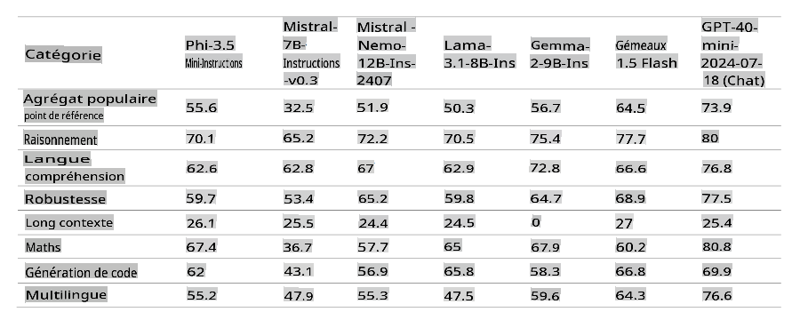
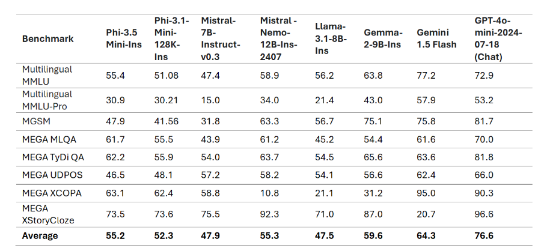
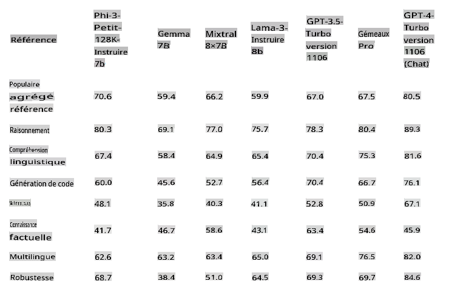
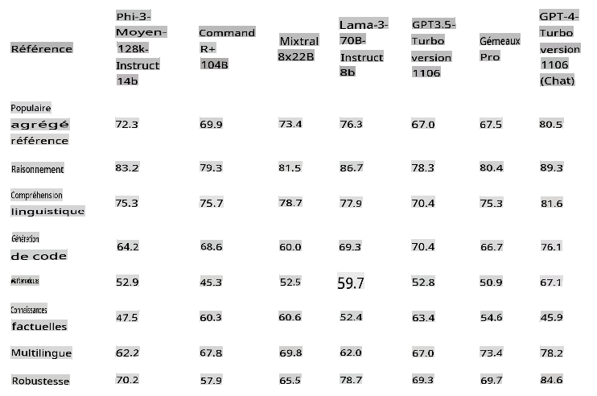
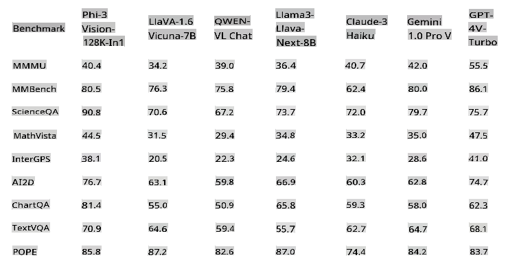
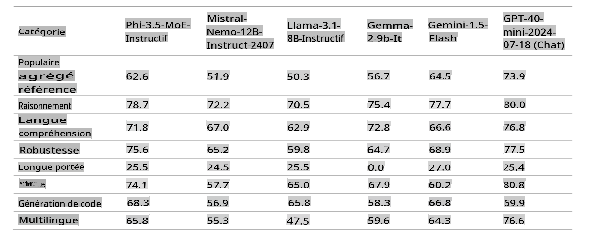

# La famille Phi-3 de Microsoft

Les modèles Phi-3 sont les modèles de Petits Modèles de Langage (SLMs) les plus performants et les plus rentables disponibles, surpassant les modèles de même taille et de taille supérieure dans divers domaines comme la langue, le raisonnement, le codage et les mathématiques. Cette version élargit la sélection de modèles de haute qualité pour les clients, offrant plus de choix pratiques pour composer et construire des applications d'IA générative.

La famille Phi-3 inclut des versions mini, petite, moyenne et vision, entraînées avec différentes quantités de paramètres pour répondre à divers scénarios d'application. Chaque modèle est ajusté pour les instructions et développé conformément aux standards de l'IA Responsable de Microsoft, ainsi qu'aux normes de sécurité pour garantir une utilisation prête à l'emploi. Phi-3-mini surpasse les modèles deux fois plus grands, et Phi-3-small et Phi-3-medium surpassent des modèles beaucoup plus grands, y compris GPT-3.5T.

## Exemple de tâches Phi-3

| | |
|-|-|
|Tâches|Phi-3|
|Tâches linguistiques|Oui|
|Mathématiques & Raisonnement|Oui|
|Codage|Oui|
|Appel de fonction|Non|
|Auto-orchestration (Assistant)|Non|
|Modèles d'intégration dédiés|Non|

## Phi-3-mini

Phi-3-mini, un modèle de langage de 3,8 milliards de paramètres, est disponible sur [Microsoft Azure AI Studio](https://ai.azure.com/explore/models?selectedCollection=phi), [Hugging Face](https://huggingface.co/collections/microsoft/phi-3-6626e15e9585a200d2d761e3), et [Ollama](https://ollama.com/library/phi3). Il offre deux longueurs de contexte : [128K](https://ai.azure.com/explore/models/Phi-3-mini-128k-instruct/version/9/registry/azureml) et [4K](https://ai.azure.com/explore/models/Phi-3-mini-4k-instruct/version/9/registry/azureml).

Phi-3-mini est un modèle de langage basé sur Transformer avec 3,8 milliards de paramètres. Il a été entraîné avec des données de haute qualité contenant des informations utiles sur le plan éducatif, augmentées de nouvelles sources de données comprenant divers textes synthétiques NLP, ainsi que des ensembles de données de chat internes et externes, ce qui améliore considérablement les capacités de chat. De plus, Phi-3-mini a été affiné pour le chat après l'entraînement initial grâce à un affinement supervisé (SFT) et à l'Optimisation de Préférence Directe (DPO). Après cet affinement, Phi-3-mini a montré des améliorations significatives dans plusieurs capacités, notamment en termes d'alignement, de robustesse et de sécurité. Le modèle fait partie de la famille Phi-3 et est disponible en version mini avec deux variantes, 4K et 128K, représentant la longueur de contexte (en tokens) qu'il peut supporter.

## Phi-3.5-mini-instruct 

[Phi-3.5 mini](https://ai.azure.com/explore/models/Phi-3.5-mini-instruct/version/1/registry/azureml) est un modèle léger et de pointe construit à partir des ensembles de données utilisés pour Phi-3 - données synthétiques et sites web publics filtrés - avec un accent sur des données de très haute qualité, riches en raisonnement. Le modèle fait partie de la famille Phi-3 et supporte une longueur de contexte de 128K tokens. Le modèle a subi un processus d'amélioration rigoureux, intégrant à la fois un affinement supervisé, une optimisation de politique proximale, et une optimisation de préférence directe pour garantir une adhérence précise aux instructions et des mesures de sécurité robustes.

Phi-3.5 Mini possède 3,8 milliards de paramètres et est un modèle Transformer dense à décodeur unique utilisant le même tokenizer que Phi-3 Mini.

Globalement, le modèle avec seulement 3,8 milliards de paramètres atteint un niveau de compréhension linguistique multilingue et de capacité de raisonnement similaire à des modèles beaucoup plus grands. Cependant, il reste fondamentalement limité par sa taille pour certaines tâches. Le modèle n'a tout simplement pas la capacité de stocker trop de connaissances factuelles, donc les utilisateurs peuvent rencontrer des inexactitudes factuelles. Cependant, nous pensons que cette faiblesse peut être résolue en augmentant Phi-3.5 avec un moteur de recherche, en particulier lors de l'utilisation du modèle dans des paramètres RAG.

### Support linguistique 

Le tableau ci-dessous met en évidence la capacité multilingue du Phi-3 sur les ensembles de données multilingues MMLU, MEGA et MMLU-pro multilingue. Globalement, nous avons observé que même avec seulement 3,8 milliards de paramètres actifs, le modèle est très compétitif sur les tâches multilingues par rapport à d'autres modèles avec des paramètres actifs beaucoup plus grands.

## Phi-3-small

Phi-3-small, un modèle de langage de 7 milliards de paramètres, disponible en deux longueurs de contexte [128K](https://ai.azure.com/explore/models/Phi-3-small-128k-instruct/version/2/registry/azureml) et [8K.](https://ai.azure.com/explore/models/Phi-3-small-8k-instruct/version/2/registry/azureml) surpasse GPT-3.5T dans divers benchmarks de langue, raisonnement, codage et mathématiques.

Phi-3-small est un modèle de langage basé sur Transformer avec 7 milliards de paramètres. Il a été entraîné avec des données de haute qualité contenant des informations utiles sur le plan éducatif, augmentées de nouvelles sources de données comprenant divers textes synthétiques NLP, ainsi que des ensembles de données de chat internes et externes, ce qui améliore considérablement les capacités de chat. En outre, Phi-3-small a été affiné pour le chat après l'entraînement initial via un affinement supervisé (SFT) et l'Optimisation de Préférence Directe (DPO). Après cet affinement, Phi-3-small a montré des améliorations significatives dans plusieurs capacités, notamment en termes d'alignement, de robustesse et de sécurité. Phi-3-small est également plus intensivement entraîné sur des ensembles de données multilingues par rapport à Phi-3-Mini. La famille de modèles offre deux variantes, 8K et 128K, représentant la longueur de contexte (en tokens) qu'il peut supporter.

## Phi-3-medium

Phi-3-medium, un modèle de langage de 14 milliards de paramètres, disponible en deux longueurs de contexte [128K](https://ai.azure.com/explore/models/Phi-3-medium-128k-instruct/version/2/registry/azureml) et [4K.](https://ai.azure.com/explore/models/Phi-3-medium-4k-instruct/version/2/registry/azureml), continue la tendance en surpassant Gemini 1.0 Pro.

Phi-3-medium est un modèle de langage basé sur Transformer avec 14 milliards de paramètres. Il a été entraîné avec des données de haute qualité contenant des informations utiles sur le plan éducatif, augmentées de nouvelles sources de données comprenant divers textes synthétiques NLP, ainsi que des ensembles de données de chat internes et externes, ce qui améliore considérablement les capacités de chat. De plus, Phi-3-medium a été affiné pour le chat après l'entraînement initial grâce à un affinement supervisé (SFT) et à l'Optimisation de Préférence Directe (DPO). Après cet affinement, Phi-3-medium a montré des améliorations significatives dans plusieurs capacités, notamment en termes d'alignement, de robustesse et de sécurité. La famille de modèles offre deux variantes, 4K et 128K, représentant la longueur de contexte (en tokens) qu'il peut supporter.

[!NOTE]
Nous recommandons de passer à Phi-3.5-MoE comme une mise à niveau de Phi-3-medium car le modèle MoE est bien meilleur et plus rentable.

## Phi-3-vision

Le [Phi-3-vision](https://ai.azure.com/explore/models/Phi-3-vision-128k-instruct/version/2/registry/azureml), un modèle multimodal de 4,2 milliards de paramètres avec des capacités de langage et de vision, surpasse des modèles plus grands comme Claude-3 Haiku et Gemini 1.0 Pro V dans le raisonnement visuel général, l'OCR, et les tâches de compréhension de tableaux et de graphiques.

Phi-3-vision est le premier modèle multimodal de la famille Phi-3, réunissant texte et images. Phi-3-vision peut être utilisé pour raisonner sur des images du monde réel et extraire et raisonner sur du texte à partir d'images. Il a également été optimisé pour la compréhension des tableaux et des diagrammes et peut être utilisé pour générer des insights et répondre à des questions. Phi-3-vision s'appuie sur les capacités linguistiques de Phi-3-mini, continuant à offrir une forte qualité de raisonnement linguistique et visuel dans une petite taille.

## Phi-3.5-vision

[Phi-3.5 Vision](https://ai.azure.com/explore/models/Phi-3.5-vision-instruct/version/1/registry/azureml) est un modèle multimodal léger et de pointe construit à partir d'ensembles de données comprenant - des données synthétiques et des sites web publics filtrés - avec un accent sur des données de très haute qualité, riches en raisonnement à la fois sur le texte et la vision. Le modèle fait partie de la famille Phi-3, et la version multimodale supporte une longueur de contexte de 128K tokens. Le modèle a subi un processus d'amélioration rigoureux, intégrant à la fois un affinement supervisé et une optimisation de préférence directe pour garantir une adhérence précise aux instructions et des mesures de sécurité robustes.

Phi-3.5 Vision possède 4,2 milliards de paramètres et contient un encodeur d'image, un connecteur, un projecteur, et le modèle de langage Phi-3 Mini.

Le modèle est destiné à une utilisation commerciale et de recherche large en anglais. Le modèle offre des utilisations pour les systèmes et applications d'IA à usage général avec des capacités d'entrée visuelle et textuelle qui nécessitent
1) des environnements contraints en mémoire/puissance de calcul.
2) des scénarios à latence limitée.
3) une compréhension générale des images.
4) OCR
5) compréhension des tableaux et graphiques.
6) comparaison de plusieurs images.
7) résumés de plusieurs images ou clips vidéo.

Le modèle Phi-3.5-vision est conçu pour accélérer la recherche sur les modèles de langage et multimodaux efficaces, pour être utilisé comme un bloc de construction pour des fonctionnalités alimentées par l'IA générative.

## Phi-3.5-MoE

[Phi-3.5 MoE](https://ai.azure.com/explore/models/Phi-3.5-MoE-instruct/version/1/registry/azureml) est un modèle léger et de pointe construit à partir des ensembles de données utilisés pour Phi-3 - données synthétiques et documents publics filtrés - avec un accent sur des données de très haute qualité, riches en raisonnement. Le modèle supporte le multilingue et est fourni avec une longueur de contexte de 128K tokens. Le modèle a subi un processus d'amélioration rigoureux, intégrant un affinement supervisé, une optimisation de politique proximale, et une optimisation de préférence directe pour garantir une adhérence précise aux instructions et des mesures de sécurité robustes.

Phi-3 MoE possède 16x3,8 milliards de paramètres avec 6,6 milliards de paramètres actifs lors de l'utilisation de 2 experts. Le modèle est un modèle Transformer à décodeur unique mélange d'experts utilisant le tokenizer avec une taille de vocabulaire de 32,064.

Le modèle est destiné à une utilisation commerciale et de recherche large en anglais. Le modèle offre des utilisations pour les systèmes et applications d'IA à usage général qui nécessitent.

1) des environnements contraints en mémoire/puissance de calcul. 
2) des scénarios à latence limitée. 
3) un raisonnement fort (surtout mathématique et logique).

Le modèle MoE est conçu pour accélérer la recherche sur les modèles de langage et multimodaux, pour être utilisé comme un bloc de construction pour des fonctionnalités alimentées par l'IA générative et nécessite des ressources de calcul supplémentaires.

> [!NOTE]
>
> Les modèles Phi-3 ne performent pas aussi bien sur les benchmarks de connaissances factuelles (comme TriviaQA) car la taille plus petite du modèle entraîne une capacité réduite à retenir des faits.

## Phi silica

Nous introduisons Phi Silica qui est construit à partir de la série de modèles Phi et est conçu spécifiquement pour les NPU dans les PC Copilot+. Windows est la première plateforme à disposer d'un petit modèle de langage (SLM) de pointe spécialement conçu pour le NPU et intégré dans le système. L'API Phi Silica ainsi que les API OCR, Studio Effects, Live Captions, et Recall User Activity seront disponibles dans la bibliothèque Windows Copilot en juin. D'autres API comme Vector Embedding, RAG API, et Text Summarization seront disponibles plus tard.

## **Trouver tous les modèles Phi-3** 

- [Azure AI](https://ai.azure.com/explore/models?selectedCollection=phi)
- [Hugging Face](https://huggingface.co/collections/microsoft/phi-3-6626e15e9585a200d2d761e3) 

## Modèles ONNX

La principale différence entre les deux modèles ONNX, “cpu-int4-rtn-block-32” et “cpu-int4-rtn-block-32-acc-level-4”, est le niveau de précision. Le modèle avec “acc-level-4” est conçu pour équilibrer la latence et la précision, avec un léger compromis sur la précision pour de meilleures performances, ce qui pourrait être particulièrement adapté aux appareils mobiles.

## Exemple de sélection de modèle

| | | | |
|-|-|-|-|
|Besoins du client|Tâche|Commencer avec|Plus de détails|
|Besoin d'un modèle qui résume simplement un fil de messages|Résumé de conversation|Modèle texte Phi-3|Le facteur décisif ici est que le client a une tâche linguistique bien définie et simple|
|Une application gratuite de tutorat en mathématiques pour enfants|Mathématiques et Raisonnement|Modèles texte Phi-3|Parce que l'application est gratuite, les clients veulent une solution qui ne leur coûte pas de manière récurrente|
|Caméra de patrouille autonome|Analyse visuelle|Phi-Vision|Besoin d'une solution qui fonctionne en périphérie sans internet|
|Souhaite construire un agent de réservation de voyage basé sur l'IA|Besoin de planification complexe, d'appel de fonction et d'orchestration|Modèles GPT|Besoin de capacité de planification, d'appel d'API pour recueillir des informations et d'exécution|
|Souhaite construire un copilote pour ses employés|RAG, multiple domaines, complexe et ouvert|Modèles GPT|Scénario ouvert, besoin de connaissances plus larges, donc un modèle plus grand est plus adapté|

Avertissement : La traduction a été réalisée à partir de l'original par un modèle d'IA et peut ne pas être parfaite. Veuillez examiner le résultat et apporter les corrections nécessaires.