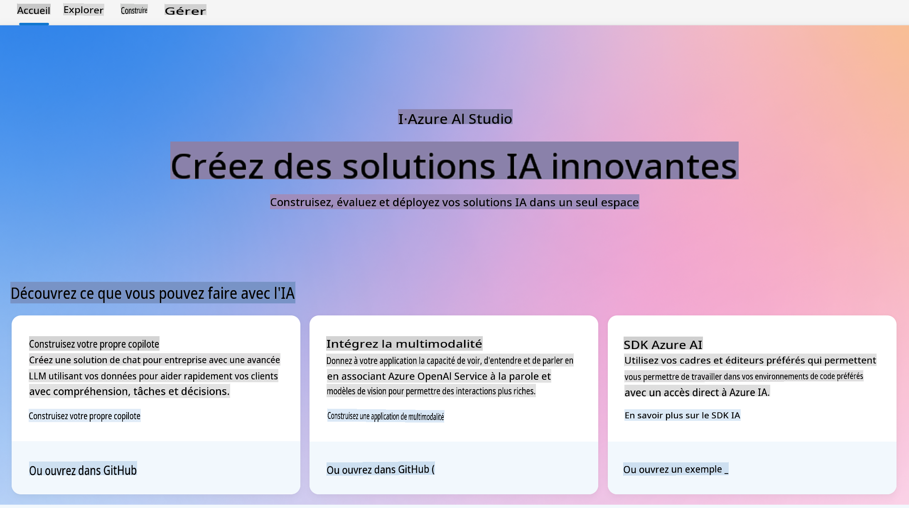
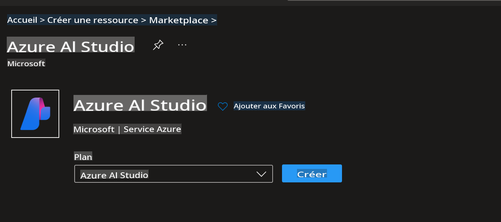
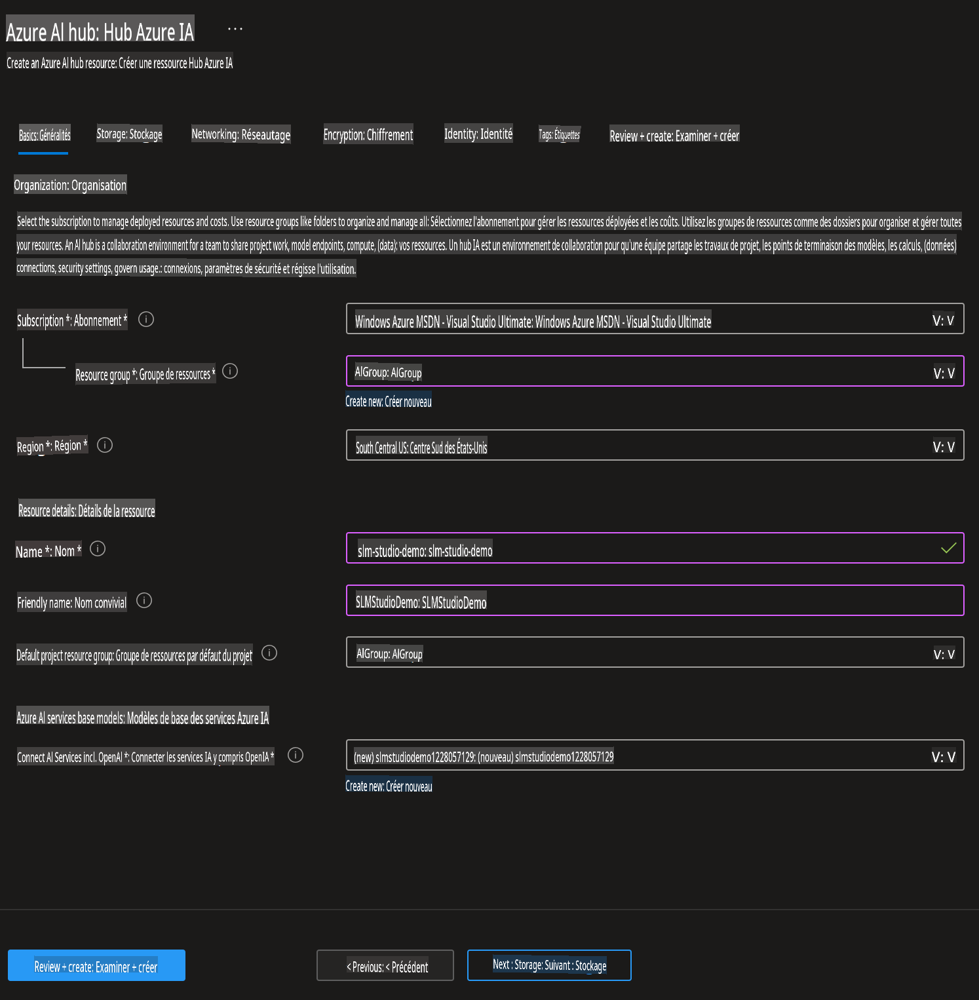
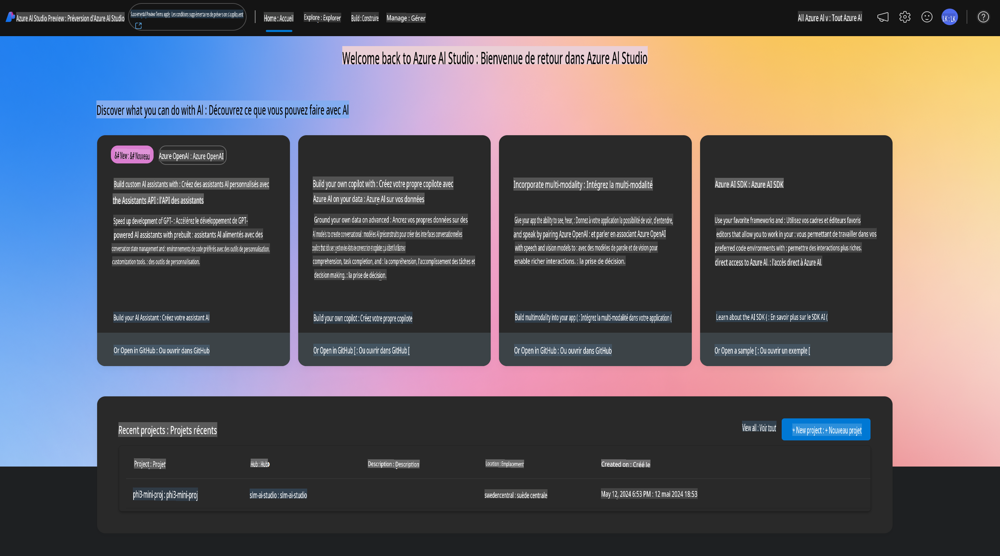
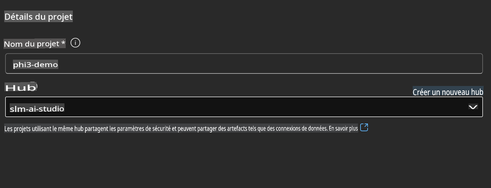
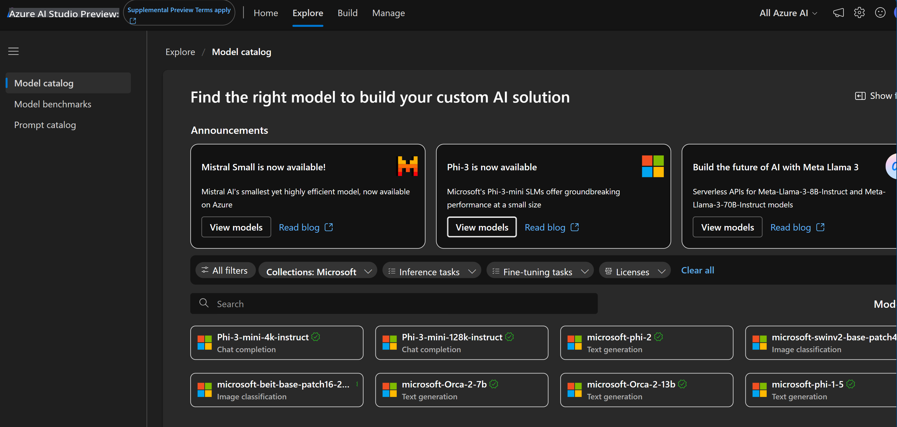
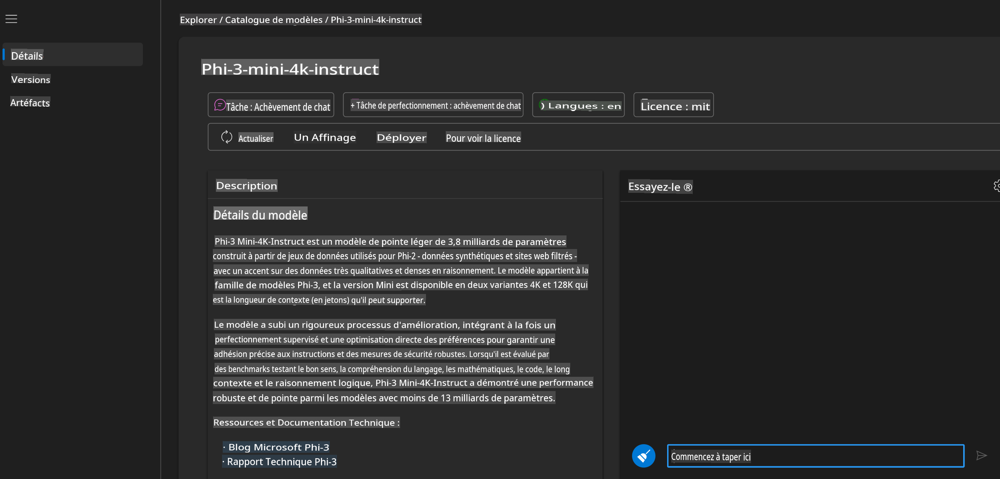
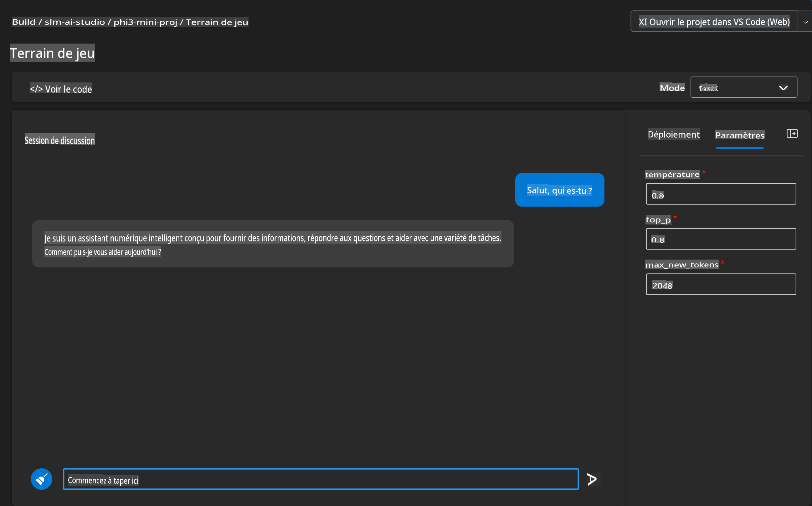
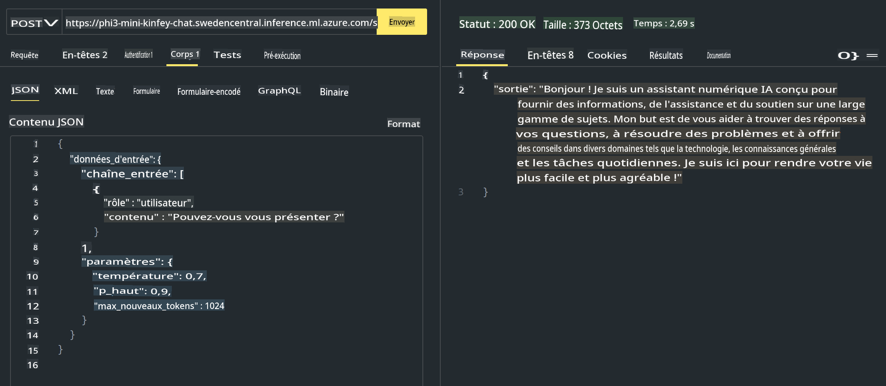

# **Utilisation de Phi-3 dans Azure AI Studio**

Avec le développement de l'IA générative, nous espérons utiliser une plateforme unifiée pour gérer différents LLM et SLM, l'intégration des données d'entreprise, les opérations de fine-tuning/RAG, et l'évaluation des différentes activités de l'entreprise après l'intégration des LLM et SLM, etc., afin que les applications intelligentes de l'IA générative soient mieux mises en œuvre. [Azure AI Studio](https://ai.azure.com) est une plateforme d'application d'IA générative de niveau entreprise.



Avec Azure AI Studio, vous pouvez évaluer les réponses des modèles de langage large (LLM) et orchestrer les composants d'application de prompt avec prompt flow pour de meilleures performances. La plateforme facilite l'évolutivité pour transformer les preuves de concept en production complète en toute simplicité. La surveillance continue et le raffinement soutiennent le succès à long terme.

Nous pouvons déployer rapidement le modèle Phi-3 sur Azure AI Studio en quelques étapes simples, puis utiliser Azure AI Studio pour compléter les travaux liés à Phi-3 tels que Playground/Chat, le fine-tuning, l'évaluation et autres.

## **1. Préparation**

## [AZD AI Studio Starter Template](https://azure.github.io/awesome-azd/?name=AI+Studio)

### Azure AI Studio Starter

Il s'agit d'un modèle Bicep qui déploie tout ce dont vous avez besoin pour commencer avec Azure AI Studio. Comprend AI Hub avec des ressources dépendantes, un projet AI, des services AI et un point de terminaison en ligne.

### Utilisation rapide

Si vous avez déjà le [Azure Developer CLI](https://learn.microsoft.com/azure/developer/azure-developer-cli/overview?WT.mc_id=aiml-138114-kinfeylo) installé sur votre machine, utiliser ce modèle est aussi simple que de lancer cette commande dans un nouveau répertoire.

### Commande Terminal

```bash
azd init -t azd-aistudio-starter
```

Ou
Si vous utilisez l'extension azd pour VS Code, vous pouvez coller cette URL dans le terminal de commande de VS Code.

### URL Terminal

```bash
azd-aistudio-starter
```

## Création manuelle

Créez Azure AI Studio sur [Azure Portal](https://portal.azure.com?WT.mc_id=aiml-138114-kinfeylo)



Après avoir complété la nomination du studio et défini la région, vous pouvez le créer.



Après une création réussie, vous pouvez accéder au studio que vous avez créé via [ai.azure.com](https://ai.azure.com/)



Il peut y avoir plusieurs projets sur un AI Studio. Créez un projet dans AI Studio pour préparer.



## **2. Déployer le modèle Phi-3 dans Azure AI Studio**

Cliquez sur l'option Explorer du projet pour entrer dans le Catalogue de Modèles et sélectionnez Phi-3



Sélectionnez Phi-3-mini-4k-instruct



Cliquez sur 'Deploy' pour déployer le modèle Phi-3-mini-4k-instruct

> [!NOTE]
>
> Vous pouvez sélectionner la puissance de calcul lors du déploiement

## **3. Playground Chat Phi-3 dans Azure AI Studio**

Allez sur la page de déploiement, sélectionnez Playground, et discutez avec Phi-3 d'Azure AI Studio



## **4. Déployer le modèle depuis Azure AI Studio**

Pour déployer un modèle depuis le Catalogue de Modèles Azure, vous pouvez suivre ces étapes :

- Connectez-vous à Azure AI Studio.
- Choisissez le modèle que vous souhaitez déployer depuis le catalogue de modèles Azure AI Studio.
- Sur la page Détails du modèle, sélectionnez Deploy puis sélectionnez Serverless API avec Azure AI Content Safety.
- Sélectionnez le projet dans lequel vous souhaitez déployer vos modèles. Pour utiliser l'offre Serverless API, votre workspace doit appartenir à la région East US 2 ou Sweden Central. Vous pouvez personnaliser le nom du déploiement.
- Sur l'assistant de déploiement, sélectionnez les Prix et conditions pour en savoir plus sur les prix et les conditions d'utilisation.
- Sélectionnez Deploy. Attendez que le déploiement soit prêt et que vous soyez redirigé vers la page des Déploiements.
- Sélectionnez Open in playground pour commencer à interagir avec le modèle.
- Vous pouvez retourner à la page des Déploiements, sélectionner le déploiement, et noter l'URL cible du point de terminaison et la clé secrète, que vous pouvez utiliser pour appeler le déploiement et générer des complétions.
- Vous pouvez toujours trouver les détails du point de terminaison, l'URL et les clés d'accès en naviguant vers l'onglet Build et en sélectionnant Deployments dans la section Components.

> [!NOTE]
> Veuillez noter que votre compte doit disposer des permissions du rôle Azure AI Developer sur le groupe de ressources pour effectuer ces étapes.

## **5. Utilisation de l'API Phi-3 dans Azure AI Studio**

Vous pouvez accéder à https://{Your project name}.region.inference.ml.azure.com/swagger.json via Postman GET et le combiner avec Key pour en savoir plus sur les interfaces fournies.


comme accéder à l'API de score


Vous pouvez obtenir très facilement les paramètres de la requête, ainsi que les paramètres de réponse. Voici le résultat de Postman.



Avertissement : La traduction a été réalisée à partir de l'original par un modèle d'IA et peut ne pas être parfaite. 
Veuillez examiner le résultat et apporter les corrections nécessaires.