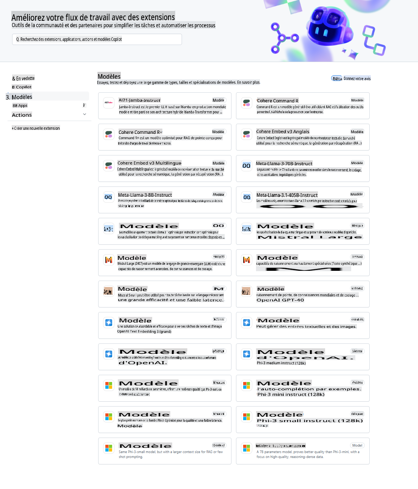
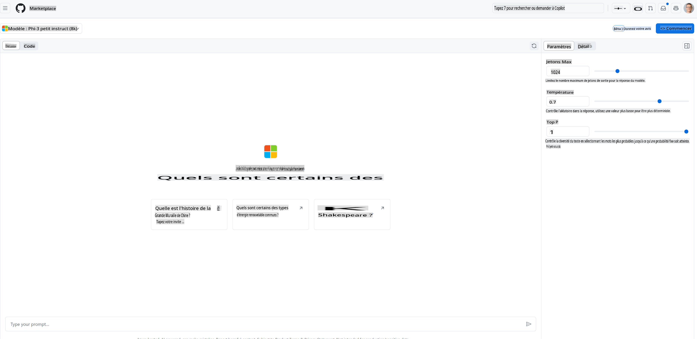
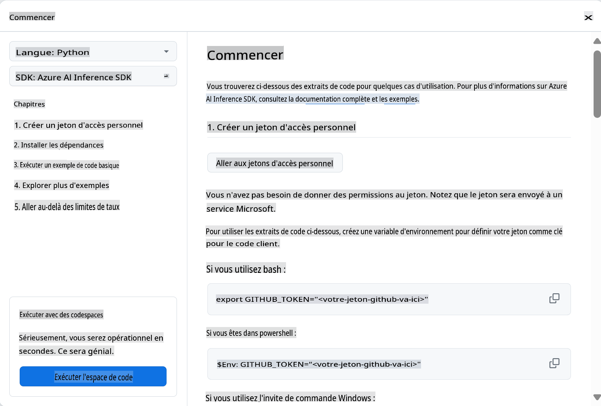
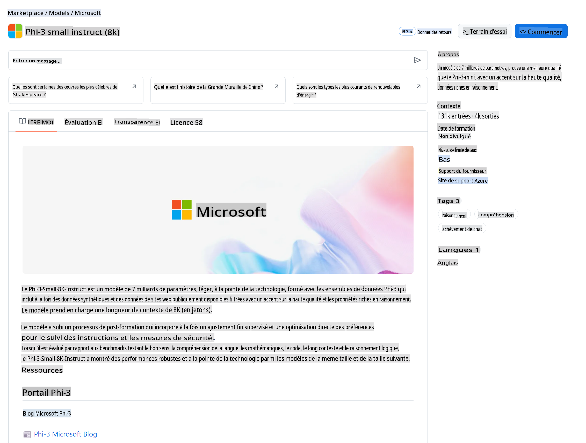

## Modèles GitHub - Bêta Publique Limitée

Bienvenue sur [GitHub Models](https://github.com/marketplace/models) ! Nous avons tout préparé pour que vous puissiez explorer les modèles d'IA hébergés sur Azure AI.



Pour plus d'informations sur les modèles disponibles sur GitHub Models, consultez le [GitHub Model Marketplace](https://github.com/marketplace/models).

## Modèles Disponibles

Chaque modèle dispose d'un espace de jeu dédié et de code d'exemple.



### Modèles Phi-3 dans le catalogue des modèles GitHub

[Phi-3-Medium-128k-Instruct](https://github.com/marketplace/models/azureml/Phi-3-medium-128k-instruct)

[Phi-3-medium-4k-instruct](https://github.com/marketplace/models/azureml/Phi-3-medium-4k-instruct)

[Phi-3-mini-128k-instruct](https://github.com/marketplace/models/azureml/Phi-3-mini-128k-instruct)

[Phi-3-mini-4k-instruct](https://github.com/marketplace/models/azureml/Phi-3-mini-4k-instruct)

[Phi-3-small-128k-instruct](https://github.com/marketplace/models/azureml/Phi-3-small-128k-instruct)

[Phi-3-small-8k-instruct](https://github.com/marketplace/models/azureml/Phi-3-small-8k-instruct)

## Commencer

Quelques exemples de base sont prêts à être exécutés. Vous pouvez les trouver dans le répertoire des exemples. Si vous souhaitez passer directement à votre langage préféré, vous pouvez trouver les exemples dans les langages suivants :

- Python
- JavaScript
- cURL

Il existe également un environnement Codespaces dédié pour exécuter les exemples et les modèles.



## Code d'Exemple

Ci-dessous se trouvent des extraits de code pour quelques cas d'utilisation. Pour plus d'informations sur Azure AI Inference SDK, consultez la documentation complète et les exemples.

## Configuration

1. Créer un jeton d'accès personnel
Vous n'avez pas besoin de donner des permissions au jeton. Notez que le jeton sera envoyé à un service Microsoft.

Pour utiliser les extraits de code ci-dessous, créez une variable d'environnement pour définir votre jeton comme clé pour le code client.

Si vous utilisez bash :
```
export GITHUB_TOKEN="<your-github-token-goes-here>"
```
Si vous êtes dans powershell :

```
$Env:GITHUB_TOKEN="<your-github-token-goes-here>"
```

Si vous utilisez l'invite de commande Windows :

```
set GITHUB_TOKEN=<your-github-token-goes-here>
```

## Exemple Python

### Installer les dépendances
Installez le SDK Azure AI Inference en utilisant pip (Nécessite : Python >=3.8) :

```
pip install azure-ai-inference
```
### Exécuter un exemple de code de base

Cet exemple démontre un appel de base à l'API de complétion de chat. Il utilise le point de terminaison d'inférence du modèle AI de GitHub et votre jeton GitHub. L'appel est synchrone.

```
import os
from azure.ai.inference import ChatCompletionsClient
from azure.ai.inference.models import SystemMessage, UserMessage
from azure.core.credentials import AzureKeyCredential

endpoint = "https://models.inference.ai.azure.com"
# Replace Model_Name 
model_name = "Phi-3-small-8k-instruct"
token = os.environ["GITHUB_TOKEN"]

client = ChatCompletionsClient(
    endpoint=endpoint,
    credential=AzureKeyCredential(token),
)

response = client.complete(
    messages=[
        SystemMessage(content="You are a helpful assistant."),
        UserMessage(content="What is the capital of France?"),
    ],
    model=model_name,
    temperature=1.,
    max_tokens=1000,
    top_p=1.
)

print(response.choices[0].message.content)
```

### Exécuter une conversation à plusieurs tours

Cet exemple démontre une conversation à plusieurs tours avec l'API de complétion de chat. Lors de l'utilisation du modèle pour une application de chat, vous devrez gérer l'historique de cette conversation et envoyer les derniers messages au modèle.

```
import os
from azure.ai.inference import ChatCompletionsClient
from azure.ai.inference.models import AssistantMessage, SystemMessage, UserMessage
from azure.core.credentials import AzureKeyCredential

token = os.environ["GITHUB_TOKEN"]
endpoint = "https://models.inference.ai.azure.com"
# Replace Model_Name
model_name = "Phi-3-small-8k-instruct"

client = ChatCompletionsClient(
    endpoint=endpoint,
    credential=AzureKeyCredential(token),
)

messages = [
    SystemMessage(content="You are a helpful assistant."),
    UserMessage(content="What is the capital of France?"),
    AssistantMessage(content="The capital of France is Paris."),
    UserMessage(content="What about Spain?"),
]

response = client.complete(messages=messages, model=model_name)

print(response.choices[0].message.content)
```

### Diffuser la sortie

Pour une meilleure expérience utilisateur, vous voudrez diffuser la réponse du modèle afin que le premier jeton apparaisse rapidement et que vous évitiez d'attendre de longues réponses.

```
import os
from azure.ai.inference import ChatCompletionsClient
from azure.ai.inference.models import SystemMessage, UserMessage
from azure.core.credentials import AzureKeyCredential

token = os.environ["GITHUB_TOKEN"]
endpoint = "https://models.inference.ai.azure.com"
# Replace Model_Name
model_name = "Phi-3-small-8k-instruct"

client = ChatCompletionsClient(
    endpoint=endpoint,
    credential=AzureKeyCredential(token),
)

response = client.complete(
    stream=True,
    messages=[
        SystemMessage(content="You are a helpful assistant."),
        UserMessage(content="Give me 5 good reasons why I should exercise every day."),
    ],
    model=model_name,
)

for update in response:
    if update.choices:
        print(update.choices[0].delta.content or "", end="")

client.close()
```

## JavaScript

### Installer les dépendances

Installez Node.js.

Copiez les lignes de texte suivantes et enregistrez-les sous forme de fichier package.json dans votre dossier.

```
{
  "type": "module",
  "dependencies": {
    "@azure-rest/ai-inference": "latest",
    "@azure/core-auth": "latest",
    "@azure/core-sse": "latest"
  }
}
```

Note : @azure/core-sse est uniquement nécessaire lorsque vous diffusez la réponse des complétions de chat.

Ouvrez une fenêtre de terminal dans ce dossier et exécutez npm install.

Pour chacun des extraits de code ci-dessous, copiez le contenu dans un fichier sample.js et exécutez-le avec node sample.js.

### Exécuter un exemple de code de base

Cet exemple démontre un appel de base à l'API de complétion de chat. Il utilise le point de terminaison d'inférence du modèle AI de GitHub et votre jeton GitHub. L'appel est synchrone.

```
import ModelClient from "@azure-rest/ai-inference";
import { AzureKeyCredential } from "@azure/core-auth";

const token = process.env["GITHUB_TOKEN"];
const endpoint = "https://models.inference.ai.azure.com";
// Update your modelname
const modelName = "Phi-3-small-8k-instruct";

export async function main() {

  const client = new ModelClient(endpoint, new AzureKeyCredential(token));

  const response = await client.path("/chat/completions").post({
    body: {
      messages: [
        { role:"system", content: "You are a helpful assistant." },
        { role:"user", content: "What is the capital of France?" }
      ],
      model: modelName,
      temperature: 1.,
      max_tokens: 1000,
      top_p: 1.
    }
  });

  if (response.status !== "200") {
    throw response.body.error;
  }
  console.log(response.body.choices[0].message.content);
}

main().catch((err) => {
  console.error("The sample encountered an error:", err);
});
```

### Exécuter une conversation à plusieurs tours

Cet exemple démontre une conversation à plusieurs tours avec l'API de complétion de chat. Lors de l'utilisation du modèle pour une application de chat, vous devrez gérer l'historique de cette conversation et envoyer les derniers messages au modèle.

```
import ModelClient from "@azure-rest/ai-inference";
import { AzureKeyCredential } from "@azure/core-auth";

const token = process.env["GITHUB_TOKEN"];
const endpoint = "https://models.inference.ai.azure.com";
// Update your modelname
const modelName = "Phi-3-small-8k-instruct";

export async function main() {

  const client = new ModelClient(endpoint, new AzureKeyCredential(token));

  const response = await client.path("/chat/completions").post({
    body: {
      messages: [
        { role: "system", content: "You are a helpful assistant." },
        { role: "user", content: "What is the capital of France?" },
        { role: "assistant", content: "The capital of France is Paris." },
        { role: "user", content: "What about Spain?" },
      ],
      model: modelName,
    }
  });

  if (response.status !== "200") {
    throw response.body.error;
  }

  for (const choice of response.body.choices) {
    console.log(choice.message.content);
  }
}

main().catch((err) => {
  console.error("The sample encountered an error:", err);
});
```

### Diffuser la sortie
Pour une meilleure expérience utilisateur, vous voudrez diffuser la réponse du modèle afin que le premier jeton apparaisse rapidement et que vous évitiez d'attendre de longues réponses.

```
import ModelClient from "@azure-rest/ai-inference";
import { AzureKeyCredential } from "@azure/core-auth";
import { createSseStream } from "@azure/core-sse";

const token = process.env["GITHUB_TOKEN"];
const endpoint = "https://models.inference.ai.azure.com";
// Update your modelname
const modelName = "Phi-3-small-8k-instruct";

export async function main() {

  const client = new ModelClient(endpoint, new AzureKeyCredential(token));

  const response = await client.path("/chat/completions").post({
    body: {
      messages: [
        { role: "system", content: "You are a helpful assistant." },
        { role: "user", content: "Give me 5 good reasons why I should exercise every day." },
      ],
      model: modelName,
      stream: true
    }
  }).asNodeStream();

  const stream = response.body;
  if (!stream) {
    throw new Error("The response stream is undefined");
  }

  if (response.status !== "200") {
    stream.destroy();
    throw new Error(`Failed to get chat completions, http operation failed with ${response.status} code`);
  }

  const sseStream = createSseStream(stream);

  for await (const event of sseStream) {
    if (event.data === "[DONE]") {
      return;
    }
    for (const choice of (JSON.parse(event.data)).choices) {
        process.stdout.write(choice.delta?.content ?? ``);
    }
  }
}

main().catch((err) => {
  console.error("The sample encountered an error:", err);
});
```

## REST

### Exécuter un exemple de code de base

Collez ce qui suit dans un shell :

```
curl -X POST "https://models.inference.ai.azure.com/chat/completions" \
    -H "Content-Type: application/json" \
    -H "Authorization: Bearer $GITHUB_TOKEN" \
    -d '{
        "messages": [
            {
                "role": "system",
                "content": "You are a helpful assistant."
            },
            {
                "role": "user",
                "content": "What is the capital of France?"
            }
        ],
        "model": "Phi-3-small-8k-instruct"
    }'
```

### Exécuter une conversation à plusieurs tours

Appelez l'API de complétion de chat et passez l'historique du chat :

```
curl -X POST "https://models.inference.ai.azure.com/chat/completions" \
    -H "Content-Type: application/json" \
    -H "Authorization: Bearer $GITHUB_TOKEN" \
    -d '{
        "messages": [
            {
                "role": "system",
                "content": "You are a helpful assistant."
            },
            {
                "role": "user",
                "content": "What is the capital of France?"
            },
            {
                "role": "assistant",
                "content": "The capital of France is Paris."
            },
            {
                "role": "user",
                "content": "What about Spain?"
            }
        ],
        "model": "Phi-3-small-8k-instruct"
    }'
```

### Diffuser la sortie

Voici un exemple d'appel du point de terminaison et de diffusion de la réponse.

```
curl -X POST "https://models.inference.ai.azure.com/chat/completions" \
    -H "Content-Type: application/json" \
    -H "Authorization: Bearer $GITHUB_TOKEN" \
    -d '{
        "messages": [
            {
                "role": "system",
                "content": "You are a helpful assistant."
            },
            {
                "role": "user",
                "content": "Give me 5 good reasons why I should exercise every day."
            }
        ],
        "stream": true,
        "model": "Phi-3-small-8k-instruct"
    }'
```

## Utilisation GRATUITE et limites de taux pour les modèles GitHub



Les [limites de taux pour l'espace de jeu et l'utilisation gratuite de l'API](https://docs.github.com/en/github-models/prototyping-with-ai-models#rate-limits) sont destinées à vous aider à expérimenter avec les modèles et à prototyper votre application d'IA. Pour une utilisation au-delà de ces limites et pour faire passer votre application à l'échelle, vous devez provisionner des ressources à partir d'un compte Azure et vous authentifier à partir de là au lieu de votre jeton d'accès personnel GitHub. Vous n'avez pas besoin de changer quoi que ce soit d'autre dans votre code. Utilisez ce lien pour découvrir comment aller au-delà des limites de la version gratuite dans Azure AI.

### Divulgations

Rappelez-vous qu'en interagissant avec un modèle, vous expérimentez avec l'IA, donc des erreurs de contenu sont possibles.

La fonctionnalité est soumise à diverses limites (y compris les demandes par minute, les demandes par jour, les jetons par demande et les demandes concurrentes) et n'est pas conçue pour des cas d'utilisation en production.

GitHub Models utilise Azure AI Content Safety. Ces filtres ne peuvent pas être désactivés dans le cadre de l'expérience GitHub Models. Si vous décidez d'utiliser des modèles via un service payant, veuillez configurer vos filtres de contenu pour répondre à vos besoins.

Ce service est soumis aux conditions préalables de GitHub.

**Avertissement**:
Ce document a été traduit en utilisant des services de traduction automatique basés sur l'intelligence artificielle. Bien que nous nous efforcions d'assurer l'exactitude, veuillez noter que les traductions automatiques peuvent contenir des erreurs ou des inexactitudes. Le document original dans sa langue native doit être considéré comme la source faisant autorité. Pour des informations critiques, il est recommandé de faire appel à une traduction humaine professionnelle. Nous ne sommes pas responsables des malentendus ou des interprétations erronées résultant de l'utilisation de cette traduction.