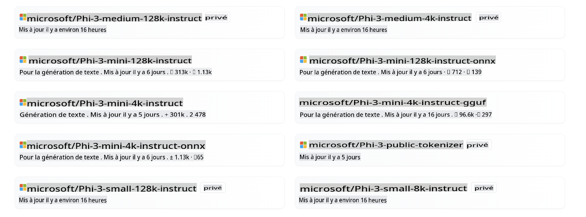
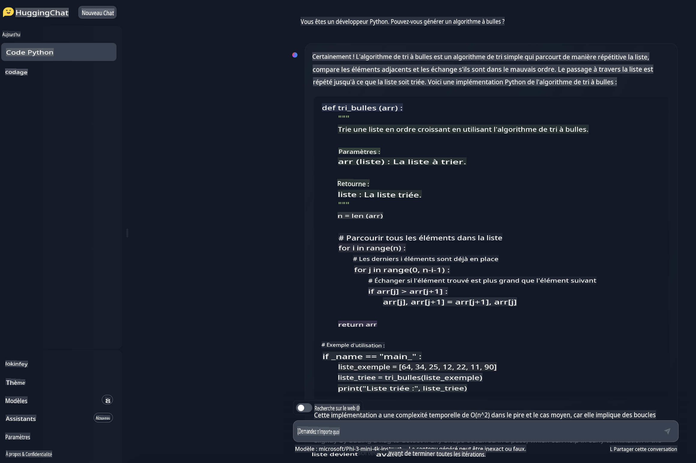

# **Utilisation de Phi-3 sur Hugging Face**

[Hugging Face](https://huggingface.co/) est une communauté d'IA très populaire avec des données riches et des ressources de modèles open source. Différents fabricants publient des LLM et SLM open source via Hugging Face, tels que Microsoft, Meta, Mistral, Apple, Google, etc.



Microsoft Phi-3 a été publié sur Hugging Face. Les développeurs peuvent télécharger le modèle Phi-3 correspondant en fonction des scénarios et des besoins métiers. En plus de déployer les modèles Phi-3 Pytorch sur Hugging Face, nous avons également publié des modèles quantifiés, utilisant les formats GGUF et ONNX pour offrir un choix aux utilisateurs finaux.


## **1. Télécharger Phi-3 depuis Hugging Face**

```bash

git lfs install 

git clone https://huggingface.co/microsoft/Phi-3-mini-4k-instruct

```

## **2. En savoir plus sur le modèle de prompt de Phi-3**

Il existe un modèle de données spécifique lors de l'entraînement de Phi-3, donc lors de l'utilisation de Phi-3, l'envoi de prompts doit être configuré via le modèle. Pendant le fine-tuning, les données doivent également être étendues selon le modèle.

Le modèle a trois rôles, y compris le système, l'utilisateur et l'assistant.

```txt

<|system|>
Your Role<|end|>
<|user|>
Your Question?<|end|>
<|assistant|>

```

par exemple

```txt

<|system|>
Your are a python developer.<|end|>
<|user|>
Help me generate a bubble algorithm<|end|>
<|assistant|>

```

## **3. Inferences Phi-3 avec Python**

Les inferences avec Phi-3 font référence au processus d'utilisation des modèles Phi-3 pour générer des prédictions ou des sorties basées sur des données d'entrée. Les modèles Phi-3 sont une famille de petits modèles de langage (SLM) qui incluent des variantes comme Phi-3-Mini, Phi-3-Small et Phi-3-Medium, chacun conçu pour différents scénarios d'application et avec des tailles de paramètres variées. Ces modèles ont été entraînés sur des données de haute qualité et sont affinés pour les capacités de chat, l'alignement, la robustesse et la sécurité. Ils peuvent être déployés sur des plateformes edge et cloud en utilisant ONNX et TensorFlow Lite, et sont développés conformément aux principes d'IA responsable de Microsoft.

Par exemple, le Phi-3-Mini est un modèle léger et de pointe avec 3,8 milliards de paramètres, adapté aux prompts utilisant le format de chat et supportant une longueur de contexte allant jusqu'à 128K tokens. C'est le premier modèle de sa catégorie de poids à supporter un contexte aussi long.

Les modèles Phi-3 sont disponibles sur des plateformes comme Azure AI MaaS, HuggingFace, NVIDIA, Ollama, ONNX, et peuvent être utilisés pour une variété d'applications, y compris les interactions en temps réel, les systèmes autonomes et les applications nécessitant une faible latence.

Il existe de nombreuses façons de référencer Phi-3. Vous pouvez utiliser différents langages de programmation pour référencer le modèle.

Voici un exemple en Python.

```python

import torch
from transformers import AutoModelForCausalLM, AutoTokenizer, pipeline

torch.random.manual_seed(0)

model = AutoModelForCausalLM.from_pretrained(
    "microsoft/Phi-3-mini-4k-instruct", 
    device_map="cuda", 
    torch_dtype="auto", 
    trust_remote_code=True, 
)
tokenizer = AutoTokenizer.from_pretrained("microsoft/Phi-3-mini-4k-instruct")

messages = [
    {"role": "system", "content": "Your are a python developer."},
    {"role": "user", "content": "Help me generate a bubble algorithm"},
]

pipe = pipeline(
    "text-generation",
    model=model,
    tokenizer=tokenizer,
)

generation_args = {
    "max_new_tokens": 600,
    "return_full_text": False,
    "temperature": 0.3,
    "do_sample": False,
}

output = pipe(messages, **generation_args)
print(output[0]['generated_text'])


```

> [!NOTE]
> Vous pouvez vérifier si ce résultat est cohérent avec celui que vous aviez en tête

## **4. Inferences Phi-3 avec C#**

Voici un exemple dans une application console .NET.

Le projet C# doit ajouter les packages suivants :

```bash
dotnet add package Microsoft.ML.OnnxRuntime --version 1.18.0
dotnet add package Microsoft.ML.OnnxRuntimeGenAI --version 0.3.0-rc2
dotnet add package Microsoft.ML.OnnxRuntimeGenAI.Cuda --version 0.3.0-rc2
```

Voici le code C#.

```csharp
using System;
using Microsoft.ML.OnnxRuntimeGenAI;


// folder location of the ONNX model file
var modelPath = @"..\models\Phi-3-mini-4k-instruct-onnx";
var model = new Model(modelPath);
var tokenizer = new Tokenizer(model);

var systemPrompt = "You are an AI assistant that helps people find information. Answer questions using a direct style. Do not share more information that the requested by the users.";

// chat start
Console.WriteLine(@"Ask your question. Type an empty string to Exit.");


// chat loop
while (true)
{
    // Get user question
    Console.WriteLine();
    Console.Write(@"Q: ");
    var userQ = Console.ReadLine();    
    if (string.IsNullOrEmpty(userQ))
    {
        break;
    }

    // show phi3 response
    Console.Write("Phi3: ");
    var fullPrompt = $"<|system|>{systemPrompt}<|end|><|user|>{userQ}<|end|><|assistant|>";
    var tokens = tokenizer.Encode(fullPrompt);

    var generatorParams = new GeneratorParams(model);
    generatorParams.SetSearchOption("max_length", 2048);
    generatorParams.SetSearchOption("past_present_share_buffer", false);
    generatorParams.SetInputSequences(tokens);

    var generator = new Generator(model, generatorParams);
    while (!generator.IsDone())
    {
        generator.ComputeLogits();
        generator.GenerateNextToken();
        var outputTokens = generator.GetSequence(0);
        var newToken = outputTokens.Slice(outputTokens.Length - 1, 1);
        var output = tokenizer.Decode(newToken);
        Console.Write(output);
    }
    Console.WriteLine();
}
```

La démo en cours d'exécution est similaire à celle-ci :


***Remarque:** il y a une faute de frappe dans la première question, Phi-3 est suffisamment intelligent pour partager la bonne réponse !*

## **5. Utiliser Phi-3 dans le chat Hugging Face**

Le chat Hugging Face offre une expérience liée. Entrez [ici pour essayer le chat Phi-3](https://huggingface.co/chat/models/microsoft/Phi-3-mini-4k-instruct) dans votre navigateur pour l'expérimenter.



**Avertissement**:
Ce document a été traduit en utilisant des services de traduction basés sur l'IA. Bien que nous nous efforcions d'assurer l'exactitude, veuillez noter que les traductions automatisées peuvent contenir des erreurs ou des inexactitudes. Le document original dans sa langue d'origine doit être considéré comme la source faisant autorité. Pour des informations critiques, une traduction humaine professionnelle est recommandée. Nous ne sommes pas responsables des malentendus ou des interprétations erronées résultant de l'utilisation de cette traduction.