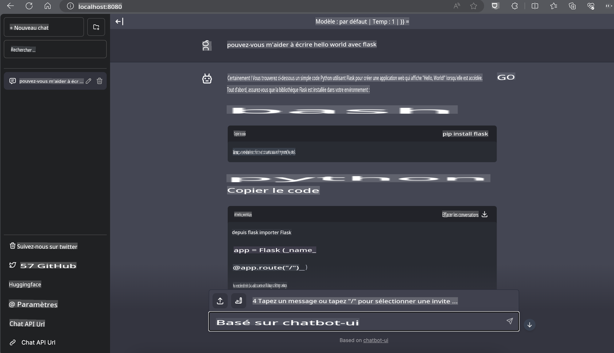

# **Inférence Phi-3 sur Nvidia Jetson**

Nvidia Jetson est une série de cartes informatiques embarquées de Nvidia. Les modèles Jetson TK1, TX1 et TX2 sont tous équipés d'un processeur Tegra (ou SoC) de Nvidia qui intègre une unité centrale de traitement (CPU) à architecture ARM. Jetson est un système à faible consommation d'énergie conçu pour accélérer les applications d'apprentissage automatique. Nvidia Jetson est utilisé par les développeurs professionnels pour créer des produits d'IA révolutionnaires dans tous les secteurs, et par les étudiants et les passionnés pour l'apprentissage pratique de l'IA et la réalisation de projets étonnants. SLM est déployé dans des appareils périphériques tels que Jetson, ce qui permettra une meilleure mise en œuvre des scénarios d'application industrielle de l'IA générative.

## Déploiement sur NVIDIA Jetson :
Les développeurs travaillant sur la robotique autonome et les appareils embarqués peuvent tirer parti de Phi-3 Mini. La taille relativement petite de Phi-3 le rend idéal pour le déploiement en périphérie. Les paramètres ont été méticuleusement ajustés pendant l'entraînement, garantissant une grande précision dans les réponses.

### Optimisation TensorRT-LLM :
La [bibliothèque TensorRT-LLM de NVIDIA](https://github.com/NVIDIA/TensorRT-LLM?WT.mc_id=aiml-138114-kinfeylo) optimise l'inférence des grands modèles de langage. Elle prend en charge la longue fenêtre contextuelle de Phi-3 Mini, améliorant à la fois le débit et la latence. Les optimisations incluent des techniques telles que LongRoPE, FP8 et le batching en vol.

### Disponibilité et Déploiement :
Les développeurs peuvent explorer Phi-3 Mini avec la fenêtre contextuelle de 128K sur [NVIDIA's AI](https://www.nvidia.com/en-us/ai-data-science/generative-ai/). Il est empaqueté sous forme de NIM NVIDIA, un microservice avec une API standard qui peut être déployé partout. De plus, les [implémentations TensorRT-LLM sur GitHub](https://github.com/NVIDIA/TensorRT-LLM).

 ## **1. Préparation**

a. Jetson Orin NX / Jetson NX

b. JetPack 5.1.2+
   
c. Cuda 11.8
   
d. Python 3.8+

 ## **2. Exécution de Phi-3 sur Jetson**

 Nous pouvons choisir [Ollama](https://ollama.com) ou [LlamaEdge](https://llamaedge.com)

 Si vous souhaitez utiliser gguf dans le cloud et les appareils périphériques en même temps, LlamaEdge peut être compris comme WasmEdge (WasmEdge est un runtime WebAssembly léger, performant et évolutif, adapté aux applications cloud natives, périphériques et décentralisées. Il prend en charge les applications serverless, les fonctions embarquées, les microservices, les contrats intelligents et les appareils IoT. Vous pouvez déployer le modèle quantitatif de gguf sur les appareils périphériques et le cloud via LlamaEdge.


Voici les étapes à suivre 

1. Installer et télécharger les bibliothèques et fichiers associés

```bash

curl -sSf https://raw.githubusercontent.com/WasmEdge/WasmEdge/master/utils/install.sh | bash -s -- --plugin wasi_nn-ggml

curl -LO https://github.com/LlamaEdge/LlamaEdge/releases/latest/download/llama-api-server.wasm

curl -LO https://github.com/LlamaEdge/chatbot-ui/releases/latest/download/chatbot-ui.tar.gz

tar xzf chatbot-ui.tar.gz

```

**Note**: llama-api-server.wasm et chatbot-ui doivent être dans le même répertoire

2. Exécuter les scripts dans le terminal

```bash

wasmedge --dir .:. --nn-preload default:GGML:AUTO:{Your gguf path} llama-api-server.wasm -p phi-3-chat

```

Voici le résultat de l'exécution



***Code d'exemple*** [Exemple de Notebook Phi-3 mini WASM](https://github.com/Azure-Samples/Phi-3MiniSamples/tree/main/wasm)

En résumé, Phi-3 Mini représente une avancée dans la modélisation du langage, combinant efficacité, conscience contextuelle et l'expertise en optimisation de NVIDIA. Que vous construisiez des robots ou des applications périphériques, Phi-3 Mini est un outil puissant à connaître.

**Avertissement** :
Ce document a été traduit en utilisant des services de traduction basés sur l'IA. Bien que nous nous efforcions d'assurer l'exactitude, veuillez noter que les traductions automatisées peuvent contenir des erreurs ou des inexactitudes. Le document original dans sa langue d'origine doit être considéré comme la source faisant autorité. Pour des informations cruciales, une traduction humaine professionnelle est recommandée. Nous ne sommes pas responsables des malentendus ou des interprétations erronées résultant de l'utilisation de cette traduction.