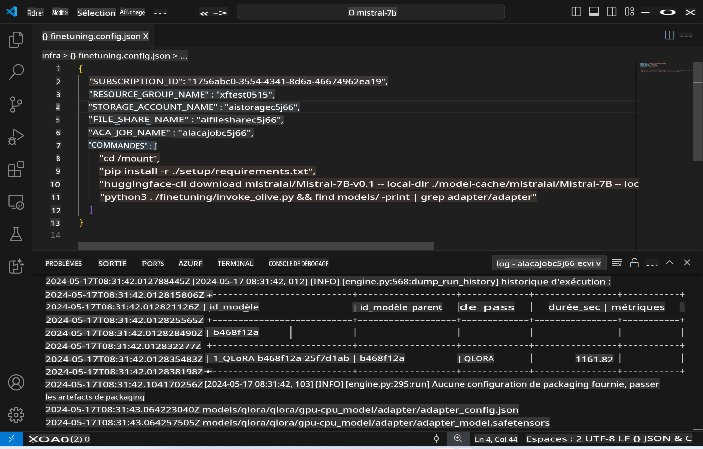
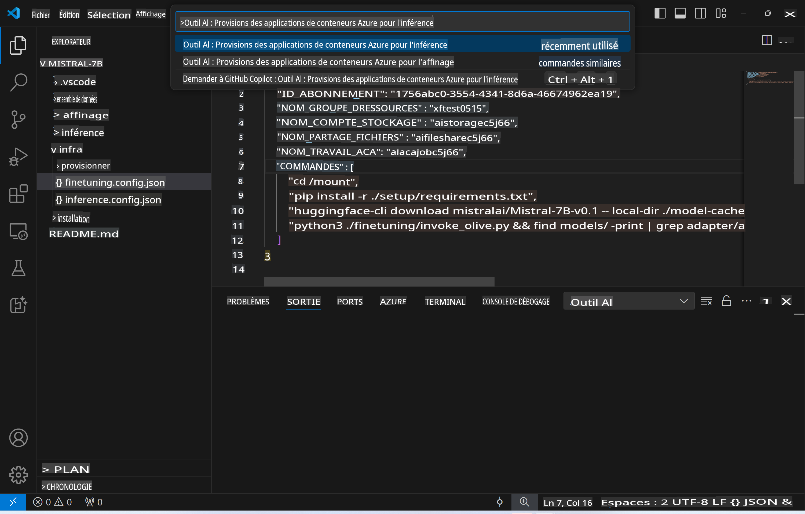
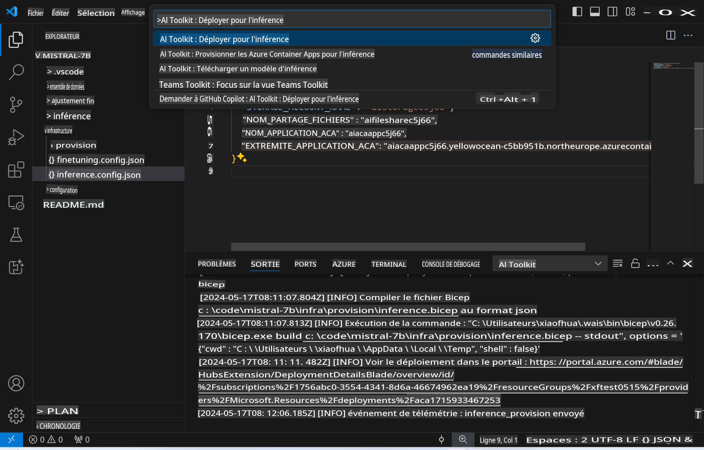
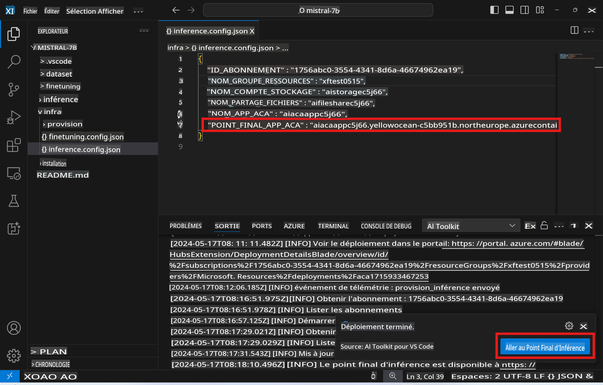

# Inférence à distance avec le modèle affiné

Après avoir entraîné les adaptateurs dans l'environnement distant, utilisez une simple application Gradio pour interagir avec le modèle.



### Provisionner les ressources Azure
Vous devez configurer les ressources Azure pour l'inférence à distance en exécutant la commande `AI Toolkit: Provision Azure Container Apps for inference` depuis la palette de commandes. Lors de cette configuration, il vous sera demandé de sélectionner votre abonnement Azure et votre groupe de ressources.  

   
Par défaut, l'abonnement et le groupe de ressources pour l'inférence doivent correspondre à ceux utilisés pour l'affinage. L'inférence utilisera le même environnement Azure Container App et accédera au modèle et à l'adaptateur de modèle stockés dans Azure Files, qui ont été générés lors de l'étape d'affinage. 

## Utilisation de l'AI Toolkit 

### Déploiement pour l'inférence  
Si vous souhaitez réviser le code d'inférence ou recharger le modèle d'inférence, veuillez exécuter la commande `AI Toolkit: Deploy for inference`. Cela synchronisera votre dernier code avec ACA et redémarrera la réplique.  



Après la réussite du déploiement, le modèle est maintenant prêt pour l'évaluation en utilisant cet endpoint.

### Accéder à l'API d'inférence

Vous pouvez accéder à l'API d'inférence en cliquant sur le bouton "*Go to Inference Endpoint*" affiché dans la notification VSCode. Alternativement, l'endpoint de l'API web peut être trouvé sous `ACA_APP_ENDPOINT` dans `./infra/inference.config.json` et dans le panneau de sortie.



> **Note:** L'endpoint d'inférence peut nécessiter quelques minutes pour devenir pleinement opérationnel.

## Composants d'inférence inclus dans le modèle
 
| Dossier | Contenu |
| ------ |--------- |
| `infra` | Contient toutes les configurations nécessaires pour les opérations à distance. |
| `infra/provision/inference.parameters.json` | Contient les paramètres pour les templates bicep, utilisés pour provisionner les ressources Azure pour l'inférence. |
| `infra/provision/inference.bicep` | Contient les templates pour provisionner les ressources Azure pour l'inférence. |
| `infra/inference.config.json` |Le fichier de configuration, généré par la commande `AI Toolkit: Provision Azure Container Apps for inference`. Il est utilisé comme entrée pour d'autres palettes de commandes à distance. |

### Utilisation de l'AI Toolkit pour configurer la provision des ressources Azure
Configurez le [AI Toolkit](https://marketplace.visualstudio.com/items?itemName=ms-windows-ai-studio.windows-ai-studio)

Provision Azure Container Apps for inference` command.

Vous pouvez trouver les paramètres de configuration dans le fichier `./infra/provision/inference.parameters.json`. Voici les détails :
| Paramètre | Description |
| --------- |------------ |
| `defaultCommands` | Ce sont les commandes pour initier une API web. |
| `maximumInstanceCount` | Ce paramètre définit la capacité maximale des instances GPU. |
| `location` | C'est l'emplacement où les ressources Azure sont provisionnées. La valeur par défaut est la même que l'emplacement du groupe de ressources choisi. |
| `storageAccountName`, `fileShareName` `acaEnvironmentName`, `acaEnvironmentStorageName`, `acaAppName`,  `acaLogAnalyticsName` | Ces paramètres sont utilisés pour nommer les ressources Azure pour la provision. Par défaut, ils seront les mêmes que le nom des ressources d'affinage. Vous pouvez entrer un nouveau nom de ressource inutilisé pour créer vos propres ressources nommées, ou vous pouvez entrer le nom d'une ressource Azure déjà existante si vous préférez utiliser celle-ci. Pour plus de détails, reportez-vous à la section [Using existing Azure Resources](#using-existing-azure-resources). |

### Utilisation des ressources Azure existantes

Par défaut, la provision d'inférence utilise le même environnement Azure Container App, le même compte de stockage, le même Azure File Share, et le même Azure Log Analytics que ceux utilisés pour l'affinage. Une application Azure Container App distincte est créée uniquement pour l'API d'inférence. 

Si vous avez personnalisé les ressources Azure lors de l'étape d'affinage ou si vous souhaitez utiliser vos propres ressources Azure existantes pour l'inférence, spécifiez leurs noms dans le fichier `./infra/inference.parameters.json`. Ensuite, exécutez la commande `AI Toolkit: Provision Azure Container Apps for inference` depuis la palette de commandes. Cela mettra à jour toutes les ressources spécifiées et créera celles qui manquent.

Par exemple, si vous avez un environnement Azure Container existant, votre fichier `./infra/finetuning.parameters.json` devrait ressembler à ceci :

```json
{
    "$schema": "https://schema.management.azure.com/schemas/2019-04-01/deploymentParameters.json#",
    "contentVersion": "1.0.0.0",
    "parameters": {
      ...
      "acaEnvironmentName": {
        "value": "<your-aca-env-name>"
      },
      "acaEnvironmentStorageName": {
        "value": null
      },
      ...
    }
  }
```

### Provision manuelle  
Si vous préférez configurer manuellement les ressources Azure, vous pouvez utiliser les fichiers bicep fournis dans les dossiers `./infra/provision`. Si vous avez déjà configuré et configuré toutes les ressources Azure sans utiliser la palette de commandes AI Toolkit, vous pouvez simplement entrer les noms des ressources dans le fichier `inference.config.json`.

Par exemple :

```json
{
  "SUBSCRIPTION_ID": "<your-subscription-id>",
  "RESOURCE_GROUP_NAME": "<your-resource-group-name>",
  "STORAGE_ACCOUNT_NAME": "<your-storage-account-name>",
  "FILE_SHARE_NAME": "<your-file-share-name>",
  "ACA_APP_NAME": "<your-aca-name>",
  "ACA_APP_ENDPOINT": "<your-aca-endpoint>"
}
```

Avertissement : La traduction a été effectuée à partir de l'original par un modèle d'IA et peut ne pas être parfaite. 
Veuillez examiner le résultat et apporter les corrections nécessaires.