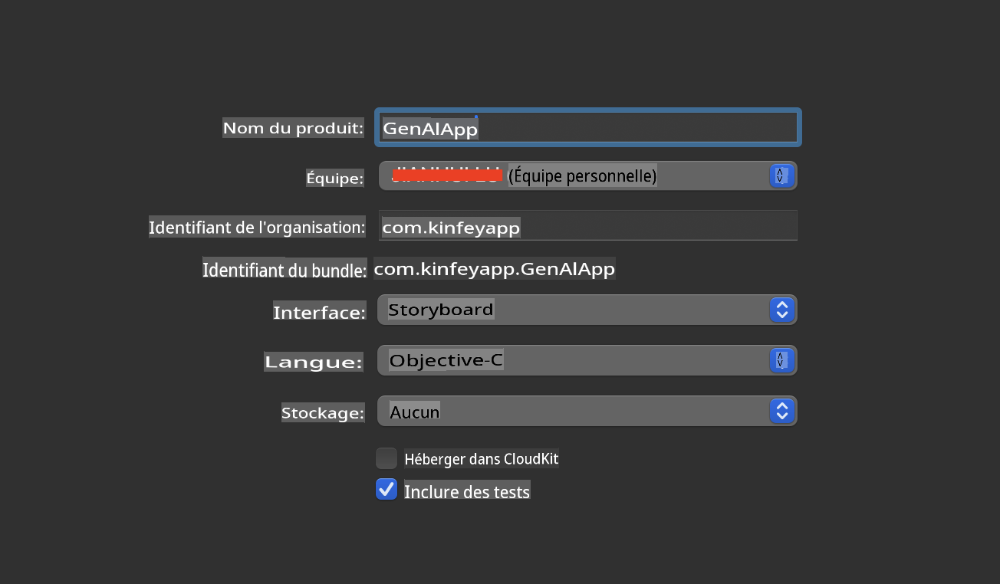

# **Inférence Phi-3 sur iOS**

Phi-3-mini est une nouvelle série de modèles de Microsoft qui permet le déploiement de Large Language Models (LLMs) sur des appareils edge et des dispositifs IoT. Phi-3-mini est disponible pour des déploiements sur iOS, Android et appareils edge, permettant ainsi de déployer l'IA générative dans des environnements BYOD. L'exemple suivant montre comment déployer Phi-3-mini sur iOS.

## **1. Préparation**

- **a.** macOS 14+
- **b.** Xcode 15+
- **c.** iOS SDK 17.x (iPhone 14 A16 ou supérieur)
- **d.** Installer Python 3.10+ (Conda est recommandé)
- **e.** Installer la bibliothèque Python : `python-flatbuffers`
- **f.** Installer CMake

### Semantic Kernel et Inférence

Semantic Kernel est un framework d'application qui permet de créer des applications compatibles avec Azure OpenAI Service, les modèles OpenAI et même des modèles locaux. Accéder aux services locaux via Semantic Kernel permet une intégration facile avec votre serveur de modèle Phi-3-mini auto-hébergé.

### Appeler des Modèles Quantifiés avec Ollama ou LlamaEdge

Beaucoup d'utilisateurs préfèrent utiliser des modèles quantifiés pour exécuter des modèles localement. [Ollama](https://ollama.com) et [LlamaEdge](https://llamaedge.com) permettent aux utilisateurs d'appeler différents modèles quantifiés :

#### **Ollama**

Vous pouvez exécuter `ollama run phi3` directement ou le configurer hors ligne. Créez un Modelfile avec le chemin vers votre fichier `gguf`. Exemple de code pour exécuter le modèle quantifié Phi-3-mini :

```gguf
FROM {Add your gguf file path}
TEMPLATE \"\"\"<|user|> .Prompt<|end|> <|assistant|>\"\"\"
PARAMETER stop <|end|>
PARAMETER num_ctx 4096
```

#### **LlamaEdge**

Si vous souhaitez utiliser `gguf` à la fois sur des appareils cloud et edge simultanément, LlamaEdge est une excellente option.

## **2. Compiler ONNX Runtime pour iOS**

```bash

git clone https://github.com/microsoft/onnxruntime.git

cd onnxruntime

./build.sh --build_shared_lib --ios --skip_tests --parallel --build_dir ./build_ios --ios --apple_sysroot iphoneos --osx_arch arm64 --apple_deploy_target 17.5 --cmake_generator Xcode --config Release

cd ../

```

### **Remarque**

- **a.** Avant de compiler, assurez-vous que Xcode est correctement configuré et définissez-le comme le répertoire de développeur actif dans le terminal :

    ```bash
    sudo xcode-select -switch /Applications/Xcode.app/Contents/Developer
    ```

- **b.** ONNX Runtime doit être compilé pour différentes plateformes. Pour iOS, vous pouvez compiler pour `arm64` or `x86_64`.

- **c.** Il est recommandé d'utiliser le dernier SDK iOS pour la compilation. Cependant, vous pouvez également utiliser une version plus ancienne si vous avez besoin de compatibilité avec des SDK précédents.

## **3. Compiler l'IA Générative avec ONNX Runtime pour iOS**

> **Note :** Comme l'IA Générative avec ONNX Runtime est en aperçu, veuillez être conscient des changements potentiels.

```bash

git clone https://github.com/microsoft/onnxruntime-genai
 
cd onnxruntime-genai
 
mkdir ort
 
cd ort
 
mkdir include
 
mkdir lib
 
cd ../
 
cp ../onnxruntime/include/onnxruntime/core/session/onnxruntime_c_api.h ort/include
 
cp ../onnxruntime/build_ios/Release/Release-iphoneos/libonnxruntime*.dylib* ort/lib
 
export OPENCV_SKIP_XCODEBUILD_FORCE_TRYCOMPILE_DEBUG=1
 
python3 build.py --parallel --build_dir ./build_ios --ios --ios_sysroot iphoneos --ios_arch arm64 --ios_deployment_target 17.5 --cmake_generator Xcode --cmake_extra_defines CMAKE_XCODE_ATTRIBUTE_CODE_SIGNING_ALLOWED=NO

```

## **4. Créer une application App dans Xcode**

J'ai choisi Objective-C comme méthode de développement de l'application, car l'utilisation de l'IA Générative avec l'API C++ d'ONNX Runtime est mieux compatible avec Objective-C. Bien sûr, vous pouvez également effectuer les appels associés via un pont Swift.



## **5. Copier le modèle quantifié INT4 ONNX dans le projet de l'application**

Nous devons importer le modèle de quantification INT4 au format ONNX, qui doit d'abord être téléchargé.


Après le téléchargement, vous devez l'ajouter au répertoire Resources du projet dans Xcode.


## **6. Ajouter l'API C++ dans ViewControllers**

> **Remarque :**

- **a.** Ajoutez les fichiers d'en-tête C++ correspondants au projet.

  

- **b.** Incluez `onnxruntime-genai` dynamic library in Xcode.

  

- **c.** Use the C Samples code for testing. You can also add additional features like ChatUI for more functionality.

- **d.** Since you need to use C++ in your project, rename `ViewController.m` to `ViewController.mm` pour activer la prise en charge d'Objective-C++.

```objc

    NSString *llmPath = [[NSBundle mainBundle] resourcePath];
    char const *modelPath = llmPath.cString;

    auto model =  OgaModel::Create(modelPath);

    auto tokenizer = OgaTokenizer::Create(*model);

    const char* prompt = "<|system|>You are a helpful AI assistant.<|end|><|user|>Can you introduce yourself?<|end|><|assistant|>";

    auto sequences = OgaSequences::Create();
    tokenizer->Encode(prompt, *sequences);

    auto params = OgaGeneratorParams::Create(*model);
    params->SetSearchOption("max_length", 100);
    params->SetInputSequences(*sequences);

    auto output_sequences = model->Generate(*params);
    const auto output_sequence_length = output_sequences->SequenceCount(0);
    const auto* output_sequence_data = output_sequences->SequenceData(0);
    auto out_string = tokenizer->Decode(output_sequence_data, output_sequence_length);
    
    auto tmp = out_string;

```

## **7. Exécuter l'application**

Une fois la configuration terminée, vous pouvez exécuter l'application pour voir les résultats de l'inférence du modèle Phi-3-mini.


Pour plus de code d'exemple et d'instructions détaillées, visitez le [dépôt des exemples Phi-3 Mini](https://github.com/Azure-Samples/Phi-3MiniSamples/tree/main/ios).

**Avertissement** :
Ce document a été traduit en utilisant des services de traduction automatique basés sur l'IA. Bien que nous nous efforcions d'assurer l'exactitude, veuillez noter que les traductions automatisées peuvent contenir des erreurs ou des inexactitudes. Le document original dans sa langue d'origine doit être considéré comme la source faisant autorité. Pour des informations cruciales, il est recommandé de faire appel à une traduction humaine professionnelle. Nous ne sommes pas responsables des malentendus ou des interprétations erronées résultant de l'utilisation de cette traduction.