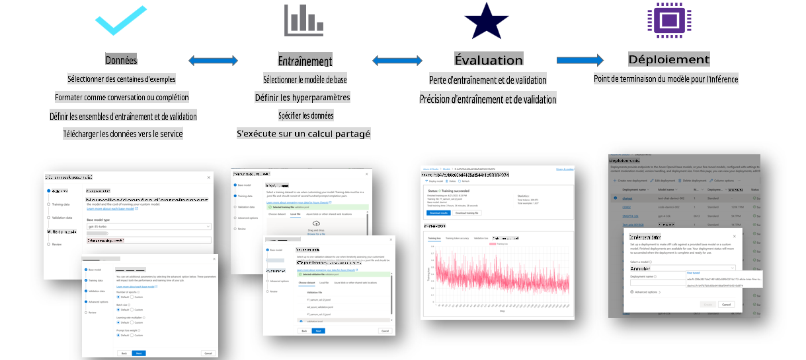
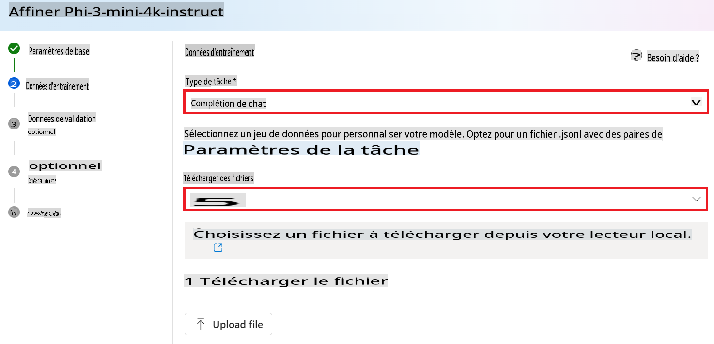
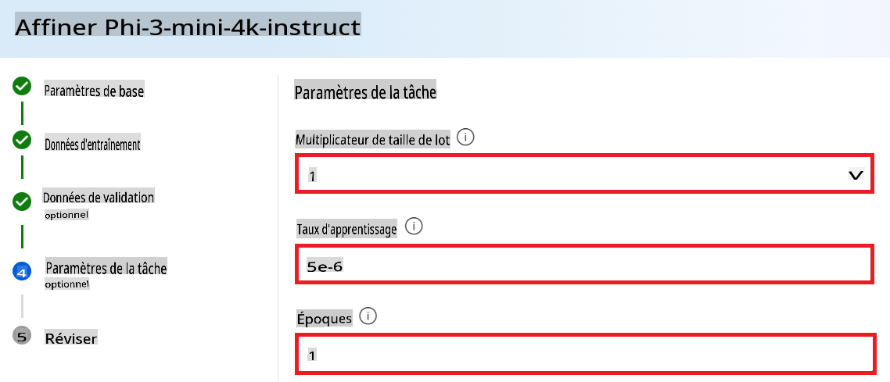
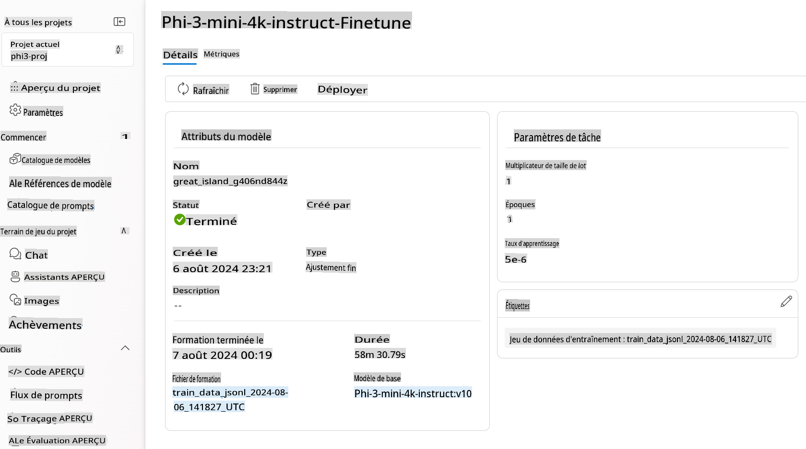

# Affiner Phi-3 avec Azure AI Foundry

 Explorons comment affiner le modèle de langage Phi-3 Mini de Microsoft en utilisant Azure AI Foundry. L'affinage vous permet d'adapter Phi-3 Mini à des tâches spécifiques, le rendant encore plus puissant et conscient du contexte.

## Considérations

- **Capacités :** Quels modèles peuvent être affinés ? Que peut faire le modèle de base après affinage ?
- **Coût :** Quel est le modèle de tarification pour l'affinage ?
- **Personnalisation :** Dans quelle mesure puis-je modifier le modèle de base et de quelles manières ?
- **Commodité :** Comment se déroule réellement l'affinage - dois-je écrire du code personnalisé ? Dois-je apporter mes propres ressources de calcul ?
- **Sécurité :** Les modèles affinés sont connus pour présenter des risques de sécurité - y a-t-il des garde-fous en place pour protéger contre les dommages involontaires ?


## Préparation à l'affinage

### Prérequis

> [!NOTE]
> Pour les modèles de la famille Phi-3, l'offre d'affinage à la demande n'est disponible qu'avec les hubs créés dans les régions **East US 2**.

- Un abonnement Azure. Si vous n'avez pas d'abonnement Azure, créez un [compte Azure payant](https://azure.microsoft.com/pricing/purchase-options/pay-as-you-go) pour commencer.

- Un [projet AI Foundry](https://ai.azure.com?WT.mc_id=aiml-138114-kinfeylo).
- Les contrôles d'accès basés sur les rôles Azure (Azure RBAC) sont utilisés pour accorder l'accès aux opérations dans Azure AI Foundry. Pour effectuer les étapes de cet article, votre compte utilisateur doit être assigné au __rôle de développeur Azure AI__ sur le groupe de ressources.

### Enregistrement du fournisseur d'abonnement

Vérifiez que l'abonnement est enregistré auprès du fournisseur de ressources `Microsoft.Network`.

1. Connectez-vous au [portail Azure](https://portal.azure.com).
1. Sélectionnez **Abonnements** dans le menu de gauche.
1. Sélectionnez l'abonnement que vous souhaitez utiliser.
1. Sélectionnez **Paramètres du projet AI** > **Fournisseurs de ressources** dans le menu de gauche.
1. Confirmez que **Microsoft.Network** figure dans la liste des fournisseurs de ressources. Sinon, ajoutez-le.

### Préparation des données

Préparez vos données d'entraînement et de validation pour affiner votre modèle. Vos ensembles de données d'entraînement et de validation doivent contenir des exemples d'entrée et de sortie pour illustrer comment vous souhaitez que le modèle fonctionne.

Assurez-vous que tous vos exemples d'entraînement suivent le format attendu pour l'inférence. Pour affiner les modèles efficacement, assurez-vous d'avoir un ensemble de données équilibré et diversifié.

Cela implique de maintenir l'équilibre des données, d'inclure divers scénarios, et de raffiner périodiquement les données d'entraînement pour s'aligner sur les attentes du monde réel, ce qui conduit finalement à des réponses de modèle plus précises et équilibrées.

Différents types de modèles nécessitent un format différent de données d'entraînement.

### Chat Completion

Les données d'entraînement et de validation que vous utilisez **doivent** être formatées sous forme de document JSON Lines (JSONL). Pour `Phi-3-mini-128k-instruct`, l'ensemble de données d'affinage doit être formaté dans le format conversationnel utilisé par l'API de complétion de chat.

### Exemple de format de fichier

```json
    {"messages": [{"role": "system", "content": "You are an Xbox customer support agent whose primary goal is to help users with issues they are experiencing with their Xbox devices. You are friendly and concise. You only provide factual answers to queries, and do not provide answers that are not related to Xbox."}, {"role": "user", "content": "Is Xbox better than PlayStation?"}, {"role": "assistant", "content": "I apologize, but I cannot provide personal opinions. My primary job is to assist you with any issues related to your Xbox device. Do you have any Xbox-related issues that need addressing?"}]}
    {"messages": [{"role": "system", "content": "You are an Xbox customer support agent whose primary goal is to help users with issues they are experiencing with their Xbox devices. You are friendly and concise. You only provide factual answers to queries, and do not provide answers that are not related to Xbox."}, {"role": "user", "content": "Can I play PC games on my Xbox?"}, {"role": "assistant", "content": "While Xbox consoles don't natively support PC games, they can play an array of Xbox games, many of which are also available on PC. Can I assist you with finding games compatible with your Xbox device?"}]}
    {"messages": [{"role": "system", "content": "You are an Xbox customer support agent whose primary goal is to help users with issues they are experiencing with their Xbox devices. You are friendly and concise. You only provide factual answers to queries, and do not provide answers that are not related to Xbox."}, {"role": "user", "content": "I'm having trouble connecting my Xbox to the Wi-Fi."}, {"role": "assistant", "content": "No worries, let's go through the network settings on your Xbox. Can you please tell me what happens when you try to connect it to the Wi-Fi?"}]}
```

Le type de fichier pris en charge est JSON Lines. Les fichiers sont téléchargés sur le datastore par défaut et mis à disposition dans votre projet.

## Affiner Phi-3 avec Azure AI Foundry

Azure AI Foundry vous permet de personnaliser les grands modèles de langage pour vos ensembles de données personnels en utilisant un processus connu sous le nom d'affinage. L'affinage offre une valeur significative en permettant la personnalisation et l'optimisation pour des tâches et applications spécifiques. Il conduit à une amélioration des performances, une efficacité des coûts, une réduction de la latence, et des sorties personnalisées.



### Créer un Nouveau Projet

1. Connectez-vous à [Azure AI Foundry](https://ai.azure.com).

1. Sélectionnez **+Nouveau projet** pour créer un nouveau projet dans Azure AI Foundry.

    

1. Effectuez les tâches suivantes :

    - Nom du **Hub du projet**. Il doit être une valeur unique.
    - Sélectionnez le **Hub** à utiliser (créez-en un nouveau si nécessaire).

    

1. Effectuez les tâches suivantes pour créer un nouveau hub :

    - Entrez le **Nom du hub**. Il doit être une valeur unique.
    - Sélectionnez votre **Abonnement Azure**.
    - Sélectionnez le **Groupe de ressources** à utiliser (créez-en un nouveau si nécessaire).
    - Sélectionnez l'**Emplacement** que vous souhaitez utiliser.
    - Sélectionnez les **Services Azure AI à connecter** à utiliser (créez-en un nouveau si nécessaire).
    - Sélectionnez **Connecter Azure AI Search** pour **Ignorer la connexion**.

    

1. Sélectionnez **Suivant**.
1. Sélectionnez **Créer un projet**.

### Préparation des Données

Avant l'affinage, rassemblez ou créez un ensemble de données pertinent pour votre tâche, tel que des instructions de chat, des paires de questions-réponses, ou tout autre texte pertinent. Nettoyez et prétraitez ces données en supprimant le bruit, en gérant les valeurs manquantes, et en tokenisant le texte.

### Affiner les modèles Phi-3 dans Azure AI Foundry

> [!NOTE]
> L'affinage des modèles Phi-3 est actuellement pris en charge dans les projets situés dans East US 2.

1. Sélectionnez **Catalogue de modèles** dans l'onglet de gauche.

1. Tapez *phi-3* dans la **barre de recherche** et sélectionnez le modèle phi-3 que vous souhaitez utiliser.

    

1. Sélectionnez **Affiner**.

    

1. Entrez le **Nom du modèle affiné**.

    

1. Sélectionnez **Suivant**.

1. Effectuez les tâches suivantes :

    - Sélectionnez le **type de tâche** pour **Chat completion**.
    - Sélectionnez les **Données d'entraînement** que vous souhaitez utiliser. Vous pouvez les télécharger via les données d'Azure AI Foundry ou depuis votre environnement local.

    

1. Sélectionnez **Suivant**.

1. Téléchargez les **Données de validation** que vous souhaitez utiliser, ou vous pouvez sélectionner **Division automatique des données d'entraînement**.

    

1. Sélectionnez **Suivant**.

1. Effectuez les tâches suivantes :

    - Sélectionnez le **multiplicateur de taille de lot** que vous souhaitez utiliser.
    - Sélectionnez le **taux d'apprentissage** que vous souhaitez utiliser.
    - Sélectionnez le **nombre d'époques** que vous souhaitez utiliser.

    

1. Sélectionnez **Soumettre** pour démarrer le processus d'affinage.

    

1. Une fois que votre modèle est affiné, le statut sera affiché comme **Terminé**, comme montré dans l'image ci-dessous. Vous pouvez maintenant déployer le modèle et l'utiliser dans votre propre application, dans le terrain de jeu, ou dans le flux de prompt. Pour plus d'informations, consultez [Comment déployer la famille de petits modèles de langage Phi-3 avec Azure AI Foundry](https://learn.microsoft.com/azure/ai-studio/how-to/deploy-models-phi-3?tabs=phi-3-5&pivots=programming-language-python).

    

> [!NOTE]
> Pour des informations plus détaillées sur l'affinage de Phi-3, veuillez visiter [Affiner les modèles Phi-3 dans Azure AI Foundry](https://learn.microsoft.com/azure/ai-studio/how-to/fine-tune-phi-3?tabs=phi-3-mini).

## Nettoyer vos modèles affinés

Vous pouvez supprimer un modèle affiné de la liste des modèles affinés dans [Azure AI Foundry](https://ai.azure.com) ou depuis la page des détails du modèle. Sélectionnez le modèle affiné à supprimer depuis la page d'affinage, puis sélectionnez le bouton Supprimer pour supprimer le modèle affiné.

> [!NOTE]
> Vous ne pouvez pas supprimer un modèle personnalisé s'il a un déploiement existant. Vous devez d'abord supprimer votre déploiement de modèle avant de pouvoir supprimer votre modèle personnalisé.

## Coût et quotas

### Considérations sur le coût et les quotas pour les modèles Phi-3 affinés en tant que service

Les modèles Phi affinés en tant que service sont proposés par Microsoft et intégrés à Azure AI Foundry pour être utilisés. Vous pouvez trouver les tarifs lors du [déploiement](https://learn.microsoft.com/azure/ai-studio/how-to/deploy-models-phi-3?tabs=phi-3-5&pivots=programming-language-python) ou de l'affinage des modèles sous l'onglet Tarification et conditions dans l'assistant de déploiement.

## Filtrage de contenu

Les modèles déployés en tant que service avec paiement à l'utilisation sont protégés par Azure AI Content Safety. Lorsqu'ils sont déployés sur des points de terminaison en temps réel, vous pouvez choisir de désactiver cette fonctionnalité. Avec Azure AI content safety activé, à la fois l'invite et la complétion passent par un ensemble de modèles de classification visant à détecter et à prévenir la sortie de contenu nuisible. Le système de filtrage de contenu détecte et prend des mesures sur des catégories spécifiques de contenu potentiellement nuisible dans les invites d'entrée et les complétions de sortie. En savoir plus sur [Azure AI Content Safety](https://learn.microsoft.com/azure/ai-studio/concepts/content-filtering).

**Configuration de l'affinage**

Hyperparamètres : Définissez des hyperparamètres tels que le taux d'apprentissage, la taille des lots et le nombre d'époques d'entraînement.

**Fonction de perte**

Choisissez une fonction de perte appropriée pour votre tâche (par exemple, l'entropie croisée).

**Optimiseur**

Sélectionnez un optimiseur (par exemple, Adam) pour les mises à jour de gradient pendant l'entraînement.

**Processus d'affinage**

- Charger le modèle pré-entraîné : Chargez le point de contrôle de Phi-3 Mini.
- Ajouter des couches personnalisées : Ajoutez des couches spécifiques à la tâche (par exemple, une tête de classification pour les instructions de chat).

**Entraîner le modèle**
Affinez le modèle en utilisant votre ensemble de données préparé. Surveillez les progrès de l'entraînement et ajustez les hyperparamètres au besoin.

**Évaluation et validation**

Ensemble de validation : Divisez vos données en ensembles d'entraînement et de validation.

**Évaluer les performances**

Utilisez des métriques comme la précision, le score F1, ou la perplexité pour évaluer les performances du modèle.

## Sauvegarder le modèle affiné

**Point de contrôle**
Sauvegardez le point de contrôle du modèle affiné pour une utilisation future.

## Déploiement

- Déployez en tant que service web : Déployez votre modèle affiné en tant que service web dans Azure AI Foundry.
- Testez le point de terminaison : Envoyez des requêtes de test au point de terminaison déployé pour vérifier sa fonctionnalité.

## Itérer et améliorer

Itérer : Si les performances ne sont pas satisfaisantes, itérez en ajustant les hyperparamètres, en ajoutant plus de données, ou en affinant pour des époques supplémentaires.

## Surveiller et affiner

Surveillez continuellement le comportement du modèle et affinez-le au besoin.

## Personnaliser et étendre

Tâches personnalisées : Phi-3 Mini peut être affiné pour diverses tâches au-delà des instructions de chat. Explorez d'autres cas d'utilisation !
Expérimenter : Essayez différentes architectures, combinaisons de couches, et techniques pour améliorer les performances.

> [!NOTE]
> L'affinage est un processus itératif. Expérimentez, apprenez, et adaptez votre modèle pour obtenir les meilleurs résultats pour votre tâche spécifique !

**Avertissement** :
Ce document a été traduit à l'aide de services de traduction automatisés par IA. Bien que nous nous efforcions d'assurer l'exactitude, veuillez noter que les traductions automatisées peuvent contenir des erreurs ou des inexactitudes. Le document original dans sa langue d'origine doit être considéré comme la source faisant autorité. Pour des informations critiques, une traduction humaine professionnelle est recommandée. Nous ne sommes pas responsables des malentendus ou des interprétations erronées résultant de l'utilisation de cette traduction.