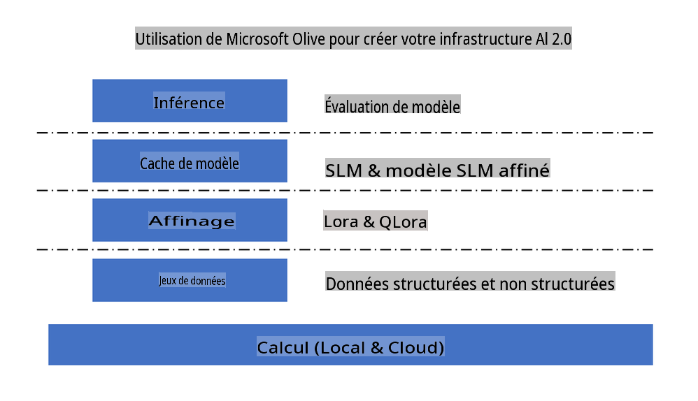
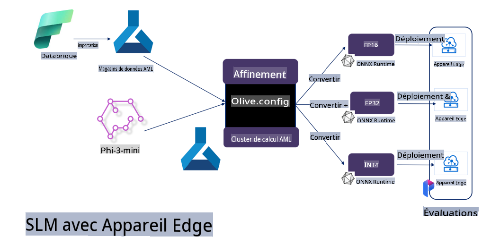

# **Affiner Phi-3 avec Microsoft Olive**

[Olive](https://github.com/microsoft/OLive?WT.mc_id=aiml-138114-kinfeylo) est un outil d'optimisation de modèle conscient du matériel, facile à utiliser, qui regroupe des techniques de pointe en matière de compression, d'optimisation et de compilation de modèles.

Il est conçu pour simplifier le processus d'optimisation des modèles d'apprentissage automatique, en s'assurant qu'ils utilisent de manière optimale des architectures matérielles spécifiques.

Que vous travailliez sur des applications basées sur le cloud ou sur des dispositifs edge, Olive vous permet d'optimiser vos modèles de manière simple et efficace.

## Caractéristiques principales :
- Olive regroupe et automatise les techniques d'optimisation pour les cibles matérielles souhaitées.
- Aucune technique d'optimisation unique ne convient à tous les scénarios, donc Olive permet une extensibilité en permettant aux experts du secteur d'intégrer leurs innovations d'optimisation.

## Réduire l'effort d'ingénierie :
- Les développeurs doivent souvent apprendre et utiliser plusieurs chaînes d'outils spécifiques aux fournisseurs de matériel pour préparer et optimiser les modèles entraînés pour le déploiement.
- Olive simplifie cette expérience en automatisant les techniques d'optimisation pour le matériel souhaité.

## Solution d'optimisation prête à l'emploi de bout en bout :

En composant et en ajustant des techniques intégrées, Olive offre une solution unifiée pour l'optimisation de bout en bout.
Il prend en compte des contraintes telles que la précision et la latence tout en optimisant les modèles.

## Utiliser Microsoft Olive pour l'affinage

Microsoft Olive est un outil d'optimisation de modèle open source très facile à utiliser qui peut couvrir à la fois l'affinage et la référence dans le domaine de l'intelligence artificielle générative. Il ne nécessite qu'une simple configuration, combinée à l'utilisation de petits modèles linguistiques open source et d'environnements d'exécution associés (AzureML / GPU local, CPU, DirectML), vous pouvez compléter l'affinage ou la référence du modèle grâce à une optimisation automatique, et trouver le meilleur modèle à déployer sur le cloud ou sur des dispositifs edge. Permettre aux entreprises de construire leurs propres modèles verticaux industriels sur site et dans le cloud.



## Affinage de Phi-3 avec Microsoft Olive



## Code exemple et exemple d'Olive pour Phi-3
Dans cet exemple, vous utiliserez Olive pour :

- Affiner un adaptateur LoRA pour classer des phrases en Tristesse, Joie, Peur, Surprise.
- Fusionner les poids de l'adaptateur dans le modèle de base.
- Optimiser et quantifier le modèle en int4.

[Code Exemple](../../code/04.Finetuning/olive-ort-example/README.md)

### Installation de Microsoft Olive

L'installation de Microsoft Olive est très simple, et peut également être installée pour CPU, GPU, DirectML, et Azure ML

```bash
pip install olive-ai
```

Si vous souhaitez exécuter un modèle ONNX avec un CPU, vous pouvez utiliser

```bash
pip install olive-ai[cpu]
```

Si vous souhaitez exécuter un modèle ONNX avec un GPU, vous pouvez utiliser

```python
pip install olive-ai[gpu]
```

Si vous souhaitez utiliser Azure ML, utilisez

```python
pip install git+https://github.com/microsoft/Olive#egg=olive-ai[azureml]
```

**Remarque**
Exigence du système d'exploitation : Ubuntu 20.04 / 22.04 

### **Config.json de Microsoft Olive**

Après l'installation, vous pouvez configurer différents paramètres spécifiques au modèle via le fichier de configuration, y compris les données, le calcul, l'entraînement, le déploiement et la génération de modèles.

**1. Données**

Sur Microsoft Olive, l'entraînement sur des données locales et des données cloud est pris en charge, et peut être configuré dans les paramètres.

*Paramètres des données locales*

Vous pouvez simplement configurer l'ensemble de données qui doit être entraîné pour l'affinage, généralement au format json, et l'adapter avec le modèle de données. Cela doit être ajusté en fonction des exigences du modèle (par exemple, l'adapter au format requis par Microsoft Phi-3-mini. Si vous avez d'autres modèles, veuillez vous référer aux formats d'affinage requis par d'autres modèles pour le traitement)

```json

    "data_configs": [
        {
            "name": "dataset_default_train",
            "type": "HuggingfaceContainer",
            "load_dataset_config": {
                "params": {
                    "data_name": "json", 
                    "data_files":"dataset/dataset-classification.json",
                    "split": "train"
                }
            },
            "pre_process_data_config": {
                "params": {
                    "dataset_type": "corpus",
                    "text_cols": [
                            "phrase",
                            "tone"
                    ],
                    "text_template": "### Text: {phrase}\n### The tone is:\n{tone}",
                    "corpus_strategy": "join",
                    "source_max_len": 2048,
                    "pad_to_max_len": false,
                    "use_attention_mask": false
                }
            }
        }
    ],
```

**Paramètres de la source de données cloud**

En reliant le datastore d'Azure AI Studio / Azure Machine Learning Service pour lier les données dans le cloud, vous pouvez choisir d'introduire différentes sources de données à Azure AI Studio / Azure Machine Learning Service via Microsoft Fabric et Azure Data comme support pour l'affinage des données.

```json

    "data_configs": [
        {
            "name": "dataset_default_train",
            "type": "HuggingfaceContainer",
            "load_dataset_config": {
                "params": {
                    "data_name": "json", 
                    "data_files": {
                        "type": "azureml_datastore",
                        "config": {
                            "azureml_client": {
                                "subscription_id": "Your Azure Subscrition ID",
                                "resource_group": "Your Azure Resource Group",
                                "workspace_name": "Your Azure ML Workspaces name"
                            },
                            "datastore_name": "workspaceblobstore",
                            "relative_path": "Your train_data.json Azure ML Location"
                        }
                    },
                    "split": "train"
                }
            },
            "pre_process_data_config": {
                "params": {
                    "dataset_type": "corpus",
                    "text_cols": [
                            "Question",
                            "Best Answer"
                    ],
                    "text_template": "<|user|>\n{Question}<|end|>\n<|assistant|>\n{Best Answer}\n<|end|>",
                    "corpus_strategy": "join",
                    "source_max_len": 2048,
                    "pad_to_max_len": false,
                    "use_attention_mask": false
                }
            }
        }
    ],
    
```

**2. Configuration de calcul**

Si vous avez besoin d'être local, vous pouvez directement utiliser les ressources de données locales. Vous devez utiliser les ressources d'Azure AI Studio / Azure Machine Learning Service. Vous devez configurer les paramètres Azure pertinents, le nom de la puissance de calcul, etc.

```json

    "systems": {
        "aml": {
            "type": "AzureML",
            "config": {
                "accelerators": ["gpu"],
                "hf_token": true,
                "aml_compute": "Your Azure AI Studio / Azure Machine Learning Service Compute Name",
                "aml_docker_config": {
                    "base_image": "Your Azure AI Studio / Azure Machine Learning Service docker",
                    "conda_file_path": "conda.yaml"
                }
            }
        },
        "azure_arc": {
            "type": "AzureML",
            "config": {
                "accelerators": ["gpu"],
                "aml_compute": "Your Azure AI Studio / Azure Machine Learning Service Compute Name",
                "aml_docker_config": {
                    "base_image": "Your Azure AI Studio / Azure Machine Learning Service docker",
                    "conda_file_path": "conda.yaml"
                }
            }
        }
    },
```

***Remarque***

Comme il est exécuté via un conteneur sur Azure AI Studio / Azure Machine Learning Service, l'environnement requis doit être configuré. Cela est configuré dans l'environnement conda.yaml.

```yaml

name: project_environment
channels:
  - defaults
dependencies:
  - python=3.8.13
  - pip=22.3.1
  - pip:
      - einops
      - accelerate
      - azure-keyvault-secrets
      - azure-identity
      - bitsandbytes
      - datasets
      - huggingface_hub
      - peft
      - scipy
      - sentencepiece
      - torch>=2.2.0
      - transformers
      - git+https://github.com/microsoft/Olive@jiapli/mlflow_loading_fix#egg=olive-ai[gpu]
      - --extra-index-url https://aiinfra.pkgs.visualstudio.com/PublicPackages/_packaging/ORT-Nightly/pypi/simple/ 
      - ort-nightly-gpu==1.18.0.dev20240307004
      - --extra-index-url https://aiinfra.pkgs.visualstudio.com/PublicPackages/_packaging/onnxruntime-genai/pypi/simple/
      - onnxruntime-genai-cuda

    

```

**3. Choisissez votre SLM**

Vous pouvez utiliser le modèle directement depuis Hugging face, ou vous pouvez directement le combiner avec le catalogue de modèles d'Azure AI Studio / Azure Machine Learning pour sélectionner le modèle à utiliser. Dans l'exemple de code ci-dessous, nous utiliserons Microsoft Phi-3-mini comme exemple.

Si vous avez le modèle localement, vous pouvez utiliser cette méthode

```json

    "input_model":{
        "type": "PyTorchModel",
        "config": {
            "hf_config": {
                "model_name": "model-cache/microsoft/phi-3-mini",
                "task": "text-generation",
                "model_loading_args": {
                    "trust_remote_code": true
                }
            }
        }
    },
```

Si vous souhaitez utiliser un modèle d'Azure AI Studio / Azure Machine Learning Service, vous pouvez utiliser cette méthode

```json

    "input_model":{
        "type": "PyTorchModel",
        "config": {
            "model_path": {
                "type": "azureml_registry_model",
                "config": {
                    "name": "microsoft/Phi-3-mini-4k-instruct",
                    "registry_name": "azureml-msr",
                    "version": "11"
                }
            },
             "model_file_format": "PyTorch.MLflow",
             "hf_config": {
                "model_name": "microsoft/Phi-3-mini-4k-instruct",
                "task": "text-generation",
                "from_pretrained_args": {
                    "trust_remote_code": true
                }
            }
        }
    },
```

**Remarque :**
Nous devons nous intégrer à Azure AI Studio / Azure Machine Learning Service, donc lors de la configuration du modèle, veuillez vous référer au numéro de version et à la nomenclature associée.

Tous les modèles sur Azure doivent être configurés sur PyTorch.MLflow

Vous devez avoir un compte Hugging face et lier la clé à la valeur clé d'Azure AI Studio / Azure Machine Learning

**4. Algorithme**

Microsoft Olive encapsule très bien les algorithmes d'affinage Lora et QLora. Tout ce que vous avez à faire est de configurer certains paramètres pertinents. Ici, je prends QLora comme exemple.

```json
        "lora": {
            "type": "LoRA",
            "config": {
                "target_modules": [
                    "o_proj",
                    "qkv_proj"
                ],
                "double_quant": true,
                "lora_r": 64,
                "lora_alpha": 64,
                "lora_dropout": 0.1,
                "train_data_config": "dataset_default_train",
                "eval_dataset_size": 0.3,
                "training_args": {
                    "seed": 0,
                    "data_seed": 42,
                    "per_device_train_batch_size": 1,
                    "per_device_eval_batch_size": 1,
                    "gradient_accumulation_steps": 4,
                    "gradient_checkpointing": false,
                    "learning_rate": 0.0001,
                    "num_train_epochs": 3,
                    "max_steps": 10,
                    "logging_steps": 10,
                    "evaluation_strategy": "steps",
                    "eval_steps": 187,
                    "group_by_length": true,
                    "adam_beta2": 0.999,
                    "max_grad_norm": 0.3
                }
            }
        },
```

Si vous souhaitez une conversion de quantification, la branche principale de Microsoft Olive prend déjà en charge la méthode onnxruntime-genai. Vous pouvez le configurer selon vos besoins :

1. Fusionner les poids de l'adaptateur dans le modèle de base
2. Convertir le modèle en modèle onnx avec la précision requise par ModelBuilder

comme la conversion en quantifié INT4

```json

        "merge_adapter_weights": {
            "type": "MergeAdapterWeights"
        },
        "builder": {
            "type": "ModelBuilder",
            "config": {
                "precision": "int4"
            }
        }
```

**Remarque**
- Si vous utilisez QLoRA, la conversion de quantification d'ONNXRuntime-genai n'est pas prise en charge pour le moment.

- Il convient de noter ici que vous pouvez configurer les étapes ci-dessus en fonction de vos propres besoins. Il n'est pas nécessaire de configurer complètement les étapes ci-dessus. Selon vos besoins, vous pouvez directement utiliser les étapes de l'algorithme sans affinage. Enfin, vous devez configurer les moteurs pertinents

```json

    "engine": {
        "log_severity_level": 0,
        "host": "aml",
        "target": "aml",
        "search_strategy": false,
        "execution_providers": ["CUDAExecutionProvider"],
        "cache_dir": "../model-cache/models/phi3-finetuned/cache",
        "output_dir" : "../model-cache/models/phi3-finetuned"
    }
```

**5. Affinage terminé**

Sur la ligne de commande, exécutez dans le répertoire de olive-config.json

```bash
olive run --config olive-config.json  
```

**Avertissement**:
Ce document a été traduit à l'aide de services de traduction automatisés basés sur l'IA. Bien que nous nous efforcions d'assurer l'exactitude, veuillez noter que les traductions automatisées peuvent contenir des erreurs ou des inexactitudes. Le document original dans sa langue d'origine doit être considéré comme la source faisant autorité. Pour des informations critiques, une traduction humaine professionnelle est recommandée. Nous ne sommes pas responsables des malentendus ou des interprétations erronées résultant de l'utilisation de cette traduction.