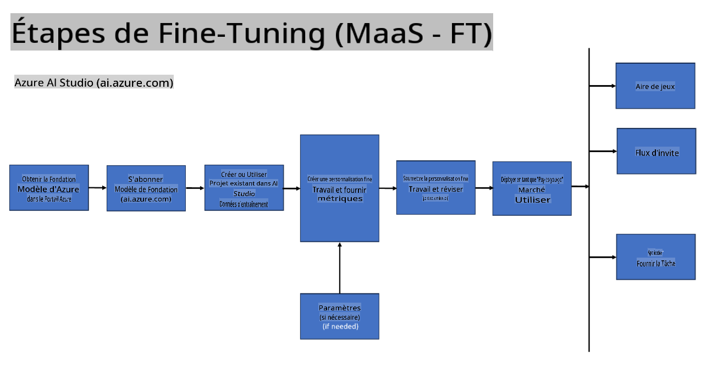
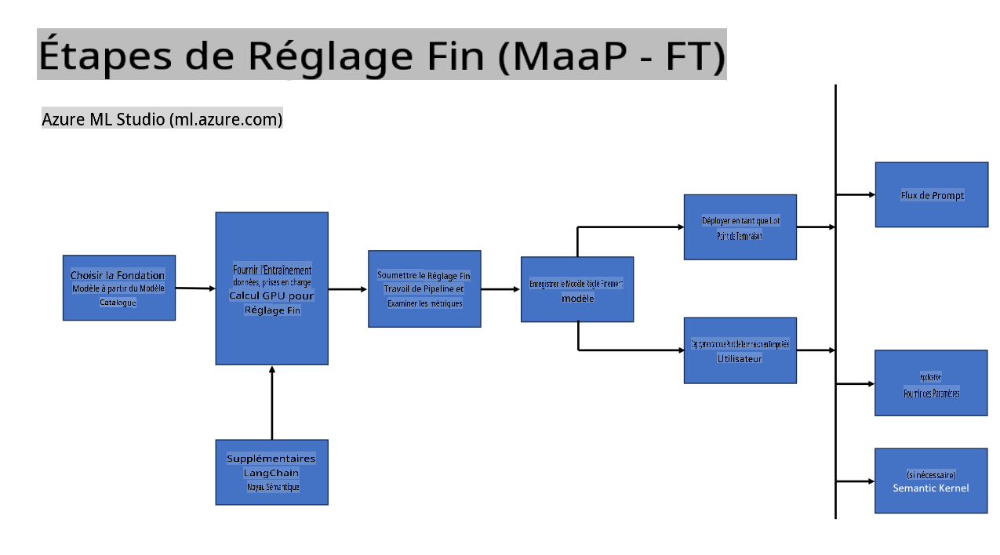

## Scénarios de Réglage Fin

**Plateforme** Cela inclut diverses technologies telles que Azure AI Foundry, Azure Machine Learning, AI Tools, Kaito et ONNX Runtime. 

**Infrastructure** Cela inclut le CPU et le FPGA, qui sont essentiels pour le processus de réglage fin. Laissez-moi vous montrer les icônes pour chacune de ces technologies.

**Outils & Cadre** Cela inclut ONNX Runtime et ONNX Runtime. Laissez-moi vous montrer les icônes pour chacune de ces technologies.
[Insérer les icônes pour ONNX Runtime et ONNX Runtime]

Le processus de réglage fin avec les technologies Microsoft implique divers composants et outils. En comprenant et en utilisant ces technologies, nous pouvons affiner efficacement nos applications et créer de meilleures solutions. 

## Modèle en tant que Service

Ajustez le modèle en utilisant un réglage fin hébergé, sans avoir besoin de créer et de gérer des ressources de calcul.

Le réglage fin sans serveur est disponible pour les modèles Phi-3-mini et Phi-3-medium, permettant aux développeurs de personnaliser rapidement et facilement les modèles pour les scénarios cloud et edge sans avoir à organiser des ressources de calcul. Nous avons également annoncé que, Phi-3-small, est maintenant disponible via notre offre Models-as-a-Service, permettant aux développeurs de commencer rapidement et facilement le développement d'IA sans avoir à gérer l'infrastructure sous-jacente.

[Exemple de Réglage Fin](https://github.com/microsoft/Phi-3CookBook/blob/main/md/04.Fine-tuning/FineTuning_AIStudio.md)
## Modèle en tant que Plateforme 

Les utilisateurs gèrent leurs propres ressources de calcul pour ajuster leurs modèles.

[Exemple de Réglage Fin](https://github.com/Azure/azureml-examples/blob/main/sdk/python/foundation-models/system/finetune/chat-completion/chat-completion.ipynb)

## Scénarios de Réglage Fin 

| | | | | | | |
|-|-|-|-|-|-|-|
|Scénario|LoRA|QLoRA|PEFT|DeepSpeed|ZeRO|DORA|
|Adapter des LLM pré-entraînés à des tâches ou domaines spécifiques|Oui|Oui|Oui|Oui|Oui|Oui|
|Réglage fin pour des tâches de NLP telles que la classification de texte, la reconnaissance d'entités nommées et la traduction automatique|Oui|Oui|Oui|Oui|Oui|Oui|
|Réglage fin pour des tâches de QA|Oui|Oui|Oui|Oui|Oui|Oui|
|Réglage fin pour générer des réponses humaines dans les chatbots|Oui|Oui|Oui|Oui|Oui|Oui|
|Réglage fin pour générer de la musique, de l'art ou d'autres formes de créativité|Oui|Oui|Oui|Oui|Oui|Oui|
|Réduire les coûts computationnels et financiers|Oui|Oui|Non|Oui|Oui|Non|
|Réduire l'utilisation de la mémoire|Non|Oui|Non|Oui|Oui|Oui|
|Utiliser moins de paramètres pour un réglage fin efficace|Non|Oui|Oui|Non|Non|Oui|
|Forme de parallélisme de données efficace en mémoire qui donne accès à la mémoire GPU agrégée de tous les dispositifs GPU disponibles|Non|Non|Non|Oui|Oui|Oui|

## Exemples de Performance de Réglage Fin

**Avertissement**:
Ce document a été traduit en utilisant des services de traduction automatisée par IA. Bien que nous nous efforcions d'assurer l'exactitude, veuillez noter que les traductions automatisées peuvent contenir des erreurs ou des inexactitudes. Le document original dans sa langue d'origine doit être considéré comme la source faisant autorité. Pour des informations critiques, il est recommandé de recourir à une traduction humaine professionnelle. Nous ne sommes pas responsables des malentendus ou des interprétations erronées résultant de l'utilisation de cette traduction.