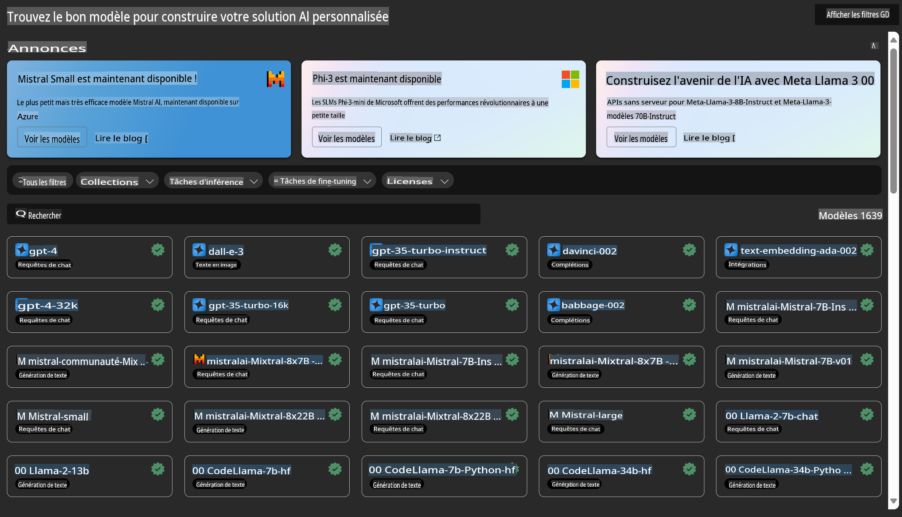
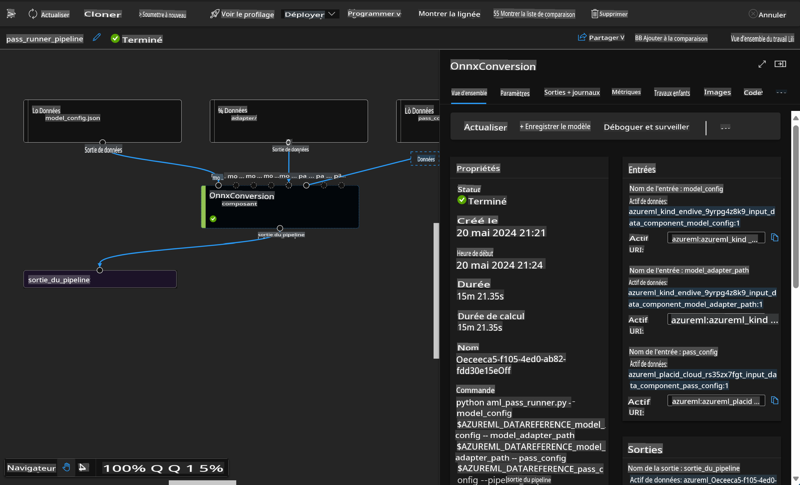

# **Introduction au service Azure Machine Learning**

[Azure Machine Learning](https://ml.azure.com?WT.mc_id=aiml-138114-kinfeylo) est un service cloud destiné à accélérer et à gérer le cycle de vie des projets de machine learning (ML).

Les professionnels du ML, les data scientists et les ingénieurs peuvent l'utiliser dans leurs flux de travail quotidiens pour :

- Entraîner et déployer des modèles.
Gérer les opérations de machine learning (MLOps).
- Vous pouvez créer un modèle dans Azure Machine Learning ou utiliser un modèle construit à partir d'une plateforme open-source, telle que PyTorch, TensorFlow ou scikit-learn.
- Les outils MLOps vous aident à surveiller, réentraîner et redéployer les modèles.

## Pour qui est Azure Machine Learning ?

**Data Scientists et Ingénieurs ML**

Ils peuvent utiliser des outils pour accélérer et automatiser leurs flux de travail quotidiens.
Azure ML offre des fonctionnalités pour l'équité, l'explicabilité, le suivi et l'auditabilité.
Développeurs d'applications :
Ils peuvent intégrer des modèles dans des applications ou des services de manière transparente.

**Développeurs de plateformes**

Ils ont accès à un ensemble robuste d'outils soutenus par des API durables d'Azure Resource Manager.
Ces outils permettent de créer des outils ML avancés.

**Entreprises**

En travaillant dans le cloud Microsoft Azure, les entreprises bénéficient d'une sécurité familière et d'un contrôle d'accès basé sur les rôles.
Configurez des projets pour contrôler l'accès aux données protégées et aux opérations spécifiques.

## Productivité pour toute l'équipe
Les projets ML nécessitent souvent une équipe avec des compétences variées pour les construire et les maintenir.

Azure ML fournit des outils qui vous permettent de :
- Collaborer avec votre équipe via des notebooks partagés, des ressources de calcul, des calculs sans serveur, des données et des environnements.
- Développer des modèles avec équité, explicabilité, suivi et auditabilité pour répondre aux exigences de traçabilité et de conformité des audits.
- Déployer des modèles ML rapidement et facilement à grande échelle, et les gérer et les gouverner efficacement avec MLOps.
- Exécuter des charges de travail de machine learning partout avec une gouvernance, une sécurité et une conformité intégrées.

## Outils de plateforme compatibles

Tout membre d'une équipe ML peut utiliser ses outils préférés pour accomplir le travail.
Que vous réalisiez des expériences rapides, de l'ajustement d'hyperparamètres, que vous construisiez des pipelines ou que vous gériez des inférences, vous pouvez utiliser des interfaces familières, notamment :
- Azure Machine Learning Studio
- Python SDK (v2)
- Azure CLI (v2)
- Azure Resource Manager REST APIs

À mesure que vous affinez les modèles et collaborez tout au long du cycle de développement, vous pouvez partager et trouver des actifs, des ressources et des métriques dans l'interface utilisateur d'Azure Machine Learning studio.

## **LLM/SLM dans Azure ML**

Azure ML a ajouté de nombreuses fonctions liées aux LLM/SLM, combinant LLMOps et SLMOps pour créer une plateforme technologique d'intelligence artificielle générative à l'échelle de l'entreprise.

### **Catalogue de modèles**

Les utilisateurs d'entreprise peuvent déployer différents modèles selon différents scénarios commerciaux via le Catalogue de Modèles, et fournir des services en tant que Model as Service pour que les développeurs ou utilisateurs d'entreprise puissent y accéder.

Le Catalogue de Modèles dans Azure Machine Learning studio est le hub pour découvrir et utiliser une large gamme de modèles qui vous permettent de construire des applications d'IA générative. Le catalogue de modèles propose des centaines de modèles provenant de fournisseurs de modèles tels que Azure OpenAI service, Mistral, Meta, Cohere, Nvidia, Hugging Face, y compris des modèles entraînés par Microsoft. Les modèles provenant de fournisseurs autres que Microsoft sont des Produits Non-Microsoft, comme défini dans les Termes de Produit de Microsoft, et sont soumis aux termes fournis avec le modèle.

### **Pipeline de tâches**

Le cœur d'un pipeline de machine learning consiste à diviser une tâche complète de machine learning en un flux de travail à plusieurs étapes. Chaque étape est un composant gérable qui peut être développé, optimisé, configuré et automatisé individuellement. Les étapes sont connectées via des interfaces bien définies. Le service de pipeline Azure Machine Learning orchestre automatiquement toutes les dépendances entre les étapes du pipeline.

Lors de l'affinage des SLM / LLM, nous pouvons gérer nos processus de données, d'entraînement et de génération via Pipeline

### **Flux de prompt**

Avantages de l'utilisation du flux de prompt Azure Machine Learning
Le flux de prompt Azure Machine Learning offre une gamme d'avantages qui aident les utilisateurs à passer de l'idéation à l'expérimentation et, en fin de compte, à des applications prêtes pour la production basées sur les LLM :

**Agilité de l'ingénierie des prompts**

Expérience de rédaction interactive : Le flux de prompt Azure Machine Learning fournit une représentation visuelle de la structure du flux, permettant aux utilisateurs de comprendre et de naviguer facilement dans leurs projets. Il offre également une expérience de codage similaire à un notebook pour un développement et un débogage de flux efficaces.
Variantes pour l'ajustement des prompts : Les utilisateurs peuvent créer et comparer plusieurs variantes de prompts, facilitant un processus de raffinement itératif.

Évaluation : Les flux d'évaluation intégrés permettent aux utilisateurs d'évaluer la qualité et l'efficacité de leurs prompts et flux.

Ressources complètes : Le flux de prompt Azure Machine Learning comprend une bibliothèque d'outils intégrés, d'exemples et de modèles qui servent de point de départ pour le développement, inspirant la créativité et accélérant le processus.

**Préparation de l'entreprise pour les applications basées sur les LLM**

Collaboration : Le flux de prompt Azure Machine Learning prend en charge la collaboration en équipe, permettant à plusieurs utilisateurs de travailler ensemble sur des projets d'ingénierie de prompts, de partager des connaissances et de maintenir le contrôle des versions.

Plateforme tout-en-un : Le flux de prompt Azure Machine Learning rationalise l'ensemble du processus d'ingénierie des prompts, du développement et de l'évaluation au déploiement et à la surveillance. Les utilisateurs peuvent déployer sans effort leurs flux en tant que points de terminaison Azure Machine Learning et surveiller leurs performances en temps réel, garantissant un fonctionnement optimal et une amélioration continue.

Solutions de préparation d'entreprise Azure Machine Learning : Le flux de prompt exploite les solutions robustes de préparation d'entreprise d'Azure Machine Learning, fournissant une base sécurisée, évolutive et fiable pour le développement, l'expérimentation et le déploiement de flux.

Avec le flux de prompt Azure Machine Learning, les utilisateurs peuvent libérer leur agilité d'ingénierie des prompts, collaborer efficacement et tirer parti des solutions de qualité entreprise pour un développement et un déploiement réussis d'applications basées sur les LLM.

En combinant la puissance de calcul, les données et les différents composants d'Azure ML, les développeurs d'entreprise peuvent facilement créer leurs propres applications d'intelligence artificielle.

**Avertissement**:
Ce document a été traduit à l'aide de services de traduction automatique basés sur l'IA. Bien que nous nous efforcions d'assurer l'exactitude, veuillez noter que les traductions automatisées peuvent contenir des erreurs ou des inexactitudes. Le document original dans sa langue d'origine doit être considéré comme la source faisant autorité. Pour des informations critiques, une traduction humaine professionnelle est recommandée. Nous ne sommes pas responsables des malentendus ou des interprétations erronées résultant de l'utilisation de cette traduction.