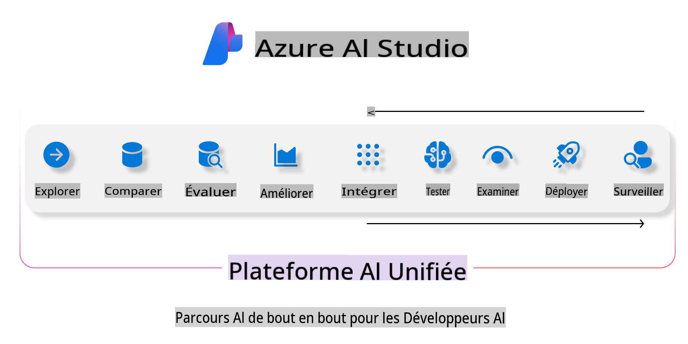

# **Utilisation de Azure AI Foundry pour l'évaluation**

Comment évaluer votre application d'IA générative en utilisant [Azure AI Foundry](https://ai.azure.com?WT.mc_id=aiml-138114-kinfeylo). Que vous évaluiez des conversations à un seul tour ou à plusieurs tours, Azure AI Foundry fournit des outils pour évaluer la performance et la sécurité du modèle.

## Comment évaluer des applications d'IA générative avec Azure AI Foundry
Pour des instructions plus détaillées, consultez la [documentation de Azure AI Foundry](https://learn.microsoft.com/azure/ai-studio/how-to/evaluate-generative-ai-app?WT.mc_id=aiml-138114-kinfeylo).

Voici les étapes pour commencer :

## Évaluer des modèles d'IA générative dans Azure AI Foundry

**Prérequis**

- Un jeu de données de test au format CSV ou JSON.
- Un modèle d'IA générative déployé (tel que les modèles Phi-3, GPT 3.5, GPT 4 ou Davinci).
- Un environnement d'exécution avec une instance de calcul pour exécuter l'évaluation.

## Métriques d'évaluation intégrées

Azure AI Foundry vous permet d'évaluer à la fois les conversations à un seul tour et les conversations complexes à plusieurs tours.
Pour les scénarios de génération augmentée par récupération (RAG), où le modèle est ancré dans des données spécifiques, vous pouvez évaluer la performance en utilisant des métriques d'évaluation intégrées.
De plus, vous pouvez évaluer des scénarios généraux de questions-réponses à un seul tour (non-RAG).

## Création d'une exécution d'évaluation

Depuis l'interface utilisateur de Azure AI Foundry, naviguez soit vers la page Évaluer, soit vers la page Prompt Flow.
Suivez l'assistant de création d'évaluation pour configurer une exécution d'évaluation. Fournissez un nom optionnel pour votre évaluation.
Sélectionnez le scénario qui correspond aux objectifs de votre application.
Choisissez une ou plusieurs métriques d'évaluation pour évaluer la sortie du modèle.

## Flux d'évaluation personnalisé (optionnel)

Pour une plus grande flexibilité, vous pouvez établir un flux d'évaluation personnalisé. Personnalisez le processus d'évaluation en fonction de vos besoins spécifiques.

## Visualisation des résultats

Après avoir exécuté l'évaluation, enregistrez, visualisez et analysez des métriques d'évaluation détaillées dans Azure AI Foundry. Obtenez des informations sur les capacités et les limitations de votre application.

**Note** Azure AI Foundry est actuellement en préversion publique, utilisez-le donc à des fins d'expérimentation et de développement. Pour les charges de travail en production, envisagez d'autres options. Explorez la [documentation officielle d'AI Foundry](https://learn.microsoft.com/azure/ai-studio/?WT.mc_id=aiml-138114-kinfeylo) pour plus de détails et des instructions étape par étape.

**Avertissement** :
Ce document a été traduit en utilisant des services de traduction basés sur l'IA. Bien que nous nous efforcions d'assurer l'exactitude, veuillez noter que les traductions automatisées peuvent contenir des erreurs ou des inexactitudes. Le document original dans sa langue d'origine doit être considéré comme la source faisant autorité. Pour des informations cruciales, il est recommandé de faire appel à une traduction humaine professionnelle. Nous ne sommes pas responsables des malentendus ou des interprétations erronées résultant de l'utilisation de cette traduction.