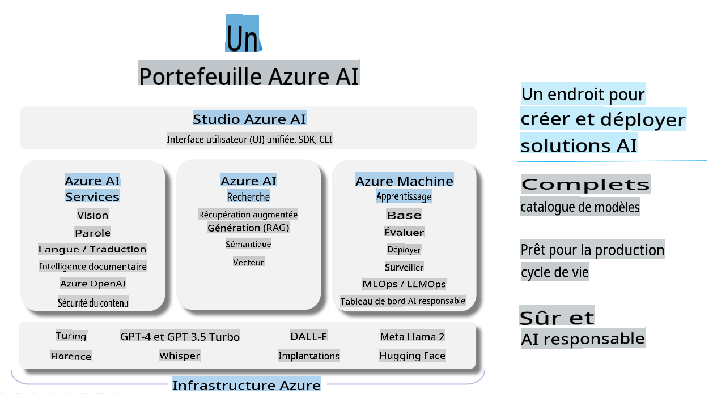

# **Utilisation d'Azure AI Studio pour l'évaluation**

Comment évaluer votre application d'IA générative en utilisant [Azure AI Studio](https://ai.azure.com?WT.mc_id=aiml-138114-kinfeylo). Que vous évaluiez des conversations à un seul tour ou à plusieurs tours, Azure AI Studio fournit des outils pour évaluer les performances et la sécurité du modèle.

## Comment évaluer des applications d'IA générative avec Azure AI Studio
Pour des instructions plus détaillées, consultez la [documentation Azure AI Studio](https://learn.microsoft.com/azure/ai-studio/how-to/evaluate-generative-ai-app?WT.mc_id=aiml-138114-kinfeylo)

Voici les étapes pour commencer :

## Évaluation des modèles d'IA générative dans Azure AI Studio

**Prérequis**

- Un jeu de données de test au format CSV ou JSON.
- Un modèle d'IA générative déployé (comme les modèles Phi-3, GPT 3.5, GPT 4, ou Davinci).
- Un environnement d'exécution avec une instance de calcul pour exécuter l'évaluation.

## Métriques d'évaluation intégrées

Azure AI Studio vous permet d'évaluer à la fois des conversations à un seul tour et des conversations complexes à plusieurs tours.
Pour les scénarios de génération augmentée par récupération (RAG), où le modèle est basé sur des données spécifiques, vous pouvez évaluer les performances en utilisant des métriques d'évaluation intégrées.
De plus, vous pouvez évaluer des scénarios généraux de questions-réponses à un seul tour (non-RAG).

## Création d'une exécution d'évaluation

Depuis l'interface utilisateur d'Azure AI Studio, accédez à la page Évaluer ou à la page Flux de Prompt.
Suivez l'assistant de création d'évaluation pour configurer une exécution d'évaluation. Fournissez un nom optionnel pour votre évaluation.
Sélectionnez le scénario qui correspond aux objectifs de votre application.
Choisissez une ou plusieurs métriques d'évaluation pour évaluer la sortie du modèle.

## Flux d'évaluation personnalisé (optionnel)

Pour plus de flexibilité, vous pouvez établir un flux d'évaluation personnalisé. Personnalisez le processus d'évaluation en fonction de vos besoins spécifiques.

## Visualisation des résultats

Après avoir exécuté l'évaluation, enregistrez, visualisez et analysez les métriques d'évaluation détaillées dans Azure AI Studio. Obtenez des informations sur les capacités et les limites de votre application.

**Note** Azure AI Studio est actuellement en préversion publique, donc utilisez-le à des fins d'expérimentation et de développement. Pour les charges de travail en production, envisagez d'autres options. Explorez la [documentation officielle d'AI Studio](https://learn.microsoft.com/azure/ai-studio/?WT.mc_id=aiml-138114-kinfeylo) pour plus de détails et des instructions pas à pas.

