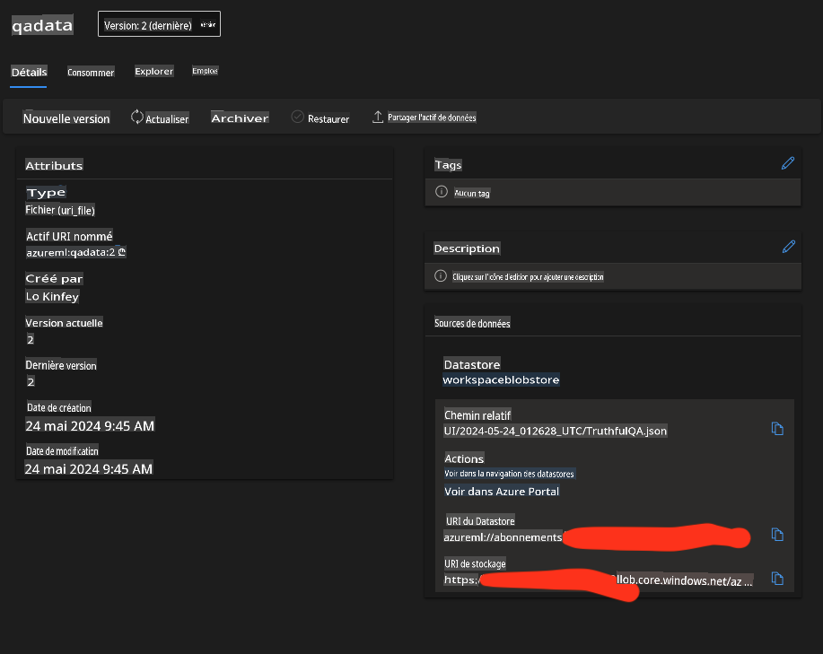

# **Préparez vos données industrielles**

Nous espérons injecter Phi-3-mini dans [les données de TruthfulQA](https://github.com/sylinrl/TruthfulQA/blob/main/TruthfulQA.csv). La première étape consiste à importer les données de TruthfulQA.

### **1. Charger les données dans un fichier csv et les enregistrer en json**

```python

import csv
import json

csvfile = open('./datasets/TruthfulQA.csv', 'r')
jsonfile = open('./output/TruthfulQA.json', 'w')

fieldnames = ("Type","Category","Question","Best Answer","Correct Answers","Incorrect Answers","Source")

reader = csv.DictReader(csvfile, fieldnames)

for row in reader:
    json.dump(row, jsonfile)
    jsonfile.write('\n')

i = 1
data = []
with open('./output/TruthfulQA.json', 'r') as file:
    for line in file:
        print(line)
        data.append(json.loads(line))
        print(str(i))
        i+=1

```

### **2. Télécharger les données vers les datastores Azure ML**



### **Félicitations !**

Vos données ont été chargées avec succès. Ensuite, vous devez configurer vos données et les algorithmes associés via Microsoft Olive [E2E_LoRA&QLoRA_Config_With_Olive.md](./E2E_LoRA&QLoRA_Config_With_Olive.md)

Avertissement : La traduction a été réalisée à partir de l'original par un modèle d'IA et peut ne pas être parfaite. Veuillez vérifier le résultat et apporter les corrections nécessaires.