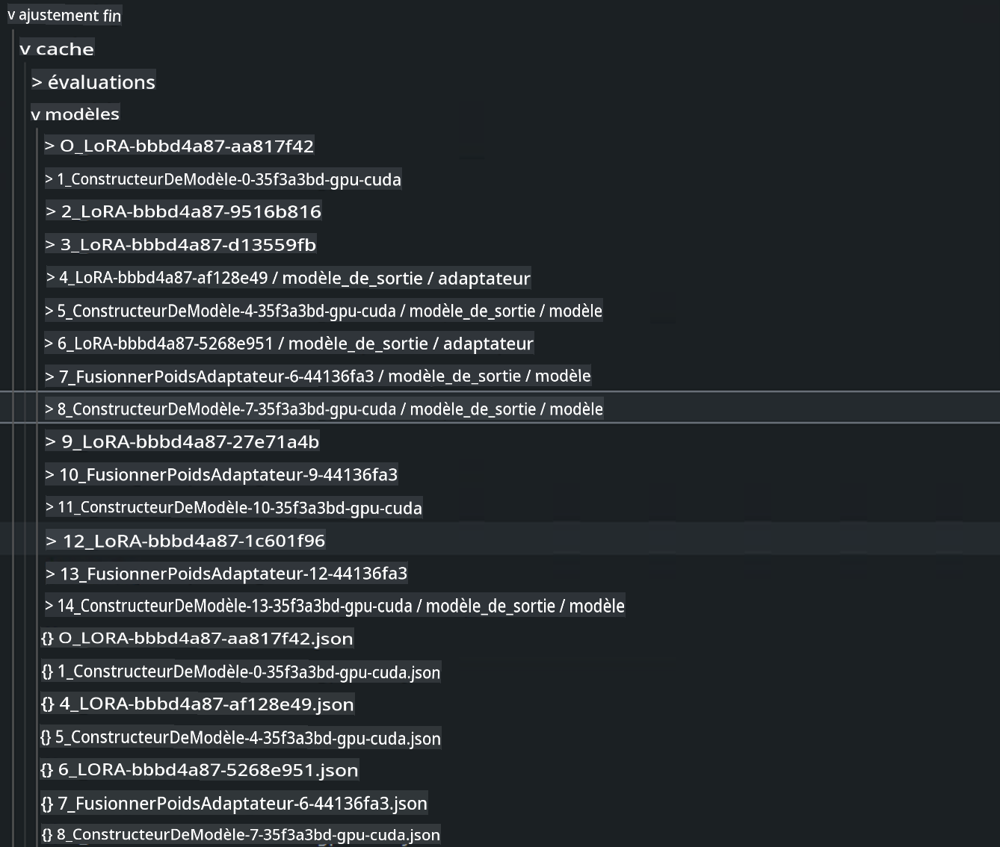

# **Utilisez Microsoft Olive pour architecturer vos projets**

Si une entreprise souhaite avoir son propre modèle vertical d'industrie, elle doit commencer par les données, l'ajustement fin et le déploiement. Dans le contenu précédent, nous avons introduit Microsoft Olive, et nous complétons maintenant une introduction plus détaillée basée sur le travail de E2E.

## **Architecture**

Nous pouvons nous référer aux projets générés par AI Toolkit pour VS Code pour structurer nos projets, y compris les données, les modèles, les formats ajustés et les inférences, comme suit :

```txt

｜-- Votre projet Phi-3-mini E2E
    ｜-- datasets
    ｜-- fine-tuning
    ｜-- inferences
    ｜-- model-cache
    ｜-- gen-model
    ｜-- setup
     

```

- **datasets**

    Les données peuvent être stockées en csv, json et autres formats. Dans cet exemple, il s'agit des données json exportées. [dataset](./E2E_Datasets.md) 

    ***Note*** Nous pouvons ignorer les paramètres pertinents ici car les données ont déjà été téléchargées sur Azure ML (si elles sont locales, nous pouvons les télécharger ici)

- **fine-tuning**
    
    Spécifiez les algorithmes de réglage fin QLoRA et LoRA, ainsi que les paramètres associés

- **inferences**

    L'inférence est le modèle après ajustement fin. Il peut s'agir d'une référence à la couche d'adaptateur ajustée, d'une référence au modèle intégré avec l'adaptateur après ajustement fin, ou d'un modèle quantifié ONNX Runtime.

- **model-cache**

    Modèles téléchargés via Hugging face CLI, ici le modèle Phi-3-Mini (en utilisant Azure ML nous pouvons ignorer ce contenu, si vous souhaitez opérer localement, veuillez exécuter le script suivant pour obtenir le modèle phi-3)


```bash

huggingface-cli login

# entrez votre clé depuis le portail Hugging Face

huggingface-cli download microsoft/Phi-3-mini-4k-instruct --local-dir Votre emplacement Phi-3-mini

```

- **gen-model**

Le modèle sauvegardé après l'opération inclut le modèle d'adaptateur ajusté, le modèle intégré ajusté et le modèle quantitatif exécuté par ONNX Runtime.

- **setup**

Environnement d'installation requis, veuillez exécuter ceci pour configurer votre environnement Olive


```bash

pip install -r requirements.txt

```

## **Configuration de Microsoft Olive**

Si vous souhaitez en savoir plus sur la configuration de Microsoft Olive, veuillez visiter [Fine Tuning with Microsoft Olive](../04.Fine-tuning/FineTuning_MicrosoftOlive.md)

***Note*** Pour rester à jour, installez Microsoft Olive en utilisant


```bash

pip install git+https://github.com/microsoft/Olive

```

## **Exécution de Microsoft Olive dans Azure ML**

**LoRA**

Cet exemple utilise des calculs en cloud, des ensembles de données en cloud, ajoutez olive.config dans le dossier fine-tuning


```json

{
    "azureml_client": {
        "subscription_id": "Your Azure Subscription ID",
        "resource_group": "Your Azure Resource Group",
        "workspace_name": "Your Azure ML Worksapce",
        "keyvault_name":  "Your Azure Key Valuts"
    },
    "input_model":{
        "type": "PyTorchModel",
        "config": {
            "hf_config": {
                "model_name": "microsoft/Phi-3-mini-4k-instruct",
                "task": "text-generation",
                "from_pretrained_args": {
                    "trust_remote_code": true
                }
            }
        }
    },
    "systems": {
        "aml": {
            "type": "AzureML",
            "config": {
                "accelerators": [
                    {
                        "device": "gpu",
                        "execution_providers": [
                            "CUDAExecutionProvider"
                        ]
                    }
                ],
                "hf_token": true,
                "aml_compute": "Your Azure ML Compute Cluster",
                "aml_docker_config": {
                    "base_image": "mcr.microsoft.com/azureml/openmpi4.1.0-cuda11.8-cudnn8-ubuntu22.04",
                    "conda_file_path": "conda.yaml"
                }
            }
        },
        "azure_arc": {
            "type": "AzureML",
            "config": {
                "accelerators": [
                    {
                        "device": "gpu",
                        "execution_providers": [
                            "CUDAExecutionProvider"
                        ]
                    }
                ],
                "aml_compute": "Your Azure ML Compute",
                "aml_docker_config": {
                    "base_image": "mcr.microsoft.com/azureml/openmpi4.1.0-cuda11.8-cudnn8-ubuntu22.04",
                    "conda_file_path": "conda.yaml"
                }
            }
        }
    },
    "data_configs": [
        {
            "name": "dataset_default_train",
            "type": "HuggingfaceContainer",
            "load_dataset_config": {
                "params": {
                    "data_name": "json", 
                    "data_files": {
                        "type": "azureml_datastore",
                        "config": {
                            "azureml_client": {
                                "subscription_id": "Your Azure Subscrition ID",
                                "resource_group": "Your Azure Resource Group",
                                "workspace_name": "Your Azure ML Workspaces name"
                            },
                            "datastore_name": "workspaceblobstore",
                            "relative_path": "Your train_data.json Azure ML Location"
                        }
                    },
                    "split": "train"
                }
            },
            "pre_process_data_config": {
                "params": {
                    "dataset_type": "corpus",
                    "text_cols": [
                            "Question",
                            "Best Answer"
                    ],
                    "text_template": "<|user|>\n{Question}<|end|>\n<|assistant|>\n{Best Answer}\n<|end|>",
                    "corpus_strategy": "join",
                    "source_max_len": 2048,
                    "pad_to_max_len": false,
                    "use_attention_mask": false
                }
            }
        }
    ],
    "passes": {
        "lora": {
            "type": "LoRA",
            "config": {
                "target_modules": [
                    "o_proj",
                    "qkv_proj"
                ],
                "double_quant": true,
                "lora_r": 64,
                "lora_alpha": 64,
                "lora_dropout": 0.1,
                "train_data_config": "dataset_default_train",
                "eval_dataset_size": 0.1,
                "training_args": {
                    "seed": 0,
                    "data_seed": 42,
                    "per_device_train_batch_size": 1,
                    "per_device_eval_batch_size": 1,
                    "gradient_accumulation_steps": 4,
                    "gradient_checkpointing": false,
                    "learning_rate": 0.0001,
                    "num_train_epochs": 1000,
                    "max_steps": 100,
                    "logging_steps": 100,
                    "evaluation_strategy": "steps",
                    "eval_steps": 187,
                    "group_by_length": true,
                    "adam_beta2": 0.999,
                    "max_grad_norm": 0.3
                }
            }
        },
        "merge_adapter_weights": {
            "type": "MergeAdapterWeights"
        },
        "builder": {
            "type": "ModelBuilder",
            "config": {
                "precision": "int4"
            }
        }
    },
    "engine": {
        "log_severity_level": 0,
        "host": "aml",
        "target": "aml",
        "search_strategy": false,
        "cache_dir": "cache",
        "output_dir" : "../model-cache/models/phi3-finetuned"
    }
}


```


**QLoRA**


```json

{
    "azureml_client": {
        "subscription_id": "Your Azure Subscription ID",
        "resource_group": "Your Azure Resource Group",
        "workspace_name": "Your Azure ML Worksapce",
        "keyvault_name":  "Your Azure Key Valuts"
    },
    "input_model":{
        "type": "PyTorchModel",
        "config": {
            "hf_config": {
                "model_name": "microsoft/Phi-3-mini-4k-instruct",
                "task": "text-generation",
                "from_pretrained_args": {
                    "trust_remote_code": true
                }
            }
        }
    },
    "systems": {
        "aml": {
            "type": "AzureML",
            "config": {
                "accelerators": [
                    {
                        "device": "gpu",
                        "execution_providers": [
                            "CUDAExecutionProvider"
                        ]
                    }
                ],
                "hf_token": true,
                "aml_compute": "Your Azure ML Compute Cluster",
                "aml_docker_config": {
                    "base_image": "mcr.microsoft.com/azureml/openmpi4.1.0-cuda11.8-cudnn8-ubuntu22.04",
                    "conda_file_path": "conda.yaml"
                }
            }
        },
        "azure_arc": {
            "type": "AzureML",
            "config": {
                "accelerators": [
                    {
                        "device": "gpu",
                        "execution_providers": [
                            "CUDAExecutionProvider"
                        ]
                    }
                ],
                "aml_compute": "Your Azure ML Compute",
                "aml_docker_config": {
                    "base_image": "mcr.microsoft.com/azureml/openmpi4.1.0-cuda11.8-cudnn8-ubuntu22.04",
                    "conda_file_path": "conda.yaml"
                }
            }
        }
    },
    "data_configs": [
        {
            "name": "dataset_default_train",
            "type": "HuggingfaceContainer",
            "load_dataset_config": {
                "params": {
                    "data_name": "json", 
                    "data_files": {
                        "type": "azureml_datastore",
                        "config": {
                            "azureml_client": {
                                "subscription_id": "Your Azure Subscrition ID",
                                "resource_group": "Your Azure Resource Group",
                                "workspace_name": "Your Azure ML Workspaces name"
                            },
                            "datastore_name": "workspaceblobstore",
                            "relative_path": "Your train_data.json Azure ML Location"
                        }
                    },
                    "split": "train"
                }
            },
            "pre_process_data_config": {
                "params": {
                    "dataset_type": "corpus",
                    "text_cols": [
                            "Question",
                            "Best Answer"
                    ],
                    "text_template": "<|user|>\n{Question}<|end|>\n<|assistant|>\n{Best Answer}\n<|end|>",
                    "corpus_strategy": "join",
                    "source_max_len": 2048,
                    "pad_to_max_len": false,
                    "use_attention_mask": false
                }
            }
        }
    ],
    "passes": {
        "qlora": {
            "type": "QLoRA",
            "config": {
                "compute_dtype": "bfloat16",
                "quant_type": "nf4",
                "double_quant": true,
                "lora_r": 64,
                "lora_alpha": 64,
                "lora_dropout": 0.1,
                "train_data_config": "dataset_default_train",
                "eval_dataset_size": 0.3,
                "training_args": {
                    "seed": 0,
                    "data_seed": 42,
                    "per_device_train_batch_size": 1,
                    "per_device_eval_batch_size": 1,
                    "gradient_accumulation_steps": 4,
                    "gradient_checkpointing": false,
                    "learning_rate": 0.0001,
                    "num_train_epochs": 3,
                    "max_steps": 10,
                    "logging_steps": 10,
                    "evaluation_strategy": "steps",
                    "eval_steps": 187,
                    "group_by_length": true,
                    "adam_beta2": 0.999,
                    "max_grad_norm": 0.3
                }
            }
        },
        "merge_adapter_weights": {
            "type": "MergeAdapterWeights"
        }
    },
    "engine": {
        "log_severity_level": 0,
        "host": "aml",
        "target": "aml",
        "search_strategy": false,
        "cache_dir": "cache",
        "output_dir" : "../model-cache/models/phi3-finetuned"
    }
}


```

***Notice*** 

- Si vous utilisez QLoRA, la conversion de quantification de ONNXRuntime-genai n'est pas encore supportée.


- Il convient de noter ici que vous pouvez configurer les étapes ci-dessus selon vos propres besoins. Il n'est pas nécessaire de configurer complètement les étapes ci-dessus. Selon vos besoins, vous pouvez directement utiliser les étapes de l'algorithme sans ajustement fin. Enfin, vous devez configurer les moteurs pertinents.

### **Exécution de Microsoft Olive**


Une fois que vous avez terminé avec Microsoft Olive, vous devez exécuter cette commande dans le terminal 


```bash

olive run --config olive-config.json  

```

***Notice*** 

1. Lorsque Microsoft Olive est exécuté, chaque étape peut être placée dans le cache. Nous pouvons consulter les résultats des étapes pertinentes en consultant le répertoire de réglage fin.




2. Nous fournissons ici à la fois LoRA et QLoRA, et vous pouvez les configurer selon vos besoins.

3. L'environnement d'exécution recommandé est WSL / Ubuntu 22.04+.

4. Pourquoi choisir ORT ? Parce que ORT peut être déployé sur des dispositifs périphériques, l'inférence est mise en œuvre dans l'environnement ORT.


Avertissement : La traduction a été réalisée à partir de son original par un modèle d'IA et peut ne pas être parfaite. 
Veuillez examiner le résultat et apporter les corrections nécessaires.