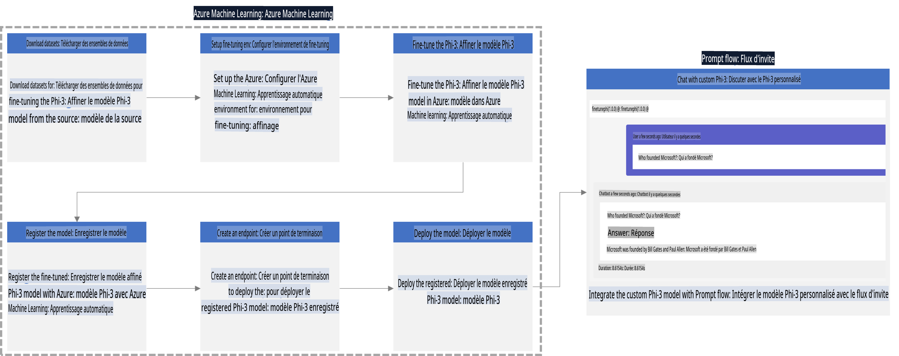
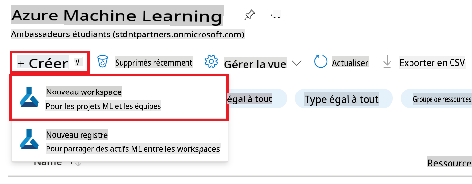
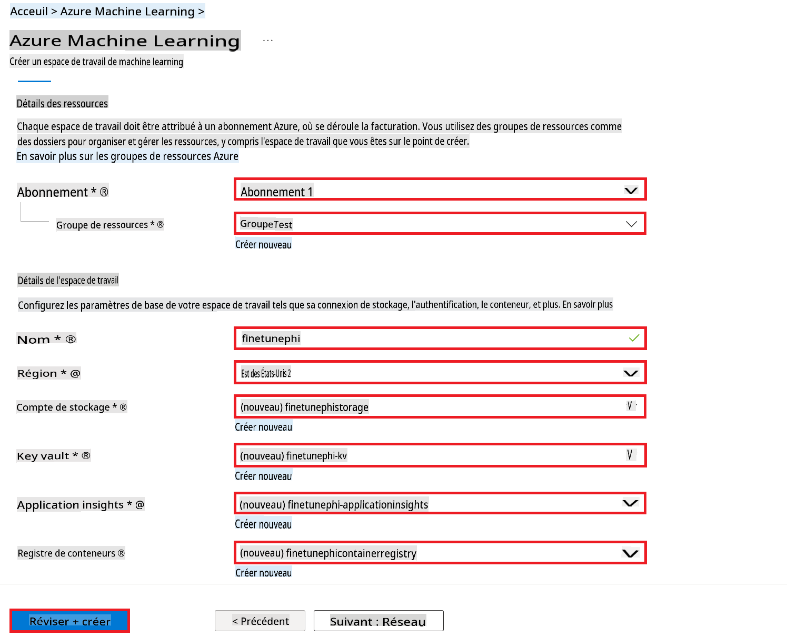
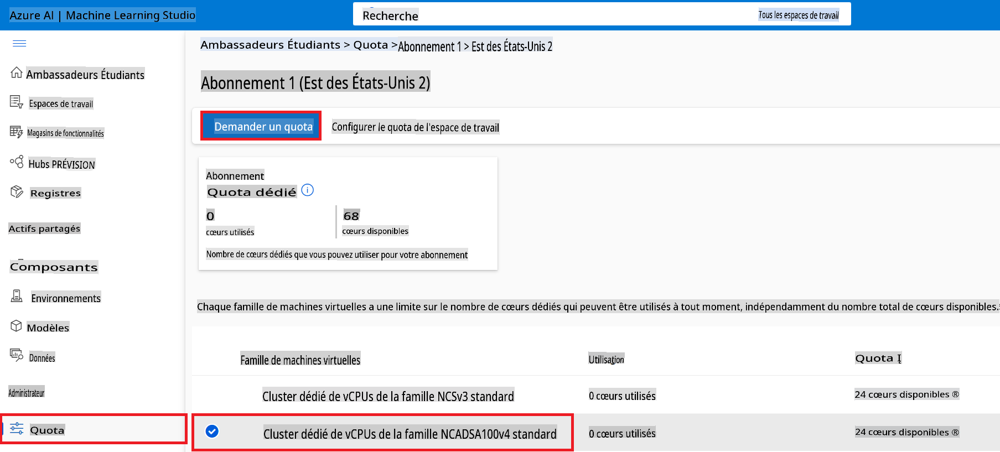
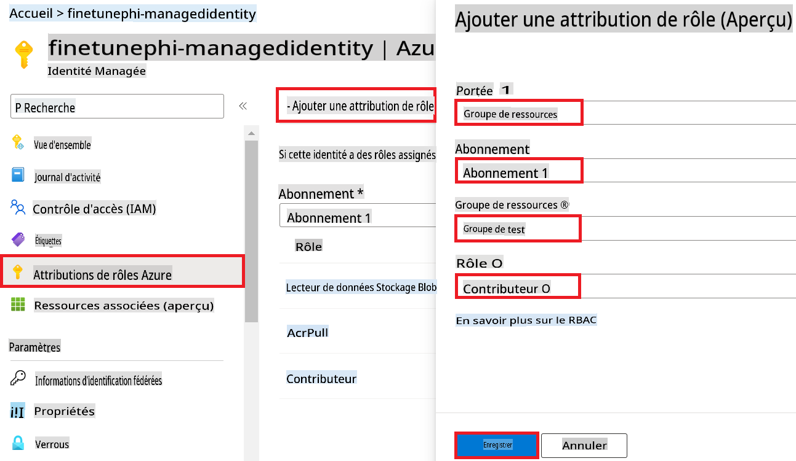

# Affiner et Intégrer des modèles Phi-3 personnalisés avec Prompt flow

Cet exemple de bout en bout (E2E) est basé sur le guide "[Fine-Tune and Integrate Custom Phi-3 Models with Prompt Flow: Step-by-Step Guide](https://techcommunity.microsoft.com/t5/educator-developer-blog/fine-tune-and-integrate-custom-phi-3-models-with-prompt-flow/ba-p/4178612?WT.mc_id=aiml-137032-kinfeylo)" de la communauté technique de Microsoft. Il introduit les processus de réglage fin, de déploiement et d'intégration de modèles Phi-3 personnalisés avec Prompt flow.

## Vue d'ensemble

Dans cet exemple E2E, vous apprendrez à affiner le modèle Phi-3 et à l'intégrer avec Prompt flow. En utilisant Azure Machine Learning et Prompt flow, vous établirez un flux de travail pour déployer et utiliser des modèles d'IA personnalisés. Cet exemple E2E est divisé en trois scénarios :

**Scénario 1 : Configurer les ressources Azure et se préparer à l'affinement**

**Scénario 2 : Affiner le modèle Phi-3 et le déployer dans Azure Machine Learning Studio**

**Scénario 3 : Intégrer avec Prompt flow et discuter avec votre modèle personnalisé**

Voici un aperçu de cet exemple E2E.



### Table des matières

1. **[Scénario 1 : Configurer les ressources Azure et se préparer à l'affinement](../../../../md/06.E2ESamples)**
    - [Créer un espace de travail Azure Machine Learning](../../../../md/06.E2ESamples)
    - [Demander des quotas GPU dans l'abonnement Azure](../../../../md/06.E2ESamples)
    - [Ajouter une attribution de rôle](../../../../md/06.E2ESamples)
    - [Configurer le projet](../../../../md/06.E2ESamples)
    - [Préparer le jeu de données pour l'affinement](../../../../md/06.E2ESamples)

1. **[Scénario 2 : Affiner le modèle Phi-3 et le déployer dans Azure Machine Learning Studio](../../../../md/06.E2ESamples)**
    - [Configurer Azure CLI](../../../../md/06.E2ESamples)
    - [Affiner le modèle Phi-3](../../../../md/06.E2ESamples)
    - [Déployer le modèle affiné](../../../../md/06.E2ESamples)

1. **[Scénario 3 : Intégrer avec Prompt flow et discuter avec votre modèle personnalisé](../../../../md/06.E2ESamples)**
    - [Intégrer le modèle Phi-3 personnalisé avec Prompt flow](../../../../md/06.E2ESamples)
    - [Discuter avec votre modèle personnalisé](../../../../md/06.E2ESamples)

## Scénario 1 : Configurer les ressources Azure et se préparer à l'affinement

### Créer un espace de travail Azure Machine Learning

1. Tapez *azure machine learning* dans la **barre de recherche** en haut de la page du portail et sélectionnez **Azure Machine Learning** parmi les options qui apparaissent.

    

1. Sélectionnez **+ Créer** dans le menu de navigation.

1. Sélectionnez **Nouvel espace de travail** dans le menu de navigation.

    

1. Effectuez les tâches suivantes :

    - Sélectionnez votre **Abonnement** Azure.
    - Sélectionnez le **Groupe de ressources** à utiliser (créez-en un nouveau si nécessaire).
    - Entrez le **Nom de l'espace de travail**. Il doit être une valeur unique.
    - Sélectionnez la **Région** que vous souhaitez utiliser.
    - Sélectionnez le **Compte de stockage** à utiliser (créez-en un nouveau si nécessaire).
    - Sélectionnez le **Key vault** à utiliser (créez-en un nouveau si nécessaire).
    - Sélectionnez les **Insights d'application** à utiliser (créez-en un nouveau si nécessaire).
    - Sélectionnez le **Registre de conteneurs** à utiliser (créez-en un nouveau si nécessaire).

    

1. Sélectionnez **Vérifier + Créer**.

1. Sélectionnez **Créer**.

### Demander des quotas GPU dans l'abonnement Azure

Dans cet exemple E2E, vous utiliserez le *Standard_NC24ads_A100_v4 GPU* pour l'affinement, ce qui nécessite une demande de quota, et le *Standard_E4s_v3* CPU pour le déploiement, ce qui ne nécessite pas de demande de quota.

> [!NOTE]
>
> Seuls les abonnements Pay-As-You-Go (le type d'abonnement standard) sont éligibles pour l'allocation de GPU ; les abonnements à bénéfices ne sont actuellement pas pris en charge.
>
> Pour ceux utilisant des abonnements à bénéfices (comme l'abonnement Visual Studio Enterprise) ou ceux cherchant à tester rapidement le processus d'affinement et de déploiement, ce tutoriel fournit également des conseils pour affiner avec un jeu de données minimal en utilisant un CPU. Cependant, il est important de noter que les résultats de l'affinement sont nettement meilleurs lorsqu'un GPU est utilisé avec des jeux de données plus grands.

1. Visitez [Azure ML Studio](https://ml.azure.com/home?wt.mc_id=studentamb_279723).

1. Effectuez les tâches suivantes pour demander un quota *Standard NCADSA100v4 Family* :

    - Sélectionnez **Quota** dans l'onglet de gauche.
    - Sélectionnez la **Famille de machines virtuelles** à utiliser. Par exemple, sélectionnez **Standard NCADSA100v4 Family Cluster Dedicated vCPUs**, qui inclut le GPU *Standard_NC24ads_A100_v4*.
    - Sélectionnez **Demander un quota** dans le menu de navigation.

        

    - À l'intérieur de la page Demander un quota, entrez la **Nouvelle limite de cœurs** que vous souhaitez utiliser. Par exemple, 24.
    - À l'intérieur de la page Demander un quota, sélectionnez **Soumettre** pour demander le quota GPU.

> [!NOTE]
> Vous pouvez sélectionner le GPU ou le CPU approprié à vos besoins en vous référant au document [Tailles des machines virtuelles dans Azure](https://learn.microsoft.com/azure/virtual-machines/sizes/overview?tabs=breakdownseries%2Cgeneralsizelist%2Ccomputesizelist%2Cmemorysizelist%2Cstoragesizelist%2Cgpusizelist%2Cfpgasizelist%2Chpcsizelist).

### Ajouter une attribution de rôle

Pour affiner et déployer vos modèles, vous devez d'abord créer une Identité Gérée Assignée par l'Utilisateur (UAI) et lui attribuer les permissions appropriées. Cette UAI sera utilisée pour l'authentification pendant le déploiement.

#### Créer une Identité Gérée Assignée par l'Utilisateur (UAI)

1. Tapez *identités gérées* dans la **barre de recherche** en haut de la page du portail et sélectionnez **Identités Gérées** parmi les options qui apparaissent.

    

1. Sélectionnez **+ Créer**.

    

1. Effectuez les tâches suivantes :

    - Sélectionnez votre **Abonnement** Azure.
    - Sélectionnez le **Groupe de ressources** à utiliser (créez-en un nouveau si nécessaire).
    - Sélectionnez la **Région** que vous souhaitez utiliser.
    - Entrez le **Nom**. Il doit être une valeur unique.

1. Sélectionnez **Vérifier + créer**.

1. Sélectionnez **+ Créer**.

#### Ajouter une attribution de rôle de Contributeur à l'Identité Gérée

1. Accédez à la ressource Identité Gérée que vous avez créée.

1. Sélectionnez **Attributions de rôles Azure** dans l'onglet de gauche.

1. Sélectionnez **+ Ajouter une attribution de rôle** dans le menu de navigation.

1. À l'intérieur de la page Ajouter une attribution de rôle, effectuez les tâches suivantes :
    - Sélectionnez la **Portée** à **Groupe de ressources**.
    - Sélectionnez votre **Abonnement** Azure.
    - Sélectionnez le **Groupe de ressources** à utiliser.
    - Sélectionnez le **Rôle** à **Contributeur**.

    

1. Sélectionnez **Enregistrer**.

#### Ajouter une attribution de rôle de Lecteur de Données Blob de Stockage à l'Identité Gérée

1. Tapez *comptes de stockage* dans la **barre de recherche** en haut de la page du portail et sélectionnez **Comptes de stockage** parmi les options qui apparaissent.

    

1. Sélectionnez le compte de stockage associé à l'espace de travail Azure Machine Learning que vous avez créé. Par exemple, *finetunephistorage*.

1. Effectuez les tâches suivantes pour accéder à la page Ajouter une attribution de rôle :

    - Accédez au compte de stockage Azure que vous avez créé.
    - Sélectionnez **Contrôle d'accès (IAM)** dans l'onglet de gauche.
    - Sélectionnez **+ Ajouter** dans le menu de navigation.
    - Sélectionnez **Ajouter une attribution de rôle** dans le menu de navigation.

    

1. À l'intérieur de la page Ajouter une attribution de rôle, effectuez les tâches suivantes :

    - À l'intérieur de la page Rôle, tapez *Lecteur de Données Blob de Stockage* dans la **barre de recherche** et sélectionnez **Lecteur de Données Blob de Stockage** parmi les options qui apparaissent.
    - À l'intérieur de la page Rôle, sélectionnez **Suivant**.
    - À l'intérieur de la page Membres, sélectionnez **Attribuer l'accès à** **Identité gérée**.
    - À l'intérieur de la page Membres, sélectionnez **+ Sélectionner des membres**.
    - À l'intérieur de la page Sélectionner des identités gérées, sélectionnez votre **Abonnement** Azure.
    - À l'intérieur de la page Sélectionner des identités gérées, sélectionnez l'**Identité gérée** à **Gérer l'Identité**.
    - À l'intérieur de la page Sélectionner des identités gérées, sélectionnez l'Identité Gérée que vous avez créée. Par exemple, *finetunephi-managedidentity*.
    - À l'intérieur de la page Sélectionner des identités gérées, sélectionnez **Sélectionner**.

    

1. Sélectionnez **Vérifier + attribuer**.

#### Ajouter une attribution de rôle AcrPull à l'Identité Gérée

1. Tapez *registres de conteneurs* dans la **barre de recherche** en haut de la page du portail et sélectionnez **Registres de conteneurs** parmi les options qui apparaissent.

    

1. Sélectionnez le registre de conteneurs associé à l'espace de travail Azure Machine Learning. Par exemple, *finetunephicontainerregistries*

1. Effectuez les tâches suivantes pour accéder à la page Ajouter une attribution de rôle :

    - Sélectionnez **Contrôle d'accès (IAM)** dans l'onglet de gauche.
    - Sélectionnez **+ Ajouter** dans le menu de navigation.
    - Sélectionnez **Ajouter une attribution de rôle** dans le menu de navigation.

1. À l'intérieur de la page Ajouter une attribution de rôle, effectuez les tâches suivantes :

    - À l'intérieur de la page Rôle, tapez *AcrPull* dans la **barre de recherche** et sélectionnez **AcrPull** parmi les options qui apparaissent.
    - À l'intérieur de la page Rôle, sélectionnez **Suivant**.
    - À l'intérieur de la page Membres, sélectionnez **Attribuer l'accès à** **Identité gérée**.
    - À l'intérieur de la page Membres, sélectionnez **+ Sélectionner des membres**.
    - À l'intérieur de la page Sélectionner des identités gérées, sélectionnez votre **Abonnement** Azure.
    - À l'intérieur de la page Sélectionner des identités gérées, sélectionnez l'**Identité gérée** à **Gérer l'Identité**.
    - À l'intérieur de la page Sélectionner des identités gérées, sélectionnez l'Identité Gérée que vous avez créée. Par exemple, *finetunephi-managedidentity*.
    - À l'intérieur de la page Sélectionner des identités gérées, sélectionnez **Sélectionner**.
    - Sélectionnez **Vérifier + attribuer**.

### Configurer le projet

Maintenant, vous allez créer un dossier pour travailler et configurer un environnement virtuel pour développer un programme qui interagit avec les utilisateurs et utilise l'historique de chat stocké dans Azure Cosmos DB pour informer ses réponses.

#### Créer un dossier pour travailler dedans

1. Ouvrez une fenêtre de terminal et tapez la commande suivante pour créer un dossier nommé *finetune-phi* dans le chemin par défaut.

    ```console
    mkdir finetune-phi
    ```

1. Tapez la commande suivante dans votre terminal pour naviguer vers le dossier *finetune-phi* que vous avez créé.

    ```console
    cd finetune-phi
    ```

#### Créer un environnement virtuel

1. Tapez la commande suivante dans votre terminal pour créer un environnement virtuel nommé *.venv*.

    ```console
    python -m venv .venv
    ```

1. Tapez la commande suivante dans votre terminal pour activer l'environnement virtuel.

    ```console
    .venv\Scripts\activate.bat
    ```

> [!NOTE]
>
> Si cela a fonctionné, vous devriez voir *(.venv)* avant l'invite de commande.

#### Installer les packages requis

1. Tapez les commandes suivantes dans votre terminal pour installer les packages requis.

    ```console
    pip install datasets==2.19.1
    pip install transformers==4.41.1
    pip install azure-ai-ml==1.16.0
    pip install torch==2.3.1
    pip install trl==0.9.4
    pip install promptflow==1.12.0
    ```

#### Créer les fichiers du projet

Dans cet exercice, vous allez créer les fichiers essentiels pour notre projet. Ces fichiers incluent des scripts pour télécharger le jeu de données, configurer l'environnement Azure Machine Learning, affiner le modèle Phi-3, et déployer le modèle affiné. Vous allez également créer un fichier *conda.yml* pour configurer l'environnement d'affinement.

Dans cet exercice, vous allez :

- Créer un fichier *download_dataset.py* pour télécharger le jeu de données.
- Créer un fichier *setup_ml.py* pour configurer l'environnement Azure Machine Learning.
- Créer un fichier *fine_tune.py* dans le dossier *finetuning_dir* pour affiner le modèle Phi-3 en utilisant le jeu de données.
- Créer un fichier *conda.yml* pour configurer l'environnement d'affinement.
- Créer un fichier *deploy_model.py* pour déployer le modèle affiné.
- Créer un fichier *integrate_with_promptflow.py* pour intégrer le modèle affiné et exécuter le modèle en utilisant Prompt flow.
- Créer un fichier flow.dag.yml pour configurer la structure de flux de travail pour Prompt flow.
- Créer un fichier *config.py* pour entrer les informations Azure.

> [!NOTE]
>
> Structure complète du dossier :
>
> ```text
> └── YourUserName
> .    └── finetune-phi
> .        ├── finetuning_dir
> .        │      └── fine_tune.py
> .        ├── conda.yml
> .        ├── config.py
> .        ├── deploy_model.py
> .        ├── download_dataset.py
> .        ├── flow.dag.yml
> .        ├── integrate_with_promptflow.py
> .        └── setup_ml.py
> ```

1. Ouvrez **Visual Studio Code**.

1. Sélectionnez **Fichier** dans la barre de menu.

1. Sélectionnez **Ouvrir le dossier**.

1. Sélectionnez le dossier *finetune-phi* que vous avez créé, situé à *C:\Users\yourUserName\finetune-phi*.

    

1. Dans le volet gauche de Visual Studio Code, cliquez avec le bouton droit et sélectionnez **Nouveau fichier** pour créer un nouveau fichier nommé *download_dataset.py*.

1. Dans le volet gauche de Visual Studio Code, cliquez avec le bouton droit et sélectionnez **Nouveau fichier** pour créer un nouveau fichier nommé *setup_ml.py*.

1. Dans le volet gauche de Visual Studio Code,


Avertissement : La traduction a été réalisée à partir de l'original par un modèle d'IA et peut ne pas être parfaite. 
Veuillez examiner le résultat et apporter les corrections nécessaires.