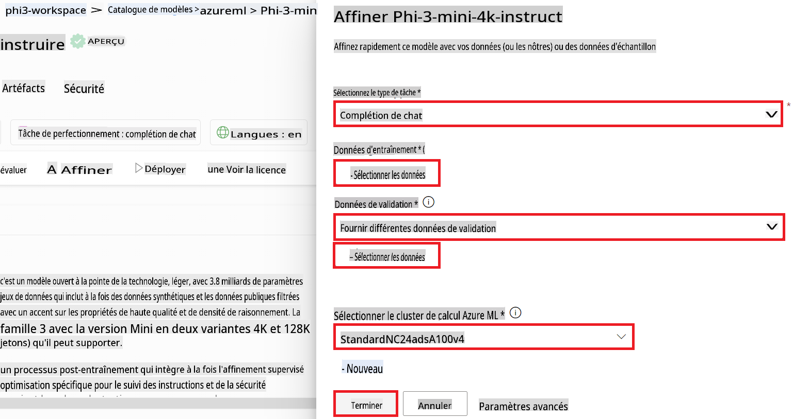
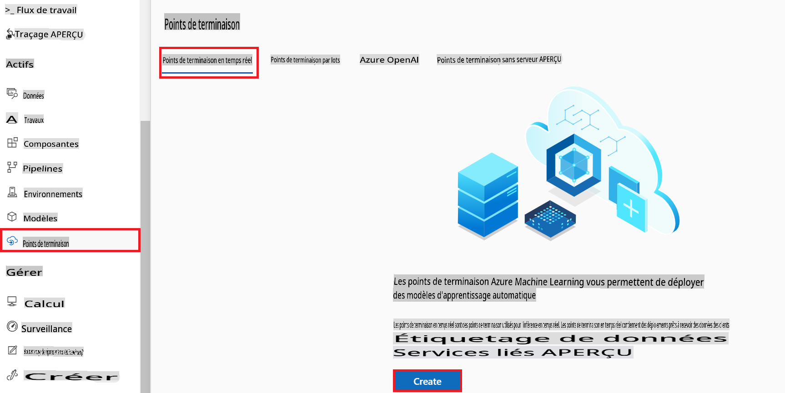
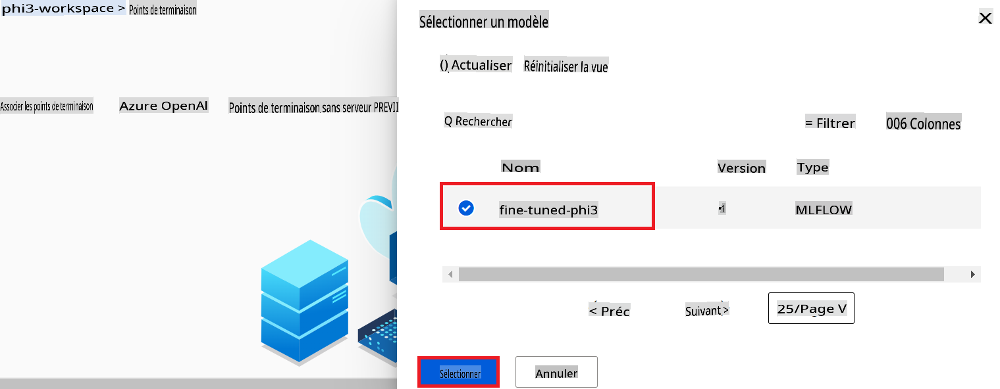
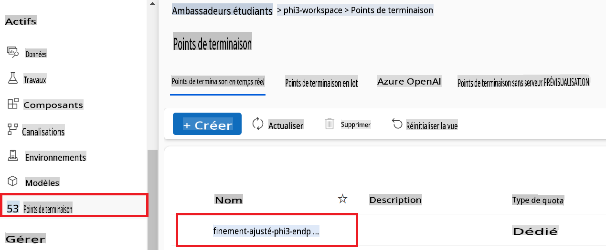
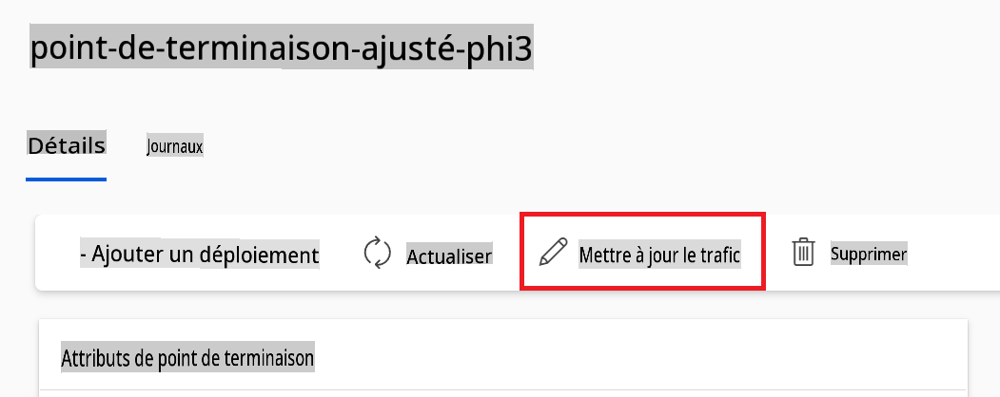
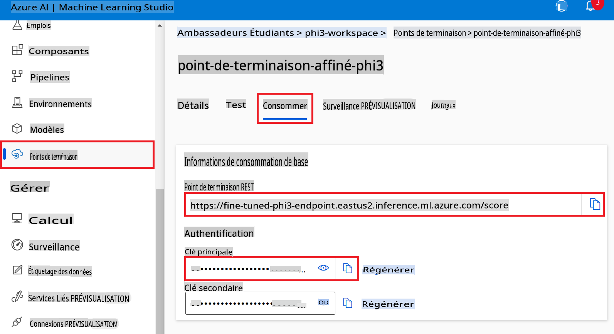
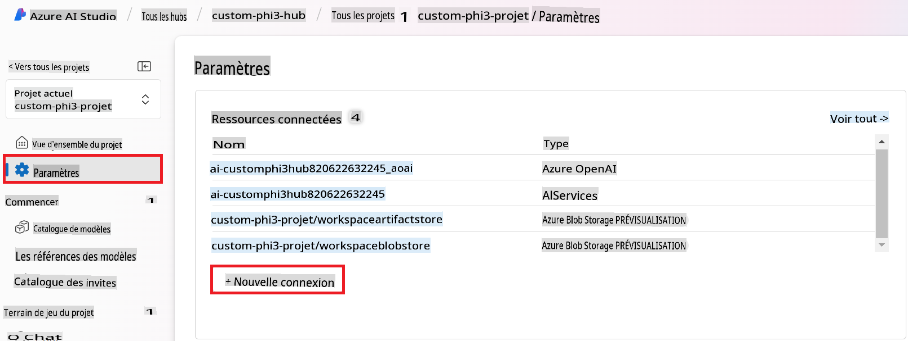
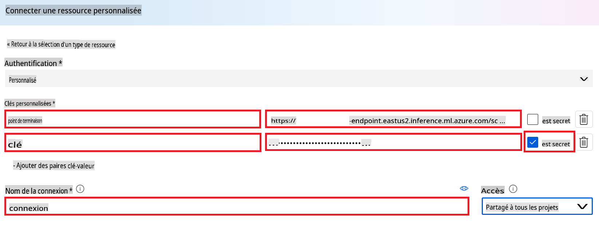
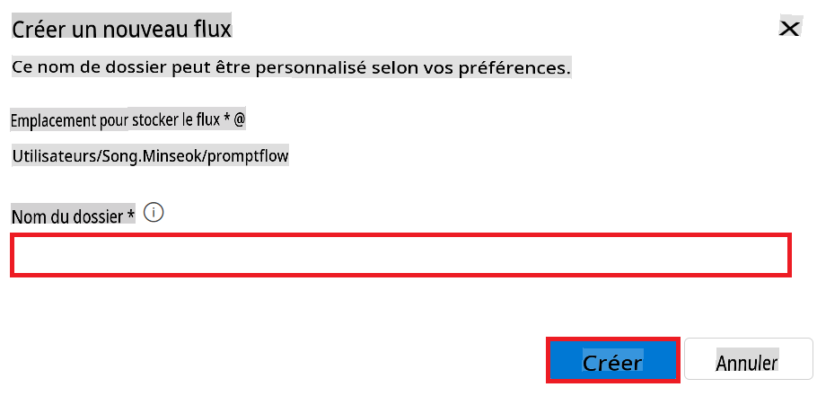

1. Visitez [Azure ML Studio](https://ml.azure.com/home?wt.mc_id=studentamb_279723).

1. Sélectionnez **Compute** dans l'onglet de gauche.

1. Sélectionnez **Compute clusters** dans le menu de navigation.

1. Sélectionnez **+ New**.

    

1. Effectuez les tâches suivantes :

    - Sélectionnez la **Région** que vous souhaitez utiliser.
    - Sélectionnez le **Niveau de machine virtuelle** sur **Dedicated**.
    - Sélectionnez le **Type de machine virtuelle** sur **GPU**.
    - Sélectionnez le filtre **Taille de machine virtuelle** sur **Select from all options**.
    - Sélectionnez la **Taille de machine virtuelle** sur **Standard_NC24ads_A100_v4**.

    

1. Sélectionnez **Next**.

1. Effectuez les tâches suivantes :

    - Entrez le **Nom de la ressource**. Il doit être unique.
    - Sélectionnez le **Nombre minimum de nœuds** sur **0**.
    - Sélectionnez le **Nombre maximum de nœuds** sur **1**.
    - Sélectionnez les **Secondes d'inactivité avant réduction d'échelle** sur **120**.

    

1. Sélectionnez **Create**.

#### Affiner le modèle Phi-3

1. Visitez [Azure ML Studio](https://ml.azure.com/home?wt.mc_id=studentamb_279723).

1. Sélectionnez l'espace de travail Azure Machine Learning que vous avez créé.

    

1. Effectuez les tâches suivantes :

    - Sélectionnez **Model catalog** dans l'onglet de gauche.
    - Tapez *phi-3-mini-4k* dans la **barre de recherche** et sélectionnez **Phi-3-mini-4k-instruct** parmi les options qui apparaissent.

    

1. Sélectionnez **Fine-tune** dans le menu de navigation.

    

1. Effectuez les tâches suivantes :

    - Sélectionnez **Select task type** sur **Chat completion**.
    - Sélectionnez **+ Select data** pour télécharger les **Données d'entraînement**.
    - Sélectionnez le type de téléchargement des données de validation sur **Provide different validation data**.
    - Sélectionnez **+ Select data** pour télécharger les **Données de validation**.

    

    > [!TIP]
    >
    > Vous pouvez sélectionner **Advanced settings** pour personnaliser des configurations telles que **learning_rate** et **lr_scheduler_type** afin d'optimiser le processus d'affinage selon vos besoins spécifiques.

1. Sélectionnez **Finish**.

1. Dans cet exercice, vous avez réussi à affiner le modèle Phi-3 en utilisant Azure Machine Learning. Veuillez noter que le processus d'affinage peut prendre un temps considérable. Après avoir lancé le travail d'affinage, vous devez attendre qu'il se termine. Vous pouvez surveiller l'état du travail d'affinage en naviguant vers l'onglet Jobs sur le côté gauche de votre espace de travail Azure Machine Learning. Dans la prochaine série, vous déploierez le modèle affiné et l'intégrerez avec Prompt flow.

    

### Déployer le modèle Phi-3 affiné

Pour intégrer le modèle Phi-3 affiné avec Prompt flow, vous devez déployer le modèle pour le rendre accessible pour des inférences en temps réel. Ce processus implique l'enregistrement du modèle, la création d'un point de terminaison en ligne et le déploiement du modèle.

Dans cet exercice, vous allez :

- Enregistrer le modèle affiné dans l'espace de travail Azure Machine Learning.
- Créer un point de terminaison en ligne.
- Déployer le modèle Phi-3 affiné enregistré.

#### Enregistrer le modèle affiné

1. Visitez [Azure ML Studio](https://ml.azure.com/home?wt.mc_id=studentamb_279723).

1. Sélectionnez l'espace de travail Azure Machine Learning que vous avez créé.

    

1. Sélectionnez **Models** dans l'onglet de gauche.
1. Sélectionnez **+ Register**.
1. Sélectionnez **From a job output**.

    

1. Sélectionnez le travail que vous avez créé.

    

1. Sélectionnez **Next**.

1. Sélectionnez **Model type** sur **MLflow**.

1. Assurez-vous que **Job output** est sélectionné; il devrait être automatiquement sélectionné.

    

1. Sélectionnez **Next**.

1. Sélectionnez **Register**.

    

1. Vous pouvez voir votre modèle enregistré en naviguant vers le menu **Models** depuis l'onglet de gauche.

    

#### Déployer le modèle affiné

1. Naviguez vers l'espace de travail Azure Machine Learning que vous avez créé.

1. Sélectionnez **Endpoints** dans l'onglet de gauche.

1. Sélectionnez **Real-time endpoints** dans le menu de navigation.

    

1. Sélectionnez **Create**.

1. Sélectionnez le modèle enregistré que vous avez créé.

    

1. Sélectionnez **Select**.

1. Effectuez les tâches suivantes :

    - Sélectionnez **Virtual machine** sur *Standard_NC6s_v3*.
    - Sélectionnez le **Nombre d'instances** que vous souhaitez utiliser. Par exemple, *1*.
    - Sélectionnez le **Point de terminaison** sur **New** pour créer un point de terminaison.
    - Entrez le **Nom du point de terminaison**. Il doit être unique.
    - Entrez le **Nom du déploiement**. Il doit être unique.

    

1. Sélectionnez **Deploy**.

> [!WARNING]
> Pour éviter des frais supplémentaires sur votre compte, assurez-vous de supprimer le point de terminaison créé dans l'espace de travail Azure Machine Learning.
>

#### Vérifier l'état du déploiement dans l'espace de travail Azure Machine Learning

1. Naviguez vers l'espace de travail Azure Machine Learning que vous avez créé.

1. Sélectionnez **Endpoints** dans l'onglet de gauche.

1. Sélectionnez le point de terminaison que vous avez créé.

    

1. Sur cette page, vous pouvez gérer les points de terminaison pendant le processus de déploiement.

> [!NOTE]
> Une fois le déploiement terminé, assurez-vous que **Live traffic** est réglé sur **100%**. Si ce n'est pas le cas, sélectionnez **Update traffic** pour ajuster les paramètres de trafic. Notez que vous ne pouvez pas tester le modèle si le trafic est réglé sur 0%.
>
> 
>

## Scénario 3 : Intégrer avec Prompt flow et discuter avec votre modèle personnalisé dans Azure AI Studio

### Intégrer le modèle personnalisé Phi-3 avec Prompt flow

Après avoir déployé avec succès votre modèle affiné, vous pouvez maintenant l'intégrer avec Prompt Flow pour utiliser votre modèle dans des applications en temps réel, permettant une variété de tâches interactives avec votre modèle personnalisé Phi-3.

Dans cet exercice, vous allez :

- Créer un Hub Azure AI Studio.
- Créer un Projet Azure AI Studio.
- Créer un Prompt flow.
- Ajouter une connexion personnalisée pour le modèle Phi-3 affiné.
- Configurer Prompt flow pour discuter avec votre modèle personnalisé Phi-3.

> [!NOTE]
> Vous pouvez également intégrer avec Promptflow en utilisant Azure ML Studio. Le même processus d'intégration peut être appliqué à Azure ML Studio.

#### Créer un Hub Azure AI Studio

Vous devez créer un Hub avant de créer le Projet. Un Hub fonctionne comme un groupe de ressources, vous permettant d'organiser et de gérer plusieurs Projets au sein d'Azure AI Studio.

1. Visitez [Azure AI Studio](https://ai.azure.com/?WT.mc_id=aiml-137032-kinfeylo).

1. Sélectionnez **All hubs** dans l'onglet de gauche.

1. Sélectionnez **+ New hub** dans le menu de navigation.

    

1. Effectuez les tâches suivantes :

    - Entrez le **Nom du hub**. Il doit être unique.
    - Sélectionnez votre **Abonnement Azure**.
    - Sélectionnez le **Groupe de ressources** à utiliser (créez-en un nouveau si nécessaire).
    - Sélectionnez l'**Emplacement** que vous souhaitez utiliser.
    - Sélectionnez les **Services Azure AI** à connecter (créez-en un nouveau si nécessaire).
    - Sélectionnez **Connect Azure AI Search** sur **Skip connecting**.

    

1. Sélectionnez **Next**.

#### Créer un Projet Azure AI Studio

1. Dans le Hub que vous avez créé, sélectionnez **All projects** dans l'onglet de gauche.

1. Sélectionnez **+ New project** dans le menu de navigation.

    

1. Entrez le **Nom du projet**. Il doit être unique.

    

1. Sélectionnez **Create a project**.

#### Ajouter une connexion personnalisée pour le modèle Phi-3 affiné

Pour intégrer votre modèle personnalisé Phi-3 avec Prompt flow, vous devez enregistrer le point de terminaison et la clé du modèle dans une connexion personnalisée. Cette configuration garantit l'accès à votre modèle personnalisé Phi-3 dans Prompt flow.

#### Définir la clé API et l'URI du point de terminaison du modèle Phi-3 affiné

1. Visitez [Azure ML Studio](https://ml.azure.com/home?WT.mc_id=aiml-137032-kinfeylo).

1. Naviguez vers l'espace de travail Azure Machine Learning que vous avez créé.

1. Sélectionnez **Endpoints** dans l'onglet de gauche.

    

1. Sélectionnez le point de terminaison que vous avez créé.

    

1. Sélectionnez **Consume** dans le menu de navigation.

1. Copiez votre **REST endpoint** et **Primary key**.


#### Ajouter la Connexion Personnalisée

1. Rendez-vous sur [Azure AI Studio](https://ai.azure.com/?WT.mc_id=aiml-137032-kinfeylo).

1. Accédez au projet Azure AI Studio que vous avez créé.

1. Dans le projet que vous avez créé, sélectionnez **Paramètres** dans l'onglet de gauche.

1. Sélectionnez **+ Nouvelle connexion**.

    

1. Sélectionnez **Clés personnalisées** dans le menu de navigation.

    

1. Effectuez les tâches suivantes :

    - Sélectionnez **+ Ajouter des paires clé-valeur**.
    - Pour le nom de la clé, entrez **endpoint** et collez l'endpoint que vous avez copié depuis Azure ML Studio dans le champ de valeur.
    - Sélectionnez **+ Ajouter des paires clé-valeur** à nouveau.
    - Pour le nom de la clé, entrez **key** et collez la clé que vous avez copiée depuis Azure ML Studio dans le champ de valeur.
    - Après avoir ajouté les clés, sélectionnez **est secret** pour éviter que la clé ne soit exposée.

    

1. Sélectionnez **Ajouter connexion**.

#### Créer un Prompt flow

Vous avez ajouté une connexion personnalisée dans Azure AI Studio. Maintenant, créons un Prompt flow en suivant les étapes ci-dessous. Ensuite, vous connecterez ce Prompt flow à la connexion personnalisée afin de pouvoir utiliser le modèle ajusté finement dans le Prompt flow.

1. Accédez au projet Azure AI Studio que vous avez créé.

1. Sélectionnez **Prompt flow** dans l'onglet de gauche.

1. Sélectionnez **+ Créer** dans le menu de navigation.

    

1. Sélectionnez **Chat flow** dans le menu de navigation.

    

1. Entrez **Nom du dossier** à utiliser.

    

1. Sélectionnez **Créer**.

#### Configurer Prompt flow pour discuter avec votre modèle personnalisé Phi-3

Vous devez intégrer le modèle ajusté finement Phi-3 dans un Prompt flow. Cependant, le Prompt flow existant fourni n'est pas conçu pour cet usage. Par conséquent, vous devez redessiner le Prompt flow pour permettre l'intégration du modèle personnalisé.

1. Dans le Prompt flow, effectuez les tâches suivantes pour reconstruire le flux existant :

    - Sélectionnez **Mode fichier brut**.
    - Supprimez tout le code existant dans le fichier *flow.dag.yml*.
    - Ajoutez le code suivant au fichier *flow.dag.yml*.

        ```yml
        inputs:
          input_data:
            type: string
            default: "Qui a fondé Microsoft?"

        outputs:
          answer:
            type: string
            reference: ${integrate_with_promptflow.output}

        nodes:
        - name: integrate_with_promptflow
          type: python
          source:
            type: code
            path: integrate_with_promptflow.py
          inputs:
            input_data: ${inputs.input_data}
        ```

    - Sélectionnez **Enregistrer**.

    

1. Ajoutez le code suivant au fichier *integrate_with_promptflow.py* pour utiliser le modèle personnalisé Phi-3 dans Prompt flow.

    ```python
    import logging
    import requests
    from promptflow import tool
    from promptflow.connections import CustomConnection

    # Configuration de la journalisation
    logging.basicConfig(
        format="%(asctime)s - %(levelname)s - %(name)s - %(message)s",
        datefmt="%Y-%m-%d %H:%M:%S",
        level=logging.DEBUG
    )
    logger = logging.getLogger(__name__)

    def query_phi3_model(input_data: str, connection: CustomConnection) -> str:
        """
        Envoyer une requête à l'endpoint du modèle Phi-3 avec les données d'entrée fournies en utilisant la Connexion Personnalisée.
        """

        # "connection" est le nom de la Connexion Personnalisée, "endpoint", "key" sont les clés dans la Connexion Personnalisée
        endpoint_url = connection.endpoint
        api_key = connection.key

        headers = {
            "Content-Type": "application/json",
            "Authorization": f"Bearer {api_key}"
        }
        data = {
            "input_data": {
                "input_string": [
                    {"role": "user", "content": input_data}
                ],
                "parameters": {
                    "temperature": 0.7,
                    "max_new_tokens": 128
                }
            }
        }
        try:
            response = requests.post(endpoint_url, json=data, headers=headers)
            response.raise_for_status()
            
            # Enregistrer la réponse JSON complète
            logger.debug(f"Réponse JSON complète: {response.json()}")

            result = response.json()["output"]
            logger.info("Réponse reçue avec succès de l'Endpoint Azure ML.")
            return result
        except requests.exceptions.RequestException as e:
            logger.error(f"Erreur lors de la requête à l'Endpoint Azure ML: {e}")
            raise

    @tool
    def my_python_tool(input_data: str, connection: CustomConnection) -> str:
        """
        Fonction outil pour traiter les données d'entrée et interroger le modèle Phi-3.
        """
        return query_phi3_model(input_data, connection)

    ```

    

> [!NOTE]
> Pour plus d'informations détaillées sur l'utilisation de Prompt flow dans Azure AI Studio, vous pouvez consulter [Prompt flow dans Azure AI Studio](https://learn.microsoft.com/azure/ai-studio/how-to/prompt-flow).

1. Sélectionnez **Entrée du chat**, **Sortie du chat** pour activer le chat avec votre modèle.

    

1. Vous êtes maintenant prêt à discuter avec votre modèle personnalisé Phi-3. Dans le prochain exercice, vous apprendrez comment démarrer Prompt flow et l'utiliser pour discuter avec votre modèle Phi-3 ajusté finement.

> [!NOTE]
>
> Le flux reconstruit devrait ressembler à l'image ci-dessous :
>
> 
>

### Discuter avec votre modèle personnalisé Phi-3

Maintenant que vous avez ajusté finement et intégré votre modèle personnalisé Phi-3 avec Prompt flow, vous êtes prêt à commencer à interagir avec lui. Cet exercice vous guidera à travers le processus de configuration et de démarrage d'une conversation avec votre modèle en utilisant Prompt flow. En suivant ces étapes, vous pourrez pleinement utiliser les capacités de votre modèle Phi-3 ajusté finement pour diverses tâches et conversations.

- Discutez avec votre modèle personnalisé Phi-3 en utilisant Prompt flow.

#### Démarrer Prompt flow

1. Sélectionnez **Démarrer les sessions de calcul** pour démarrer Prompt flow.

    

1. Sélectionnez **Valider et analyser l'entrée** pour renouveler les paramètres.

    

1. Sélectionnez la **Valeur** de la **connexion** à la connexion personnalisée que vous avez créée. Par exemple, *connexion*.

    

#### Discuter avec votre modèle personnalisé

1. Sélectionnez **Chat**.

    

1. Voici un exemple de résultats : Vous pouvez maintenant discuter avec votre modèle personnalisé Phi-3. Il est recommandé de poser des questions basées sur les données utilisées pour l'ajustement fin.

    

Avertissement : La traduction a été réalisée à partir de l'original par un modèle d'IA et peut ne pas être parfaite. 
Veuillez vérifier le résultat et apporter les corrections nécessaires.