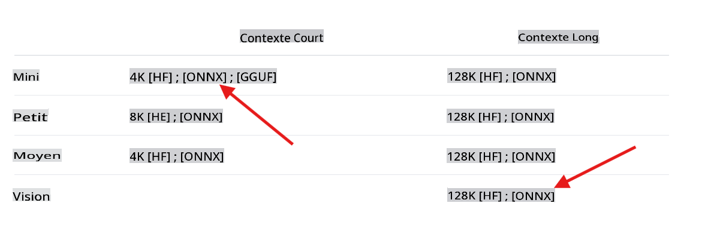

## Bienvenue aux laboratoires Phi-3 utilisant C#.

Il y a une sélection de laboratoires qui montrent comment intégrer les puissantes versions différentes des modèles Phi-3 dans un environnement .NET.

## Prérequis
Avant de lancer l'exemple, assurez-vous d'avoir installé les éléments suivants :

**.NET 8 :** Assurez-vous d'avoir la [dernière version de .NET](https://dotnet.microsoft.com/download/dotnet/8.0?WT.mc_id=aiml-137032-kinfeylo) installée sur votre machine.

**(Optionnel) Visual Studio ou Visual Studio Code :** Vous aurez besoin d'un IDE ou éditeur de code capable d'exécuter des projets .NET. [Visual Studio](https://visualstudio.microsoft.com/) ou [Visual Studio Code](https://code.visualstudio.com?WT.mc_id=aiml-137032-kinfeylo) sont recommandés.

**Utiliser git** pour cloner localement l'une des versions disponibles de Phi-3 depuis [Hugging Face](https://huggingface.co).

**Téléchargez le modèle phi3-mini-4k-instruct-onnx** sur votre machine locale :

### naviguez vers le dossier pour stocker les modèles
```bash
cd c:\phi3\models
```
### ajoutez le support pour lfs
```bash
git lfs install 
```
### clonez et téléchargez le modèle mini 4K instruct
```bash
git clone https://huggingface.co/microsoft/Phi-3-mini-4k-instruct-onnx
```

### clonez et téléchargez le modèle vision 128K
```
git clone https://huggingface.co/microsoft/Phi-3-vision-128k-instruct-onnx-cpu
```
**Important :** Les démos actuelles sont conçues pour utiliser les versions ONNX du modèle. Les étapes précédentes clonent les modèles suivants.



## À propos des laboratoires

La solution principale comporte plusieurs laboratoires d'exemple qui démontrent les capacités des modèles Phi-3 en utilisant C#.

| Projet | Description | Emplacement |
| ------------ | ----------- | -------- |
| LabsPhi301    | Il s'agit d'un projet d'exemple qui utilise un modèle phi3 local pour poser une question. Le projet charge un modèle ONNX Phi-3 local en utilisant le `Microsoft.ML.OnnxRuntime` libraries. | .\src\LabsPhi301\ |
| LabsPhi302    | This is a sample project that implement a Console chat using Semantic Kernel. | .\src\LabsPhi302\ |
| LabsPhi303 | This is a sample project that uses a local phi3 vision model to analyze images.. The project load a local ONNX Phi-3 Vision model using the `Microsoft.ML.OnnxRuntime` libraries. | .\src\LabsPhi303\ |
| LabsPhi304 | This is a sample project that uses a local phi3 vision model to analyze images.. The project load a local ONNX Phi-3 Vision model using the `Microsoft.ML.OnnxRuntime` libraries. The project also presents a menu with different options to interacti with the user. | .\src\LabsPhi304\ |
| LabsPhi305 | This is a sample project that uses a the Phi-3 hosted in ollama model to answer a question.  |**coming soon**|
| LabsPhi306 | This is a sample project that implement a Console chat using Semantic Kernel. |**coming soon**|
| LabsPhi307  | This is a sample project that implement a RAG using local embeddings and Semantic Kernel. |**coming soon**|


## How to Run the Projects

To run the projects, follow these steps:
1. Clone the repository to your local machine.

1. Open a terminal and navigate to the desired project. In example, let's run `LabsPhi301`.
    ```bash
    cd .\src\LabsPhi301\
    ```

1. Exécutez le projet avec la commande
    ```bash
    dotnet run
    ```

1.  Le projet d'exemple demande une entrée utilisateur et répond en utilisant le mode local.

    La démo en cours d'exécution est similaire à celle-ci :

    

    ***Note :** il y a une faute de frappe dans la première question, Phi-3 est suffisamment cool pour partager la bonne réponse !*

1.  Le projet `LabsPhi304` demande à l'utilisateur de sélectionner différentes options, puis traite la demande. Par exemple, analyser une image locale.

    La démo en cours d'exécution est similaire à celle-ci :

    

**Avertissement** :
Ce document a été traduit en utilisant des services de traduction automatisée par IA. Bien que nous nous efforcions d'être précis, veuillez noter que les traductions automatisées peuvent contenir des erreurs ou des inexactitudes. Le document original dans sa langue d'origine doit être considéré comme la source faisant autorité. Pour des informations critiques, il est recommandé de faire appel à une traduction humaine professionnelle. Nous ne sommes pas responsables des malentendus ou des interprétations erronées résultant de l'utilisation de cette traduction.