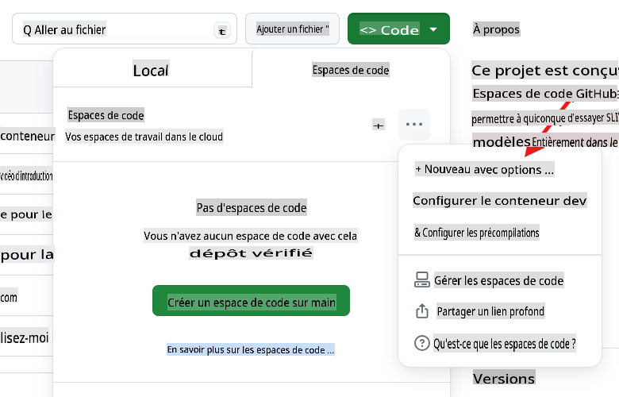
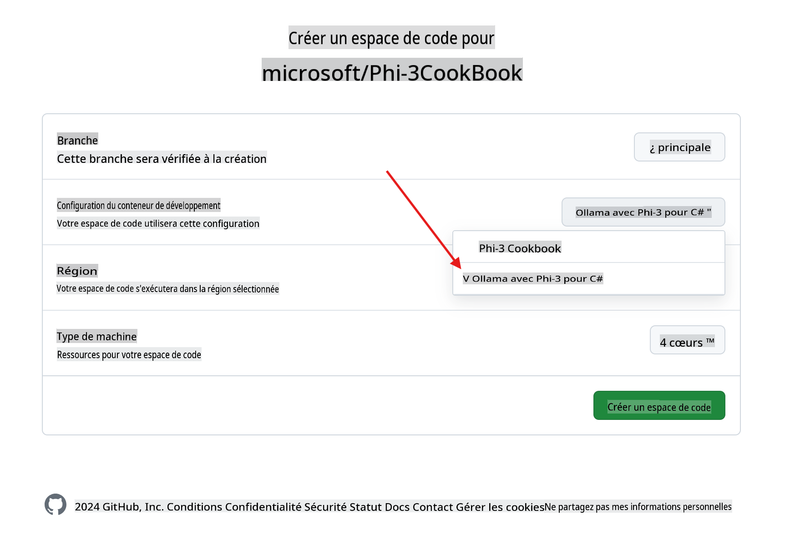

# Terrain de jeu Ollama C#

Ce laboratoire est conçu pour tester Phi-3 avec des exemples en C# directement dans GitHub Codespaces, offrant ainsi une manière simple pour tout le monde d'essayer les SLMs (petits modèles de langage) entièrement dans le navigateur.

## Comment créer le Codespace C# + Ollama + Phi-3

1. Créez un nouveau Codespace en utilisant le bouton `Code` en haut du dépôt. Sélectionnez [+ New with options ...]


1. Depuis la page des options, sélectionnez la configuration nommée `Ollama with Phi-3 for C#`



1. Une fois le Codespace chargé, il devrait avoir [ollama](https://ollama.com/) pré-installé, le dernier modèle Phi-3 téléchargé, et [.NET 8](https://dotnet.microsoft.com/download) installé.

1. (Optionnel) Utilisez le terminal du Codespace pour demander à Ollama d'exécuter le modèle [phi3](https://ollama.com/library/phi3) :

    ```shell
    ollama run phi3
    ```

4. Vous pouvez envoyer un message à ce modèle depuis l'invite.

    ```shell
    >>> Write a joke about kittens
    ```

5. Après plusieurs secondes, vous devriez voir une réponse en provenance du modèle.

    

1. Pour en savoir plus sur les différentes techniques utilisées avec les modèles de langage, consultez les projets d'exemples dans le dossier `.\src` :

| Projet | Description |
|--------|-------------|
| Sample01  | C'est un projet exemple qui utilise le modèle Phi-3 hébergé dans Ollama pour répondre à une question.  |
| Sample02  | C'est un projet exemple qui implémente un chat de console utilisant Semantic Kernel. |
| [Sample03](./src/Sample03/readme.md)  | C'est un projet exemple qui implémente un RAG en utilisant des embeddings locaux et Semantic Kernel. Consultez les détails du RAG local [ici](./src/Sample03/readme.md) |

## Comment exécuter un exemple

1. Ouvrez un terminal et naviguez vers le projet souhaité. Par exemple, exécutons `Sample02`, le chat de console.

    ```bash
    cd .\src\Sample02\
    ```

1. Exécutez le projet avec la commande

    ```bash
    dotnet run
    ```

1. Le projet `Sample02` définit un message système personnalisé :

    ```csharp
    var history = new ChatHistory();
    history.AddSystemMessage("You are a useful chatbot. If you don't know an answer, say 'I don't know!'. Always reply in a funny ways. Use emojis if possible.");

    ```

1. Ainsi, lorsque l'utilisateur pose une question, comme `What is the capital of Italy?`, le chat répond en utilisant le mode local.
   
    La sortie est similaire à celle-ci :

    

## Tutoriels vidéo

Si vous souhaitez en savoir plus sur l'utilisation de Codespaces avec Ollama dans un dépôt GitHub, consultez la vidéo de 3 minutes suivante :

[](https://youtu.be/HmKpHErUEHM)

