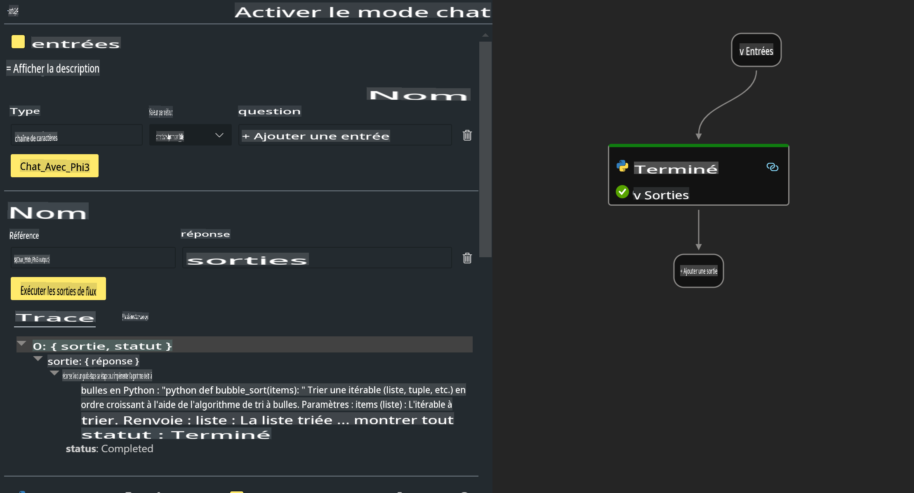

# **Lab 2 - Exécuter un flux de prompts avec Phi-3-mini dans AIPC**

## **Qu'est-ce que Prompt flow**

Prompt flow est une suite d'outils de développement conçue pour simplifier le cycle de développement complet des applications d'IA basées sur LLM, de l'idéation, du prototypage, des tests, de l'évaluation au déploiement en production et à la surveillance. Il rend l'ingénierie des prompts beaucoup plus facile et vous permet de créer des applications LLM de qualité production.

Avec prompt flow, vous pourrez :

- Créer des flux qui relient les LLM, les prompts, le code Python et d'autres outils ensemble dans un workflow exécutable.

- Déboguer et itérer vos flux, en particulier l'interaction avec les LLM, avec facilité.

- Évaluer vos flux, calculer des métriques de qualité et de performance avec des ensembles de données plus larges.

- Intégrer les tests et l'évaluation dans votre système CI/CD pour assurer la qualité de votre flux.

- Déployer vos flux sur la plateforme de service de votre choix ou les intégrer facilement dans le code de votre application.

- (Optionnel mais fortement recommandé) Collaborer avec votre équipe en utilisant la version cloud de Prompt flow dans Azure AI.

## **Qu'est-ce que l'AIPC**

Un PC AI dispose d'un CPU, d'un GPU et d'un NPU, chacun avec des capacités spécifiques d'accélération AI. Un NPU, ou unité de traitement neuronal, est un accélérateur spécialisé qui traite les tâches d'intelligence artificielle (IA) et d'apprentissage automatique (ML) directement sur votre PC au lieu d'envoyer les données à traiter dans le cloud. Le GPU et le CPU peuvent également traiter ces charges de travail, mais le NPU est particulièrement bon pour les calculs AI à faible consommation. Le PC AI représente un changement fondamental dans la manière dont nos ordinateurs fonctionnent. Ce n'est pas une solution à un problème qui n'existait pas auparavant. Au contraire, il promet d'être une énorme amélioration pour les usages quotidiens des PC.

Alors, comment cela fonctionne-t-il ? Comparé à l'IA générative et aux modèles de langage massifs (LLM) entraînés sur des tonnes de données publiques, l'IA qui se produira sur votre PC est plus accessible à presque tous les niveaux. Le concept est plus facile à digérer, et parce qu'il est entraîné sur vos données, sans avoir besoin d'accéder au cloud, les avantages sont plus immédiatement attrayants pour une population plus large.

À court terme, le monde des PC AI implique des assistants personnels et de plus petits modèles AI fonctionnant directement sur votre PC, utilisant vos données pour offrir des améliorations AI personnelles, privées et plus sécurisées pour les choses que vous faites déjà tous les jours – prendre des notes de réunion, organiser une ligue de football fantastique, automatiser les améliorations pour l'édition de photos et de vidéos, ou planifier l'itinéraire parfait pour une réunion de famille en fonction des heures d'arrivée et de départ de chacun.


## **Créer des flux de génération de code sur AIPC**

***Note*** : Si vous n'avez pas terminé l'installation de l'environnement, veuillez visiter [Lab 0 - Installations](./01.Installations.md)

1. Ouvrez l'extension Prompt flow dans Visual Studio Code et créez un projet de flux vide


2. Ajoutez des paramètres d'entrées et de sorties et ajoutez du code Python comme nouveau flux



Vous pouvez vous référer à cette structure (flow.dag.yaml) pour construire votre flux

```yaml

inputs:
  question:
    type: string
    default: how to write Bubble Algorithm
outputs:
  answer:
    type: string
    reference: ${Chat_With_Phi3.output}
nodes:
- name: Chat_With_Phi3
  type: python
  source:
    type: code
    path: Chat_With_Phi3.py
  inputs:
    question: ${inputs.question}


```

3. Ajoutez du code dans ***Chat_With_Phi3.py***

```python


from promptflow.core import tool

# import torch
from transformers import AutoTokenizer, pipeline,TextStreamer
import intel_npu_acceleration_library as npu_lib

import warnings

import asyncio
import platform

class Phi3CodeAgent:
    
    model = None
    tokenizer = None
    text_streamer = None
    
    model_id = "microsoft/Phi-3-mini-4k-instruct"

    @staticmethod
    def init_phi3():
        
        if Phi3CodeAgent.model is None or Phi3CodeAgent.tokenizer is None or Phi3CodeAgent.text_streamer is None:
            Phi3CodeAgent.model = npu_lib.NPUModelForCausalLM.from_pretrained(
                                    Phi3CodeAgent.model_id,
                                    torch_dtype="auto",
                                    dtype=npu_lib.int4,
                                    trust_remote_code=True
                                )
            Phi3CodeAgent.tokenizer = AutoTokenizer.from_pretrained(Phi3CodeAgent.model_id)
            Phi3CodeAgent.text_streamer = TextStreamer(Phi3CodeAgent.tokenizer, skip_prompt=True)

    

    @staticmethod
    def chat_with_phi3(prompt):
        
        Phi3CodeAgent.init_phi3()

        messages = "<|system|>You are a AI Python coding assistant. Please help me to generate code in Python.The answer only genertated Python code, but any comments and instructions do not need to be generated<|end|><|user|>" + prompt +"<|end|><|assistant|>"


        generation_args = {
            "max_new_tokens": 1024,
            "return_full_text": False,
            "temperature": 0.3,
            "do_sample": False,
            "streamer": Phi3CodeAgent.text_streamer,
        }

        pipe = pipeline(
            "text-generation",
            model=Phi3CodeAgent.model,
            tokenizer=Phi3CodeAgent.tokenizer,
            # **generation_args
        )

        result = ''

        with warnings.catch_warnings():
            warnings.simplefilter("ignore")
            response = pipe(messages, **generation_args)
            result =response[0]['generated_text']
            return result


@tool
def my_python_tool(question: str) -> str:
    if platform.system() == 'Windows':
        asyncio.set_event_loop_policy(asyncio.WindowsSelectorEventLoopPolicy())
    return Phi3CodeAgent.chat_with_phi3(question)


```

4. Vous pouvez tester le flux à partir de Debug ou Run pour vérifier si le code de génération est correct ou non


5. Exécutez le flux comme API de développement dans le terminal

```

pf flow serve --source ./ --port 8080 --host localhost   

```

Vous pouvez le tester dans Postman / Thunder Client


### **Remarque**

1. La première exécution prend beaucoup de temps. Il est recommandé de télécharger le modèle phi-3 depuis Hugging face CLI.

2. En raison de la puissance de calcul limitée de l'Intel NPU, il est recommandé d'utiliser Phi-3-mini-4k-instruct

3. Nous utilisons l'accélération Intel NPU pour quantifier la conversion INT4, mais si vous réexécutez le service, vous devez supprimer les dossiers cache et nc_workshop.


## **Ressources**

1. Apprendre Promptflow [https://microsoft.github.io/promptflow/](https://microsoft.github.io/promptflow/)

2. Apprendre l'accélération Intel NPU [https://github.com/intel/intel-npu-acceleration-library](https://github.com/intel/intel-npu-acceleration-library)

3. Exemple de code, télécharger [Exemple de code de l'agent local NPU](../../../../../../../code/07.Lab/01/AIPC/local-npu-agent)

**Avertissement** :
Ce document a été traduit à l'aide de services de traduction automatique basés sur l'IA. Bien que nous nous efforcions d'assurer l'exactitude, veuillez noter que les traductions automatiques peuvent contenir des erreurs ou des inexactitudes. Le document original dans sa langue d'origine doit être considéré comme la source faisant autorité. Pour des informations critiques, il est recommandé de faire appel à une traduction humaine professionnelle. Nous ne sommes pas responsables des malentendus ou des interprétations erronées résultant de l'utilisation de cette traduction.