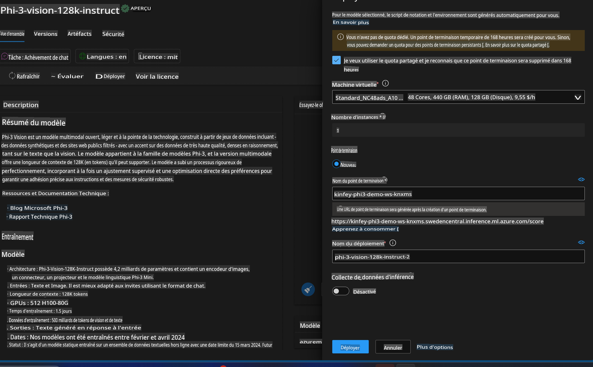
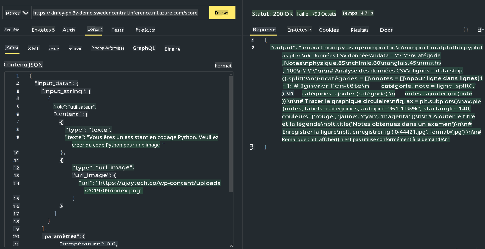

# **Lab 3 - Déployer Phi-3-vision sur Azure Machine Learning Service**

Nous utilisons NPU pour compléter le déploiement de production du code local, puis nous voulons introduire la capacité d'introduire PHI-3-VISION à travers celui-ci pour générer du code à partir d'images.

Dans cette introduction, nous pouvons rapidement construire un service Model As Service Phi-3 Vision dans Azure Machine Learning Service.

***Note*** : Phi-3 Vision nécessite une puissance de calcul pour générer du contenu plus rapidement. Nous avons besoin de la puissance de calcul en nuage pour nous aider à y parvenir.

### **1. Créer Azure Machine Learning Service**

Nous devons créer un Azure Machine Learning Service dans le portail Azure. Si vous voulez apprendre comment, veuillez visiter ce lien [https://learn.microsoft.com/azure/machine-learning/quickstart-create-resources?view=azureml-api-2](https://learn.microsoft.com/azure/machine-learning/quickstart-create-resources?view=azureml-api-2)

### **2. Choisir Phi-3 Vision dans Azure Machine Learning Service**


### **3. Déployer Phi-3-Vision dans Azure**



### **4. Tester l'Endpoint dans Postman**



***Note***

1. Les paramètres à transmettre doivent inclure Authorization, azureml-model-deployment, et Content-Type. Vous devez vérifier les informations de déploiement pour les obtenir.

2. Pour transmettre des paramètres, Phi-3-Vision doit transmettre un lien d'image. Veuillez vous référer à la méthode GPT-4-Vision pour transmettre des paramètres, comme

```json

{
  "input_data":{
    "input_string":[
      {
        "role":"user",
        "content":[ 
          {
            "type": "text",
            "text": "You are a Python coding assistant.Please create Python code for image "
          },
          {
              "type": "image_url",
              "image_url": {
                "url": "https://ajaytech.co/wp-content/uploads/2019/09/index.png"
              }
          }
        ]
      }
    ],
    "parameters":{
          "temperature": 0.6,
          "top_p": 0.9,
          "do_sample": false,
          "max_new_tokens": 2048
    }
  }
}

```

3. Appeler **/score** en utilisant la méthode Post

**Félicitations** ! Vous avez complété le déploiement rapide de PHI-3-VISION et essayé comment utiliser des images pour générer du code. Ensuite, nous pouvons construire des applications en combinant les NPU et le cloud.

Avertissement : La traduction a été effectuée à partir de l'original par un modèle d'IA et peut ne pas être parfaite. 
Veuillez revoir le résultat et apporter les corrections nécessaires.