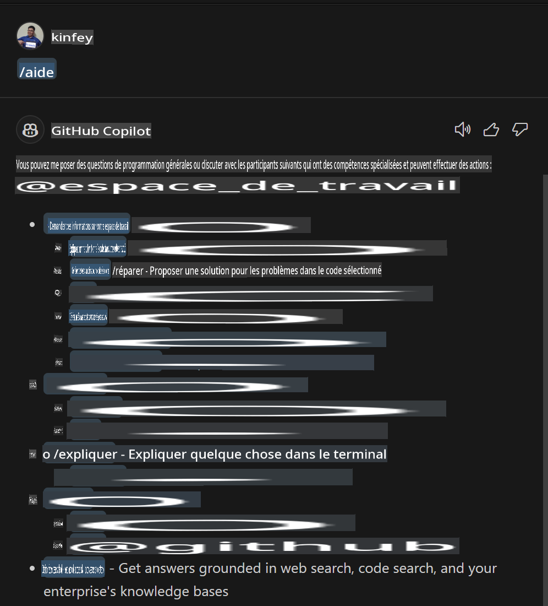
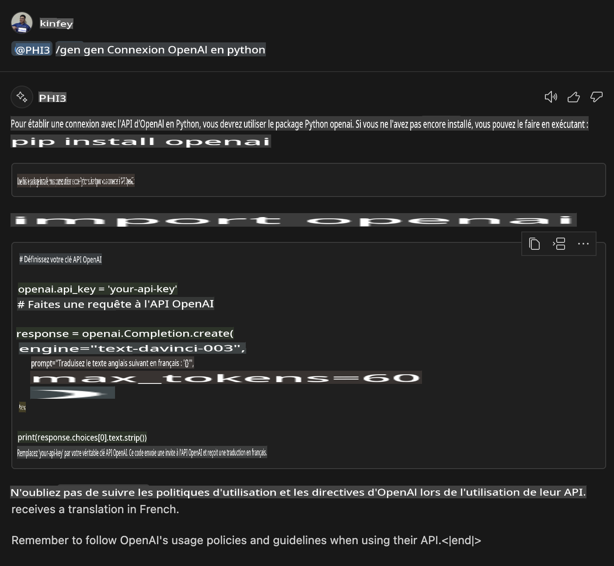
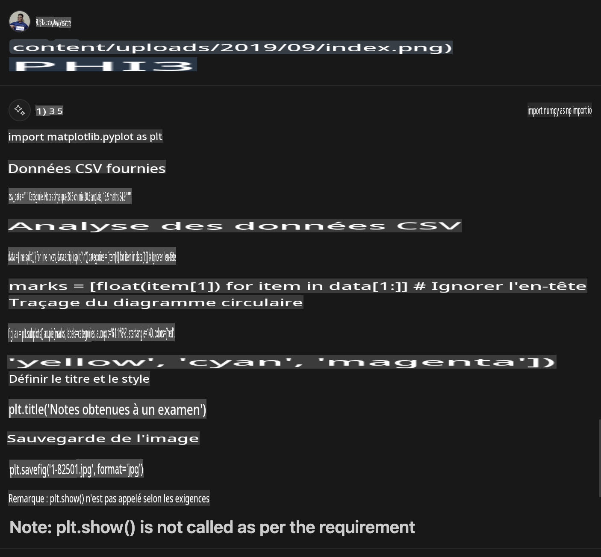

# **Lab 3 - Créer un agent @PHI3 dans GitHub Copilot Chat**

Dans Visual Studio Code Copilot Chat, vous pouvez gérer l'ensemble du projet via @workspace. Pour les scénarios d'entreprise, nous pouvons également personnaliser l'agent Copilot Chat de manière plus flexible.

Dans le dernier Lab, nous avons combiné le framework MX et le cloud pour compléter une extension Visual Studio Code pour l'agent Phi3.



### **1. Créer une extension de développement VSCode**

Veuillez vous référer à ce lien [https://code.visualstudio.com/api/get-started/your-first-extension](https://code.visualstudio.com/api/get-started/your-first-extension) pour créer un projet d'extension.

***NOTE:*** Veuillez utiliser Typescript et WebPack comme solution technique pour ce projet.

### **2. Ajouter vscode.d.ts**

L'API de Visual Studio Code Chat n'a pas encore été fusionnée dans l'API de code, mais elle est désormais ajoutée via des extensions.

Téléchargez vscode.d.ts [https://github.com/microsoft/vscode/blob/main/src/vscode-dts/vscode.d.ts](https://github.com/microsoft/vscode/blob/main/src/vscode-dts/vscode.d.ts)

***NOTE:*** Veuillez l'exécuter dans Visual Studio Code Insiders 1.90+.

### **3. Mettre à jour package.json**

```json
{
  "name": "phi3ext",
  "displayName": "phi3ext",
  "description": "",
  "version": "0.0.1",
  "engines": {
    "vscode": "^1.90.0"
  },
  "categories": [
      "AI",
      "Chat"
  ],
  "activationEvents": [],
  "enabledApiProposals": [
      "chatVariableResolver"
  ],
  "main": "./dist/extension.js",
  "contributes": {
      "chatParticipants": [
          {
              "id": "chat.PHI3",
              "name": "PHI3",
              "description": "Hey! Je suis PHI3",
              "isSticky": true,
              "commands": [
                  {
                      "name": "gen",
                      "description": "Je suis PHI3, vous pouvez générer du code avec moi"
                  },
                  {
                      "name": "img",
                      "description": "Je suis PHI3-vision, vous pouvez générer du code à partir d'une image avec moi"
                  }
              ]
          }
      ],
      "commands": [
          {
              "command": "PHI3.namesInEditor",
              "title": "Utiliser PHI3 dans l'éditeur"
          }
      ]
  },  
  "scripts": {
    "vscode:prepublish": "npm run package",
    "compile": "webpack",
    "watch": "webpack --watch",
    "package": "webpack --mode production --devtool hidden-source-map",
    "compile-tests": "tsc -p . --outDir out",
    "watch-tests": "tsc -p . -w --outDir out",
    "pretest": "npm run compile-tests && npm run compile && npm run lint",
    "lint": "eslint src --ext ts",
    "test": "vscode-test"
  },
  "devDependencies": {
    "@types/vscode": "^1.90.0",
    "@types/mocha": "^10.0.6",
    "@types/node": "18.x",
    "@typescript-eslint/eslint-plugin": "^7.11.0",
    "@typescript-eslint/parser": "^7.11.0",
    "eslint": "^8.57.0",
    "typescript": "^5.4.5",
    "ts-loader": "^9.5.1",
    "webpack": "^5.91.0",
    "webpack-cli": "^5.1.4",
    "@vscode/test-cli": "^0.0.9",
    "@vscode/test-electron": "^2.4.0"
  },
  "dependencies": {
    "@types/node-fetch": "^2.6.11",
    "node-fetch": "^3.3.2"
  }
}
```

Vous pouvez exécuter **npm install** dans le terminal et déboguer votre extension pour tester.

***Télécharger le code d'exemple*** [Cliquez ici](../../../../../../../code/07.Lab/01/Apple)

### **4. Modifier src/extension.ts**

```ts
// Le module 'vscode' contient l'API d'extensibilité de VS Code
// Importez le module et référencez-le avec l'alias vscode dans votre code ci-dessous
import * as vscode from 'vscode';

interface IPHI3ChatResult extends vscode.ChatResult {
    metadata: {
        command: string;
    }
}

// Cette méthode est appelée lorsque votre extension est activée
// Votre extension est activée la toute première fois que la commande est exécutée
export function activate(extcontext: vscode.ExtensionContext) {

	// Définir un gestionnaire de chat SHEIN.
	const phi3handler: vscode.ChatRequestHandler = async (request: vscode.ChatRequest, context: vscode.ChatContext, stream: vscode.ChatResponseStream, token: vscode.CancellationToken): Promise<IPHI3ChatResult> => {

		if (request.command == 'gen') {

			const content = "Bienvenue à Phi-3 pour générer du code";

			const result = await gen(request.prompt);

			const code = result;
			
			stream.markdown(code);

            return { metadata: { command: 'gen' } };

		}
		if (request.command == 'img') {

			const content = "Bienvenue à Phi-3 vision pour générer du code à partir d'une image";

			const prompt = request.prompt;

			if(prompt.indexOf("(IMG_URL:")>-1){

				const img_url = prompt.split("(IMG_URL:")[1].split(")")[0];
				const question = prompt.split("(IMG_URL:")[0];
				const tmp = question;

				const result = await genImage(question,img_url);
	
				const code = result;
				
				stream.markdown(code);

				return { metadata: { command: 'img' } };
			}
			else
			{
				var result = "Veuillez poser la question comme ceci : Votre question (IMG_URL:https://example.com/image.jpg)";
				stream.markdown(result);
			}

            return { metadata: { command: 'img' } };

		}

		return { metadata: { command: '' } };

	}

	const phi3 = vscode.chat.createChatParticipant("chat.PHI3", phi3handler);

	phi3.iconPath = new vscode.ThemeIcon('sparkle');

    phi3.followupProvider = {
        provideFollowups(result: IPHI3ChatResult, context: vscode.ChatContext, token: vscode.CancellationToken) {
            return [{
                prompt: 'laissons coder avec la famille Phi-3',
                label: vscode.l10n.t('Dev avec la famille Phi-3'),
                command: 'help'
            } satisfies vscode.ChatFollowup];
        }
    };

	extcontext.subscriptions.push(phi3);
}

interface GenCode {
	prompt: string;
}

interface ImgGenCodeResponse {
	output: string;
}

interface GenCodeResponse {
	result: string;
}

async function gen(prompt: string) {

	const postData: GenCode = {
		prompt: prompt
	};
	const response = await fetch('http://localhost:8080/score', {
		method: 'POST',
		body: JSON.stringify(postData),
		headers: { 'Content-Type': 'application/json' }
	});
	const post = await response.json();
	const resultResponse = post as GenCodeResponse;
	return resultResponse.result;
}

async function genImage(prompt: string, img_url: string) {

	// const postData: GenCode = {
	// 	question: prompt
	// };
	const response = await fetch('Your Phi-3 Endpoint', {
		method: 'POST',
		body: JSON.stringify({
			"input_data":{
			  "input_string":[
				{
				  "role":"user",
				  "content":[ 
					{
					  "type": "text",
					  "text": prompt
					},
					{
						"type": "image_url",
						"image_url": {
						  "url": img_url
						}
					}
				  ]
				}
			  ],
			  "parameters":{
					"temperature": 0.6,
					"top_p": 0.9,
					"do_sample": false,
					"max_new_tokens": 2048
			  }
			}
		}),
		headers: { 'Content-Type': 'application/json', 'Authorization' : 'Bearer Your Phi-3-Vision Endpoint Key', 'azureml-model-deployment': 'Your Phi-3-Vision Deployment Name' }
	});
	const post = await response.json();
	const resultResponse = post as ImgGenCodeResponse;
	return resultResponse.output;
}

// Cette méthode est appelée lorsque votre extension est désactivée
export function deactivate() {}
```

Félicitations ! Vous avez terminé tous les labs. J'espère que cela vous aide à comprendre la famille Phi-3 et comment utiliser GitHub Copilot Chat.

Vous pouvez essayer ***@PHI3 /gen***



Vous pouvez essayer ***@PHI3 /img***



Avertissement : La traduction a été réalisée à partir de l'original par un modèle d'IA et peut ne pas être parfaite. Veuillez vérifier le résultat et apporter les corrections nécessaires.