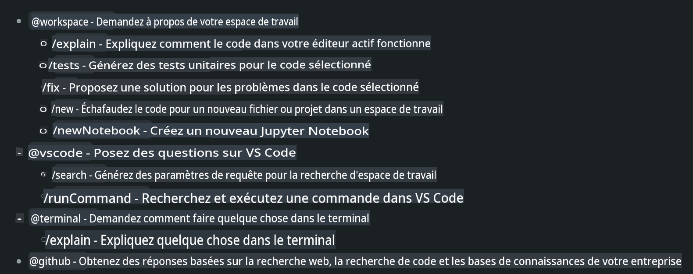
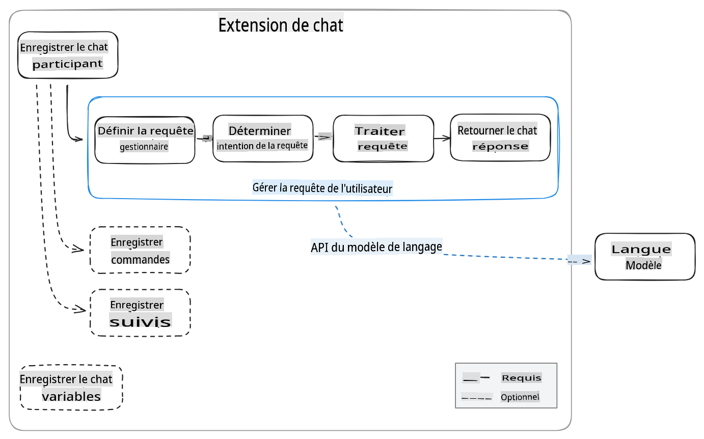
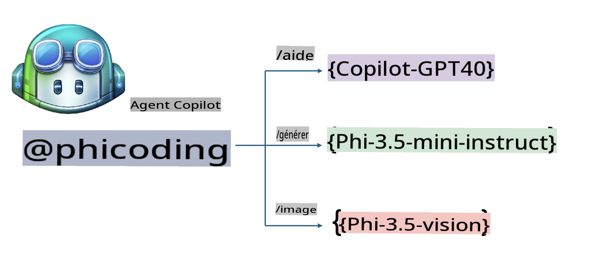
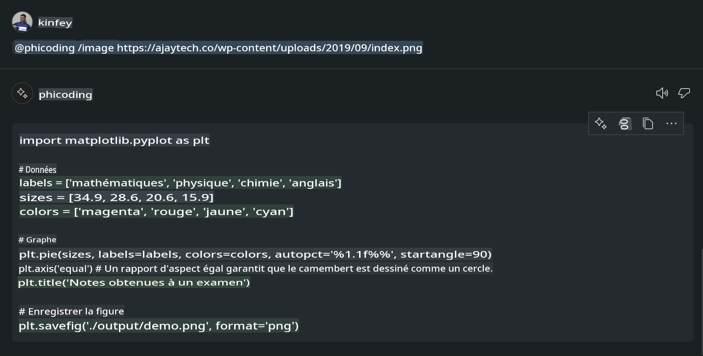

# **Créez votre propre agent Chat Copilot de Visual Studio Code avec Phi-3.5 par GitHub Models**

Utilisez-vous Visual Studio Code Copilot ? En particulier dans Chat, vous pouvez utiliser différents agents pour améliorer la capacité à créer, écrire et maintenir des projets dans Visual Studio Code. Visual Studio Code fournit une API qui permet aux entreprises et aux particuliers de créer différents agents en fonction de leurs besoins pour étendre leurs capacités dans divers domaines propriétaires. Dans cet article, nous nous concentrerons sur **Phi-3.5-mini-instruct (128k)** et **Phi-3.5-vision-instruct (128k)** de GitHub Models pour créer votre propre agent Visual Studio Code.

## **À propos de Phi-3.5 sur GitHub Models**

Nous savons que Phi-3/3.5-mini-instruct dans la famille Phi-3/3.5 possède de fortes capacités de compréhension et de génération de code, et présente des avantages par rapport à Gemma-2-9b et Mistral-Nemo-12B-instruct-2407.


Les derniers GitHub Models offrent déjà un accès aux modèles Phi-3.5-mini-instruct (128k) et Phi-3.5-vision-instruct (128k). Les développeurs peuvent y accéder via l'OpenAI SDK, l'Azure AI Inference SDK et l'API REST.


***Note :*** Il est recommandé d'utiliser l'Azure AI Inference SDK ici, car il peut mieux se synchroniser avec le catalogue de modèles Azure en environnement de production.

Voici les résultats de **Phi-3.5-mini-instruct (128k)** et **Phi-3.5-vision-instruct (128k)** dans le scénario de génération de code après l'intégration avec GitHub Models, et aussi préparer les exemples suivants.

**Démo : GitHub Models Phi-3.5-mini-instruct (128k) génère du code à partir de Prompt** ([cliquez sur ce lien](../../../../../code/09.UpdateSamples/Aug/ghmodel_phi35_instruct_demo.ipynb))

**Démo : GitHub Models Phi-3.5-vision-instruct (128k) génère du code à partir d'une image** ([cliquez sur ce lien](../../../../../code/09.UpdateSamples/Aug/ghmodel_phi35_vision_demo.ipynb))


## **À propos de l'agent Chat Copilot de GitHub**

L'agent Chat Copilot de GitHub peut accomplir différentes tâches dans différents scénarios de projet en fonction du code. Le système dispose de quatre agents : workspace, github, terminal, vscode.



En ajoutant le nom de l'agent avec ‘@’, vous pouvez rapidement accomplir le travail correspondant. Pour les entreprises, si vous ajoutez votre propre contenu lié à l'entreprise, comme les exigences, le codage, les spécifications de test et la publication, vous pouvez avoir des fonctions privées d'entreprise plus puissantes basées sur GitHub Copilot.

L'agent Chat de Visual Studio Code a maintenant officiellement publié son API, permettant aux entreprises ou aux développeurs d'entreprise de développer des agents basés sur différents écosystèmes logiciels. Basé sur la méthode de développement de l'extension Visual Studio Code, vous pouvez facilement accéder à l'interface de l'API de l'agent Chat de Visual Studio Code. Nous pouvons développer en suivant ce processus.



Le scénario de développement peut prendre en charge l'accès aux API de modèles tiers (comme GitHub Models, Azure Model Catalog, et des services auto-hébergés basés sur des modèles open source) et peut également utiliser les modèles gpt-35-turbo, gpt-4, et gpt-4o fournis par GitHub Copilot.

## **Ajouter un agent @phicoding basé sur Phi-3.5**

Nous essayons d'intégrer les capacités de programmation de Phi-3.5 pour accomplir des tâches telles que l'écriture de code, la génération de code à partir d'images, etc. Complétez un agent construit autour de Phi-3.5 - @PHI, voici quelques fonctions :

1. Générer une auto-présentation basée sur GPT-4o fourni par GitHub Copilot via la commande **@phicoding /help**

2. Générer du code pour différents langages de programmation basé sur **Phi-3.5-mini-instruct (128k)** via la commande **@phicoding /gen**

3. Générer du code basé sur **Phi-3.5-vision-instruct (128k)** et la complétion d'images via la commande **@phicoding /image**



## **Étapes associées**

1. Installez le support de développement d'extension Visual Studio Code en utilisant npm

```bash

npm install --global yo generator-code 

```
2. Créez un plugin d'extension Visual Studio Code (en utilisant le mode de développement Typescript, nommé phiext)


```bash

yo code 

```

3. Ouvrez le projet créé et modifiez package.json. Voici les instructions et configurations associées, ainsi que la configuration de GitHub Models. Notez que vous devez ajouter votre jeton GitHub Models ici.


```json

{
  "name": "phiext",
  "displayName": "phiext",
  "description": "",
  "version": "0.0.1",
  "engines": {
    "vscode": "^1.93.0"
  },
  "categories": [
    "AI",
    "Chat"
  ],
  "activationEvents": [],
  "enabledApiProposals": [
      "chatVariableResolver"
  ],
  "main": "./dist/extension.js",
  "contributes": {
    "chatParticipants": [
        {
            "id": "chat.phicoding",
            "name": "phicoding",
            "description": "Hey! Je suis Microsoft Phi-3.5, Elle peut m'aider avec des problèmes de codage, comme générer du code avec votre langage naturel, ou même générer du code à partir d'images. Demandez-moi n'importe quoi!",
            "isSticky": true,
            "commands": [
                {
                    "name": "help",
                    "description": "Me présenter à vous"
                },
                {
                    "name": "gen",
                    "description": "Générer du code pour vous avec Microsoft Phi-3.5-mini-instruct"
                },
                {
                    "name": "image",
                    "description": "Générer du code pour un graphique à partir d'une image (png ou jpg) avec Microsoft Phi-3.5-vision-instruct, veuillez ajouter l'URL de l'image comme ceci : https://ajaytech.co/wp-content/uploads/2019/09/index.png"
                }
            ]
        }
    ],
    "commands": [
        {
            "command": "phicoding.namesInEditor",
            "title": "Utiliser Microsoft Phi 3.5 dans l'éditeur"
        }
    ],
    "configuration": {
      "type": "object",
      "title": "githubmodels",
      "properties": {
        "githubmodels.endpoint": {
          "type": "string",
          "default": "https://models.inference.ai.azure.com",
          "description": "Votre point de terminaison GitHub Models",
          "order": 0
        },
        "githubmodels.api_key": {
          "type": "string",
          "default": "Votre jeton GitHub Models",
          "description": "Votre jeton GitHub Models",
          "order": 1
        },
        "githubmodels.phi35instruct": {
          "type": "string",
          "default": "Phi-3.5-mini-instruct",
          "description": "Votre modèle Phi-35-Instruct",
          "order": 2
        },
        "githubmodels.phi35vision": {
          "type": "string",
          "default": "Phi-3.5-vision-instruct",
          "description": "Votre modèle Phi-35-Vision",
          "order": 3
        }
      }
    }
  },
  "scripts": {
    "vscode:prepublish": "npm run package",
    "compile": "webpack",
    "watch": "webpack --watch",
    "package": "webpack --mode production --devtool hidden-source-map",
    "compile-tests": "tsc -p . --outDir out",
    "watch-tests": "tsc -p . -w --outDir out",
    "pretest": "npm run compile-tests && npm run compile && npm run lint",
    "lint": "eslint src",
    "test": "vscode-test"
  },
  "devDependencies": {
    "@types/vscode": "^1.93.0",
    "@types/mocha": "^10.0.7",
    "@types/node": "20.x",
    "@typescript-eslint/eslint-plugin": "^8.3.0",
    "@typescript-eslint/parser": "^8.3.0",
    "eslint": "^9.9.1",
    "typescript": "^5.5.4",
    "ts-loader": "^9.5.1",
    "webpack": "^5.94.0",
    "webpack-cli": "^5.1.4",
    "@vscode/test-cli": "^0.0.10",
    "@vscode/test-electron": "^2.4.1"
  },
  "dependencies": {
    "@types/node-fetch": "^2.6.11",
    "node-fetch": "^3.3.2",
    "@azure-rest/ai-inference": "latest",
    "@azure/core-auth": "latest",
    "@azure/core-sse": "latest"
  }
}


```

4. Modifiez src/extension.ts


```typescript

// Le module 'vscode' contient l'API d'extensibilité de VS Code
// Importez le module et référencez-le avec l'alias vscode dans votre code ci-dessous
import * as vscode from 'vscode';
import ModelClient from "@azure-rest/ai-inference";
import { AzureKeyCredential } from "@azure/core-auth";


interface IPhiChatResult extends vscode.ChatResult {
    metadata: {
        command: string;
    };
}


const MODEL_SELECTOR: vscode.LanguageModelChatSelector = { vendor: 'copilot', family: 'gpt-4o' };

function isValidImageUrl(url: string): boolean {
    const regex = /^(https?:\/\/.*\.(?:png|jpg))$/i;
    return regex.test(url);
}
  

// Cette méthode est appelée lorsque votre extension est activée
// Votre extension est activée la toute première fois que la commande est exécutée
export function activate(context: vscode.ExtensionContext) {

    const codinghandler: vscode.ChatRequestHandler = async (request: vscode.ChatRequest, context: vscode.ChatContext, stream: vscode.ChatResponseStream, token: vscode.CancellationToken): Promise<IPhiChatResult> => {


        const config : any = vscode.workspace.getConfiguration('githubmodels');
        const endPoint: string = config.get('endpoint');
        const apiKey: string = config.get('api_key');
        const phi35instruct: string = config.get('phi35instruct');
        const phi35vision: string = config.get('phi35vision');
        
        if (request.command === 'help') {

            const content = "Bienvenue dans l'assistant de codage avec Microsoft Phi-3.5"; 
            stream.progress(content);


            try {
                const [model] = await vscode.lm.selectChatModels(MODEL_SELECTOR);
                if (model) {
                    const messages = [
                        vscode.LanguageModelChatMessage.User("Veuillez m'aider à exprimer ce contenu de manière humoristique : Je suis un assistant de programmation qui peut vous aider à convertir le langage naturel en code et à générer du code basé sur les graphiques dans les images. format de sortie comme ceci : Hey je suis Phi ......")
                    ];
                    const chatResponse = await model.sendRequest(messages, {}, token);
                    for await (const fragment of chatResponse.text) {
                        stream.markdown(fragment);
                    }
                }
            } catch(err) {
                console.log(err);
            }


            return { metadata: { command: 'help' } };

        }

        
        if (request.command === 'gen') {

            const content = "Bienvenue à l'utilisation de phi-3.5 pour générer du code";

            stream.progress(content);

            const client = new ModelClient(endPoint, new AzureKeyCredential(apiKey));

            const response = await client.path("/chat/completions").post({
              body: {
                messages: [
                  { role:"system", content: "Vous êtes un assistant de codage. Aidez à répondre à toutes les questions de génération de code." },
                  { role:"user", content: request.prompt }
                ],
                model: phi35instruct,
                temperature: 0.4,
                max_tokens: 1000,
                top_p: 1.
              }
            });

            stream.markdown(response.body.choices[0].message.content);

            return { metadata: { command: 'gen' } };

        }


        
        if (request.command === 'image') {


            const content = "Bienvenue à l'utilisation de phi-3.5 pour générer du code à partir d'une image (png ou jpg), URL de l'image comme ceci : https://ajaytech.co/wp-content/uploads/2019/09/index.png";

            stream.progress(content);

            if (!isValidImageUrl(request.prompt)) {
                stream.markdown('Veuillez fournir une URL d'image valide');
                return { metadata: { command: 'image' } };
            }
            else
            {

                const client = new ModelClient(endPoint, new AzureKeyCredential(apiKey));
    
                const response = await client.path("/chat/completions").post({
                    body: {
                      messages: [
                        { role: "system", content: "Vous êtes un assistant utile qui décrit les images en détail." },
                        { role: "user", content: [
                            { type: "text", text: "Veuillez générer du code en fonction du graphique dans l'image selon les exigences suivantes\n1. Conservez toutes les informations dans le graphique, y compris les données et le texte\n2. Ne générez pas d'informations supplémentaires qui ne sont pas incluses dans le graphique\n3. Veuillez extraire les données de l'image, ne les générez pas à partir d'un csv\n4. Veuillez enregistrer le graphique régénéré en tant que graphique et l'enregistrer dans ./output/demo.png"},
                            { type: "image_url", image_url: {url: request.prompt}
                            }
                          ]
                        }
                      ],
                      model: phi35vision,
                      temperature: 0.4,
                      max_tokens: 2048,
                      top_p: 1.
                    }
                  });
    
                
                stream.markdown(response.body.choices[0].message.content);
    
                return { metadata: { command: 'image' } };
            }


        }


        return { metadata: { command: '' } };
    };


    const phi_ext = vscode.chat.createChatParticipant("chat.phicoding", codinghandler);

    phi_ext.iconPath = new vscode.ThemeIcon('sparkle');


    phi_ext.followupProvider = {
        provideFollowups(result: IPhiChatResult, context: vscode.ChatContext, token: vscode.CancellationToken) {
            return [{
                prompt: 'Codons avec Phi-3.5 😋😋😋😋',
                label: vscode.l10n.t('Profitez du codage avec Phi-3.5'),
                command: 'help'
            } satisfies vscode.ChatFollowup];
        }
    };

    context.subscriptions.push(phi_ext);
}

// Cette méthode est appelée lorsque votre extension est désactivée
export function deactivate() {}


```

6. Exécution

***/help***


***@phicoding /help***


***@phicoding /gen***


***@phicoding /image***




Vous pouvez télécharger le code d'exemple :[cliquez](../../../../../code/09.UpdateSamples/Aug/vscode)

## **Ressources**

1. Inscrivez-vous à GitHub Models [https://gh.io/models](https://gh.io/models)

2. Apprenez le développement d'extensions Visual Studio Code [https://code.visualstudio.com/api/get-started/your-first-extension](https://code.visualstudio.com/api/get-started/your-first-extension)

3. Apprenez-en plus sur l'API de Chat Copilot de Visual Studio Code [https://code.visualstudio.com/api/extension-guides/chat](https://code.visualstudio.com/api/extension-guides/chat)

Avertissement : La traduction a été réalisée à partir de l'original par un modèle d'IA et peut ne pas être parfaite. 
Veuillez examiner le résultat et apporter les corrections nécessaires.