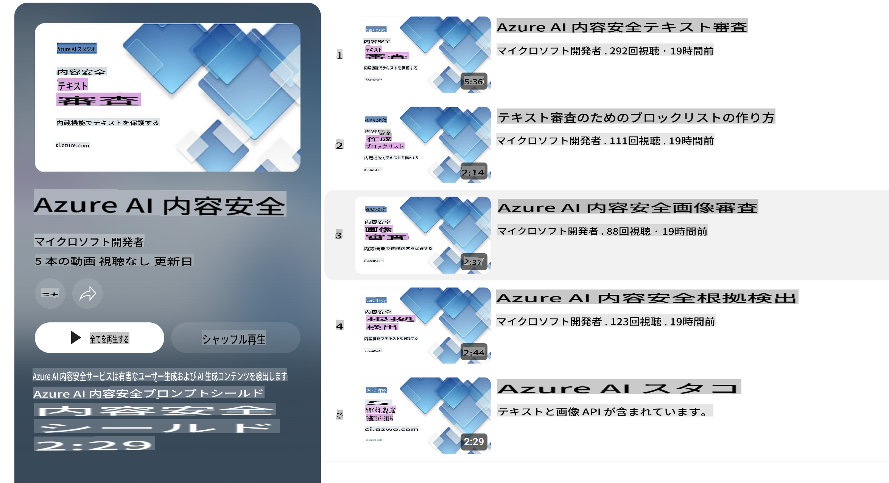

# Phi-3モデルのAI安全性
Phi-3モデルのファミリーは、[Microsoft Responsible AI Standard](https://query.prod.cms.rt.microsoft.com/cms/api/am/binary/RE5cmFl)に基づいて開発されました。この標準は、Microsoftの責任あるAI原則を形成する6つの原則（アカウンタビリティ、透明性、公平性、信頼性と安全性、プライバシーとセキュリティ、包括性）に基づく、全社的な要件のセットです。

以前のPhi-3モデルと同様に、多面的な安全評価と安全性後トレーニングアプローチが採用されており、このリリースの多言語対応を考慮して追加の措置が取られています。安全性トレーニングと評価のアプローチ、複数の言語とリスクカテゴリにまたがるテストについては、[Phi-3 Safety Post-Training Paper](https://arxiv.org/abs/2407.13833)で詳しく説明されています。Phi-3モデルはこのアプローチの恩恵を受けますが、開発者は自分の特定の使用ケースと文化的・言語的な文脈に関連するリスクをマッピング、測定、および軽減する責任あるAIのベストプラクティスを適用する必要があります。

## ベストプラクティス

他のモデルと同様に、Phiファミリーのモデルも不公平、不確実、または攻撃的な行動をする可能性があります。

SLMやLLMの制限された動作のいくつかには以下が含まれます：

- **サービスの質:** Phiモデルは主に英語のテキストで訓練されています。英語以外の言語ではパフォーマンスが低下します。訓練データに少ない英語のバリエーションは、標準的なアメリカ英語よりもパフォーマンスが低下する可能性があります。
- **ハームの表現とステレオタイプの継続:** これらのモデルは、人々のグループを過剰または過小評価したり、特定のグループの表現を消去したり、侮辱的または否定的なステレオタイプを強化したりする可能性があります。安全性後トレーニングにもかかわらず、これらの制限は、異なるグループの表現レベルの違いや、訓練データにおける否定的なステレオタイプの例の普及によって、現実のパターンや社会的偏見を反映して依然として存在する可能性があります。
- **不適切または攻撃的なコンテンツ:** これらのモデルは、他のタイプの不適切または攻撃的なコンテンツを生成する可能性があり、特定の使用ケースに固有の追加の軽減策がないと、敏感なコンテキストでの展開には不適切となる可能性があります。
- **情報の信頼性:** 言語モデルは、意味不明なコンテンツを生成したり、一見合理的に聞こえるが不正確または古いコンテンツを作り出したりする可能性があります。
- **コードの範囲の制限:** Phi-3の訓練データの大部分はPythonに基づいており、"typing, math, random, collections, datetime, itertools"などの一般的なパッケージを使用しています。モデルが他のパッケージを利用したPythonスクリプトや他の言語のスクリプトを生成する場合、すべてのAPIの使用を手動で確認することを強くお勧めします。

開発者は責任あるAIのベストプラクティスを適用し、特定の使用ケースが関連する法律や規制（例：プライバシー、貿易など）に準拠していることを確認する責任があります。

## 責任あるAIの考慮事項

他の言語モデルと同様に、Phiシリーズのモデルも不公平、不確実、または攻撃的な行動をする可能性があります。意識すべき制限された動作のいくつかには以下が含まれます：

**サービスの質:** Phiモデルは主に英語のテキストで訓練されています。英語以外の言語ではパフォーマンスが低下します。訓練データに少ない英語のバリエーションは、標準的なアメリカ英語よりもパフォーマンスが低下する可能性があります。

**ハームの表現とステレオタイプの継続:** これらのモデルは、人々のグループを過剰または過小評価したり、特定のグループの表現を消去したり、侮辱的または否定的なステレオタイプを強化したりする可能性があります。安全性後トレーニングにもかかわらず、これらの制限は、異なるグループの表現レベルの違いや、訓練データにおける否定的なステレオタイプの例の普及によって、現実のパターンや社会的偏見を反映して依然として存在する可能性があります。

**不適切または攻撃的なコンテンツ:** これらのモデルは、他のタイプの不適切または攻撃的なコンテンツを生成する可能性があり、特定の使用ケースに固有の追加の軽減策がないと、敏感なコンテキストでの展開には不適切となる可能性があります。
情報の信頼性: 言語モデルは、意味不明なコンテンツを生成したり、一見合理的に聞こえるが不正確または古いコンテンツを作り出したりする可能性があります。

**コードの範囲の制限:** Phi-3の訓練データの大部分はPythonに基づいており、"typing, math, random, collections, datetime, itertools"などの一般的なパッケージを使用しています。モデルが他のパッケージを利用したPythonスクリプトや他の言語のスクリプトを生成する場合、すべてのAPIの使用を手動で確認することを強くお勧めします。

開発者は責任あるAIのベストプラクティスを適用し、特定の使用ケースが関連する法律や規制（例：プライバシー、貿易など）に準拠していることを確認する責任があります。重要な考慮事項には以下が含まれます：

**割り当て:** モデルは、法的地位やリソースや生活機会の割り当てに重要な影響を与える可能性のあるシナリオ（例：住宅、雇用、信用など）には、さらなる評価と追加のバイアス除去技術なしでは適していない可能性があります。

**高リスクシナリオ:** 開発者は、不公平、不確実、または攻撃的な出力が非常にコストがかかるか、害を引き起こす可能性がある高リスクのシナリオでモデルを使用する適合性を評価する必要があります。これには、正確性と信頼性が重要な敏感な分野や専門分野でのアドバイス提供（例：法的または健康アドバイス）が含まれます。展開コンテキストに応じて、アプリケーションレベルで追加の安全策を実装する必要があります。

**誤情報:** モデルは不正確な情報を生成する可能性があります。開発者は透明性のベストプラクティスに従い、エンドユーザーにAIシステムと対話していることを知らせるべきです。アプリケーションレベルでは、開発者はフィードバックメカニズムとパイプラインを構築し、特定の使用ケースに基づくコンテキスト情報に基づいた応答を行うRetrieval Augmented Generation（RAG）という技術を使用できます。

**有害なコンテンツの生成:** 開発者は、コンテキストに応じて出力を評価し、利用可能な安全分類器や使用ケースに適したカスタムソリューションを使用するべきです。

**悪用:** 詐欺、スパム、マルウェアの生成などの他の形態の悪用が可能であり、開発者はアプリケーションが適用される法律や規制に違反しないようにする必要があります。

### ファインチューニングとAIコンテンツ安全性

モデルをファインチューニングした後、生成されたコンテンツを監視し、潜在的なリスク、脅威、および品質問題を特定してブロックするために[Azure AI Content Safety](https://learn.microsoft.com/azure/ai-services/content-safety/overview)の措置を利用することを強くお勧めします。

[Azure AI Content Safety](https://learn.microsoft.com/azure/ai-services/content-safety/overview)はテキストと画像の両方のコンテンツをサポートしています。クラウド、切断されたコンテナ、およびエッジ/組み込みデバイスで展開することができます。

## Azure AI Content Safetyの概要

Azure AI Content Safetyは万能の解決策ではなく、ビジネスの特定のポリシーに合わせてカスタマイズすることができます。さらに、その多言語モデルにより、複数の言語を同時に理解することができます。

- **Azure AI Content Safety**
- **Microsoft Developer**
- **5本のビデオ**

Azure AI Content Safetyサービスは、アプリケーションやサービス内のユーザー生成およびAI生成の有害なコンテンツを検出します。テキストと画像のAPIが含まれており、有害または不適切な素材を検出することができます。

[AI Content Safety Playlist](https://www.youtube.com/playlist?list=PLlrxD0HtieHjaQ9bJjyp1T7FeCbmVcPkQ)

**免責事項**:
この文書は機械翻訳AIサービスを使用して翻訳されています。正確さを期しておりますが、自動翻訳には誤りや不正確さが含まれる可能性があることをご了承ください。原文の言語で書かれたオリジナルの文書が権威ある情報源とみなされるべきです。重要な情報については、専門の人間による翻訳をお勧めします。この翻訳の使用に起因する誤解や誤解釈について、当社は一切の責任を負いません。