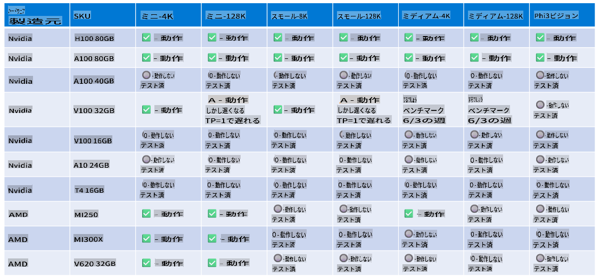

# Phi-3 ハードウェアサポート

Microsoft Phi-3はONNX Runtimeに最適化されており、Windows DirectMLをサポートしています。GPU、CPU、さらにはモバイルデバイスなど、さまざまなハードウェアタイプでうまく動作します。

## デバイスハードウェア
具体的にサポートされているハードウェアは以下の通りです：

- GPU SKU: RTX 4090 (DirectML)
- GPU SKU: 1 A100 80GB (CUDA)
- CPU SKU: Standard F64s v2 (64 vCPUs, 128 GiB メモリ)

## モバイルSKU

- Android - Samsung Galaxy S21
- Apple iPhone 14 またはそれ以上の A16/A17 プロセッサ

## Phi-3 ハードウェア仕様

- 最小構成要件
- Windows: DirectX 12対応GPUおよび合計4GB以上のRAM

CUDA: 計算能力 >= 7.02 のNVIDIA GPU



## 複数のGPUでonnxruntimeを実行する

現在利用可能なPhi-3 ONNXモデルは1つのGPU専用です。Phi-3モデルに対してマルチGPUをサポートすることは可能ですが、2つのGPUでORTを使用しても、2つのORTインスタンスと比較してスループットが向上する保証はありません。

[Build 2024のGenAI ONNXチーム](https://youtu.be/WLW4SE8M9i8?si=EtG04UwDvcjunyfC)では、Phiモデルに対してマルチGPUではなくマルチインスタンスを有効にしたことが発表されました。

現在、CUDA_VISIBLE_DEVICES環境変数を使用して、次のように1つのonnxruntimeまたはonnxruntime-genaiインスタンスを実行することができます。

```Python
CUDA_VISIBLE_DEVICES=0 python infer.py
CUDA_VISIBLE_DEVICES=1 python infer.py
```

[Azure AI Studio](https://ai.azure.com)でPhi-3をさらに探求してみてください。

免責事項: この翻訳はAIモデルによって原文から翻訳されたものであり、完璧ではない可能性があります。
出力を確認し、必要な修正を行ってください。