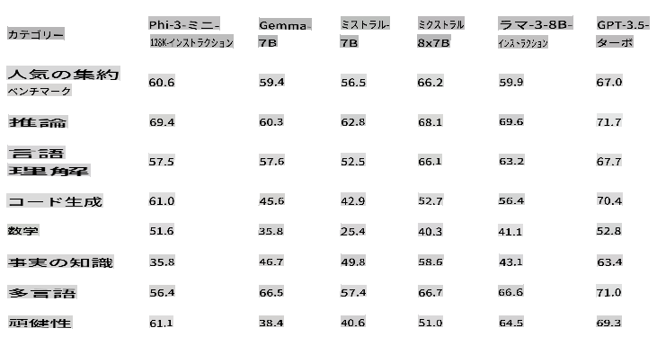
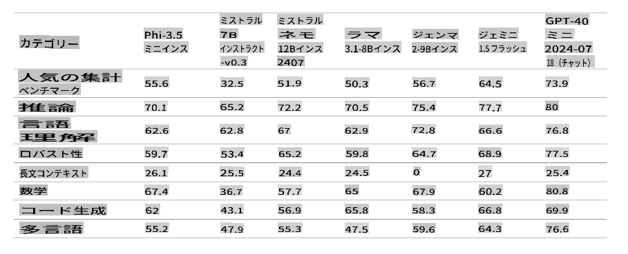
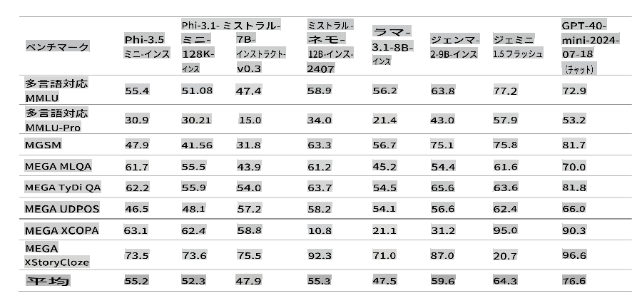
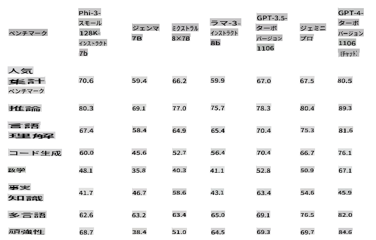
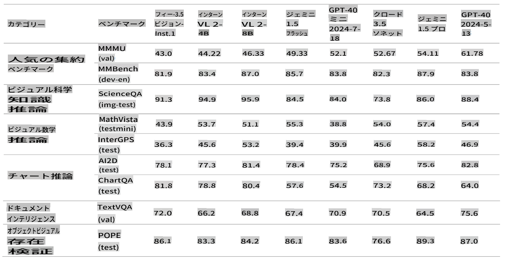

# MicrosoftのPhi-3ファミリー

Phi-3モデルは、最も高性能かつコスト効率の高い小型言語モデル（SLM）であり、さまざまな言語、推論、コーディング、および数学のベンチマークで同サイズおよび次のサイズのモデルを上回ります。このリリースは、高品質のモデルの選択肢を拡大し、生成AIアプリケーションの作成と構築においてより実用的な選択肢を提供します。

Phi-3ファミリーには、ミニ、小型、中型、およびビジョンバージョンがあり、さまざまなアプリケーションシナリオに対応するために異なるパラメータ量に基づいてトレーニングされています。各モデルは指示に基づいて調整され、Microsoftの責任あるAI、安全性およびセキュリティ基準に従って開発されており、すぐに使用できるようになっています。Phi-3-miniはそのサイズの2倍のモデルを上回り、Phi-3-smallおよびPhi-3-mediumはGPT-3.5Tを含むはるかに大きなモデルを上回ります。

## Phi-3のタスク例

| | |
|-|-|
|タスク|Phi-3|
|言語タスク|はい|
|数学と推論|はい|
|コーディング|はい|
|関数呼び出し|いいえ|
|自己オーケストレーション（アシスタント）|いいえ|
|専用の埋め込みモデル|いいえ|

## Phi-3-mini

Phi-3-miniは、3.8Bパラメータの言語モデルで、[Microsoft Azure AI Studio](https://ai.azure.com/explore/models?selectedCollection=phi)、[Hugging Face](https://huggingface.co/collections/microsoft/phi-3-6626e15e9585a200d2d761e3)、および[Ollama](https://ollama.com/library/phi3)で利用可能です。コンテキスト長は[128K](https://ai.azure.com/explore/models/Phi-3-mini-128k-instruct/version/9/registry/azureml)と[4K](https://ai.azure.com/explore/models/Phi-3-mini-4k-instruct/version/9/registry/azureml)の2つのバリエーションがあります。

Phi-3-miniは3.8億パラメータのTransformerベースの言語モデルです。教育的に有用な情報を含む高品質のデータを使用してトレーニングされ、新しいデータソースであるさまざまなNLP合成テキストおよび内部外部のチャットデータセットで強化されており、チャット機能が大幅に向上しています。さらに、Phi-3-miniは事前トレーニング後に監督付きファインチューニング（SFT）と直接好みの最適化（DPO）を通じてチャットファインチューニングされています。この後のトレーニングにより、Phi-3-miniは特にアライメント、堅牢性、安全性において大幅な改善を示しました。モデルはPhi-3ファミリーの一部であり、サポートできるトークンのコンテキスト長（4Kと128K）の2つのバリエーションがあります。

## Phi-3.5-mini-instruct

[Phi-3.5 mini](https://ai.azure.com/explore/models/Phi-3.5-mini-instruct/version/1/registry/azureml)は、Phi-3で使用されたデータセット（合成データおよびフィルタリングされた公開ウェブサイト）に基づいて構築された軽量で最先端のオープンモデルであり、非常に高品質で推論が豊富なデータに焦点を当てています。このモデルはPhi-3モデルファミリーに属し、128Kトークンのコンテキスト長をサポートします。モデルは、監督付きファインチューニング、近接方策最適化、および直接好みの最適化を組み合わせた厳格な強化プロセスを経て、正確な指示の遵守と堅牢な安全対策を確保しています。

Phi-3.5 Miniは3.8億パラメータを持ち、Phi-3 Miniと同じトークナイザーを使用するデンスなデコーダ専用のTransformerモデルです。

全体として、3.8億パラメータのモデルは、はるかに大きなモデルと同様の多言語理解および推論能力を達成していますが、特定のタスクではそのサイズに制約されています。モデルはあまりにも多くの事実知識を保存する能力がないため、ユーザーは事実の誤りを経験するかもしれません。しかし、この弱点は、特にRAG設定でモデルを使用する場合に、Phi-3.5を検索エンジンで強化することで解決できると考えています。

### 言語サポート

以下の表は、多言語MMLU、MEGA、および多言語MMLU-proデータセットにおけるPhi-3の多言語対応能力を示しています。全体として、3.8億のアクティブパラメータだけでも、はるかに大きなアクティブパラメータを持つ他のモデルに比べて多言語タスクで非常に競争力があることがわかりました。

## Phi-3-small

Phi-3-smallは、7Bパラメータの言語モデルで、コンテキスト長[128K](https://ai.azure.com/explore/models/Phi-3-small-128k-instruct/version/2/registry/azureml)と[8K](https://ai.azure.com/explore/models/Phi-3-small-8k-instruct/version/2/registry/azureml)の2つのバリエーションがあります。さまざまな言語、推論、コーディング、および数学のベンチマークでGPT-3.5Tを上回ります。

Phi-3-smallは7億パラメータのTransformerベースの言語モデルです。教育的に有用な情報を含む高品質のデータを使用してトレーニングされ、新しいデータソースであるさまざまなNLP合成テキストおよび内部外部のチャットデータセットで強化されており、チャット機能が大幅に向上しています。さらに、Phi-3-smallは事前トレーニング後に監督付きファインチューニング（SFT）と直接好みの最適化（DPO）を通じてチャットファインチューニングされています。この後のトレーニングにより、Phi-3-smallは特にアライメント、堅牢性、安全性において大幅な改善を示しました。Phi-3-smallはPhi-3-Miniに比べて多言語データセットでより集中的にトレーニングされています。モデルファミリーは、サポートできるトークンのコンテキスト長（8Kと128K）の2つのバリエーションを提供します。

## Phi-3-medium

Phi-3-mediumは、14Bパラメータの言語モデルで、コンテキスト長[128K](https://ai.azure.com/explore/models/Phi-3-medium-128k-instruct/version/2/registry/azureml)と[4K](https://ai.azure.com/explore/models/Phi-3-medium-4k-instruct/version/2/registry/azureml)の2つのバリエーションがあります。Gemini 1.0 Proを上回る性能を発揮します。

Phi-3-mediumは14億パラメータのTransformerベースの言語モデルです。教育的に有用な情報を含む高品質のデータを使用してトレーニングされ、新しいデータソースであるさまざまなNLP合成テキストおよび内部外部のチャットデータセットで強化されており、チャット機能が大幅に向上しています。さらに、Phi-3-mediumは事前トレーニング後に監督付きファインチューニング（SFT）と直接好みの最適化（DPO）を通じてチャットファインチューニングされています。この後のトレーニングにより、Phi-3-mediumは特にアライメント、堅牢性、安全性において大幅な改善を示しました。モデルファミリーは、サポートできるトークンのコンテキスト長（4Kと128K）の2つのバリエーションを提供します。

[!NOTE]
Phi-3-mediumのアップグレードとしてPhi-3.5-MoEへの切り替えをお勧めします。MoEモデルははるかに優れたコスト効果の高いモデルです。

## Phi-3-vision

[Phi-3-vision](https://ai.azure.com/explore/models/Phi-3-vision-128k-instruct/version/2/registry/azureml)は、言語と視覚の機能を持つ4.2Bパラメータのマルチモーダルモデルで、一般的な視覚推論、OCR、およびテーブルやチャートの理解タスクでClaude-3 HaikuやGemini 1.0 Pro Vなどの大きなモデルを上回ります。

Phi-3-visionはPhi-3ファミリーの最初のマルチモーダルモデルであり、テキストと画像を統合しています。Phi-3-visionは実世界の画像を推論し、画像からテキストを抽出して推論することができます。また、チャートや図の理解に最適化されており、洞察を生成し質問に答えるために使用できます。Phi-3-visionはPhi-3-miniの言語機能を基にしており、小さなサイズで強力な言語と画像の推論品質を維持しています。

## Phi-3.5-vision

[Phi-3.5 Vision](https://ai.azure.com/explore/models/Phi-3.5-vision-instruct/version/1/registry/azureml)は、合成データおよびフィルタリングされた公開ウェブサイトを含むデータセットに基づいて構築された軽量で最先端のオープンマルチモーダルモデルであり、非常に高品質で推論が豊富なデータに焦点を当てています。このモデルはPhi-3モデルファミリーに属し、128Kトークンのコンテキスト長をサポートします。モデルは、監督付きファインチューニングと直接好みの最適化を組み合わせた厳格な強化プロセスを経て、正確な指示の遵守と堅牢な安全対策を確保しています。

Phi-3.5 Visionは4.2億パラメータを持ち、画像エンコーダ、コネクタ、プロジェクタ、およびPhi-3 Mini言語モデルを含みます。

このモデルは、英語での広範な商業および研究利用を意図しています。モデルは、視覚およびテキスト入力機能を持つ一般的なAIシステムおよびアプリケーションに使用されることを目的としています。

1) メモリ/計算制約のある環境。
2) レイテンシーに制約のあるシナリオ。
3) 一般的な画像理解。
4) OCR
5) チャートおよびテーブルの理解。
6) 複数画像の比較。
7) 複数画像またはビデオクリップの要約。

Phi-3.5-visionモデルは、効率的な言語およびマルチモーダルモデルの研究を加速し、生成AIを活用した機能の構築ブロックとして使用されることを目的としています。

## Phi-3.5-MoE

[Phi-3.5 MoE](https://ai.azure.com/explore/models/Phi-3.5-MoE-instruct/version/1/registry/azureml)は、Phi-3で使用されたデータセット（合成データおよびフィルタリングされた公開ドキュメント）に基づいて構築された軽量で最先端のオープンモデルであり、非常に高品質で推論が豊富なデータに焦点を当てています。このモデルは多言語をサポートし、128Kトークンのコンテキスト長を持ちます。モデルは、監督付きファインチューニング、近接方策最適化、および直接好みの最適化を組み合わせた厳格な強化プロセスを経て、正確な指示の遵守と堅牢な安全対策を確保しています。

Phi-3 MoEは16×3.8億パラメータを持ち、2つのエキスパートを使用する場合に6.6億アクティブパラメータを持ちます。モデルは、32,064の語彙サイズを持つトークナイザーを使用するエキスパート混合型デコーダ専用のTransformerモデルです。

このモデルは、英語での広範な商業および研究利用を意図しています。モデルは、以下のような一般的なAIシステムおよびアプリケーションに使用されることを目的としています。

1) メモリ/計算制約のある環境。
2) レイテンシーに制約のあるシナリオ。
3) 強力な推論（特に数学および論理）。

MoEモデルは、言語およびマルチモーダルモデルの研究を加速し、生成AIを活用した機能の構築ブロックとして使用されることを目的としており、追加の計算リソースを必要とします。

> [!NOTE]
>
> Phi-3モデルは、事実知識ベンチマーク（例えばTriviaQA）では、小さなモデルサイズのために事実を保持する能力が低いため、あまり良い結果を出せません。

## Phi Silica

Phiシリーズのモデルから構築され、Copilot+ PCのNPU用に特化して設計されたPhi Silicaを紹介します。Windowsは、NPU用にカスタム構築され、インボックスで出荷される最先端の小型言語モデル（SLM）を初めて搭載するプラットフォームです。Phi Silica APIは、OCR、スタジオエフェクト、ライブキャプション、およびユーザーアクティビティのリコールAPIと共に、6月にWindows Copilotライブラリで利用可能になります。ベクトル埋め込み、RAG API、およびテキスト要約などの他のAPIも後で提供される予定です。

## **すべてのPhi-3モデルを見つける**

- [Azure AI](https://ai.azure.com/explore/models?selectedCollection=phi)
- [Hugging Face](https://huggingface.co/collections/microsoft/phi-3-6626e15e9585a200d2d761e3)

## ONNXモデル

2つのONNXモデル「cpu-int4-rtn-block-32」と「cpu-int4-rtn-block-32-acc-level-4」の主な違いは精度レベルです。「acc-level-4」を持つモデルは、レイテンシーと精度のバランスを取るように設計されており、わずかな精度のトレードオフでパフォーマンスを向上させることができます。これは特にモバイルデバイスに適しているかもしれません。

## モデル選択の例

| | | | |
|-|-|-|-|
|顧客のニーズ|タスク|開始するモデル|詳細|
|メッセージのスレッドを単純に要約するモデルが必要|会話の要約|Phi-3テキストモデル|顧客が明確でシンプルな言語タスクを持っていることが決定要因|
|子供向けの無料の数学チューターアプリ|数学と推論|Phi-3テキストモデル|アプリが無料であるため、顧客は継続的なコストがかからないソリューションを

**免責事項**:
この文書は機械翻訳サービスを使用して翻訳されています。正確さを期しておりますが、自動翻訳には誤りや不正確さが含まれる場合がありますのでご注意ください。原文が権威ある情報源と見なされるべきです。重要な情報については、専門の人間による翻訳を推奨します。この翻訳の使用により生じる誤解や誤解について、当社は一切の責任を負いません。