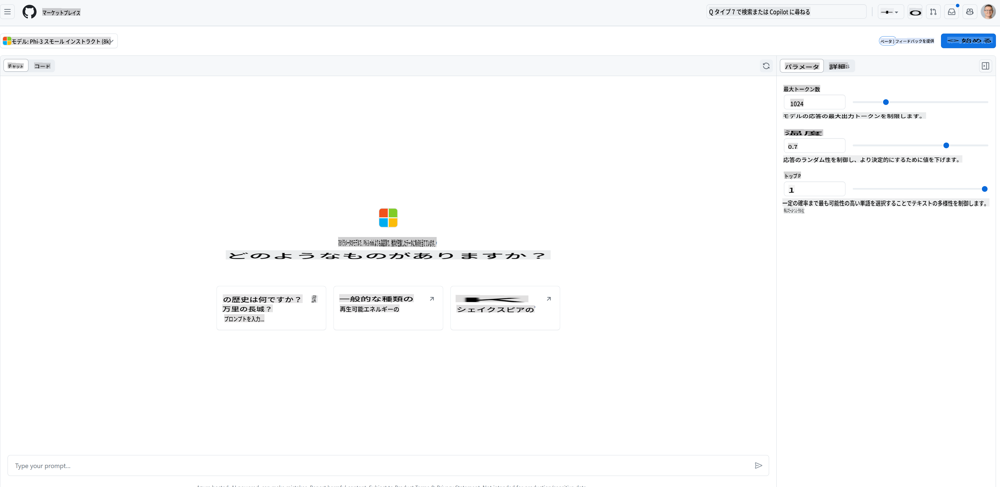

## GitHub Models - 限定公開ベータ

[GitHub Models](https://github.com/marketplace/models)へようこそ！Azure AI上でホストされているAIモデルを探索する準備が整っています。


GitHub Modelsで利用可能なモデルについての詳細は、[GitHub Model Marketplace](https://github.com/marketplace/models)をご覧ください。

## 利用可能なモデル

各モデルには専用のプレイグラウンドとサンプルコードがあります。



### GitHub Model CatalogのPhi-3モデル

[Phi-3-Medium-128k-Instruct](https://github.com/marketplace/models/azureml/Phi-3-medium-128k-instruct)

[Phi-3-medium-4k-instruct](https://github.com/marketplace/models/azureml/Phi-3-medium-4k-instruct)

[Phi-3-mini-128k-instruct](https://github.com/marketplace/models/azureml/Phi-3-mini-128k-instruct)

[Phi-3-mini-4k-instruct](https://github.com/marketplace/models/azureml/Phi-3-mini-4k-instruct)

[Phi-3-small-128k-instruct](https://github.com/marketplace/models/azureml/Phi-3-small-128k-instruct)

[Phi-3-small-8k-instruct](https://github.com/marketplace/models/azureml/Phi-3-small-8k-instruct)

## 始めに

いくつかの基本的な例がすぐに実行できるように用意されています。これらはsamplesディレクトリにあります。お気に入りの言語で始めたい場合は、以下の言語で例を見つけることができます：

- Python
- JavaScript
- cURL

また、サンプルとモデルを実行するための専用のCodespaces環境もあります。


## サンプルコード

以下は、いくつかのユースケースのためのサンプルコードのスニペットです。Azure AI Inference SDKの詳細については、完全なドキュメントとサンプルをご覧ください。

## セットアップ

1. パーソナルアクセストークンを作成
トークンに権限を与える必要はありません。トークンはMicrosoftのサービスに送信されることに注意してください。

以下のコードスニペットを使用するには、環境変数を作成してトークンをクライアントコードのキーとして設定します。

bashを使用している場合：
```
export GITHUB_TOKEN="<your-github-token-goes-here>"
```
powershellを使用している場合：

```
$Env:GITHUB_TOKEN="<your-github-token-goes-here>"
```

Windowsのコマンドプロンプトを使用している場合：

```
set GITHUB_TOKEN=<your-github-token-goes-here>
```

## Pythonサンプル

### 依存関係のインストール
pipを使用してAzure AI Inference SDKをインストールします（必要：Python >=3.8）：

```
pip install azure-ai-inference
```
### 基本的なコードサンプルを実行

このサンプルは、チャットコンプリートAPIへの基本的な呼び出しを示しています。GitHub AIモデル推論エンドポイントとあなたのGitHubトークンを利用しています。この呼び出しは同期的です。

```
import os
from azure.ai.inference import ChatCompletionsClient
from azure.ai.inference.models import SystemMessage, UserMessage
from azure.core.credentials import AzureKeyCredential

endpoint = "https://models.inference.ai.azure.com"
# Replace Model_Name 
model_name = "Phi-3-small-8k-instruct"
token = os.environ["GITHUB_TOKEN"]

client = ChatCompletionsClient(
    endpoint=endpoint,
    credential=AzureKeyCredential(token),
)

response = client.complete(
    messages=[
        SystemMessage(content="You are a helpful assistant."),
        UserMessage(content="What is the capital of France?"),
    ],
    model=model_name,
    temperature=1.,
    max_tokens=1000,
    top_p=1.
)

print(response.choices[0].message.content)
```

### 複数ターンの会話を実行

このサンプルは、チャットコンプリートAPIを使用した複数ターンの会話を示しています。チャットアプリケーションでモデルを使用する場合、その会話の履歴を管理し、最新のメッセージをモデルに送信する必要があります。

```
import os
from azure.ai.inference import ChatCompletionsClient
from azure.ai.inference.models import AssistantMessage, SystemMessage, UserMessage
from azure.core.credentials import AzureKeyCredential

token = os.environ["GITHUB_TOKEN"]
endpoint = "https://models.inference.ai.azure.com"
# Replace Model_Name
model_name = "Phi-3-small-8k-instruct"

client = ChatCompletionsClient(
    endpoint=endpoint,
    credential=AzureKeyCredential(token),
)

messages = [
    SystemMessage(content="You are a helpful assistant."),
    UserMessage(content="What is the capital of France?"),
    AssistantMessage(content="The capital of France is Paris."),
    UserMessage(content="What about Spain?"),
]

response = client.complete(messages=messages, model=model_name)

print(response.choices[0].message.content)
```

### 出力をストリーミング

より良いユーザー体験のために、最初のトークンが早く表示されるようにモデルの応答をストリーミングし、長い応答を待つのを避けたいでしょう。

```
import os
from azure.ai.inference import ChatCompletionsClient
from azure.ai.inference.models import SystemMessage, UserMessage
from azure.core.credentials import AzureKeyCredential

token = os.environ["GITHUB_TOKEN"]
endpoint = "https://models.inference.ai.azure.com"
# Replace Model_Name
model_name = "Phi-3-small-8k-instruct"

client = ChatCompletionsClient(
    endpoint=endpoint,
    credential=AzureKeyCredential(token),
)

response = client.complete(
    stream=True,
    messages=[
        SystemMessage(content="You are a helpful assistant."),
        UserMessage(content="Give me 5 good reasons why I should exercise every day."),
    ],
    model=model_name,
)

for update in response:
    if update.choices:
        print(update.choices[0].delta.content or "", end="")

client.close()
```
## JavaScript

### 依存関係のインストール

Node.jsをインストールします。

以下の行をコピーして、フォルダー内にpackage.jsonというファイルとして保存します。

```
{
  "type": "module",
  "dependencies": {
    "@azure-rest/ai-inference": "latest",
    "@azure/core-auth": "latest",
    "@azure/core-sse": "latest"
  }
}
```

注: @azure/core-sseはチャットコンプリートの応答をストリーミングする場合にのみ必要です。

このフォルダ内でターミナルウィンドウを開き、npm installを実行します。

以下の各コードスニペットについて、内容をsample.jsというファイルにコピーし、node sample.jsで実行します。

### 基本的なコードサンプルを実行

このサンプルは、チャットコンプリートAPIへの基本的な呼び出しを示しています。GitHub AIモデル推論エンドポイントとあなたのGitHubトークンを利用しています。この呼び出しは同期的です。

```
import ModelClient from "@azure-rest/ai-inference";
import { AzureKeyCredential } from "@azure/core-auth";

const token = process.env["GITHUB_TOKEN"];
const endpoint = "https://models.inference.ai.azure.com";
// Update your modelname
const modelName = "Phi-3-small-8k-instruct";

export async function main() {

  const client = new ModelClient(endpoint, new AzureKeyCredential(token));

  const response = await client.path("/chat/completions").post({
    body: {
      messages: [
        { role:"system", content: "You are a helpful assistant." },
        { role:"user", content: "What is the capital of France?" }
      ],
      model: modelName,
      temperature: 1.,
      max_tokens: 1000,
      top_p: 1.
    }
  });

  if (response.status !== "200") {
    throw response.body.error;
  }
  console.log(response.body.choices[0].message.content);
}

main().catch((err) => {
  console.error("The sample encountered an error:", err);
});
```

### 複数ターンの会話を実行

このサンプルは、チャットコンプリートAPIを使用した複数ターンの会話を示しています。チャットアプリケーションでモデルを使用する場合、その会話の履歴を管理し、最新のメッセージをモデルに送信する必要があります。

```
import ModelClient from "@azure-rest/ai-inference";
import { AzureKeyCredential } from "@azure/core-auth";

const token = process.env["GITHUB_TOKEN"];
const endpoint = "https://models.inference.ai.azure.com";
// Update your modelname
const modelName = "Phi-3-small-8k-instruct";

export async function main() {

  const client = new ModelClient(endpoint, new AzureKeyCredential(token));

  const response = await client.path("/chat/completions").post({
    body: {
      messages: [
        { role: "system", content: "You are a helpful assistant." },
        { role: "user", content: "What is the capital of France?" },
        { role: "assistant", content: "The capital of France is Paris." },
        { role: "user", content: "What about Spain?" },
      ],
      model: modelName,
    }
  });

  if (response.status !== "200") {
    throw response.body.error;
  }

  for (const choice of response.body.choices) {
    console.log(choice.message.content);
  }
}

main().catch((err) => {
  console.error("The sample encountered an error:", err);
});
```

### 出力をストリーミング
より良いユーザー体験のために、最初のトークンが早く表示されるようにモデルの応答をストリーミングし、長い応答を待つのを避けたいでしょう。

```
import ModelClient from "@azure-rest/ai-inference";
import { AzureKeyCredential } from "@azure/core-auth";
import { createSseStream } from "@azure/core-sse";

const token = process.env["GITHUB_TOKEN"];
const endpoint = "https://models.inference.ai.azure.com";
// Update your modelname
const modelName = "Phi-3-small-8k-instruct";

export async function main() {

  const client = new ModelClient(endpoint, new AzureKeyCredential(token));

  const response = await client.path("/chat/completions").post({
    body: {
      messages: [
        { role: "system", content: "You are a helpful assistant." },
        { role: "user", content: "Give me 5 good reasons why I should exercise every day." },
      ],
      model: modelName,
      stream: true
    }
  }).asNodeStream();

  const stream = response.body;
  if (!stream) {
    throw new Error("The response stream is undefined");
  }

  if (response.status !== "200") {
    stream.destroy();
    throw new Error(`Failed to get chat completions, http operation failed with ${response.status} code`);
  }

  const sseStream = createSseStream(stream);

  for await (const event of sseStream) {
    if (event.data === "[DONE]") {
      return;
    }
    for (const choice of (JSON.parse(event.data)).choices) {
        process.stdout.write(choice.delta?.content ?? ``);
    }
  }
}

main().catch((err) => {
  console.error("The sample encountered an error:", err);
});
```

## REST

### 基本的なコードサンプルを実行

シェルに以下を貼り付けます：

```
curl -X POST "https://models.inference.ai.azure.com/chat/completions" \
    -H "Content-Type: application/json" \
    -H "Authorization: Bearer $GITHUB_TOKEN" \
    -d '{
        "messages": [
            {
                "role": "system",
                "content": "You are a helpful assistant."
            },
            {
                "role": "user",
                "content": "What is the capital of France?"
            }
        ],
        "model": "Phi-3-small-8k-instruct"
    }'
```
### 複数ターンの会話を実行

チャットコンプリートAPIを呼び出し、チャット履歴を渡します：

```
curl -X POST "https://models.inference.ai.azure.com/chat/completions" \
    -H "Content-Type: application/json" \
    -H "Authorization: Bearer $GITHUB_TOKEN" \
    -d '{
        "messages": [
            {
                "role": "system",
                "content": "You are a helpful assistant."
            },
            {
                "role": "user",
                "content": "What is the capital of France?"
            },
            {
                "role": "assistant",
                "content": "The capital of France is Paris."
            },
            {
                "role": "user",
                "content": "What about Spain?"
            }
        ],
        "model": "Phi-3-small-8k-instruct"
    }'
```
### 出力をストリーミング

エンドポイントを呼び出し、応答をストリーミングする例です。

```
curl -X POST "https://models.inference.ai.azure.com/chat/completions" \
    -H "Content-Type: application/json" \
    -H "Authorization: Bearer $GITHUB_TOKEN" \
    -d '{
        "messages": [
            {
                "role": "system",
                "content": "You are a helpful assistant."
            },
            {
                "role": "user",
                "content": "Give me 5 good reasons why I should exercise every day."
            }
        ],
        "stream": true,
        "model": "Phi-3-small-8k-instruct"
    }'
```

## GitHub Modelsの無料利用とレート制限


[プレイグラウンドと無料API使用のレート制限](https://docs.github.com/en/github-models/prototyping-with-ai-models#rate-limits)は、モデルを試してAIアプリケーションのプロトタイプを作成するのに役立ちます。これらの制限を超えて使用し、アプリケーションをスケールさせるためには、Azureアカウントからリソースをプロビジョニングし、GitHubのパーソナルアクセストークンの代わりにそこから認証する必要があります。コード内で他の変更は必要ありません。このリンクを使用して、Azure AIで無料枠の制限を超える方法を確認してください。

### 免責事項

モデルと対話する際には、AIを試していることを忘れずに、コンテンツの誤りが発生する可能性があります。

この機能は、様々な制限（1分あたりのリクエスト数、1日あたりのリクエスト数、リクエストごとのトークン数、同時リクエスト数）に従っており、プロダクションユースケース向けには設計されていません。

GitHub ModelsはAzure AIコンテンツセーフティを使用しています。これらのフィルターはGitHub Modelsの体験の一部としてオフにすることはできません。有料サービスを通じてモデルを利用することを決定した場合、コンテンツフィルターを要件に合わせて設定してください。

このサービスはGitHubのプレリリース利用規約の下で提供されています。

**免責事項**：
この文書は機械ベースのAI翻訳サービスを使用して翻訳されています。正確さを期していますが、自動翻訳には誤りや不正確さが含まれる可能性があることをご理解ください。原文の母国語の文書が信頼できる情報源と見なされるべきです。重要な情報については、専門の人間による翻訳をお勧めします。この翻訳の使用に起因する誤解や誤訳について、当社は責任を負いません。